# TAFuzz 当前分支项目深度分析

生成时间：2026-07-06 CST  
仓库：`/home/lqq/project/TAFuzz`  
当前分支：`codex/tafuzz-20260706-204744`

这份文档面向后续继续学习和做模糊测试准备，重点解释：

- 当前分支到底包含什么。
- TAMonitor/MightyPPL/MoniTAal 三者如何连起来。
- MITL 公式如何转换成 timed automaton。
- BDD 在转换过程中的作用和实现方式。
- BDD 如何投影成 MoniTAal 能识别的 `bits:<valuation>` 命题标签。
- MoniTAal 如何做运行时验证。
- 可达集合、DBM、时钟约束、普通自动机边分别是什么，过程里起什么作用。
- 后续如果把它和 fuzzing 结合，应该优先 fuzz 哪些接口和语义边界。

## 1. 当前分支和工作树状态

本次分析时，仓库是一个正常的顶层 Git 仓库，远端是：

```text
origin git@github.com:PearBabe/TAFuzz.git
```

分支状态：

```text
当前分支: codex/tafuzz-20260706-204744
跟踪远端: origin/codex/tafuzz-20260706-204744
当前 HEAD: 1eb56e87829997d02a95e1fa80635693181245eb
HEAD commit: Record TAFuzz publish result
功能主体 commit: 450ec460238bacb9f6e907805ad80a08ac3fd4d9
```

注意：`.codex/PROJECT_STATE.md` 里仍记录“latest pushed commit”为 `450ec460...`，这是 TAMonitor v1 功能主体提交。当前实际本地和远端分支头是 `1eb56e87...`，它主要记录发布结果和交接信息，不是新的运行时功能主体变更。

分析开始时已有未提交工作树修改：

```text
.codex/PROJECT_STATE.md
.codex/SESSION_LOG.md
src/TAMonitor/TraceParser.cpp
```

`src/TAMonitor/TraceParser.cpp` 的修改是之前修复 interval CSV trace 的 bug：旧逻辑会把 `[20,41],{b}` 的第一个逗号当成 `time,props` 分隔符，误读成 `"[20"`；现在先找闭合 `]`，再使用 `]` 后面的逗号作为分隔符。

## 2. 项目分层结构

从当前分支看，项目可以按三层理解：

| 层 | 目录 | 角色 |
|---|---|---|
| 顶层实验和包装层 | `src/TAMonitor`, `test/TARV`, `analysis` | 新增的 TAMonitor CLI、实验脚本、最终结果、用户手册、分析文档 |
| MITL 到 TA 转换层 | `tool/MightyPPL` | 解析 MITL，做类型检查、NNF 改写、BDD 标签生成、temporal subformula tester 自动机构造、product、projection |
| 运行时验证引擎 | `tool/MoniTAal` | 读取 timed automata 和 timed trace，使用 symbolic/concrete state、DBM/federation、fixpoint 算法做三值监控 |

整体关系：

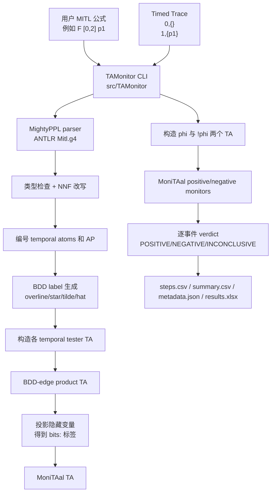

## 3. 最终实验结果入口

当前分支已经保留论文级 v1 结果入口：

```text
test/TARV/results/FINAL_RESULTS_README.md
test/TARV/results/paper_pipeline_formula_catalog_workbook_guard_full
test/TARV/results/baseline_timeout_rerun_60s_formula_catalog_workbook_guard_full
test/TARV/results/mitl_formula_catalog_latest_official.md
test/TARV/results/mitl_formula_catalog_semantic_regression.csv
test/TARV/results/mitl_formula_catalog_monitaal_xml_candidates.csv
test/TARV/results/mitl_formula_catalog_runtime_runs.csv
```

关键统计：

| 项 | 结果 |
|---|---|
| 主 pipeline | `PASS` |
| semantic cases | 87 |
| runtime verified semantic cases | 70 |
| semantic fail/error/timeout | 0/0/0 |
| candidate baseline runs | 63/63 match |
| review packet verifier | 151 PASS, 0 WARN, 0 FAIL |
| manifest verifier | 16 PASS, 0 WARN, 0 FAIL |
| stability rows | 190 PASS |
| CLI contract rows | 11 PASS |

v1 明确边界：

- 支持 flatten runtime。
- `--build-mode compflatten --build-only` 只做构建和统计，不做 runtime verdict。
- BDD-native runtime 还没有实现。
- XML-to-MITL equivalence 中 `REVIEW_REQUIRED` 的行仍需人工数学审查。
- Count 系列内部形式 `CFn/COn/CGn/CHn` 在 TAMonitor v1 用户入口中被拒绝。

## 4. 一条 smoke 例子先建立直觉

本次分析跑了一个端到端例子：

公式文件：

```text
F [0,2] p1
```

trace：

```text
# time,props
0,{}
1,{p1}
```

命令：

```bash
tool/MightyPPL/build/TAMonitor \
  --formula test/TARV/cases/smoke_f_01.mitl \
  --trace test/TARV/cases/smoke_f_01.trace \
  --word finite \
  --state symbolic \
  --build-mode flatten \
  --out /tmp/tamonitor_branch_analysis_smoke
```

观察到：

```text
Formula satisfiable: SAT
Final verdict: POSITIVE
```

`metadata.json` 中：

```json
{
  "positive_nnf": "F[0, 2] p1",
  "negative_nnf": "G[0, 2] (!p1)",
  "proposition_order": ["p1"]
}
```

`steps.csv` 的核心含义：

| step | time | human label | canonical label | verdict | 解释 |
|---:|---|---|---|---|---|
| 1 | `0` | `{}` | `bits:0` | `INCONCLUSIVE` | 还没看到 `p1`，但未来 2 时间单位内仍可能满足 |
| 2 | `1` | `{p1}` | `bits:1` | `POSITIVE` | 在 `[0,2]` 窗口内看到 `p1`，有限词下公式成立 |

这条例子是理解全项目的钥匙：

- 用户写的是 `{p1}`。
- TAMonitor 按 proposition order 转成 `bits:1`。
- MoniTAal 不理解 `{p1}` 这种集合语义，它只看到普通字符串标签 `bits:1`。
- formula 和 trace 都经过 TAMonitor 包装层对齐后，MoniTAal 才能做运行时验证。

## 5. 学术术语先解释清楚

### 5.1 MITL

MITL 是 Metric Interval Temporal Logic，中文可理解为“带时间区间约束的时序逻辑”。它描述命题在时间轴上如何发生。

例子：

```text
F [0,2] p
```

意思是：从当前时间开始，在 0 到 2 时间单位内，某个时刻 `p` 为真。

```text
G (a -> F [0,30] b)
```

意思是：任何时刻只要 `a` 发生，那么之后 0 到 30 时间单位内必须发生 `b`。

```text
a U [1,3] b
```

意思是：`a` 至少持续到某个 `b` 发生的时刻，而且这个 `b` 要在 1 到 3 时间单位内发生。

### 5.2 TA

TA 是 timed automaton，中文一般叫“时间自动机”。它是普通有限状态自动机加上时钟。

普通自动机有：

- location/state：位置或状态。
- edge/transition：从一个位置跳到另一个位置的边。
- label：边上消费的输入符号。
- accepting location：接受位置。

时间自动机额外有：

- clock：非负实值时钟，比如 `x`。
- guard：边上的时钟条件，比如 `x <= 2`。
- reset：跳边时把某个时钟清零，比如 `x := 0`。
- invariant：位置上的时钟约束，比如停在某位置时必须 `x <= 2`。

用 `F [0,2] p` 做直觉图：

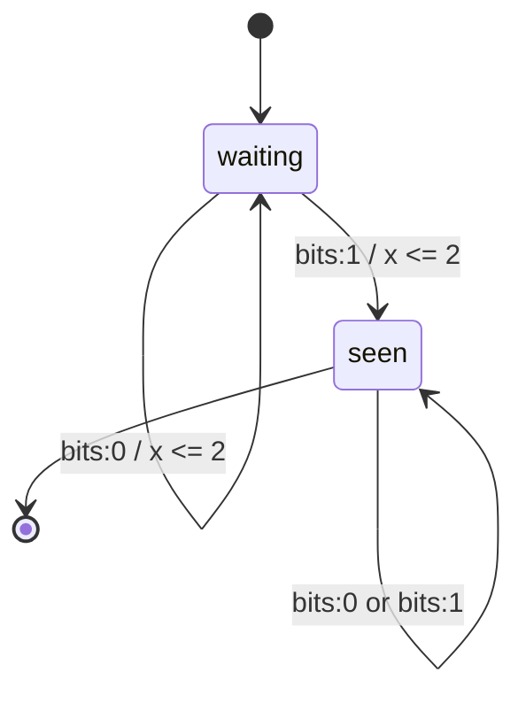

这个图不是源码中精确的完整 TA，只是直觉图：

- `waiting` 表示还在等 `p`。
- `seen` 表示已经在时限内看到 `p`。
- `x <= 2` 是 clock guard。
- `bits:0/bits:1` 是投影后的 MoniTAal 标签。

### 5.3 BDD

BDD 是 Binary Decision Diagram，二元决策图。项目里使用 BuDDy 库的 reduced ordered BDD 表示布尔公式。

BDD 解决的问题是：一条自动机边的 label 不只是一个单独命题，而可能是复杂布尔条件。

比如有两个原子命题 `a,b`：

```text
a && !b
```

可以表示为满足集合：

```text
a=1, b=0
```

如果是：

```text
a
```

则表示：

```text
a=1, b=0 或 a=1, b=1
```

BDD 用共享图结构压缩这些布尔条件，避免直接枚举所有真值组合。在最后投影给 MoniTAal 时，当前实现会把 BDD 展开成有限个 `bits:` 字符串标签。

### 5.4 Projection

Projection 在这里就是“把不需要给 MoniTAal 看的内部布尔变量消掉，只留下真实 atomic propositions”。

数学上对应 existential quantification，也就是存在量化。

例子：

```text
BDD variables: r, a, b
真实 AP: a,b
内部变量: r
边条件: r && a
```

投影掉 `r` 后得到：

```text
a
```

如果 proposition order 是 `[a,b]`，那么 `a` 会展开为：

```text
bits:10
bits:11
```

因为 `b` 可以是 0 或 1。

### 5.5 DBM

DBM 是 Difference Bound Matrix，差分约束矩阵，用来高效表示时钟区域。

时间自动机中常见约束是：

```text
x <= 2
x >= 1
x - y <= 3
```

DBM 统一表示为：

```text
x_i - x_j <= c
```

例子：用特殊零时钟 `x0 = 0`。

| 原约束 | DBM 形式 |
|---|---|
| `x <= 2` | `x - x0 <= 2` |
| `x >= 1` | `x0 - x <= -1` |
| `x - y <= 3` | `x - y <= 3` |

一个 DBM 表示一个 zone。多个 zone 的并集在 MoniTAal/pardibaal 里叫 Federation。

### 5.6 可达集合

可达集合是“自动机从某些状态出发，可以经过时间流逝和边跳转到达的所有可能状态集合”。

在运行时验证里，MoniTAal 更常用的是反向可达：

```text
哪些状态未来还能到达接受状态？
```

这个集合叫 accepting space。监控时，每吃一个事件，就把当前可能状态和 accepting space 相交。如果相交为空，说明这个监控器已经不可能接受了。

## 6. TAMonitor 包装层

核心文件：

| 文件 | 作用 |
|---|---|
| `src/TAMonitor/TAMonitorMain.cpp` | CLI 主流程 |
| `src/TAMonitor/TAMonitorOptions.cpp` | 参数解析 |
| `src/TAMonitor/TAMonitorMightyAdapter.cpp` | 连接 TAMonitor 和 MightyPPL |
| `src/TAMonitor/TraceParser.cpp` | trace 解析和 `props -> bits` |
| `src/TAMonitor/MonitorRunner.cpp` | 调 MoniTAal 运行 positive/negative monitor |
| `src/TAMonitor/ReportWriter.cpp` | 输出 CSV/JSON/XLSX |
| `src/TAMonitor/TAMonitor.h` | 数据结构和函数声明 |

CLI 主流程是：

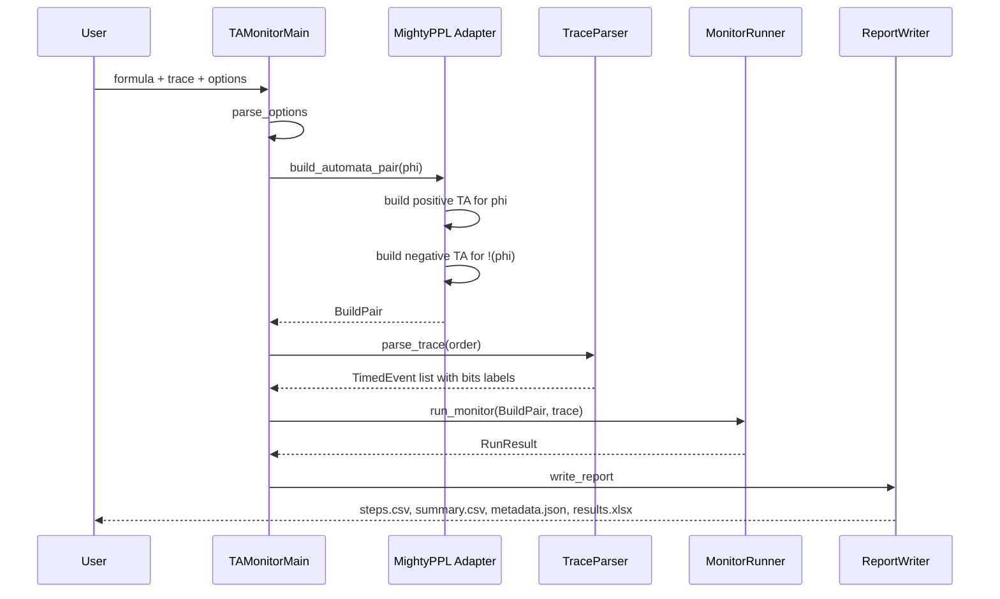

### 6.1 参数支持

`src/TAMonitor/TAMonitorOptions.cpp:54` 解析参数。

常用参数：

```text
--formula <path>
--formula-inline <formula>
--trace <path>
--word finite|infinite
--state symbolic|concrete
--build-mode flatten|compflatten
--out <dir>
--max-valuations <n>
--build-only
--emit-bdd-interface
```

当前 v1 运行时只建议：

```text
--build-mode flatten
```

`compflatten` 仅 build-only 统计。

### 6.2 BuildPair

TAMonitor 不只构建一个自动机，而是构建一对：

```text
positive: phi 的自动机
negative: !(phi) 的自动机
```

这样 runtime verdict 可以通过两个监控器共同判断：

| positive monitor | negative monitor | verdict |
|---|---|---|
| 还能接受 | 还能接受 | INCONCLUSIVE |
| 不能接受 | 还能接受 | NEGATIVE |
| 还能接受 | 不能接受 | POSITIVE |
| 都不能接受 | 理论上异常或仍保守处理 | INCONCLUSIVE/断言路径 |

代码入口：

- `src/TAMonitor/TAMonitorMightyAdapter.cpp:308`，`build_automata_pair`
- `src/TAMonitor/TAMonitorMightyAdapter.cpp:212`，`build_one`
- `src/TAMonitor/TAMonitorMightyAdapter.cpp:202`，`satisfiable`

`build_automata_pair` 做的事：

1. 初始化 BuDDy。
2. 规范化输入公式。
3. 构造 `phi` 的 TA。
4. 构造 `!(phi)` 的 TA。
5. 检查 positive/negative 两边 proposition order 一致。
6. 关闭 BuDDy。

## 7. Trace 如何变成 MoniTAal 标签

源码位置：

- `src/TAMonitor/TraceParser.cpp:116`，`props_to_bits`
- `src/TAMonitor/TraceParser.cpp:148`，`find_csv_separator`
- `src/TAMonitor/TraceParser.cpp:172`，`parse_line`
- `src/TAMonitor/TraceParser.cpp:199`，`parse_trace`

TAMonitor trace 支持：

```text
time,props
0,{}
1,{p1}

@0 {}
@1 {p1}

1,bits:1
1,1
[20,41],{b}
```

### 7.1 proposition order

MightyPPL 会记录公式里的真实 AP 顺序。比如：

```text
formula: F [0,2] (a || b)
proposition_order: [a,b]
```

则 trace 映射：

| trace props | bits |
|---|---|
| `{}` | `bits:00` |
| `{a}` | `bits:10` |
| `{b}` | `bits:01` |
| `{a,b}` | `bits:11` |

MoniTAal 最终只看到 `bits:00`、`bits:10` 这种字符串。

### 7.2 为什么不能直接给 MoniTAal `{a,b}`

MoniTAal 的 `edge_t` label 是 `std::string`，运行时判断是字符串相等：

```text
edge.label() == input.label
```

它没有内建“命题集合”的语义。因此 TAMonitor 必须把命题集合编码为唯一字符串。当前编码就是：

```text
bits:<按 proposition_order 排列的 0/1 串>
```

### 7.3 interval trace 修复

旧逻辑：

```text
[20,41],{b}
```

会在第一个逗号切开：

```text
time_text = "[20"
label_text = "41],{b}"
```

新逻辑：

1. 如果行以 `[` 开始，先找 `]`。
2. 跳过 `]` 后空格。
3. 要求后面是逗号。
4. 用这个逗号切分。

这让 `[20,41],{b}` 正确变成：

```text
time_text = "[20,41]"
label_text = "{b}"
```

## 8. MITL 到 TA 的完整转换过程

核心入口：

- `tool/MightyPPL/MightyPPL.cpp:825`，`build_ta_from_main`
- `tool/MightyPPL/MightyPPL.cpp:748`，`build_ta_from_atom`
- `tool/MightyPPL/MightyPPL.cpp:488`，`build_edge`
- `tool/MightyPPL/TAwithBDDEdges.cpp:218`，BDD-edge product intersection
- `tool/MightyPPL/TAwithBDDEdges.cpp:778`，canonical projection

整体流程：

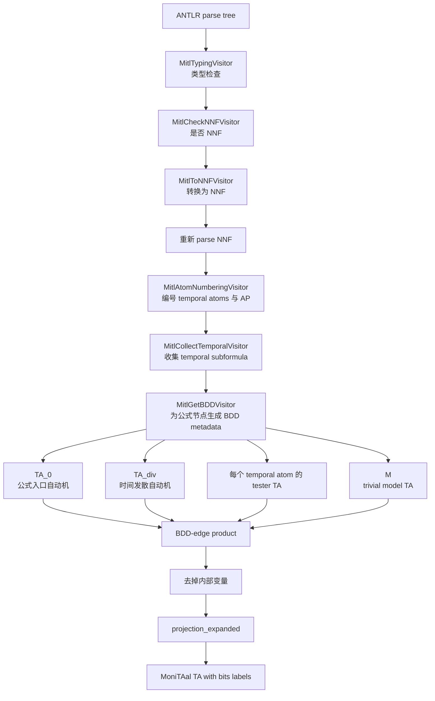

### 8.1 NNF 是什么

NNF 是 Negation Normal Form，否定范式。要求：

- 公式只用 `&&`、`||` 组合。
- `!` 只能直接出现在原子命题前面。

例子：

```text
!(a && F [0,2] b)
```

转换成：

```text
(!a) || G [0,2] (!b)
```

原因：

- `!(A && B)` 变成 `!A || !B`。
- `!(F_I b)` 变成 `G_I (!b)`。

代码：

- `tool/MightyPPL/MitlToNNFVisitor.cpp:160` 处理 `!`
- `tool/MightyPPL/MitlToNNFVisitor.cpp:250` 处理 `F`
- `tool/MightyPPL/MitlToNNFVisitor.cpp:320` 处理 `G`
- `tool/MightyPPL/MitlToNNFVisitor.cpp:390` 处理 `U`
- `tool/MightyPPL/MitlToNNFVisitor.cpp:560` 处理 `R`

为什么要 NNF：后续 BDD metadata 和 temporal tester 构造假设 temporal operator 的正负形态已经被转换成对应 dual operator，避免在构造 TA 时到处处理复杂 negation。

### 8.2 编号 temporal atom 和 atomic proposition

源码：

- `tool/MightyPPL/MitlAtomNumberingVisitor.cpp:68` 开始处理 `F`
- `tool/MightyPPL/MitlAtomNumberingVisitor.cpp:108` 开始处理 `G`
- `tool/MightyPPL/MitlAtomNumberingVisitor.cpp:148` 开始处理 `U`
- `tool/MightyPPL/MitlAtomNumberingVisitor.cpp:540` 处理 `Idfr`

MightyPPL 会给两类东西编号：

1. 真实 atomic proposition，比如 `a,b,p1`。
2. temporal subformula 的内部布尔变量，比如 `F [0,2] p1` 这个 temporal atom 自己的状态位。

为什么 temporal subformula 也要编号？

因为 MightyPPL 用 BDD 标签在各个 tester TA 之间同步信息。一个 temporal atom 是否“当前被声明为真”、是否“已经稳定”等，都会变成 BDD 变量参与 product。

例子：

```text
F [0,2] p1
```

可能出现：

```text
temporal bit: r_F
real AP bit: p1
```

最终投影前，边标签可能长这样：

```text
r_F && p1
```

投影后，`r_F` 被消掉，只留下 `p1` 相关的 `bits:1`。

### 8.3 BDD metadata: overline/star/tilde/hat

源码：

- `tool/MightyPPL/MitlGetBDDVisitor.cpp:11`，入口
- `tool/MightyPPL/MitlGetBDDVisitor.cpp:33`，`And`
- `tool/MightyPPL/MitlGetBDDVisitor.cpp:75`，`Or`
- `tool/MightyPPL/MitlGetBDDVisitor.cpp:102`，`F`
- `tool/MightyPPL/MitlGetBDDVisitor.cpp:134`，`G`
- `tool/MightyPPL/MitlGetBDDVisitor.cpp:166`，`U`
- `tool/MightyPPL/MitlGetBDDVisitor.cpp:581`，`Idfr`

每个公式节点会携带 4 个 BDD：

| 字段 | 直觉含义 |
|---|---|
| `overline` | 当前公式/子公式被表示为“真”的 BDD 条件 |
| `star` | 公式在 repeat/stability 场景下允许继续维持的条件 |
| `tilde` | 常用作“不真但仍可延续”的条件，代码里常为 `!overline & star` |
| `hat` | 触发或确认当前公式成立的关键条件 |

这些名字来自 MightyPPL 原始算法设计。你可以把它们理解成“把 MITL 语义拆成几类同步布尔条件”，供 temporal tester TA 的边使用。

对普通 AP：

```text
p
```

`visitAtomIdfr` 做的是：

```text
overline = p
star     = true
tilde    = !p
hat      = p
```

对 temporal atom，例如 `F [0,2] p`：

```text
overline = r_F
star     = !r_F 或 true，取决于 repeat
tilde    = !r_F & star
hat      = r_F
```

注意：真实语义不是只靠这几个 BDD 单独完成的，而是它们和 tester TA 的位置、时钟 guard、reset 一起完成。

### 8.4 布尔组合例子

公式：

```text
F [0,2] (a || b)
```

对 `(a || b)`，BDD visitor 会组合两个孩子：

```text
overline = a.overline || b.overline
star     = a.star && b.star
tilde    = !overline && star
hat      = (a.hat & b.tilde) | (b.hat & a.tilde) | (a.overline & b.overline & a.star & b.star)
```

直觉解释：

- `overline` 表示当前 `a || b` 为真。
- `hat` 表示“当前一步可以确认 disjunction 成立”的组合条件。
- 如果 `a` 已经触发、`b` 还处于可延续状态，或者反过来，都可以构成 `hat`。

### 8.5 构造哪些 TA

`build_ta_from_main` 构造的主要组件：

| 组件 | 作用 |
|---|---|
| `TA_0` | 总公式入口自动机，连接公式级 `hat/star` 条件 |
| `TA_div` | time divergence 自动机，避免无限快的 Zeno 行为 |
| `TA_i` | 每个 temporal atom 的 tester 自动机 |
| `M` | trivial model 自动机，一个接受位置和 true self-loop |
| product TA | 上述组件的同步乘积 |

### 8.6 `TA_0` 是什么结构

源码片段在 `tool/MightyPPL/MightyPPL.cpp:1150` 附近构造。

直觉结构：

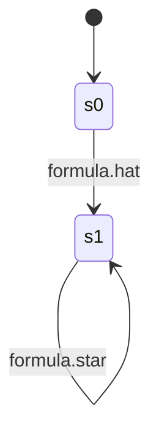

含义：

- `s0` 是起始位置，尚未确认总公式。
- 边 `s0 -> s1` 要求公式的 `hat` BDD 条件成立。
- `s1` 是接受位置。
- `s1 -> s1` 用 `star` 保持后续一致性。

这不是最后给 MoniTAal 用的完整自动机，因为 label 仍然是 BDD，且还包含内部变量。

### 8.7 `TA_div` 为什么存在

源码：

- `tool/MightyPPL/TAwithBDDEdges.cpp:889`，`time_divergence_ta`

时间自动机理论里有 Zeno 问题：无限多步跳转可能发生在有限时间内。`TA_div` 用一个时钟 `x_div` 和 gcd 时间尺度强制时间持续推进。

直觉图：

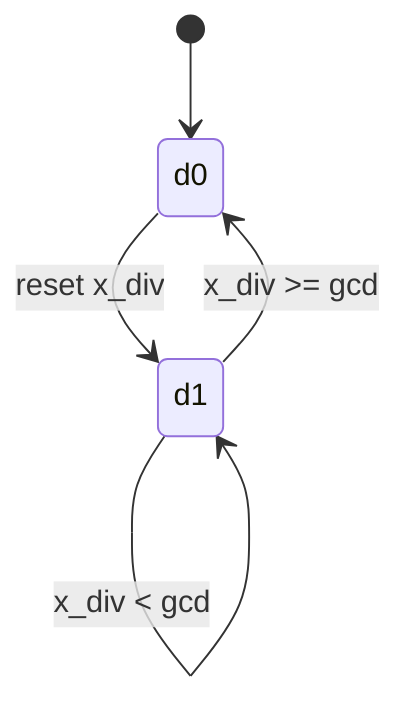

在 finite word 模式下，接受性处理不同；在 infinite word 模式下，time divergence 与 Büchi 接受条件共同作用。

### 8.8 temporal tester TA

每种 temporal operator 有自己的构造函数：

| MITL operator | 文件 | 函数 |
|---|---|---|
| `F` Finally | `tool/MightyPPL/Finally.cpp:6` | `build_finally` |
| `G` Globally | `tool/MightyPPL/Globally.cpp:6` | `build_globally` |
| `U` Until | `tool/MightyPPL/Until.cpp:6` | `build_until` |
| Pnueli `Fn` | `tool/MightyPPL/PnueliFn.cpp:6` | `build_pnuelifn` |
| 其他 past/release/trigger | `Once.cpp`, `Historically.cpp`, `Release.cpp`, `Trigger.cpp` 等 | 对应构造函数 |

#### 8.8.1 `F [0,2] p` 的 tester 直觉

`F [0,2] p` 的核心语义：

```text
从当前点开始，0 到 2 时间单位内必须看到 p。
```

tester 要表达：

- 开始等待时 reset 一个 clock。
- 在 clock 小于等于 2 时，如果看到 `p`，可以进入满足位置。
- 如果一直没有看到 `p`，超过 2 后就无法满足。

直觉图：

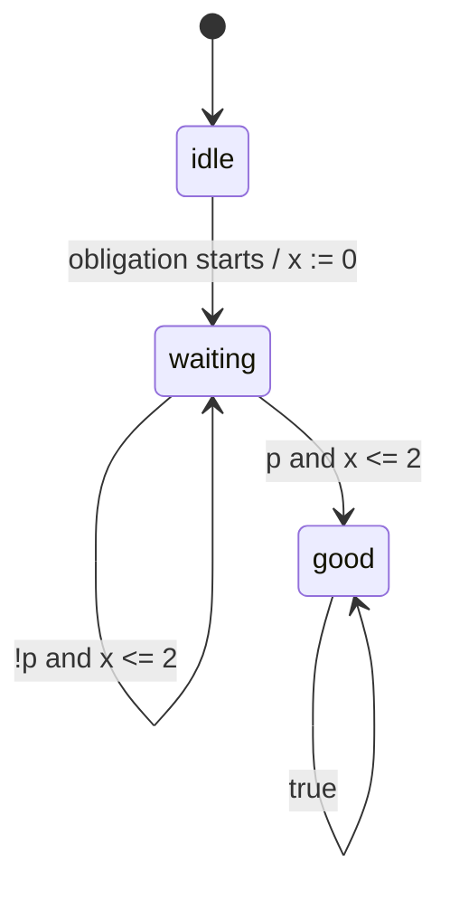

源码里边标签不是直接 `p`/`!p`，而是使用 BDD：

```text
bdd_ithvar(phi->id)
phi->atom()->hat
phi->atom()->star
phi->atom()->tilde
```

clock guard 则由字符串如 `<= 2` 转成 MoniTAal constraints。

#### 8.8.2 `G [0,2] p` 的 tester 直觉

`G [0,2] p` 表示从当前点开始到 2 时间单位内，所有观测点都必须满足 `p`。

直觉：

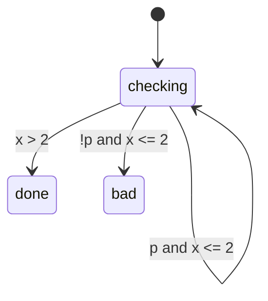

如果在窗口内看见 `!p`，就进入坏路径。源码中具体接受性和 finite/infinite 处理更复杂，但时钟 guard 的意义就是约束检查窗口。

#### 8.8.3 `a U [1,3] b` 的 tester 直觉

`a U [1,3] b` 表示：

- `b` 要在 1 到 3 时间单位之间出现。
- 在 `b` 出现前，`a` 要持续成立。

直觉图：

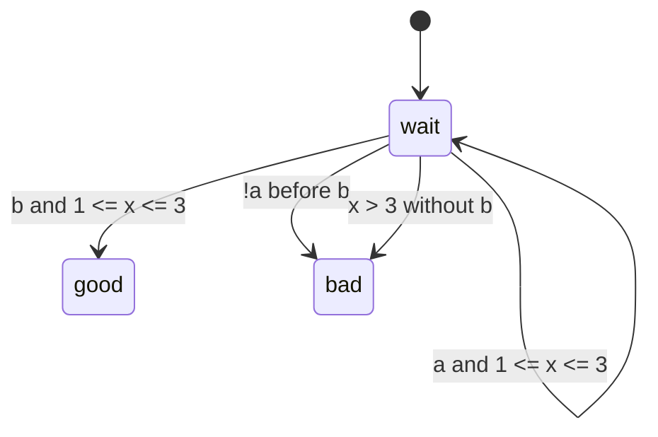

代码中 `build_until` 会把左子公式、右子公式的 `hat/star/tilde` BDD 和时钟 guard 组合到边上。

### 8.9 `build_edge` 做什么

源码：

- `tool/MightyPPL/MightyPPL.cpp:488`

它把构造函数里的人类可读边参数变成 `bdd_edge_t`：

输入大致包括：

```text
source location
target location
guard_x
guard_y
reset mode
bdd label
```

输出：

```text
monitaal::bdd_edge_t(from, to, guard constraints, reset clocks, bdd_label)
```

所以一条 edge 同时有两类约束：

| 类型 | 例子 | 作用 |
|---|---|---|
| 普通自动机结构 | `s0 -> s1` | 离散状态跳转 |
| label 条件 | `bits:1` 或投影前 BDD | 输入事件必须匹配 |
| clock guard | `x <= 2` | 跳转发生时的时钟条件 |
| reset | `x := 0` | 跳转后清零某些时钟 |

## 9. BDD-edge product 如何生成最终 TA

源码：

- `tool/MightyPPL/TAwithBDDEdges.cpp:218`，`TAwithBDDEdges::intersection(vector)`

product 是把多个组件 TA 合成一个大 TA。每个 product location 是各组件 location 的元组。

例子：

```text
TA_0 location: s1
TA_div location: d0
F-tester location: waiting
M location: m0
```

product location 可以理解为：

```text
(s1, d0, waiting, m0)
```

### 9.1 product location 如何生成

源码 `TAwithBDDEdges.cpp:256-335`：

1. 从各组件 initial location 组成初始 tuple。
2. 建立 tuple 到新 location id 的映射。
3. 用 fringe 做可达展开，只生成从初始状态可达的 product location。

### 9.2 product edge 如何生成

源码 `TAwithBDDEdges.cpp:360-535`：

对当前 tuple，遍历每个组件的一条 outgoing BDD edge 组合：

```text
e0 from TA_0
e1 from TA_div
e2 from F-tester
e3 from M
```

然后：

1. 把所有 BDD label 做 conjunction：

```text
new_bdd_label = e0.bdd & e1.bdd & e2.bdd & e3.bdd
```

2. 如果 conjunction 是 `bdd_false()`，这组边不可能同步，丢弃。
3. 合并所有 guard。
4. 合并所有 reset。
5. 合并目标位置 invariant。
6. 生成 product edge。

用图表示：

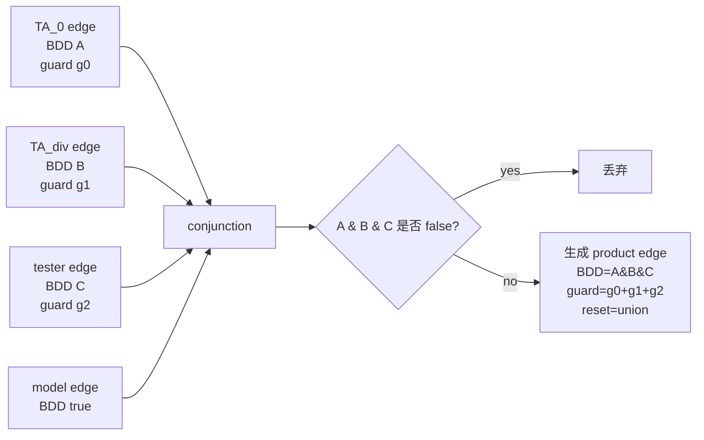

### 9.3 clock offset 为什么需要

每个组件 TA 可能都有自己的 clock 名字和编号。product 后要把它们放进同一个 TA，所以要给每个组件的 clock 编号加 offset。

例子：

```text
F-tester has clock x
G-tester has clock x
```

product 后不能都叫同一个 clock，实际会变成类似：

```text
x_2
x_3
```

源码 `TAwithBDDEdges.cpp:234-252` 维护 `clock_offsets`。

### 9.4 finite 和 infinite 接受条件不同

product 构造中 `out_fin` 区分有限词和无限词：

- finite：product location 接受当且仅当所有组件目标 location 都接受。
- infinite：使用一个 acceptance counter `new_i`，类似 round-robin Büchi 接受，要求无限运行中周期性访问各组件接受条件。

源码：

- `TAwithBDDEdges.cpp:305-324` 处理初始 location 接受性。
- `TAwithBDDEdges.cpp:427-474` 处理 infinite acceptance counter。

## 10. BDD 如何投影成 MoniTAal 能识别的命题

源码：

- `tool/MightyPPL/TAwithBDDEdges.cpp:778`，`projection_expanded`

这是 TAMonitor v1 的关键改造点之一。

### 10.1 为什么要投影

product edge 里的 BDD 变量包括：

```text
真实 AP: a,b,p1
内部 temporal bits: r_F, r_G, ...
Pnueli/Count 编码 bits: in_i/out_i 等
```

MoniTAal runtime 只能按字符串 label 匹配。它既不理解 BDD，也不应该看到内部 temporal bits。因此必须：

```text
BDD label -> existentially remove internal bits -> enumerate concrete AP valuations -> bits labels
```

### 10.2 projection_expanded 具体过程

伪代码：

```text
kept_props = 所有没有被移除的真实 AP id
for each BDD edge e:
    projected = bdd_exist(e.bdd_label, props_to_remove)
    patterns = bdd_allsat(projected)
    for each pattern:
        expand X/don't-care over kept_props
        for each concrete bit string:
            create monitaal edge with label "bits:" + bits
```

源码对应：

| 行 | 作用 |
|---:|---|
| `780-785` | 计算 kept real props |
| `789-792` | 构造要存在量化掉的变量集合 |
| `796` | `bdd_exist` 做投影 |
| `798` | `bdd_allsat` 枚举满足 pattern |
| `804-823` | 展开 `X` don't-care |
| `827-833` | 生成普通 `edge_t`，label 为 `bits:<...>` |
| `828-830` | 超过 `--max-valuations` 就报错 |

### 10.3 例子：两个 AP 的投影

公式包含 `a,b`，proposition order：

```text
[a,b]
```

投影后某条边的 BDD 是：

```text
a
```

`bdd_allsat` 可能给 pattern：

```text
a=1, b=X
```

`projection_expanded` 展开 `X`：

```text
bits:10
bits:11
```

于是这条 BDD edge 会变成两条 MoniTAal 普通 edge：

```text
edge label bits:10
edge label bits:11
```

### 10.4 例子：投影内部 temporal bit

投影前：

```text
variables: r_F, p1
edge BDD: r_F && p1
remove: r_F
keep: p1
```

存在量化：

```text
exists r_F. (r_F && p1) = p1
```

最后：

```text
bits:1
```

### 10.5 为什么会有指数爆炸

如果有 n 个真实 AP，一个 BDD pattern 全是 don't-care：

```text
XXXX...X
```

它会展开成：

```text
2^n
```

个 `bits:` 标签。当前实现用 `--max-valuations` 限制最大展开数，超过就失败，避免悄悄生成不可控的大自动机。

这也是后续 fuzzing 的重点风险点之一。

## 11. MoniTAal 的数据结构

核心文件：

| 文件 | 作用 |
|---|---|
| `tool/MoniTAal/src/monitaal/types.h` | 基础类型别名，Federation/Zone/label |
| `tool/MoniTAal/src/monitaal/TA.h` | location、edge、TA 类 |
| `tool/MoniTAal/src/monitaal/state.h/.cpp` | symbolic/concrete/delay/testing state |
| `tool/MoniTAal/src/monitaal/symbolic_state_base.cpp` | zone 操作、正向/反向 transition |
| `tool/MoniTAal/src/monitaal/Fixpoint.cpp` | 可达集和 Büchi accepting fixpoint |
| `tool/MoniTAal/src/monitaal/Monitor.cpp` | Single_monitor 和 positive/negative Monitor |

### 11.1 location_t

源码：

- `tool/MoniTAal/src/monitaal/TA.h:34`

location 包含：

```text
accept flag
id
name
invariant constraints
invariant zone
```

直觉：

```text
location waiting:
  accept = false
  invariant = x <= 2
```

如果当前 state 在 `waiting`，时间不能流逝到违反 `x <= 2`。

### 11.2 edge_t

源码：

- `tool/MoniTAal/src/monitaal/TA.h:54`

edge 包含：

```text
from
to
guard constraints
reset clocks
label string
guard zone
```

例子：

```text
from: waiting
to: good
label: bits:1
guard: x <= 2
reset: []
```

意思是：当前输入 label 是 `bits:1` 且 `x <= 2` 时，可以从 `waiting` 到 `good`。

### 11.3 TA

源码：

- `tool/MoniTAal/src/monitaal/TA.h:79`

TA 保存：

```text
locations map
forward edges
backward edges
labels set
clock names
inactive clocks
initial location
```

forward edges 用于 runtime 正向消费事件；backward edges 用于 Fixpoint 反向可达分析。

## 12. DBM 和 Federation 在代码里怎么用

源码：

- `tool/MoniTAal/src/monitaal/types.h:47`，`using Federation = pardibaal::Federation`
- `tool/MoniTAal/src/monitaal/symbolic_state_base.cpp`
- `tool/MoniTAal/src/monitaal/state.cpp:61`，`symbolic_state_t::delay`

### 12.1 symbolic state 是什么

一个 symbolic state 是：

```text
(location, federation)
```

也就是：

```text
当前可能在某个 location，并且 clock valuation 属于某个 federation。
```

如果当前有 clock `x`，一组可能状态可以是：

```text
location = waiting
0 <= x <= 2
```

这不是一个具体 valuation，而是一整个区域。这样 runtime 不需要枚举所有实数时间。

### 12.2 delay 如何实现

源码：

- `tool/MoniTAal/src/monitaal/state.cpp:61`

`symbolic_state_t::delay(value)`：

```text
federation.future()
restrict global time dimension == value
```

直觉：

1. `future()` 允许时间向未来流逝。
2. 再把全局输入时间限制到事件时间。

对 interval input `[l,u]`：

```text
future()
restrict global time dimension >= l
restrict global time dimension <= u
```

这就是为什么 TAMonitor 支持 `[20,41],{b}` 这种 interval trace。

### 12.3 正向 transition 如何实现

源码：

- `tool/MoniTAal/src/monitaal/symbolic_state_base.cpp:64`

正向 transition 步骤：

```text
if edge.from != current location:
    false
if current federation 不满足 edge.guard:
    false
restrict federation by edge.guard
for each reset clock:
    assign clock = 0
location = edge.to
true
```

例子：

当前：

```text
location = waiting
0 <= x <= 2
```

edge：

```text
waiting -> good
label bits:1
guard x <= 2
reset []
```

输入 `bits:1` 时：

```text
restrict x <= 2
location = good
```

如果 edge 是：

```text
guard x >= 1 && x <= 3
reset x
```

则跳边后：

```text
x := 0
```

### 12.4 反向 transition 如何实现

源码：

- `tool/MoniTAal/src/monitaal/symbolic_state_base.cpp:83`

反向 transition 用在可达集合计算中。步骤：

```text
if edge.to == current location:
    location = edge.from
    down()
    restrict reset clocks to zero
    free reset clocks
    restrict edge.guard
    down()
```

直觉解释：

- `down()` 是 past closure，允许从目标区域往过去回溯时间。
- `restrict_to_zero(reset)` 表示如果正向跳边 reset 了 clock，那么目标侧 reset 后它应为 0。
- `free(reset)` 恢复 reset 前 clock 可以是任意满足 guard 的值。
- `restrict(edge.guard)` 加上正向跳边发生前必须满足的 guard。
- 最后的 `down()` 继续考虑跳边前等待的时间。

例子：

目标 accepting state：

```text
good, any clock valuation
```

edge：

```text
waiting -> good
guard x <= 2
```

反向求 predecessor 得到：

```text
waiting, x <= 2
```

这表示在 `waiting` 且 `x <= 2` 时，未来一步可以到达 `good`。

## 13. MoniTAal 如何计算可达集合

核心源码：

- `tool/MoniTAal/src/monitaal/Fixpoint.cpp:30`，`reach`
- `tool/MoniTAal/src/monitaal/Fixpoint.cpp:65`，`accept_states`
- `tool/MoniTAal/src/monitaal/Fixpoint.cpp:77`，`buchi_accept_fixpoint`

### 13.1 accept_states

`accept_states(T)` 返回：

```text
所有 accepting locations 上的 unconstrained symbolic states
```

也就是：

```text
location = accepting
clock zone = 任意
```

### 13.2 reach(states, T)

`reach` 计算：

```text
哪些状态能经过至少一条边到达 states？
```

算法：

```text
waiting = direct predecessors of states
passed = empty

while waiting not empty:
    s = pop(waiting)
    if s 已被 passed 包含:
        continue
    add s to passed
    for each edge entering s.location:
        pred = backward_transition(s, edge)
        pred restrict source invariant
        add pred to waiting

return passed
```

图：

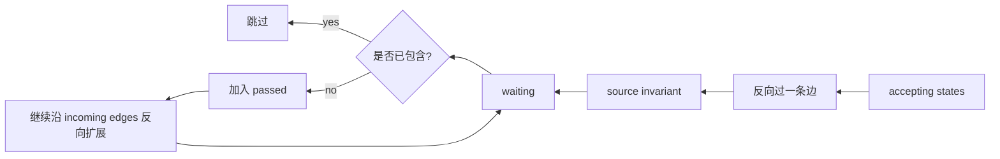

### 13.3 普通自动机边和时钟约束都如何参与 reach

反向计算时，一条 edge 的所有部分都会参与：

| edge 部分 | reach 中的作用 |
|---|---|
| `from/to` | 决定从目标 location 反向回到哪个源 location |
| `guard` | predecessor 必须满足这些 clock 条件 |
| `reset` | 反向时先约束 reset 后为 0，再 free 恢复 reset 前值 |
| `label` | Fixpoint 本身不按输入 label 过滤，因为它求的是自动机结构上的“未来可能接受空间” |
| source invariant | predecessor 最后还要满足源 location invariant |

label 不参与 Fixpoint 的过滤，是因为 Fixpoint 问题是“是否存在某条未来路径可接受”，未来输入还未知。真正消费 runtime 事件时，label 才用于匹配 edge。

### 13.4 Büchi accepting fixpoint

无限词监控需要 Büchi 接受条件，意思是：

```text
运行必须无限次访问 accepting locations。
```

`buchi_accept_fixpoint` 做的是：

1. 从 accepting states 开始求可反向到达 accepting 的集合。
2. 删除非 accepting locations。
3. 再求一次 reach。
4. 重复直到集合不再变化。

源码 `Fixpoint.cpp:77-107`。

直觉：

```text
留下那些不仅能到达接受位置，而且能反复回到接受位置的状态。
```

这就是 infinite runtime monitor 里的 accepting space。

## 14. MoniTAal 运行时验证算法

核心源码：

- `tool/MoniTAal/src/monitaal/Monitor.cpp:76`，`Single_monitor` 构造
- `tool/MoniTAal/src/monitaal/Monitor.cpp:97`，`Single_monitor::input`
- `tool/MoniTAal/src/monitaal/Monitor.cpp:224`，positive/negative `Monitor`
- `tool/MoniTAal/src/monitaal/Monitor.cpp:264`，`Monitor::input`

### 14.1 Single_monitor 初始化

初始化时：

```text
accepting_space = buchi_accept_fixpoint(automaton)
init = initial location with unconstrained clocks
init = init ∩ accepting_space
if init empty:
    status = OUT
else:
    status = ACTIVE
```

含义：

- 如果初始状态已经不可能接受，则 monitor 一开始就是 OUT。
- 否则保存当前 state estimate。

### 14.2 每个输入事件如何处理

输入事件：

```text
time = 1
label = bits:1
```

算法：

```text
next_states = empty
for each current symbolic state s:
    s.delay(input.time)
    if s 不满足当前 location invariant:
        continue
    restrict invariant

    if input label 不在 automaton.labels:
        只保留 delay 后仍能接受的状态
    else:
        for each outgoing edge from s.location:
            if edge.label == input.label:
                candidate = s
                if candidate.do_transition(edge):
                    if target invariant satisfied:
                        restrict target invariant
                        candidate = candidate ∩ accepting_space
                        if not empty:
                            add candidate

if next_states empty:
    status = OUT
else:
    status = ACTIVE
```

图：

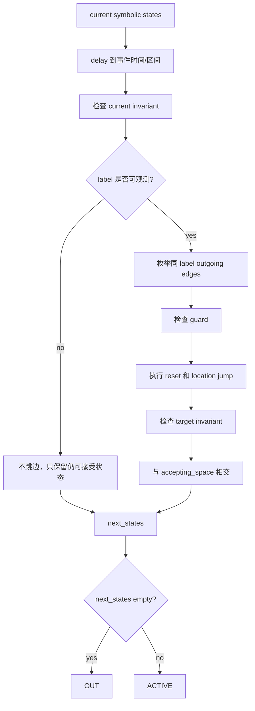

### 14.3 positive/negative monitor 如何给三值 verdict

TAMonitor 构建：

```text
pos = monitor(phi)
neg = monitor(!phi)
```

每个事件都同时喂给两个 monitor。

判断：

```text
if pos OUT:
    NEGATIVE
else if neg OUT:
    POSITIVE
else:
    INCONCLUSIVE
```

为什么这样成立：

- 如果 `phi` 已经不可能被接受，而 `!phi` 还可能，则 trace 前缀已经否定 `phi`。
- 如果 `!phi` 已经不可能被接受，而 `phi` 还可能，则 trace 前缀已经确认 `phi`。
- 两者都可能，则前缀信息还不够。

### 14.4 finite word 在 TAMonitor 中有专门逻辑

MoniTAal 原始 `Single_monitor` 用 Büchi fixpoint，偏 infinite-word 语义。TAMonitor 为 finite word 写了 `FiniteSingleMonitor`：

- 源码：`src/TAMonitor/MonitorRunner.cpp:29`
- 初始化使用 `Fixpoint::reach(accept_states)`，不是 Büchi fixpoint。
- 每步同样 delay、invariant、edge label、guard、reset、target invariant。
- 事件结束后如果还没 decisive verdict，调用 `accepts_now()` 判断当前是否停在 accepting location。

相关源码：

- `MonitorRunner.cpp:29`，`FiniteSingleMonitor`
- `MonitorRunner.cpp:45`，finite input
- `MonitorRunner.cpp:79`，`accepts_now`
- `MonitorRunner.cpp:143`，`run_finite_typed`

这就是 smoke 例子里 finite word 能最终 `POSITIVE` 的原因。

## 15. 用一个完整例子串起来

公式：

```text
G (a -> F [0,30] b)
```

含义：

```text
每次看到 a，都必须在之后 0 到 30 时间单位内看到 b。
```

trace：

```text
0,{a}
[20,41],{b}
```

### 15.1 命题编码

假设 proposition order 是：

```text
[a,b]
```

则：

```text
{a} -> bits:10
{b} -> bits:01
```

### 15.2 公式结构

`a -> F [0,30] b` 先 NNF 化：

```text
(!a) || F [0,30] b
```

所以整体可理解为：

```text
G ((!a) || F [0,30] b)
```

含义：

- 如果当前没有 `a`，条件自然满足。
- 如果当前有 `a`，产生一个 “未来 30 时间单位内要见到 b” 的 obligation。

### 15.3 自动机里的 obligation

直觉：

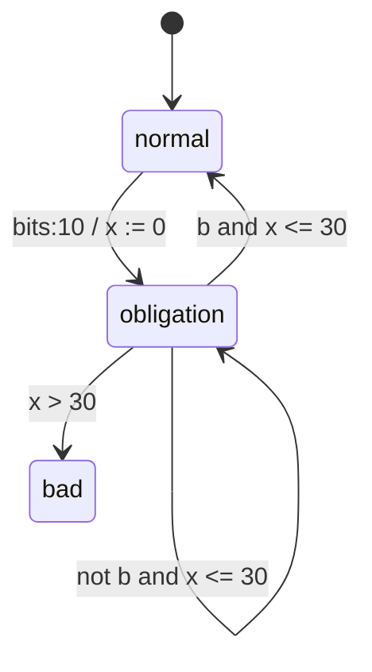

源码中的真实构造会拆成多个 tester TA，再通过 BDD-edge product 合并，但概念上就是这个 obligation。

### 15.4 interval input `[20,41],{b}`

输入时间不是一个点，而是一个区间：

```text
b 发生在 20 到 41 之间的某个未知时间
```

symbolic delay 会把全局时间限制在：

```text
20 <= t <= 41
```

如果 obligation 是 `x <= 30`，那么和 interval 相交后可能仍有：

```text
20 <= x <= 30
```

因此不能简单地说失败，也不能简单地说成功，结果可能是 `INCONCLUSIVE`，这与之前用户命令修复后的表现一致。

## 16. 输出文件如何读

TAMonitor 输出：

| 文件 | 内容 |
|---|---|
| `steps.csv` | 每个 trace 事件后的 verdict 和状态估计数量 |
| `summary.csv` | 公式 SAT、最终 verdict、自动机规模、projection valuation 数等 |
| `metadata.json` | 输入公式、NNF、proposition order、build options、v1 保留字段 |
| `results.xlsx` | CSV/metadata 的 Excel 包装，方便审阅 |
| `bdd_interface.json` | 当前是 reserved metadata，不是 BDD-native runtime |

`summary.csv` 中自动机规模字段：

```text
positive.locations
positive.edges
positive.clocks
positive.labels
positive.projection_valuations
negative.locations
negative.edges
...
```

这些可以用于 fuzzing 时观察构造是否异常膨胀。

## 17. 关键函数地图

| 功能 | 文件:行 |
|---|---|
| CLI 主流程 | `src/TAMonitor/TAMonitorMain.cpp:8` |
| 参数解析 | `src/TAMonitor/TAMonitorOptions.cpp:54` |
| 构造 positive/negative pair | `src/TAMonitor/TAMonitorMightyAdapter.cpp:308` |
| 单个公式构造 TA | `src/TAMonitor/TAMonitorMightyAdapter.cpp:212` |
| 公式 SAT 检查 | `src/TAMonitor/TAMonitorMightyAdapter.cpp:202` |
| trace props 到 bits | `src/TAMonitor/TraceParser.cpp:116` |
| interval CSV 分隔修复 | `src/TAMonitor/TraceParser.cpp:148` |
| finite runtime monitor | `src/TAMonitor/MonitorRunner.cpp:29` |
| finite runner | `src/TAMonitor/MonitorRunner.cpp:143` |
| infinite runner | `src/TAMonitor/MonitorRunner.cpp:110` |
| report writer | `src/TAMonitor/ReportWriter.cpp:207` |
| MITL grammar | `tool/MightyPPL/Mitl.g4` |
| NNF 改写 | `tool/MightyPPL/MitlToNNFVisitor.cpp:9` |
| temporal/AP 编号 | `tool/MightyPPL/MitlAtomNumberingVisitor.cpp:8` |
| BDD metadata 生成 | `tool/MightyPPL/MitlGetBDDVisitor.cpp:11` |
| MightyPPL 主构造 | `tool/MightyPPL/MightyPPL.cpp:825` |
| BDD edge 构造 | `tool/MightyPPL/MightyPPL.cpp:488` |
| product intersection | `tool/MightyPPL/TAwithBDDEdges.cpp:218` |
| canonical projection | `tool/MightyPPL/TAwithBDDEdges.cpp:778` |
| MoniTAal location/edge/TA | `tool/MoniTAal/src/monitaal/TA.h:34` |
| symbolic transition | `tool/MoniTAal/src/monitaal/symbolic_state_base.cpp:64` |
| backward transition | `tool/MoniTAal/src/monitaal/symbolic_state_base.cpp:83` |
| symbolic delay | `tool/MoniTAal/src/monitaal/state.cpp:61` |
| reach | `tool/MoniTAal/src/monitaal/Fixpoint.cpp:30` |
| Büchi fixpoint | `tool/MoniTAal/src/monitaal/Fixpoint.cpp:77` |
| Single_monitor | `tool/MoniTAal/src/monitaal/Monitor.cpp:76` |
| runtime input | `tool/MoniTAal/src/monitaal/Monitor.cpp:97` |
| positive/negative monitor | `tool/MoniTAal/src/monitaal/Monitor.cpp:224` |

## 18. 和 fuzzing 结合时的准备方向

这个项目天然适合做 grammar-aware + semantic-aware fuzzing。建议分层设计，而不是只随机字符串。

### 18.1 formula fuzzing

输入面：

```text
MITL grammar: tool/MightyPPL/Mitl.g4
```

优先生成：

- `F/G/U/R` 与不同 interval 边界组合。
- `[0,0]`, `[0,1]`, `(0,1]`, `[1,infty)`。
- 嵌套 temporal，例如 `G (a -> F [0,3] b)`。
- 布尔组合，例如 `(F [0,2] a) && (G [1,4] b)`。
- 重复子公式，例如 `(F [0,2] a) || (F [0,2] a)`，测试 repeats。

应单独测试但默认不纳入“成功 oracle”的：

- Count forms `CFn/COn/CGn/CHn`，v1 用户入口应拒绝。
- `compflatten` runtime，v1 不支持 verdict。
- 超大 AP 数量触发 projection explosion。

### 18.2 trace fuzzing

trace 维度：

- 点时间：`0,{a}`。
- 区间时间：`[2,5],{b}`。
- 空命题：`{}`、`-`、`empty`。
- bits 形式：`bits:10`。
- raw bitstring：`10`。
- 未知 proposition：应报错。
- bits 长度不等于 proposition order：应报错。

边界例子：

```text
0,{a}
0,{b}
[0,0],{}
[1,1],{a}
[2,1],{a}   # 应拒绝，因为 low > high
1,bits:101  # 如果 AP 数不是 3，应拒绝
```

### 18.3 oracle 设计

可以组合几类 oracle：

| oracle | 思路 |
|---|---|
| differential | 同一公式在 symbolic/concrete、finite/infinite 部分场景下做差异检查 |
| positive/negative consistency | `phi` 和 `!phi` 不应同时 decisive 接受 |
| metamorphic | 等价变换前后 verdict 应一致，例如 `a -> b` 与 `(!a)||b` |
| boundary | interval 开闭边界处结果应符合预期 |
| projection | `{a,b}` 和 `bits:11` 应等价 |
| smoke catalog | 已验证语义 catalog 作为回归 oracle |

### 18.4 重点 bug 面

优先 fuzz：

1. NNF 重写：`!`, `->`, `<->`, temporal dual。
2. interval parser：开闭区间、`infty`、CSV interval trace。
3. BDD projection：don't-care 展开、max valuation 限制。
4. clock guard：`<`, `<=`, `>`, `>=` 边界。
5. reset：反向 reach 中 reset clock 的 predecessor 计算。
6. finite finalization：trace 结束后 `accepts_now()`。
7. proposition order：trace `{prop}` 到 `bits:` 的映射。
8. product explosion：多个 temporal components 的同步组合。

### 18.5 一个 fuzzing pipeline 草案

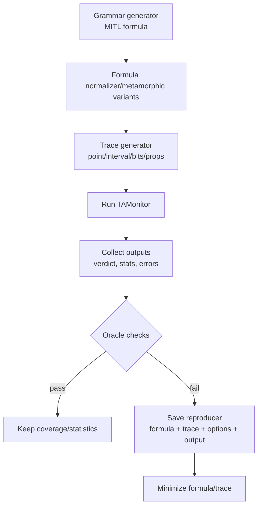

建议每个 reproducer 保存：

```text
formula.mitl
trace.csv
options.txt
stdout.txt
stderr.txt
summary.csv
steps.csv
metadata.json
git commit hash
```

## 19. 当前实现中要牢记的限制

1. BDD-native runtime 还没有实现，`--emit-bdd-interface` 只是 reserved metadata。
2. `compflatten` 只做 build-only，不支持 runtime verdict。
3. Count 系列用户输入当前会被 TAMonitor v1 拒绝。
4. Projection 展开可能指数爆炸，`--max-valuations` 是安全阀。
5. XML-to-MITL equivalence 中 `REVIEW_REQUIRED` 不是自动证明通过。
6. `--help` 当前走 error path，可能非零退出，这是已知 CLI contract 限制。
7. 顶层 `tool/MightyPPL` 和 `tool/MoniTAal` 当前是普通 tracked directories，不应按旧 handoff 中“独立 nested repo”假设操作。

## 20. 最短学习路线

如果你要从代码学习，建议按这个顺序读：

1. `analysis/manual/TAMonitor_User_Manual.md`：先知道怎么用。
2. `src/TAMonitor/TAMonitorMain.cpp`：看 CLI 主流程。
3. `src/TAMonitor/TAMonitorMightyAdapter.cpp`：看 positive/negative 构造。
4. `src/TAMonitor/TraceParser.cpp`：看 trace 到 `bits:`。
5. `tool/MightyPPL/MightyPPL.cpp:825`：看 MITL 到 TA 主流程。
6. `tool/MightyPPL/MitlGetBDDVisitor.cpp`：看 BDD metadata。
7. `tool/MightyPPL/Finally.cpp` 和 `Until.cpp`：看具体 temporal tester。
8. `tool/MightyPPL/TAwithBDDEdges.cpp:218`：看 product。
9. `tool/MightyPPL/TAwithBDDEdges.cpp:778`：看 projection。
10. `tool/MoniTAal/src/monitaal/Fixpoint.cpp`：看可达集。
11. `tool/MoniTAal/src/monitaal/Monitor.cpp`：看 runtime monitor。
12. `tool/MoniTAal/src/monitaal/symbolic_state_base.cpp`：看 DBM/federation 状态变换。

## 21. 一句话总览

这个分支的核心贡献是把 MightyPPL 生成的 BDD-labeled MITL timed automata，经过 canonical `bits:` 投影，变成 MoniTAal 原生 string-labeled timed automata，再用 positive/negative 双监控器对 timed trace 做三值运行时验证；所有 clock 语义由 MoniTAal 的 DBM/federation symbolic state 和 backward fixpoint accepting-space 算法支撑。
