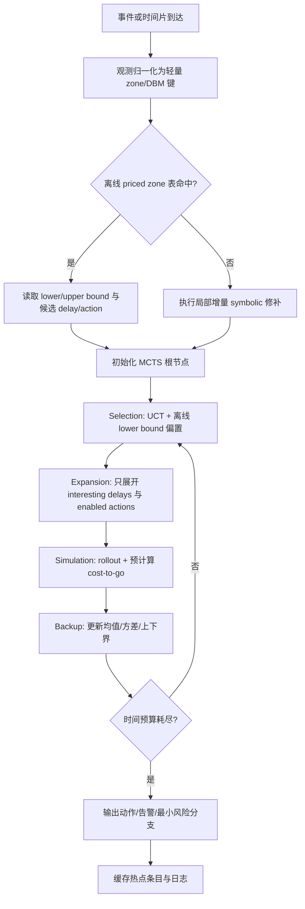

# Monte Carlo Tree Search 与 Priced Zone 在在线 Runtime Verification 中的工程化分析

文件名建议：`Monte_Carlo_Tree_Search_PTA_Analysis.md`

## 执行摘要

Priced Timed Automata（PTA，也常与 weighted timed automata 或 linearly-priced timed automata 对应）是在 timed automata 上加入“位置停留成本率”和“离散边成本”的模型，用于描述带严格时间约束的调度、规划与资源优化问题；其最自然的问题是 cost-optimal reachability，即以最小累计代价到达目标位置。该问题在线性价格情形下是可判定的，并被文献报告为 PSPACE-complete；而工程上主流的符号化解法依赖 zone / priced zone 与 DBM（Difference Bound Matrix）操作。与此同时，timed automata 本身是无限状态系统，精确前向搜索一般并不保证终止，必须依赖 extrapolation 或 simulation-based abstraction 等有限抽象；对 weighted timed automata，priced zone 的包含判定与代价传播又进一步抬高了开销。citeturn40view0turn26view0turn36view0turn14view0

把 priced zone 直接用于**在线 runtime verification**，通常会遇到三个层面的瓶颈。第一是**单次更新成本**：DBM 规范化/闭包可视为 Floyd–Warshall 风格的全源最短路闭包，复杂度为立方级，存储是平方级；intersection、inclusion 等虽更接近按矩阵逐项处理，但一旦进入 canonicalization、federation 管理或 priced inclusion，就容易被高阶成本主导。第二是**集合爆炸**：zone 的并集通常不是单个 zone，因此一旦监测器需要维护“当前所有可能状态”，就会走向 federation of zones，内存在事件流上持续增长。第三是**长期在线性**：官方 CORA 文档明确写到其实现没有 extrapolation，因此除非系统无环或所有钟都被 invariant 约束，否则终止不被保证；这对持续运行的在线监测尤其不友好。citeturn46search1turn11search4turn36view0turn14view0

因此，若你的目标是**硬实时**（例如每次决策预算小于 10ms），结论通常不是“在线 priced zone 完全不可用”，而是“**不应把它作为主在线求解器**”。更稳妥的工程路线，是把 priced zone 放到**离线阶段**做 cost-to-go 下界、候选 delay/action 集、局部抽象状态空间与 pruning 证据的预计算；在线阶段则采用**查表 + 轻量增量更新 + anytime 的 MCTS**。这样做既可以继承 CORA 风格 admissible lower bound 的优点，又能利用 MCTS 在有限时间预算下持续改进解的性质。UPPAAL TRON 的在线测试文档也反映了类似工程现实：在线引擎只维护当前可达状态集，并要求未来预计算视界“尽可能大，但又要小到能在 1 个 model time unit 内响应”。citeturn14view0turn37view0turn45view0turn33academia0

本文的工程建议可以概括成一句话：**把 priced zone 作为离线“昂贵但高价值”的符号知识编译器，而不是在线“每步都做”的主循环。** 在 `<10ms` 预算下，优先“压缩后的离线 priced zone + 在线 MCTS”；在 `10–100ms` 预算下，优先“离线 priced zone 索引 + 在线 MCTS + 小范围增量 zone 修补”；在 `>100ms` 或软实时分析中，才考虑更完整的在线 priced zone 或混合增量 symbolic engine。这个结论是基于 timed automata/weighted timed automata 的符号算法性质、官方工具限制、在线监测实现特征以及 MCTS 的 anytime 搜索特性综合得到的工程判断。citeturn36view0turn26view0turn14view0turn45view0turn37view0

## 在线 priced zone 的复杂度与瓶颈

从形式化角度，timed automata 的状态是“离散位置 + 实值钟赋值”的组合；weighted / priced timed automata 在此基础上为位置附加停留成本率、为离散边附加边成本。加权 timed automata 的经典定义可以写作状态 $s=(\ell,v)$，并通过 delay move 与 discrete move 交替演化；一条运行的总代价等于各段 delay 成本与 edge 成本之和。UPPAAL 的语义文档同样区分了 delay transitions 与 action transitions：delay 只增加钟值而不换位置，前提是全过程满足 invariant；action transition 则在 guard 成立时执行更新并切换位置。citeturn26view0turn16view0turn16view1

对 online runtime verification 而言，难点不在“定义上能不能做”，而在“**每个新事件到来时能不能足够快地更新当前符号状态集**”。近期关于 timed properties 的在线监测研究指出，监测器需要随着新事件持续维护“属性当前可能所在的状态集合”；而 TRON 文档把这一点做得更工程化：它允许打印“current reachable state set on each update”，并强调未来预计算视界必须足够小，才能保持在线响应。也就是说，在线监测本质上不是一次 verifyta 式离线求解，而是一个长期、增量、受延迟约束的**持续 successor maintenance** 问题。citeturn33academia0turn45view0

这时 priced zone 的主要瓶颈，会集中在 DBM 与 federation 管理。DBM 的空间复杂度天然是平方级，因为它对每一对钟差都存一个上界约束；canonical DBM 可通过 Floyd–Warshall 风格闭包得到，因此闭包/规范化代价是立方级。DBM 文献还指出，zone 的交是按矩阵 greatest lower bound 逐项构造的，而 inclusion 则依赖 canonical DBM 的逐项比较；这意味着，在闭包已经就绪的前提下，很多基本关系测试更接近平方级，但只要 canonicalization 频繁发生，整体成本仍会由 $O(m^3)$ 主导，其中 $m$ 是时钟数。citeturn46search1turn11search4

更麻烦的是，**zone 的并集一般不是 zone**。这不是实现细节，而是 DBM/zone 领域的结构性事实。在线监测器如果要表示“在观测不精确、乱序、部分可见条件下的所有可能当前状态”，往往不能只维护一个 zone，而要维护 federation（多个 zone 的集合）。这会把理论上的单个 DBM 成本，放大为“活动 zone 个数 $F$ 的倍数”，从而得到更接近下面的最坏情形工程模型：

$$
T_{\text{event}}
\approx
F\cdot\big(\alpha m^3+\beta b m^2\big)+T_{\text{lookup}}+T_{\text{cache-miss}},
$$

其中 $m$ 为时钟数，$b$ 为当前状态的平均分支数，$F$ 为活动 zone/federation 大小，$\alpha,\beta$ 是与实现、剪枝、内存局部性相关的常数。这个式子不是文献原式，而是基于 DBM 闭包复杂度、逐项运算定义和在线状态集维护方式得到的工程近似。其含义很直接：**真正让在线 priced zone 失控的，通常不是一个大常数，而是 $F$ 与 $m$ 同时上升。** citeturn46search1turn11search4turn33academia0

priced zone 比普通 zone 还多一层代价信息。经典 weighted timed automata 文献把 priced zone 解释为“zone + 记录到达 zone 内各状态最优代价的 cost function”，并在最优可达性前向搜索中使用 $\mathsf{Post}$ 与包含测试。理论上这让最优可达变成了可做的符号前向分析；工程上它意味着不仅要更新可达性，还要维护“最小成本到当前符号状态”的信息，并做 dominance / inclusion 风格的剪枝。CORA 官方文档进一步强调 admissible 的 `remaining` 下界估计对性能“improved dramatically”；反过来说，如果在线阶段**没有**高质量下界，priced zone 本身就很容易退化为“昂贵地探索一个很大的前向空间”。citeturn26view0turn14view0

如果把这些因素拆开看，在线性能受以下变量支配最明显：时钟数量 $m$、不变量与 guard 的复杂度、是否存在对角约束、action branching factor、delay 分辨率、zone 合并/差分需求、活动 federation 大小 $F$、以及是否频繁触发 canonicalization。其中特别值得注意的是“差分/并集”类操作：因为 union 一般不闭合，很多系统会选择 federation 或凸包近似；TRON 甚至提供了 `-A Use convex-hull approximation` 选项，这反映了在线系统为了降本，往往愿意用保守抽象换速度。对 runtime verification 来说，这往往意味着**精确度、最优性与延迟三者不可同时极致**。citeturn46search1turn45view0

下表给出一个更工程化的复杂度摘要。表中“典型估计”是基于 DBM 定义与闭包算法推导出的实现级近似，而非某一特定工具的实测定理。

| 操作 | 典型数据结构 | 典型时间 | 典型空间 | 说明 |
|---|---|---:|---:|---|
| DBM 存储 | $(m+1)\times(m+1)$ 约束矩阵 | — | $O(m^2)$ | 原始 zone 表示 |
| Canonicalization / Closure | DBM + Floyd–Warshall | $O(m^3)$ | $O(m^2)$ | 最耗时核心 |
| Intersection | 逐项取更紧约束 | 约 $O(m^2)$ | $O(m^2)$ | 常需随后再闭包 |
| Inclusion / Equality | canonical DBM 逐项比较 | 约 $O(m^2)$ | $O(1)$ 额外 | 前提是已规范化 |
| Reset / Delay successor | 行列更新 + 约束重整 | 约 $O(m^2)$ 到 $O(m^3)$ | $O(m^2)$ | 是否再闭包决定上界 |
| Federation 管理 | 多个 DBM | 乘上 $F$ | 乘上 $F$ | 在线爆炸主因 |
| Priced dominance | zone + cost function | 至少不低于纯 zone | 略高于纯 zone | 还要维护代价信息 |

综合以上，我的判断是：**在线 runtime verification 中，直接用完整 priced zone 做主循环，只适合“小钟数、弱动态、分支有限、延迟预算较宽”的场景。** 一旦你的系统进入“多钟、多不确定事件、持续运行、强实时预算”的区域，就应优先考虑把 priced zone 的价值转移到离线阶段。citeturn26view0turn36view0turn45view0

## 架构路线比较

下面的比较表不是对某篇论文的复述，而是基于 timed automata/weighted timed automata 的符号算法特性、UPPAAL CORA 与 TRON 的公开实现约束、以及 MCTS 在高分支与短时预算问题中的经验特征做出的工程综合判断。其核心依据是：符号法强在最优性与可证明剪枝，弱在在线持续更新；MCTS 强在 anytime、短预算可用与局部搜索，弱在全局最优性证明。citeturn14view0turn45view0turn37view0turn36view0

| 方案 | 典型在线延迟 | 在线内存 | 实现复杂度 | 最优性保证 | 动态环境适应能力 | 可扩展性 | 适用判断 |
|---|---:|---:|---:|---|---|---|---|
| 纯在线 priced zone | 高 | 高 | 高 | 强，若算法完备且终止 | 中 | 弱到中 | 适合离线分析或松实时 |
| 离线预计算 priced zone + 在线查表 | 很低 | 中到高 | 中 | 强下界/上界保证，动作质量取决于表覆盖 | 弱到中 | 中 | 适合静态或慢变化环境 |
| 离线 priced zone 压缩/抽象 + 在线 MCTS | 低到中 | 中 | 高 | 可给出可控误差或下界，但全局最优通常是估计 | 高 | 高 | **最推荐的平衡点** |
| 纯在线 MCTS 无 priced zone | 低到中 | 低到中 | 中 | 弱，通常只有统计意义或经验收敛 | 高 | 高 | 适合极短预算与强动态 |
| 混合增量更新 | 中 | 中到高 | 很高 | 中到强 | 高 | 中 | 适合平台稳定、团队有强工程能力 |

如果将实时性预算进一步细分，那么我的建议是：当预算 `<10ms` 时，不要把在线 priced zone 放在关键路径；优先选“离线压缩/抽象 priced zone + 在线 MCTS”或“纯在线 MCTS + 极轻量下界表”。当预算在 `10–100ms` 之间时，可以接受有限的增量 symbolic update，但仍应把大部分符号工作移到离线。只有在 `>100ms`、软实时告警、或离线回放分析中，完整在线 priced zone 才更有机会发挥其最优性优势。这个结论与 TRON 对在线视界和响应时间的要求、CORA 对终止条件的限制、以及 MCTS 在高组合复杂度问题中常需配合领域知识的经验是相一致的。citeturn45view0turn14view0turn37view0

从“软件工程可落地性”的角度，我更倾向以下判断。若你的 runtime verification 目标偏向**诊断、建议动作、风险排序**，而不是“对当前观测做一次完备最优证明”，那么带有离线下界表的 MCTS 路线几乎总是更划算。若你的目标是**离线批量验证、基准最优值计算、为在线阶段生成 policy hints**，priced zone 则非常合适。换句话说，最合理的分工不是二选一，而是：**priced zone 做编译，MCTS 做解释执行。** citeturn26view0turn14view0turn37view0

## 离线预计算 priced zone 的工程方案

离线预计算阶段的目标，不是把整个连续状态空间“完全存下来”，而是把在线阶段真正有价值的符号知识编译成三类数据：第一类是**状态抽象键**，用来把在线观测映射到离线条目；第二类是**代价边界**，即对目标的 cost-to-go 下界 $\underline J$ 与可选上界 $\overline J$；第三类是**动作约束知识**，例如候选 delay 边界集合、当前 enabled action、dominance 证据、局部禁选动作等。这样设计，本质上是在离线阶段计算 CORA 文档中 `remaining` 那样的 admissible lower bound，只是把它从单个 meta variable 提升为“按 zone 编译后的索引库”。citeturn14view0turn26view0

推荐的核心数据结构如下。这里的 DBM 必须是 canonical form，以便 inclusion/equality/hash 都稳定；参数桶 `param_bucket` 用于处理动态环境的离散近似。

```cpp
struct CanonicalDBM {
    uint16_t dim;                 // = clocks + 1
    int32_t  bound[MAX_DIM][MAX_DIM];
    uint8_t  strict[MAX_DIM][MAX_DIM];   // 0: <=, 1: <
};

struct ZoneKey {
    uint32_t loc_id;              // 离散位置
    uint32_t mode_id;             // 环境模式/模板实例/监测上下文
    uint32_t param_bucket;        // 参数桶，如负载、资源价格、设备模式
    uint64_t dbm_hash;            // canonical DBM hash
};

struct PZRecord {
    ZoneKey key;
    float lower_bound;            // admissible cost-to-go
    float upper_bound;            // 可选：来自离线求解或启发式 rollout
    uint32_t delay_ofs;           // 候选 delay 集偏移
    uint16_t delay_cnt;
    uint32_t action_ofs;          // 候选 action 集偏移
    uint16_t action_cnt;
    uint32_t next_hint_ofs;       // dominance / pruning hints
    uint16_t quality_flag;        // exact / merged / approximated
};
```

在存储层面，建议采用“两级索引”。第一级使用 `(loc_id, mode_id, param_bucket)` 作为粗粒度前缀，将大部分无关 zone 先剪掉；第二级再对 canonical DBM 的 hash 做精确匹配。若需要范围检索参数，例如某资源速率在区间内变化，则可在第一级用 B+ 树或分层哈希，将参数组织成桶或区间节点，再在叶子层挂 zone hash。对于非常大的离线库，建议把只读表做成 memory-mapped file（mmap）格式，让操作系统页缓存承担一部分热点管理。这个设计不是文献规定，而是面向大规模只读索引的常见工程做法。citeturn46search1turn14view0

压缩与抽象的关键是：**不要压缩到破坏 admissibility。** 一个可行方案是把若干“形状相近、代价边界相近”的 canonical DBM 合并为一个抽象簇，并只保留对在线 MCTS 最有用的量：$\underline J$、$\overline J$、候选动作集与近邻指针。若希望支持参数化环境，可以将每条记录的 cost bound 存成分段函数，而不是标量。例如对参数向量 $\theta$，保存：

$$
\underline J(z,\theta)=a_i^\top\theta+b_i,\qquad \theta\in\Theta_i
$$

或者更保守地保存分段区间界：

$$
\underline J_i \le J^*(z,\theta) \le \overline J_i,\qquad \theta\in\Theta_i.
$$

对在线系统而言，后者更稳妥，因为你只需保证下界从不高估即可。只要下界 admissible，它既可以驱动 branch-and-bound，也可以作为 MCTS rollout 的 value hint。citeturn14view0

下面给出一个建议性的离线构建伪代码。它假设你可以调用自定义 symbolic explorer，或用 CORA/TChecker 风格前向分析器导出 priced zone 图。

```text
OFFLINE_BUILD(model, param_grid, target):
    DB <- empty index
    for theta in param_grid:
        frontier <- INIT_SYMBOLIC_STATE(model, theta)
        visited  <- {}
        while frontier not empty:
            z <- POP(frontier)
            zc <- CANONICALIZE(z.dbm)
            if DOMINATED(z, visited):
                continue

            lb <- COMPUTE_ADMISSIBLE_LOWER_BOUND(z, target)
            ub <- COMPUTE_OPTIONAL_UPPER_BOUND(z, target)
            delays  <- EXTRACT_INTERESTING_DELAYS(z)
            actions <- EXTRACT_ENABLED_ACTIONS(z)

            key <- MAKE_KEY(z.location, z.mode, BUCKET(theta), HASH(zc))
            DB[key] <- COMPRESS(zc, lb, ub, delays, actions)

            for z2 in POST(z):
                if not PRUNE(z2, visited):
                    PUSH(frontier, z2)

            visited <- UPDATE_VISITED(visited, z)
    return FINALIZE(DB)
```

在线检索则应尽量避免复杂符号操作。理想路径是“观测归一化 → 键查询 → 可能的最近邻修补”。如果 exact hit 失败，不要立刻回退到完整 online priced-zone 求解，而应先尝试 coarse bucket、近邻 DBM、同位置同参数桶内最小包含上界，最后才做小范围增量重算。

```text
LOOKUP_OFFLINE_HINT(obs):
    z_obs  <- NORMALIZE_OBSERVATION_TO_ZONE(obs)
    zc     <- CANONICALIZE_LITE(z_obs)     // 轻量闭包；必要时只对受影响行列重整
    key    <- MAKE_KEY(obs.loc, obs.mode, BUCKET(obs.theta), HASH(zc))

    if DB.contains(key):
        return DB[key], EXACT

    cands <- DB.prefix_scan(obs.loc, obs.mode, BUCKET(obs.theta))
    best  <- NEAREST_ZONE(cands, zc)

    if COMPATIBLE(best, zc):
        return best, APPROX
    else:
        return LOCAL_RECOMPUTE(obs), MISS
```

这种设计的本质好处，在于它把**昂贵的 canonical priced-zone graph 生成**移到离线，而在线阶段只需要用极少量符号计算做映射。对于动态环境，最有效的办法通常也不是“完全重算全部 priced zones”，而是按参数桶做增量失效与局部再编译：例如某机器速度区间变化，只重建受影响模板、受影响参数桶对应的 zone 子图。若动态因子非常频繁、且跨桶跳变很大，那么离线预计算的收益会迅速下降，届时应转向更偏 MCTS 的在线方案。citeturn33academia0turn45view0

## 在线结合 MCTS 的设计

MCTS 在这里不应该被理解为“随机替代符号法”，而应被理解为“**把离线符号知识用于在线有限预算决策**”的组织框架。MCTS 的经典优势在于：它是 iterative / anytime 的，能够在有限时间内给出越来越好的候选动作；公开综述也强调，在高分支、实时和复杂决策空间中，MCTS 往往需要结合 problem-dependent modification 或外部启发式。你这里的离线 priced zone 库，正好可以扮演这种外部启发式的角色。citeturn37view0turn39view0

在 PTA / timed monitoring 场景中，MCTS 节点不应只表示离散位置，还应包含“当前钟赋值的规范化近似”“累计成本”“剩余预算”“当前观测上下文”等信息。推荐用下面的抽象：

$$
n = \big(\ell,\hat v, g, c_{\text{acc}}, t_{\text{now}}, \underline J, \overline J\big),
$$

其中 $\ell$ 是离散位置，$\hat v$ 是在线归一化后的钟摘要或轻量 DBM，$g$ 是对环境/监测上下文的离散摘要，$c_{\text{acc}}$ 为已累计成本，$\underline J,\overline J$ 来自离线 priced zone 表。这样，MCTS 的每次扩展都不仅知道“下一步可能是什么”，还知道“这个分支距离目标至少还要花多少”。这和 CORA 文档中 `cost + remaining` 进行 best-first 排序的思路是一致的，只是这里把它嵌入了 anytime tree search。citeturn14view0

由于你的目标是**最小化成本**而不是最大化赢率，直接套用 UCT 时通常会将 reward 取为负成本，或等价地把 score 写成“低平均成本 + 高探索奖励 + 强下界偏置”的形式。一个可用的工程化版本是：

$$
\text{Score}(n')
=
-\bar J(n')
+
C_p\sqrt{\frac{\ln N(n)}{N(n')}}
-
\lambda\cdot \widetilde{\underline J}(n'),
$$

其中 $\bar J(n')$ 是当前节点从 rollout/backprop 得到的平均总成本估计，$N(n)$ 为父节点访问次数，$N(n')$ 为子节点访问次数，$C_p$ 为 exploration 系数，$\widetilde{\underline J}(n')$ 是归一化后的离线下界，$\lambda$ 控制离线知识对 selection 的影响。若使用“奖励”记号，也可写成经典 UCT 形式；其基本思想与经典 UCT 的 exploitation/exploration 平衡一致。citeturn39view0turn37view0

在 timed 场景里，最大的技术点是 **delay transition**。根据 timed automata / UPPAAL 语义，delay 是实数连续量，不可能在在线 MCTS 中无穷采样。因此必须把 delay 从连续区间缩成有限候选集。最有效的做法通常不是固定步长，而是抽取“interesting delays”：下一个 guard 变为 enabled 的时间、下一个 invariant 触边时间、下一个同步机会时间、以及观测时钟误差边界。这样得到的 delay 集通常很小，却能覆盖大部分策略分歧点。对 action transition，则只展开当前 enabled 边，并优先考虑离线表中被标为非劣的动作。这个思路直接对应了 UPPAAL 语义里 delay 必须在整个区间满足 invariant、action 必须满足 guard/priority 的定义。citeturn16view0turn16view1

rollout 阶段不应再做完整符号搜索，而应尽量“查表估价”。推荐的 rollout 价值函数为：

$$
\widehat V(s)
=
-c_{\text{acc}}(s)-\underline J_{\text{off}}(s),
$$

也就是把离线 cost-to-go 下界当作 value heuristic。若能同时拿到上界，则还可以维护一个区间估计：

$$
J^*(s)\in\big[\underline J_{\text{off}}(s),\overline J_{\text{off}}(s)\big].
$$

这会给在线 pruning 带来非常直接的收益：若某分支当前累计成本加上下界，已经不可能优于现有最好上界，则该分支可安全剪枝。其逻辑与 A* / best-first 中 admissible heuristic 的使用方式一致，也与 CORA 要求 `remaining` 是 lower bound 的原则一致。citeturn14view0

下面给出建议性的整体流程图。



在线主循环伪代码如下：

```text
HYBRID_RT_MCTS(obs, budget_ms):
    hint, quality <- LOOKUP_OFFLINE_HINT(obs)
    root <- INIT_NODE(obs, hint)

    deadline <- now() + budget_ms
    while now() < deadline:
        path <- []
        node <- root

        while FULLY_EXPANDED(node) and not TERMINAL(node):
            node <- SELECT_CHILD(node)      // UCT + lower-bound bias
            path.append(node)

        if not TERMINAL(node):
            node <- EXPAND_WITH_TIMED_ACTIONS(node, hint)
            path.append(node)

        cost_est <- ROLLOUT_WITH_OFFLINE_HEURISTIC(node)
        BACKUP_COST(path, cost_est)

    return BEST_ACTION(root)
```

这种混合方法的最优性讨论要分三层。若离线表中的 $\underline J$ 是 admissible lower bound，那么所有基于“当前成本 + 下界 ≥ 已知最好上界”的剪枝都是**安全的**。若 MCTS 的 selection 保持所有动作的非零探索概率，那么它一般仍保留渐近探索的性质；但严格到 UCT 的理论收敛速度与最优性证明，现代分析已经指出其结论相当细致，并不该在所有 MDP/时序抽象上轻率宣称“必然快速收敛”。因此，最稳妥的工程表述是：**安全剪枝可以靠 admissible 下界保证；全局最优性则应视为“在离散化、预算和探索充分时逐步逼近”，而不是在线硬保证。** citeturn14view0turn48academia2turn48academia1turn39view0

如果需要量化误差，可以维护一个在线最优性缺口估计：

$$
\widehat{\mathrm{gap}}(s)
=
\frac{\hat J(s)-\underline J_{\text{off}}(s)}
{\max(1,\underline J_{\text{off}}(s))},
$$

其中 $\hat J(s)$ 是当前在线得到的最好可行总代价。它不是精确误差，但在有 admissible lower bound 时，是一个很实用的**保守 online gap 指标**。当该量已经足够小，就可以提前停止搜索并满足实时性约束。citeturn14view0

## 性能工程与评估计划

真正决定系统成败的，往往不是“算法名词”，而是性能工程。对于离线 priced zone + 在线 MCTS 的混合方案，我建议把在线路径分成三层缓存。第一层是**线程本地热缓存**，保存最近命中的 `ZoneKey -> PZRecord`；第二层是**进程级共享 LRU 缓存**，保存 mmap 文件页对应的高频条目；第三层才是**只读离线主库**。这样做的目标，是把大部分在线决策限制在 CPU cache 与内存页缓存内，尽量避免复杂对象反序列化和大量随机 I/O。对于多核 x86 平台，这类层次缓存通常比“所有线程直接打大哈希表”更稳。这里给出的不是文献结论，而是实现建议。citeturn45view0turn37view0

并行化方面，最便宜的收益来自**并行 rollout**与**异步查表预取**。由于 MCTS 本身天然可做多次独立模拟，推荐用 root parallelism 或 leaf parallelism，而不要在 DBM 结构上做粗暴共享写入。离线表查询则可通过异步预取“候选子节点对应的几个最可能 key”，让 selection 阶段与查表重叠。若系统必须在线处理高吞吐事件流，可以把“状态归一化/查表”与“MCTS 搜索”拆成两个流水阶段，用 lock-free ring buffer 传递根节点摘要。citeturn37view0

下面给出一个简单的内存与操作量估算模型。假设每个 canonical DBM 条目用 8 字节保存界与 strict 标志的压缩表示，则单个 zone 的原始 DBM 存储约为：

$$
M_{\text{zone}}
\approx
8\cdot(m+1)^2 + M_{\text{meta}}\ \text{bytes},
$$

其中 $m$ 为时钟数，$M_{\text{meta}}$ 包含位置、参数桶、下界/上界、动作偏移等元数据。若保守按 `M_meta ≈ 64B` 估计，则：

- $m=4$ 时，单 zone 约 `8×25+64=264B`；
- $m=8$ 时，单 zone 约 `8×81+64=712B`；
- $m=16$ 时，单 zone 约 `8×289+64=2376B`。

这意味着若离线库存为一百万个 zone，光核心记录就可能从数百 MB 增长到数 GB。也就是说，**离线预计算不是“白送”的，它是用离线空间换在线时间。** 这个空间代价在 8 个以上时钟时会非常明显。其增长规律直接来自 DBM 的平方存储性质。citeturn46search1

下图给出一个“归一化单事件处理量”的估算。设活动 federation 大小 $F=64$、平均分支 $b=12$，并用前文

$$
T_{\text{event}}\approx F\cdot(\alpha m^3+\beta b m^2)
$$

的主项做量纲化，对比不同时钟数的增长。图中数值是**相对操作量**，不是实测时间。

```text
归一化单事件处理量估算（F=64, b=12）

m=4   | ######                         ≈ 2.0e4
m=8   | ########################       ≈ 9.6e4
m=16  | ############################################################ ≈ 5.1e5
```

这个图的含义很直观：如果你把在线主循环建立在完整 priced-zone/federation 更新上，那么时钟数从 8 涨到 16，不是“线性慢一点”，而是会出现**量级变化**。因此，在实时系统里，降低在线活动时钟数、减少需要显式维护的 timing dimension，常常比调一个更好的哈希函数更重要。citeturn46search1turn11search4

评估计划方面，我建议采用下表。若你能取得前序论文中的完整 benchmark 定义，则沿用 `job-shop / task-graph / satellite` 三类；若拿不到全部开源模型，至少保证 task-graph 系列完整，因为它已有基于 PTA/PTMDP/UPPAAL CORA 的公开建模经验。citeturn41view0

| 维度 | 建议设置 |
|---|---|
| 基准 | job-shop、task-graph、satellite 三类；至少确保 task-graph 完整可复现 |
| 在线预算 | `<10ms`、`10–100ms`、`>100ms` 三档 |
| 指标 | 平均响应时间、p95/p99 尾延迟、吞吐、峰值内存、最好总代价、相对 gap、命中率、剪枝率 |
| 基线 | UPPAAL CORA、纯在线 MCTS、离线表+在线查表、离线压缩表+在线 MCTS；若可获得则加入 TiaMo |
| 消融 | 无离线下界、仅下界、下界+候选动作、下界+候选动作+压缩、是否启用增量修补 |
| 动态环境 | 静态、缓变参数、频繁突变三组 |
| 复现要点 | 固定随机种子、记录 CPU/内存型号、关闭 turbo 干扰、区分 warm cache / cold cache、保存离线表版本号 |

实验流程应明确分为两段。第一段是**离线构建实验**：测量表大小、构建时间、压缩率、参数桶数、exact-hit 覆盖率。第二段是**在线实验**：对同一事件流/调度实例，比较纯 MCTS、纯查表、混合方案和 CORA 式求解的延迟与代价值。若在线场景存在真实或模拟事件流，务必单独报告 warm-cache 与 cold-cache 两种结果；否则测到的延迟很容易被文件系统缓存“美化”。这些属于软件性能实验的基本复现实践。citeturn14view0turn45view0turn37view0

## 风险、局限与工程建议

离线预计算方案并非总是合适。最不适合它的，是以下三类系统。第一类是**参数爆炸**：例如资源价格、设备模式、故障模式、观测不确定区间同时离散化，导致 `(location × param_bucket × DBM_shape)` 的笛卡尔积过大。第二类是**环境高频变化**：如果参数桶频繁失效，离线表会不断过期，在线系统要么接受很粗的近似，要么不停做局部重编译，最终把优势吃掉。第三类是**目标频繁变化**：若 runtime verification 的“关注目标”本身不断切换，离线 cost-to-go 也会迅速贬值。此时，应更偏向纯 online MCTS 或非常轻量的增量 symbolic update。citeturn33academia0turn45view0turn37view0

另一个现实局限，是“理论可证明”与“系统可交付”之间的落差。CORA 官方文档已经说明，其实现存在无 extrapolation、终止需 bounded clocks 或 acyclic system 等限制；这提醒我们，很多 symbolic optimality 工具在论文级问题上成立，但放到持续在线运行的工程闭环里，会立刻碰到非终止、状态保留、诊断延迟和内存上界等额外问题。换言之，**runtime verification 不是一次性验证的小型化，而是验证算法在持续服务化条件下的再设计。** citeturn14view0turn45view0

基于前文分析，我给出三档实施建议。对于**严格硬实时**（预算 `<10ms`），建议采用“压缩后的离线 priced zone 索引 + 在线 MCTS”，并把在线 symbolic 修补限制在很小窗口内；状态表示尽量降维，delay 仅取关键边界。对于**软实时**（`10–100ms`），建议采用“离线 priced zone + 在线 MCTS + miss 时局部增量更新”；此时可以接受少量闭包与局部 canonicalization。对于**离线批处理/回放分析**（`>100ms` 或无硬预算），则可重新启用更完整的 priced zone 前向算法，以换取更强的最优性证明和可解释性。citeturn14view0turn36view0turn37view0

实施步骤可以压缩成一条清晰路线。先选一个可控 benchmark 家族，构建离线 priced zone 图并导出 lower bound 表；随后做 canonical DBM 哈希与参数桶索引；接着实现 online state normalizer 和 lookup；再把 lookup 注入 MCTS 的 selection / rollout / pruning；最后用三档预算做延迟—解质量曲线。若第一轮原型显示表太大，不要急着否定整条路线，而应先检查是不是 `param_bucket` 太细、存了太多 exact zone、或把上界/候选动作等二级信息存得过重。离线表压缩成功与否，往往决定了方案是否真正工程可用。citeturn46search1turn14view0

最后列出我建议优先查阅的资料。这些资料覆盖了：PTA/weighted timed automata 基础、priced zone 符号算法、UPPAAL CORA 官方用法、在线运行时测试/监测、以及 MCTS 在短预算复杂决策中的工程特性。

| 资料 | 用途 | 来源 |
|---|---|---|
| UPPAAL Documentation | 工具总览、语义、CORA/TRON 文档 | citeturn13view0turn14view0turn15view2turn45view0 |
| Symbolic Optimal Reachability in Weighted Timed Automata | priced zone 与 weighted timed automata 基础 | citeturn26view0 |
| Zone-based verification of timed automata | zone/extrapolation/simulation 全景综述 | citeturn36view0 |
| On Nonlinear Prices in Timed Automata | PTA 复杂度边界、LPTA PSPACE-complete 背景 | citeturn40view0 |
| Difference Bound Matrix 与 Floyd–Warshall 资料 | DBM 表示、闭包与复杂度直觉 | citeturn46search1turn11search4 |
| Distributed Monitoring of Timed Properties | 在线 timed monitoring 视角 | citeturn33academia0 |
| Monte Carlo Tree Search 综述 | MCTS 在高复杂度/实时问题中的改造思路 | citeturn37view0turn39view0 |
| Near Optimal Task Graph Scheduling with PTA/PTMDP | PTA 调度建模与 benchmark 组织方式 | citeturn41view0 |

归结起来，我的最终判断是：**如果你担心 priced zone 在在线 runtime verification 中太重，这个担心是有充分技术依据的，而且应当被认真对待。** 更可行的工程方案，不是简单放弃 priced zone，而是把它前移成离线知识编译，并在线上以“lower bound、候选动作、局部抽象状态”的形式为 MCTS 服务。这个路线同时尊重了 PTA/zone 方法的形式化优势，也尊重了 runtime verification 对低延迟、可持续运行和可控内存的现实约束。citeturn14view0turn45view0turn36view0turn37view0turn26view0