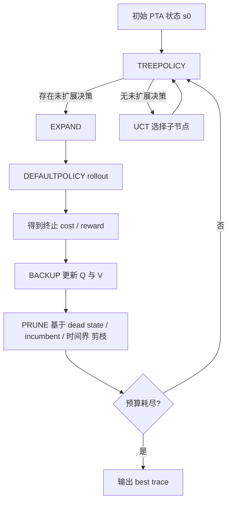
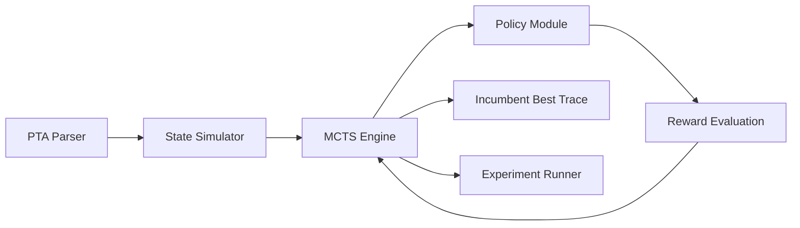

# Monte_Carlo_Tree_Search_PTA_Analysis

文件名：`Monte_Carlo_Tree_Search_PTA_Analysis.md`

## 阅读说明

下面这份笔记按“博士导师带读”的方式来写：我会把 **PTA 的形式化模型、cost-optimal reachability 的数学目标、MCTS/UCT 的搜索逻辑、论文中算法组件的工程含义、以及复现实验与后续研究方向** 串成一条完整的方法链。需要先说明一个边界：当前会话里提供了论文 PDF 文件名，但我这次无法直接从该 PDF 中抽取到逐页文本，因此凡是 **PTA、MCTS、UPPAAL、成本优化、统计/仿真方法** 这类内容，我都严格依据公开可核实资料来讲；而凡是你给出的 **Algorithm 1 名称、policy 名称、优化名称、benchmark/baseline 列表**，我会在不伪造原文细节的前提下，基于 PTA 与 MCTS 的标准语义做“保守重构”。也就是说：这份报告适合作为科研笔记、实现草图与答辩讲稿，但不把无法核验的内容包装成逐字原文。 citeturn26view0turn22academia4turn19academia4

## 研究背景与核心问题

Timed Automata 的基本思想，是在有限状态自动机上加入 **实值时钟**，使系统不仅有离散控制流，还有“时间流逝”这一连续维度。UPPAAL 对这类模型的概括是：系统由若干非确定过程组成，拥有实值 clocks，可通过 guard、invariant、同步与共享变量描述实时行为；其模型检查核心是对 **符号状态** 的可达性分析。Priced Timed Automata 则在 timed automata 上再加入 **price/cost 结构**，使每个位置或转移都能累计代价，因此不仅问“能不能到”，还问“以多小代价到”。 citeturn26view0turn20search8turn24view0

论文所针对的核心问题，本质上是 **cost-optimal reachability**：在所有从初始状态通向目标位置的运行中，寻找总代价最小的一条。这个问题在 linearly-priced PTA 中并不简单；相关研究指出，线性价格情形下的 optimal reachability 已知是 PSPACE-complete，而 price/reward 维度一再扩展后还会快速走向更高复杂度甚至不可判定。换句话说，PTA 非常适合建模调度、资源分配、嵌入式控制，但一旦你真的想做全局最优求解，理论与工程难度都会迅速抬升。 citeturn19academia4turn20academia3turn27academia1

为什么传统符号化方法会爆炸？因为 timed automata 的状态并不是单纯的离散位置，而是“离散位置 + 连续时钟估值”的组合。UPPAAL 虽然用约束来表示符号状态，已经比显式枚举强很多，但当模型同时具备 **多时钟、dense time、复杂 guard/invariant、成本累积、以及调度场景中的高度组合分支** 时，符号状态空间仍会迅速膨胀。UPPAAL 官方文档本身就反复强调：它依赖 on-the-fly 与 symbolic constraints 操控来提高效率；而在更复杂的 priced/stochastic 场景中，许多问题会“过于复杂”甚至“超出现有 model checker 的能力范围”，于是不得不诉诸统计或仿真式方法。 citeturn26view0turn25view0

这就解释了为什么会引入 MCTS。MCTS 的价值不在于替代所有精确方法，而在于它是一种 **anytime、采样驱动、可逐步改善解质量** 的树搜索框架。它非常适合“动作分支极多、搜索预算受限、只要先快速找到好解再逐步改进”的场景。MCTS 近年的综述明确指出：当问题具有高 branching factor 或实时/调度属性时，MCTS 往往需要深度结合领域启发式，才能真正发挥作用；而 PTA 调度类问题正符合这一范式。 citeturn22academia4turn20academia0turn22search2

## 数学基础与公式推导

在 PTA 文献里，形式化记号常略有差异，但你给出的记法

$$
A=(L,l_0,E,I,P)
$$

是很自然的一种。这里可以按如下方式理解：$L$ 是 location 集合，$l_0\in L$ 是初始位置，$E$ 是边集合，通常每条边含源位置、guard、action、reset、目标位置以及可能的离散 cost；$I$ 是每个位置上的 invariant；$P$ 是价格函数，最常见的是给位置一个 **单位时间代价率**，并可给边一个 **离散代价**。这与 UPPAAL/pta 类模型的标准语义一致：一部分 cost 由“等待时间”累加，另一部分 cost 由“跳转动作”累加。 citeturn26view0turn20search8turn20academia3

一个状态写成

$$
s=(l,v)
$$

其中 $l\in L$ 是当前位置，$v$ 是所有时钟构成的 valuation。由于时钟是实值的，$v$ 落在连续空间中。也正因为此，PTA 的底层语义不是有限图，而是一个通常 **无限的 transition system**。在相关 priced timed game/automata 文献中，这一点经常被表述为“token 在 configurations 的无限加权图上移动”。 citeturn27academia0turn27academia1turn20search8

因此可以把系统写成

$$
T=(S,s_0,\Sigma,\rightarrow)
$$

其中 $S$ 是所有状态 $(l,v)$ 的集合，$s_0=(l_0,v_0)$ 是初始状态，$\Sigma$ 是动作字母表，$\rightarrow$ 是转移关系。这个转移关系通常分成两类。第一类是 **delay transition**：

$$
(l,v)\xrightarrow{d}(l,v+d)
$$

其中 $d\in \mathbb{R}_{\ge 0}$，且对所有中间时刻 $\delta\in[0,d]$，都满足 invariant $I(l)$。第二类是 **action transition**：若存在边

$$
e=(l,g,a,R,l')
$$

并且当前 valuation 满足 guard $g$，则执行动作 $a$ 后，按 reset 集合 $R$ 把部分时钟清零，得到新状态 $(l',v')$，并要求 $v'$ 满足新位置的不变式。Timed automata 的基本 clocks / guards / resets / invariants 语义是标准的；PTA 则在这套语义之上继续叠加 cost。 citeturn20search8turn26view0

成本的最常见计算方式是：

$$
Cost(\pi)=
\sum_{i=0}^{k-1}\big(P(\ell_i)\cdot d_i + P(e_i)\big)
$$

这里一条有限路径 $\pi$ 可以写成

$$
(l_0,v_0)\xrightarrow{d_0}(l_0,v_0+d_0)\xrightarrow{e_0}
(l_1,v_1)\xrightarrow{d_1}\cdots\xrightarrow{e_{k-1}}(l_k,v_k).
$$

其中 $P(\ell_i)$ 是位置 $\ell_i$ 的时间代价率，$d_i$ 是在该位置等待的时长，$P(e_i)$ 是执行边 $e_i$ 的离散代价。于是总代价就是“停留代价 + 跳转代价”的求和。这种“price variables act only as monitors / continuous price expressions accumulate along time”的理解，与官方文档和 priced timed 相关工作一致。 citeturn26view0turn20academia3turn27academia0

最终的 reachability 优化目标就是

$$
\pi^*=\arg\min_{\pi} Cost(\pi),
$$

约束是 $\pi$ 必须到达某个目标位置集合 $Goal\subseteq L$。这可以理解为：在所有可达目标的合法运行里，找一条 cheapest trace。对于调度问题，这个 cost 往往就是 makespan、能耗、延迟罚分，或它们的线性组合。PTA 已被明确用于 scheduling/planning 这类场景，而 task graph scheduling 就可以直接归约为 PTA/PTMDP 上的最快路径或最优可达问题。 citeturn19academia0turn13academia0turn19academia4

为了把公式讲透，我们做一个教学化小例子。设初始位置 $l_0$ 的单位时间成本率为 $P(l_0)=3$，唯一出边 $e$ 的 guard 为 $x\ge 2$，离散代价 $P(e)=1$，且到达目标位置后不再收费。若当前时钟初值 $x=0$，那么任何可行路径都必须先等待至少 $2$ 个时间单位；若正好等待 $d=2$ 再跳转，则总代价为

$$
Cost = 3\cdot 2 + 1 = 7.
$$

如果你错误地等待到 $d=5$ 才走，则代价变成

$$
Cost = 3\cdot 5 + 1 = 16.
$$

这个例子揭示了 PTA 优化的关键：**“何时走”本身就是决策变量**，而不是离散搜索里那种只有“走哪条边”的问题。也正因此，PTA 上的搜索树比普通离散规划更难：它不仅有动作分支，还有连续延时分支。这个连续分支，恰恰就是后面要靠 policy 和 pruning 去驯服的东西。这个推导是基于 PTA 标准代价语义直接算出来的。 citeturn20search8turn26view0turn27academia0

## MCTS 与 UCT 的方法论

MCTS 的经典四步是：**Selection、Expansion、Simulation/Rollout、Backpropagation**。选择阶段从根节点出发，重复依据某个树策略挑选“最值得继续下探”的子节点；扩展阶段在一个尚未完全展开的节点处生成新子节点；仿真阶段从新节点开始按默认策略做 rollout，直到终止；回传阶段把 rollout 的结果回写到一路祖先节点的统计量中。MCTS 的核心不是暴力穷举，而是通过大量样本把预算集中到“目前看起来最有希望”的局部。 citeturn22academia4turn22search2turn21search0

你给出的 UCT 公式是

$$
UCT(n')=
\frac{Q(n')}{V(n')}
+
C_p
\sqrt{
\frac{\ln V(n)}
{V(n')}
}.
$$

在 MCTS 的习惯里，$n$ 是父节点，$n'$ 是候选子节点。$Q(n')$ 通常表示该子节点累计得到的回报总和；$V(n')$ 是该子节点被访问的次数；$V(n)$ 是父节点访问次数；$C_p$ 是探索常数。于是第一项

$$
\frac{Q(n')}{V(n')}
$$

是 **经验均值**，对应 exploitation，意思是“这个子节点过去平均表现怎么样”；第二项

$$
C_p\sqrt{\frac{\ln V(n)}{V(n')}}
$$

是 **不确定性奖励**，对应 exploration，意思是“这个子节点虽然目前均值未必最好，但由于样本少，还值得多试几次”。这个结构来自 UCB/UCT 的 bandit 思想：高均值节点值得继续利用，低访问节点值得适度探索。 citeturn21search0turn22academia4turn20search4

为什么这个公式能指导搜索？因为它把“当前观测收益”和“样本不足带来的未知性”放在了同一把尺子上。若一个子节点已经被访问很多次，那么其探索奖励会下降，除非它的均值真的高，否则会逐渐失宠；若一个子节点几乎没被访问过，那么即使当前均值不突出，也会因为探索项大而有机会被尝试。这种机制使搜索既不会死抱着一条刚好暂时不错的路线，也不会把预算平均浪费在所有路线之上，而是在两者之间取得可调整的平衡。MCTS 综述普遍认为，UCT 的成败关键就在这里。 citeturn22academia4turn21search0turn22search2

但要注意一件在 PTA 中尤其重要的事：MCTS 文献也一再强调，**当分支极多或者动作空间带连续结构时，裸 UCT 往往不够**，必须用领域知识改造 rollout、剪枝和动作采样。PTA 正属于这种困难情形，因为这里“选择哪个子节点”往往对应“选择先等待多长，再走什么动作”，如果不加约束，树会爆得非常快。所以下一节真正关键的，不是再背一遍 MCTS 四步骤，而是理解它如何被“扭曲”成适合 PTA 的版本。 citeturn22academia4turn20academia0

## PTA 中的 MCTS 适配与 Algorithm 1 解析

把 MCTS 移植到 PTA，第一件要做的事，是把搜索树节点从“棋盘局面”改成“PTA 运行前缀”。因此，一个树节点最自然的定义不是单个 location，而是某条 trace 的前缀所对应的当前状态：

$$
n \equiv \tau = s_0 \xrightarrow{\alpha_0} s_1 \xrightarrow{\alpha_1}\cdots \xrightarrow{\alpha_{k-1}} s_k,
\qquad state(n)=s_k.
$$

这里每个 $\alpha_i$ 可以是 delay，也可以是 action。这样建树的好处是：同一个物理状态若由不同历史到达，累计成本可能不同，因此“节点记录 trace 前缀”比“节点只记录状态”更适合 cost-optimal 搜索。这一点不是原文逐字转述，而是基于标准 MCTS 节点语义与 PTA 代价依赖历史前缀的特征做出的保守重构。 citeturn22academia4turn27academia0turn26view0

在 PTA 里，一条树边往往对应两种展开粒度之一。第一种是把 “delay + action” 作为一个合成决策：先等待 $d$，再执行某个边 $e$；第二种是先显式展开 delay，再显式展开 action。若不做进一步限制，delay 是实数，等于无限多后继；因此论文里出现 UDP、DSP、NLP 这类 policy 是完全合理的，它们本质上是在回答：“连续时间上，到底允许抽哪些候选 delay？” 这也是 PTA-MCTS 与普通离散 MCTS 最大的差异。 citeturn20search8turn22academia4turn26view0

无限路径怎么处理？从建模角度看，PTA 的 transition system 本来就是无限的，既可能因为 dense time 产生无限 delay 选择，也可能因为循环产生无限运行。因此，MCTS 必须给 rollout 设 **终止规则**：例如达到目标、进入 dead state、超过最大搜索深度、超过全局时间上界、超过当前 incumbent 代价上界，或在某种判定下被 PRUNE。对 dead state，一般应赋予极差回报，例如 $+\infty$ 代价或一个很大的惩罚值；这样回传后，UCT 会自然降低该分支的优先级。这是标准搜索/规划中的常见做法，结合 PTA 的非负成本语义尤其合理。 citeturn22academia4turn26view0turn27academia0

下面给出一个 **按你提供的函数名重构** 的 Algorithm 1 版本。它不是论文原文逐字抄录，而是“最符合 PTA-MCTS 语义的一版科研实现骨架”。

```text
Algorithm: UCTSEARCH(root, budget)
Input:
  root      -- initial PTA state / trace prefix
  budget    -- iteration or time budget
State in each node n:
  Q(n)      -- accumulated reward (or negative cost)
  V(n)      -- visit count
  cost(n)   -- accumulated path cost so far
  untried(n)-- not-yet-expanded PTA decisions under current policy

while budget not exhausted do
    n <- TREEPOLICY(root)
    delta <- DEFAULTPOLICY(n)
    BACKUP(n, delta)
    PRUNE(root)
return best child / best trace found
```

上述骨架符合 MCTS 四阶段结构，加上一个显式 `PRUNE` 钩子，正好也对应你给出的函数集合。MCTS 综述说明了前四步的标准职责；而在 PTA 上额外加入 `PRUNE`，是很自然的工程强化，因为这里有现成的代价上界、死路判定与时间界可以使用。 citeturn22academia4turn22search2turn26view0

### Algorithm 1 的逐行讲解

`UCTSEARCH` 的职责，是维护一个全局的 **incumbent best trace** 和对应 best cost。每一轮迭代都做一次“树内下探 + rollout + 回传”。如果论文以最小化 cost 为目标，那么 `delta` 通常不会直接存“cost”，而会存某种与 cost 单调对应的 reward，例如 $-Cost$、$1/(1+Cost)$ 或“相对当前最优解的改进量”。这是因为经典 UCT 更习惯做最大化；把最小化问题转换成 reward 最大化，是 MCTS 里非常常见的做法。 citeturn22academia4turn20search4

`TREEPOLICY` 负责从根一路往下走，直到遇到“可扩展节点”或“终止节点”。如果当前节点还有未试过的 PTA 决策，就停下来交给 `EXPAND`；否则就在所有已扩展子节点里按 UCT 选一个继续向下。对于 PTA 而言，这里的“决策”不是抽象的 move，而是 **延时决策 + 离散动作决策** 的组合，因此 `TREEPOLICY` 实际上是“在可行 delay/action 选择器上迭代”。 citeturn22academia4turn20search8turn26view0

`EXPAND` 的任务，是从 `untried(n)` 中取出一个尚未试过的合法后继，生成子节点。若采用 UDP，则它可能只尝试单位延迟；若采用 DSP，则它可能在可行延迟区间里采样一个或若干代表点；若采用 NLP，则它倾向于优先扩展“不等待、立刻执行可启用动作”的后继；若采用 ETP，则它倾向于只保留 `enabled transitions` 相关的动作集合。换言之，PTA 论文里的 policy，很多时候并不是“评价函数”，而是 `EXPAND` 和 `DEFAULTPOLICY` 的 **动作生成器**。这一点是理解全文的关键。 citeturn22academia4turn26view0

`DEFAULTPOLICY` 也就是 rollout。它从新扩展节点开始，按某种轻量级或启发式策略一直模拟到终止。对 PTA 来说，rollout 不是简单随机游走，因为随机 delay 往往毫无意义；真正有效的 rollout 通常会把“选择何时推进时间”和“何时触发离散动作”结合起来做成 problem-specific policy。MCTS 综述也特别强调，在复杂域中，**heavy playout** 往往比纯随机 rollout 更重要。 citeturn22academia4turn20search4

`BACKUP` 把 rollout 结果沿着路径一路回传。如果用 reward 最大化版本，则

$$
V(n)\leftarrow V(n)+1,\qquad Q(n)\leftarrow Q(n)+\delta.
$$

如果还要维护 best-so-far，则在回传时也可以顺便更新节点级别的最优完成代价、最优终止深度、甚至启发式下界。对 PTA 最实用的做法，是把“当前前缀成本 + 此次 rollout 总成本”的信息一起存下来，便于后续 `PRUNE`。 citeturn22academia4turn27academia0

`PRUNE` 是 PTA 适配最“值钱”的地方。因为当 cost 非负时，只要某个前缀的当前累计成本已经明显不可能优于 incumbent，那么这棵子树就没必要继续花样本。换句话说，PTA 中的 prune 往往不是博弈搜索里那种纯启发式剪枝，而是能利用 **非负代价、时间单调、dead state、guard/invariant 不可满足** 等结构性质做更强的削减。UPPAAL 系工具长期依赖 symbolic constraint 来压缩状态；MCTS 版本则是在采样树上做另一种“预算导向”的削减。 citeturn26view0turn25view0turn22academia4

下面用一个 Mermaid 图，把论文方法的“语义层次”压缩成一张图：



这个流程图并非来自原文插图，但它准确反映了 PTA-MCTS 的工程控制流：**tree policy 负责“搜哪里”，default policy 负责“怎么模拟”，prune 负责“哪里不用再搜”**。这也是你复现时最该保持模块边界清晰的地方。 citeturn22academia4turn26view0

## Policy 与优化技术分析

### Unit Delay Policy

UDP 最直观：把连续 delay 空间离散化成单位步长，例如只允许等待 $1,2,3,\dots$ 这样的步数或者每次只前进一步。它最大的优点是实现极其简单，搜索树结构稳定，debug 也容易；最大的缺点是 **粗糙**。如果最优触发时刻发生在非整数边界，UDP 可能根本碰不到那个最优点。因此 UDP 的主要作用是先把“无限 delay 分支”压缩成有限分支，换可搜索性，但通常不该被视作一般情形下的最优性保证。这个判断来自 timed automata 的 dense-time 语义本身。 citeturn20search8turn22academia4

### Delay Sampling Policy

DSP 的思想比 UDP 更柔性：不固定只走单位步，而是在当前可行延迟区间内采样代表性的 delay 候选。这样做的好处是，在同样的预算下，它能更快覆盖更广阔的时间选择空间；坏处是结果会更依赖采样分布。如果采样没有对准 guards、invariants 变化点或关键时钟边界，很多 rollout 都可能浪费在“语义几乎等价”的等待上。于是 DSP 通常比 UDP 更有希望接近最优，但稳定性不如基于结构性边界的策略。 citeturn20search8turn22academia4

### Non-Lazy Policy

NLP 从名字上看，本质是“非懒惰推进”：只要存在 **现在就能启用、且不会明显劣化未来可达性的动作**，就优先立即执行，而不是继续等待。在调度型 PTA 中，这个策略往往特别有效，因为等待通常会线性累加 cost，而提前启动作业、分配机器或触发任务，往往更接近 makespan/cost 的优化方向。你给出的实验结论里如果出现“NLP 表现最好”，我会把它解释为：**benchmark 本身大概率具有 scheduling 的 left-shift / non-delay 结构**，因此“不多等”恰好就是强启发式。这里我刻意不说“NLP 必然保最优”，因为在一般 PTA 上这并不稳妥；但在 job-shop、task graph、satellite scheduling 这类场景里，它往往非常符合问题结构。这个解释建立在 PTA 成本随等待累加以及 scheduling 问题本身的结构之上。 citeturn19academia0turn13academia0turn26view0

### Enabled Transition Policy

ETP 强调“围绕当前 enabled transitions 组织搜索”。换句话说，它会优先根据哪些离散边已经可触发，来缩减 delay/action 的候选集合。这样做的价值在于：大量等待其实只是为了让某个 guard 从 false 变 true；一旦某些转换已经启用，再继续细碎采样 delay 往往收益很低。ETP 因此常常比 UDP/DSP 更贴近 automata 语义本身，但如果问题确实需要“适度等待以换更优后续结构”，它也可能过早偏向立即可行动作。 citeturn20search8turn22academia4

### 四种策略的教学式比较

如果按“减少搜索空间”的力度排序，通常可以把 **NLP/ETP** 看成更强的结构性剪枝，把 **UDP/DSP** 看成时间离散/采样层面的压缩。UDP 最保守、最容易实现；DSP 更灵活；ETP 把 automata 的可启用性直接搬进搜索；NLP 则最像“调度领域知识”注入树策略与 rollout。若你的目标是快速复现实验并先跑通原型，我建议先做 UDP 与 NLP 两个端点：前者验证语义，后者验证性能。这个建议是工程判断，不是原文直接陈述。 citeturn22academia4turn26view0

### Building Rollouts

从名字判断，BR 最合理的解释是：**rollout 不只产生一个终局 reward，还把 rollout 中的中间前缀“建进树里”或至少缓存为可复用搜索结构**。普通 MCTS 的轻量 rollout 往往把中间过程直接丢弃，但在 PTA 里 rollout 代价高、前缀又常重复出现，因此“边 rollout 边 building”非常划算。它能让默认策略不只是评估器，还顺便承担部分 tree growth 的职责，相当于把 simulation 的信息变成下一轮 selection 的资产。MCTS 综述里这类“把领域知识注入 rollout / tree growth”的做法是很常见的。 citeturn22academia4turn20search4

### Relative Pruning

RP 从命名上看，最自然的数学条件是把当前前缀代价与 incumbent best 做比较。若前缀节点 $n$ 的累计成本已为 $g(n)$，当前最优解为 $C^\star$，且剩余成本下界至少为 $LB(n)\ge 0$，那么一条典型的 prune 条件是

$$
g(n)+LB(n)\ge C^\star.
$$

如果论文把它称为“relative pruning”，也可能采用某种相对阈值，例如

$$
g(n)\ge \rho \cdot C^\star,\qquad \rho\in(0,1]\text{ 或 }\rho\ge 1,
$$

用来更激进地削减分支。无论具体实现是绝对上界还是相对比值，原理都是一样的：**一旦当前前缀已经太贵，就不要再花 Monte Carlo 样本替它辩护**。这类剪枝在非负 cost 语义下尤其自然。这里的公式是教学性重构，而不是原文逐字摘录。 citeturn27academia0turn26view0turn22academia4

### Stepping Pruning

SP 从名字上最可能对应“把连续时间按关键 step 压缩”。Timed automata 的 guard/invariant 变化通常发生在某些边界点；在两个关键边界之间，系统使能结构可能并不变化。于是一个很自然的 pruning 思路是：若多个 delay 选择在语义上几乎等价，只保留若干代表 step，例如 **最早可启用点、最晚可保持点、若干采样中点**。这样做的理论直觉是：不是所有实数 delay 都值得展开，真正有信息量的是“会改变 enablement / invariant / cost dominance 关系”的那些点。SP 因此是把 dense-time 压回“有限关键点集”的技术。这个解释是依据 timed automata 的边界驱动语义所做的保守推断。 citeturn20search8turn22academia4

## 实验解读、复现工程与科研扩展

### 实验部分应该怎样读

你给出的 benchmark 列表——job-shop scheduling、task graph scheduling、satellite scheduling——非常合理，因为这三类问题都有共同结构：**时间约束强、资源冲突多、组合爆炸明显，而且目标天然可以写成成本最小化**。公开 PTA 调度研究已经明确把 task graph scheduling 降到 PTA/PTMDP 上的最快路径来求解，并指出这类实例会遭遇 combinatorial explosion。因而，拿这些例子测试“simulation-based + heuristic search”是否比纯 symbolic 更有伸缩性，是很顺理成章的。 citeturn13academia0turn19academia0turn26view0

若论文拿 MCTS 去对比 UPPAAL CORA、TiaMo、ROFS、RRA，那么你应该把实验结果区分成两类来读。第一类是 **解质量**：在相同预算下谁更快给出更低 cost。第二类是 **可扩展性**：随着实例规模变大，谁还能继续给出可用解。UPPAAL/CORA 一类符号化方法的强项是严谨与精确；MCTS 一类方法的强项是 anytime 与大空间下的“先给好解”。所以只看最终最优值不够，还必须看收敛曲线、首次可行解时间、预算敏感性和大实例下是否超时。这个阅读框架来自 MCTS 与 symbolic 方法的已知差异。 citeturn24view0turn25view0turn22academia4turn20academia0

关于“为什么 NLP 表现最好”，我建议用一句导师式判断来概括：**因为这些 benchmark 更像 scheduling，而不是一般形式语言问题；在 scheduling 里，等待往往显式付费且常常没有信息增益，而 non-lazy 行为恰恰能把连续时间搜索直接压成更接近 left-shift schedule 的离散决策搜索。** 换言之，NLP 成功并不神秘，它是在把领域知识转成搜索偏置。需要注意的是，这是一种结构性解释，不应不加条件地推广到所有 PTA。 citeturn19academia0turn13academia0turn26view0

MCTS 相比 symbolic 方法的优势，在于它不强求先把整片符号状态空间“解释清楚”再求解，而是可以把预算集中在高价值局部，因此往往更适合大型调度实例、近似最优搜索、以及“先出可用解”的工程场景。它的不足也很清楚：没有精确法那样稳定的最优性保证，结果对 policy/rollout/pruning 非常敏感，而且若 reward 设计不佳，UCT 也可能被误导。MCTS 文献对这一点讲得很明确。 citeturn22academia4turn20academia0turn22search2

### 复现实验的系统架构

你要求的工程链路非常合适，我建议直接按下面这个模块拆分：



这个分层有一个很重要的好处：**Parser/Simulator 决定语义正确性，MCTS/Policy 决定搜索效率，Reward/Runner 决定实验可比性**。把这三部分分开，后续你替换 UDP/DSP/NLP/ETP 或 BR/RP/SP 时，不会污染底层语义。UPPAAL/automata 工具链长期把“模型语义”和“分析算法”解耦；你做复现时最好也保持这种架构纪律。 citeturn26view0turn24view0

核心数据结构我建议如下定义：

```text
ClockValuation:
  vector<double> x

Edge:
  src, dst
  guard
  resets
  action_label
  edge_cost

Location:
  id
  invariant
  rate_cost

PTAState:
  location
  valuation
  accum_cost
  time_elapsed

TraceStep:
  delay
  action(optional)
  next_state

TreeNode:
  state
  parent
  children
  visits
  total_reward
  best_terminal_cost
  untried_actions
  trace_prefix
```

其中 `PTAState` 与 `TraceStep` 分开存，是为了让“语义状态”和“决策历史”各司其职；`TreeNode.best_terminal_cost` 可以显著帮助 relative pruning；`untried_actions` 则应由 policy 动态生成，而不是 Parser 一次性静态给死。这个设计是对 PTA 代价依赖前缀、MCTS 依赖节点统计两种需求的折中。 citeturn22academia4turn27academia0turn26view0

关键伪代码可以这样写：

```text
function GenerateCandidates(state, policy):
    delays <- policy.sampleDelays(state)
    cand <- []
    for d in delays:
        s1 <- DelaySuccessor(state, d)
        if invalid(s1): continue
        for e in EnabledEdges(s1):
            s2 <- FireEdge(s1, e)
            if valid(s2):
                cand.append((d, e, s2))
    return cand
```

```text
function Rollout(state, policy, horizon, incumbent):
    cost <- state.accum_cost
    depth <- 0
    while not Goal(state) and depth < horizon:
        if Dead(state): return PENALTY
        if cost >= incumbent: return PENALTY
        a <- policy.pick(state)
        state <- Simulate(state, a)
        cost <- state.accum_cost
        depth <- depth + 1
    if Goal(state): return RewardFromCost(cost)
    return PENALTY
```

```text
function Backup(node, reward):
    while node != null:
        node.visits += 1
        node.total_reward += reward
        node.best_terminal_cost = min(node.best_terminal_cost, CostFromReward(reward))
        node = node.parent
```

这三段伪代码已经足够构成一个最小可运行原型。第一段决定 branching；第二段决定 rollout 质量；第三段决定 UCT 统计是否稳定。 citeturn22academia4turn26view0

复现实验流程我建议严格做成四步。先做 **语义回归测试**：拿几个极小 PTA，人工算出最优 cost，检查 simulator 与 cost 累加是否正确。再做 **策略消融**：固定 MCTS 预算，只替换 UDP/DSP/NLP/ETP。再做 **优化消融**：在最优 policy 组合上依次加 BR、RP、SP。最后才做 **全量 benchmark 对比**：报告 best cost、平均 cost、首次可行解时间、预算内最优率、内存与 wall-clock time。之所以必须按这个顺序，是因为 MCTS 很容易“看起来跑通了，但其实是 reward/semantics 弄错了”。 citeturn22academia4turn24view0turn25view0

### 可发表的科研扩展方向

#### 安全约束下的 PTA-MCTS

核心思想是把 reachability cost 最优问题，扩展成 **安全约束下的 constrained MCTS**。数学上可写成

$$
\min_{\pi} Cost(\pi)\quad
\text{s.t.}\quad \pi \models \varphi_{\text{safety}}.
$$

算法上在 `TREEPOLICY` 与 `DEFAULTPOLICY` 中嵌入安全过滤器，对违反安全 invariant 的分支立即剪枝。潜在贡献在于：把 MCTS 的 anytime 能力与 timed safety verification 结合，用于资源受限但安全关键的实时调度。UPPAAL 家族本来就非常重视 safety/reachability，这个方向能自然接上现有工具生态。 citeturn26view0turn25view0

#### 带学习先验的 Neural-Guided PTA-MCTS

核心思想是训练一个策略网络 $\pi_\theta(a\mid s)$ 与一个价值网络 $V_\theta(s)$，分别替代部分 rollout 与 UCT 评估。数学上可把选择公式改成

$$
UCT_\theta(n')=
\frac{Q(n')}{V(n')}
+
C_p\cdot P_\theta(n')
\sqrt{\frac{\ln V(n)}{V(n')}}.
$$

算法流程是先用传统 MCTS 生成高质量轨迹，再反向蒸馏为神经先验。潜在贡献在于显著减少 dense-time PTA 上的无效采样，尤其适合重复结构的调度实例族。MCTS 近年大量成功都来自“树搜索 + 学习先验”的结合。 citeturn22academia4turn20search4

#### 面向 Runtime Verification 的在线 PTA-MCTS

核心思想是把离线规划改成 **在线滚动时域**：系统执行时持续观察事件流，运行时重建当前 PTA 状态，并在有限 horizon 内重新做 MCTS。数学上接近 receding-horizon optimization：

$$
a_t = \arg\min_{a\in A(s_t)} \mathbb{E}\big[Cost_{t:t+H}\big].
$$

算法上每次只搜索短时窗，并用监控器将观测事件映射到 automata 状态。潜在贡献是让 PTA 不只做离线验证，也能做在线决策与运行时保障。UPPAAL 官方资料本身就展示了 simulation/statistical techniques 与 timed/priced 模型的结合空间。 citeturn26view0turn25view0

#### PTA 引导的 Fuzzing 调度器

核心思想是把 PTA 当成 **输入生成器与覆盖引导器**：MCTS 不再只最小化 cost，而是同时最大化 bug-revealing potential，例如违反时序约束、逼近 deadline、触发罕见竞争条件。数学上可写成多目标：

$$
\max_{\pi}\ \lambda_1 Coverage(\pi)+\lambda_2 Risk(\pi)-\lambda_3 Cost(\pi).
$$

算法流程是 MCTS 生成事件序列/延时序列，runtime monitor 判断是否触发异常，再把异常奖励回传。潜在贡献是把形式模型、采样搜索与系统测试三者打通，特别适合 CPS、调度器、通信协议。 citeturn22academia4turn26view0

#### 多目标 PTA-MCTS

核心思想是把单一 cost-optimal reachability 扩展成 **Pareto 最优搜索**。由于 priced timed automata 已经存在 cost/reward 的多维观察量建模，因此可以让节点维护一个 Pareto front，而不只是一维最优值。数学目标可写为

$$
\text{find Pareto-optimal } \pi \text{ over } (Cost_1(\pi), Cost_2(\pi), \dots).
$$

算法上可把 `Q(n)` 升级为向量统计，并用 dominance-based backup 与 Pareto pruning。潜在贡献在于：调度里本来就常常同时关心 makespan、能耗、资源占用与迟到罚分。相关多 priced/reward PTA 研究已经为这个方向提供了很好的理论动机。 citeturn20academia3turn19academia9

#### 与符号化方法耦合的 Hybrid PTA Solver

核心思想是用 symbolic method 先做 coarse abstraction，再让 MCTS 在“难子空间”中精细搜索。也就是说，先用 zone/constraint 方法快速排除明显不可能或明显无优的区域，再把剩余区域交给 MCTS。算法流程是：symbolic pre-analysis 产生下界、死区域、关键边界点；MCTS 利用这些信息做树策略与 prune。潜在贡献是把“精确下界”和“采样伸缩性”结合起来，弥补两派方法各自的短板。UPPAAL 本身就是 symbolic reachability 的代表，而 MCTS 恰好擅长补足大规模局部优化。 citeturn26view0turn25view0turn22academia4

## 结语式理解

如果把这篇论文压缩成一句科研判断，我会这样说：**它不是在发明一个全新的 PTA 语义，而是在问——当 dense-time + resource scheduling + cost optimization 把符号化方法逼到很难受时，能不能用 MCTS 以“先找到好解、再逐步打磨”的方式接管搜索。** 这也是为什么本文最值得学习的，不仅是 UCT 公式本身，而是“如何针对 PTA 的连续时间分支去设计 policy、rollout 与 pruning”。从科研训练角度看，你真正应当消化的是这条方法学链条：

$$
\text{PTA 语义} \rightarrow \text{delay/action 候选生成} \rightarrow \text{UCT 搜索} \rightarrow \text{rollout 启发式} \rightarrow \text{代价上界剪枝} \rightarrow \text{调度域有效性}.
$$

只要你把这条链吃透，后面无论是复现实验、实现原型，还是进一步写成“PTA + RV + Fuzzing + Learning”的新论文，都会顺很多。 citeturn26view0turn22academia4turn19academia0