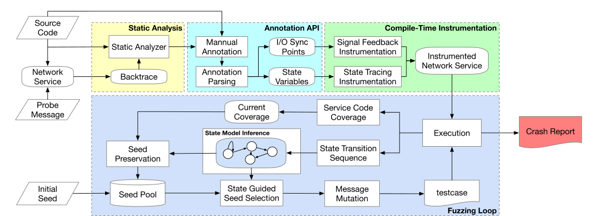
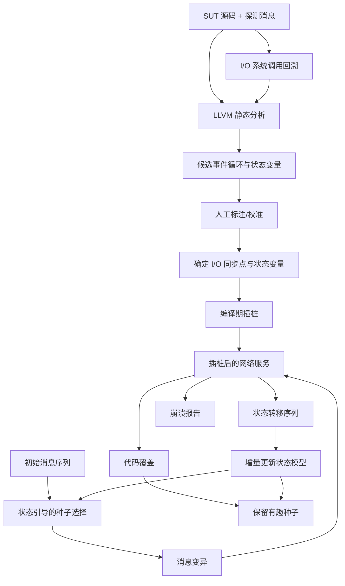
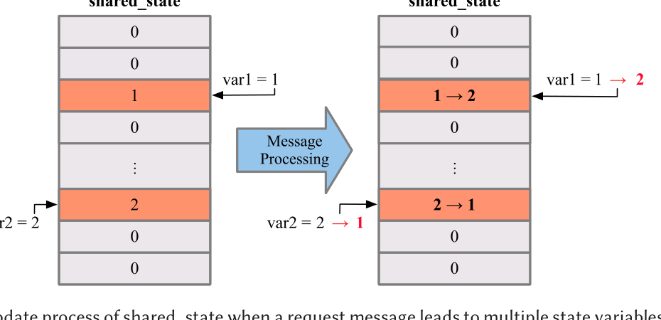
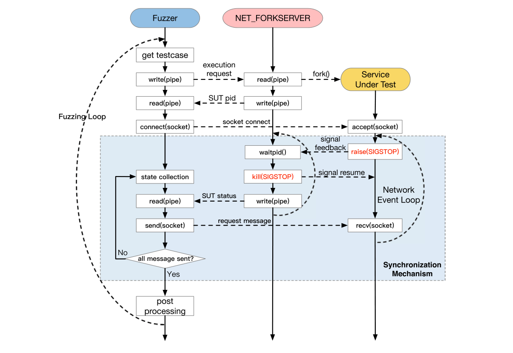
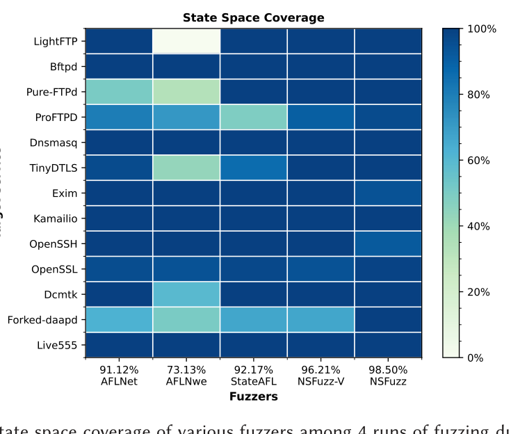

# NSFuzz 论文方法、核心算法与实验深读

## 0. 一句话结论

NSFuzz 解决的是：**如何对有状态网络服务进行既“看得懂状态”、又“跑得足够快”的灰盒模糊测试**。它的核心不是发明新的 mutation 或 power schedule，而是重新设计两条反馈通道：

1. 用少量、具有业务语义的程序状态变量表示协议/会话状态；
2. 利用网络事件循环的边界产生同步信号，取代固定 sleep，并在消息边界实时采集状态。

因此，这篇论文最侧重的是**状态表示质量和网络交互吞吐量**。状态引导的种子选择与消息变异基本沿用 AFLnet；漏洞 oracle 仍主要是崩溃与 AddressSanitizer，而不是协议性质或规范违规检测。[p.14 S019](paper.md#S019) [p.24 S033](paper.md#S033)

## 1. 论文要解决什么问题

### 1.1 为什么普通 coverage-guided fuzzing 不够

有状态网络服务具有两个关键特征：

- 同一请求在不同会话状态下可能执行不同代码；
- 很多漏洞需要特定消息序列才能进入深层状态并触发。

因此，仅观察代码覆盖会丢失“当前处于什么协议状态”的信息，遗传式变异可能保留了覆盖增加的输入，却不知道哪个消息前缀负责把服务带到关键状态。[p.2 S003](paper.md#S003)

### 1.2 现有状态表示不理想

- **AFLnet：响应码表示状态。** 有些协议没有稳定响应码；同一个响应码也可能对应多个内部状态。论文的 Bftpd 例子中，三个不同失败状态都返回 `503`，但内部变量 `state` 能区分它们。[p.8 S009](paper.md#S009)
- **StateAFL：内存状态表示。** 收集大量变化变量，再用 locality-sensitive hashing 近似内存状态；语义不清，而且需要执行后分析，吞吐开销较大。
- **SGFuzz：枚举变量表示状态。** 自动把枚举变量当状态变量会引入配置标志、消息类型等误报。

NSFuzz 的回答是：只跟踪经过筛选或人工确认、真正承载服务状态语义的变量。[p.3 S005-S006](paper.md#S005)

### 1.3 固定时间等待降低效率且不可靠

AFLnet 和 StateAFL 不知道一条请求何时处理完，只能在消息之间 sleep 固定时长：

- 太短：服务尚未准备好，下一条消息可能丢失或破坏交互；
- 太长：服务早已处理完，fuzzer 仍在空等。

NSFuzz 利用“服务重新到达事件循环入口”作为上一条请求处理完成的信号。[p.2 S004](paper.md#S004) [p.8 S008](paper.md#S008)

## 2. 论文真正的技术洞见

论文先把典型网络服务抽象为三个阶段：初始化、事件循环中的长期请求处理、清理。[p.6 S007](paper.md#S007)

由此得到两条洞见：

1. **事件循环入口是自然的消息边界。** 服务重新进入入口，表示前一请求已处理完并准备收下一条请求。
2. **业务状态通常显式编码在变量中。** 例如登录状态、握手状态、访问权限等，往往是枚举/整数全局变量或结构体成员。

这两条洞见分别对应 NSFuzz 的同步机制和状态模型。

## 3. NSFuzz 的完整工作流





### 离线准备阶段

1. 用探测消息让服务进入请求处理阶段；
2. 在 `read`、`recv`、`recvmsg` 等输入系统调用处取得调用栈回溯；
3. LLVM 静态分析识别包含网络 I/O 的循环，并用回溯选出目标外层事件循环；
4. 在事件循环及消息 handler 中筛选状态变量候选；
5. 用户用 `_NSFUZZ_SYNC` 和 `_NSFUZZ_STATE` 校准或补充结果；
6. 编译期插入同步信号和状态写入跟踪代码。

### 在线 fuzzing 阶段

1. NET_FORKSERVER 创建 SUT 子进程并与 fuzzer 建立管道；
2. SUT 到达同步点后停止，forkserver 用 `waitpid` 获取停止/崩溃状态；
3. fuzzer 在该边界读取 `shared_state`，得到上一条消息处理后的服务状态；
4. fuzzer 发送下一条消息并恢复 SUT；
5. 连续状态形成状态转移序列，用于增量构造状态模型；
6. 新代码覆盖或新状态转移使输入进入 seed pool；
7. 崩溃进入 crash report；否则继续选择状态、选择种子和变异消息。

## 4. 核心算法拆解

### 4.1 事件循环识别：动态回溯辅助的静态分析

尽管论文将其放在 “Static Analysis” 下，这一步实际上是混合式的：先动态运行探测消息取得 backtrace，再用静态循环信息匹配。

```text
输入：SUT、探测消息
1. 服务初始化后，在 read/recv/recvmsg 等输入调用处设置断点
2. 建立连接并发送探测消息
3. 命中断点时保存调用栈 BT
4. 静态枚举所有包含网络 I/O 的循环 L
5. 从 BT 底部向上扫描
6. 选择第一个包含 I/O 循环的外层函数/循环作为目标事件循环
7. 记录循环入口作为候选同步点
```

从调用栈底部向上选择外层匹配，目的是避开事件循环内部的嵌套 I/O 循环。[p.9 S011](paper.md#S011)

### 4.2 状态变量提取：启发式候选过滤

对变量 `v`，论文的候选条件可写成：

```text
candidate(v) :=
    v 出现在事件循环或消息 handler 中
    AND Load(v)
    AND Store(v)
    AND (v 是全局整数 OR v 是用户结构体的整数成员)
    AND Store(v) 的值是常量
```

逻辑依据是：状态变量需要被读取以执行状态检查，也需要被写入以完成状态转移；协议状态常以枚举/整数常量表示。[p.10 S012](paper.md#S012)

该算法只产生“更可能是状态变量”的候选集，不保证语义正确。因此作者再用标注 API：

- 删除配置 flag、消息类型等假阳性；
- 添加静态分析漏掉的状态变量；
- 对多层循环、事件驱动、C++ 虚调用目标直接人工标注。[p.10 S013](paper.md#S013)

### 4.3 状态映射：变量写入到 `shared_state`

对每个确认的状态变量分配唯一字符串 ID。每次该变量发生 `STORE` 时执行：

\[
shared\_state[H_1(var\_id)] \leftarrow current\_store\_value
\]

在一个消息边界，完整缓冲区再被哈希成服务状态 ID：

\[
s_t = H_2(shared\_state)
\]

若消息 `m_t` 前后的状态 ID 不同，就观察到一条转移：

\[
(s_{t-1}, m_t, s_t)
\]

连续转移形成状态模型。这个表示的优点是低开销、可解释、在线更新；代价是其正确性取决于状态变量选择，且论文没有分析 `H_1` 索引冲突或 `H_2` 状态哈希冲突。[p.12 S016](paper.md#S016) [p.13 S018](paper.md#S018)



### 4.4 I/O 同步：用信号替代固定 sleep

编译器在同步点插入 `raise(SIGSTOP)`。NET_FORKSERVER 作为父进程：

1. `waitpid()` 等待 SUT；
2. 根据状态判断这是同步停止还是崩溃；
3. 通过 pipe 通知 fuzzer；
4. fuzzer 采集状态并发送下一消息；
5. 父进程恢复 SUT，开始下一轮。



论文 Figure 2 把“恢复”操作标成 `kill(SIGSTOP)`，但 `SIGSTOP` 通常只会再次停止进程，正常恢复应使用 `SIGCONT`。正文没有解释这一点，因此更可能是图中的标注错误，不能据图断言实现真的用 `SIGSTOP` 恢复。[p.12 S017](paper.md#S017)

### 4.5 状态引导的 seed selection 和 mutation

这里是一个容易误读的地方：**论文没有给出新的状态调度算法或 mutation 算法，也没有算法伪代码。**正文只说按 AFLnet 的方式：

1. 从状态模型选一个“有趣状态”；
2. 选择能够到达该状态的 seed/message sequence；
3. 重放前缀到达目标状态；
4. 主要变异该状态之后的消息；
5. 若产生新代码覆盖或新状态/转移，则保留种子。

作者在 Discussion 中明确承认，当前 mutation procedure 仍遵循 AFLnet，尚未深入研究如何更好利用状态反馈。[p.14 S019](paper.md#S019) [p.24 S033](paper.md#S033)

## 5. 论文侧重什么，不侧重什么

| 维度 | 论文投入 | 判断 |
|---|---:|---|
| I/O 同步与吞吐 | 很高 | 最强贡献，也是实验提升最大的来源 |
| 状态表示与在线状态模型 | 很高 | 核心概念贡献，但准确性验证不如吞吐完整 |
| 静态分析与人工适配 | 高 | 工程化入口；并非完全自动 |
| 状态引导调度 | 中低 | 基本继承 AFLnet |
| 消息格式感知变异 | 无 | 被列为未来工作 |
| 协议规范/性质 oracle | 无 | 只观察覆盖、状态和崩溃 |
| 非崩溃逻辑漏洞 | 较弱 | 没有语义违规 oracle，可能漏掉 |

所以，NSFuzz 更像是一个**高效、语义更清晰的反馈基础设施**，而不是一个全新的 fuzzing 搜索策略。

## 6. 实验设计

### 6.1 总体设置

| 项目 | 设置 |
|---|---|
| Benchmark | ProFuzzBench 全部 13 个服务、10 类协议 |
| 协议/服务 | LightFTP、Bftpd、Pure-FTPd、ProFTPD、Dnsmasq、TinyDTLS、Exim、Kamailio、OpenSSH、OpenSSL、Forked-daapd、Live555、Dcmtk |
| 语言/传输 | C/C++；TCP 与 UDP |
| Baselines | AFLnet、StateAFL、AFLnwe |
| Ablation | NSFuzz-V：只有变量状态表示，没有快速 I/O 同步 |
| 预算 | 每个 target-fuzzer 组合 24 小时，重复 4 次 |
| 总计算量 | `13 × 5 × 24 × 4 = 6,240 CPU-hours` |
| 环境 | 论文表述为 128 Intel Xeon Platinum 8358 CPUs、384 GB RAM、SSD；独立 Docker、相同资源 |
| 崩溃分析 | AddressSanitizer 地址聚类，再人工分析漏洞根因 |

目标和版本见 [p.15 Table 1](paper.md#T001)，实验设置见 [p.15 S021](paper.md#S021)。

### 6.2 五个研究问题及对应实验

| RQ | 问题 | 实验方法 | 主要指标 |
|---|---|---|---|
| RQ1 | 是否更高效？ | 对比同步点识别与四种 fuzzer 吞吐 | exec/s、相对 AFLnet 提升 |
| RQ2 | 状态模型是否更准确？ | 状态变量提取统计、13 个模型规模、LightFTP 案例 | 变量数、分析时间、顶点/边、人工语义核验 |
| RQ3 | 总体 fuzzing 是否更有效？ | 5 种 fuzzer，含 NSFuzz-V 消融 | 分支覆盖、崩溃簇、漏洞数、首次崩溃时间 |
| RQ4 | 是否探索更多状态空间？ | 统计状态变量取值覆盖 | 近似状态空间覆盖率 |
| RQ5 | 能否持续发现真实漏洞？ | 最新版本长期 fuzzing 约两周 | 新漏洞类型、服务、确认/修复状态 |

## 7. 实验结果

### 7.1 RQ1：吞吐量——最强、最直接的结果

- 静态分析能在 13 个服务中的 9 个识别事件循环；其中 Exim、Kamailio、OpenSSH 仍需标注校准，另外 4 个只能人工标注。[p.15-16 S022/T002](paper.md#S022)
- 对不熟悉目标的人员，同步点标注耗时从数分钟到最多 2 小时。
- 相对 AFLnet，NSFuzz 的吞吐提升范围约为 `+94.60%` 到 `+20,059.68%`；论文概括为约 1.8 倍到超过 200 倍。
- 表中平均相对提升为 `+2,426.30%`，即最终吞吐约为 AFLnet 的 `25.263×`；作者称“平均提升约 24×”。[p.16-17 T003/S023](paper.md#T003)

需要注意，平均值被 TinyDTLS 的 `+20,059.68%` 显著拉高。按表中 13 个相对提升值重新计算，中位数为 `+805.32%`，即约 `9.05×` 的最终吞吐。这个数仍然很大，但更接近“典型目标”的提升，而不是算术均值所代表的整体印象。

### 7.2 RQ2：状态模型——概念合理，但广泛准确性证据有限

- 9 个目标可自动提取状态变量，分析时间从 0.7 秒到 441.9 秒；4 个目标不能自动处理。
- 静态候选经人工标注后通常大幅减少，例如 ProFTPD 从 81 个候选减到 5 个，OpenSSH 从 69 个减到 7 个，说明启发式仍有较多误报。[p.17 T004/S024](paper.md#T004)
- LightFTP 案例中，NSFuzz 四次都得到相同的 5 顶点/11 边模型：4 个 `Access` 权限状态和 1 个初始虚拟状态；人工源码分析可直接验证语义。[p.18-19 S025/F004](paper.md#S025)
- 同一目标上，AFLnet 平均得到 23 顶点/220 边，StateAFL 得到 51 顶点/254 边，而且不能清楚区分权限状态。

但“模型更小”不等于“模型更准确”，而且其他 12 个目标没有同等完整的 ground truth 对照。论文对准确性的最强证据实质上是 LightFTP 这个仅有一个状态变量、四个取值的案例。[p.19 S026](paper.md#S026)

### 7.3 RQ3：覆盖率、崩溃与漏洞

最终分支覆盖相对 AFLnet：

- NSFuzz 在 13 个目标上全部提高；
- 平均提高 `7.23%`；
- 最大为 TinyDTLS 的 `25.82%`；
- 只有变量状态反馈的 NSFuzz-V 平均提高 `2.11%`，且在 5 个目标上下降。[p.20 T006/S027](paper.md#T006)

这项消融很重要：状态变量反馈本身有帮助，但也有插桩开销；快速同步既直接提高吞吐，也抵消状态跟踪开销。

基准实验中：

| Fuzzer | 崩溃簇 | 人工分析后的漏洞 |
|---|---:|---:|
| AFLnet | 14 | 9 |
| AFLnwe | 15 | 9 |
| StateAFL | 14 | 10 |
| NSFuzz-V | 16 | 9 |
| NSFuzz | **19** | **11** |

崩溃地址聚类不是漏洞去重的最终依据，因为同一漏洞可能在不同位置崩溃；论文随后进行了人工分析。[p.21 T007/S028](paper.md#T007)

首次崩溃时间：

- Dnsmasq：NSFuzz 48 秒，AFLnet 1,554.5 秒；
- TinyDTLS：0.25 秒，AFLnet 51.25 秒；
- Live555：83.5 秒，AFLnet 470 秒；
- Dcmtk：4,628.75 秒，慢于 AFLnet 的 2,646.67 秒，但 NSFuzz 4/4 次成功，AFLnet 仅 3/4 次。[p.22 T008/S029](paper.md#T008)

### 7.4 RQ4：状态空间覆盖

平均覆盖率为：

- AFLnet：91.12%
- AFLnwe：73.13%
- StateAFL：92.17%
- NSFuzz-V：96.21%
- NSFuzz：**98.50%**



但这个指标不是对真实完整状态空间的覆盖。论文把“所有 fuzzer、所有运行共同触发过的状态变量取值并集”当作分母；若有所有工具都没到达的状态，它不会进入分母。多个变量时又主要累加各变量取值，而不是计算完整笛卡尔组合。因此它更准确地表示“相对于本次联合实验已知状态值的覆盖”，而不是绝对状态空间覆盖。[p.22 S030](paper.md#S030)

### 7.5 RQ5：真实漏洞

作者对最新版本进行约两周长期 fuzzing，报告 8 个零日漏洞：

- TinyDTLS：5 个；
- Dcmtk：3 个；
- 类型包括 heap-use-after-free、heap/global-buffer-overflow 和 SEGV。

投稿时状态是：2 个已修复、1 个已确认但因重构不直接修补、5 个仅已报告并等待确认。[p.23 T009/S032](paper.md#T009)

所以严谨表述应是：**作者报告发现 8 个候选零日漏洞，其中 3 个在投稿时得到开发者确认，2 个已修复**，而不是“8 个全部确认”。

## 8. 结果到底支持了什么

| 论文主张 | 证据强度 | 原因 |
|---|---|---|
| 事件循环同步显著提高吞吐 | 强 | 13 目标、4 次运行，提升幅度很大，NSFuzz-V 消融能分离同步贡献 |
| NSFuzz 提高总体覆盖与崩溃发现 | 中强 | 13 目标全覆盖提升、更多漏洞和更短首崩时间，但重复数和统计分析有限 |
| 变量状态表示比响应码/内存哈希准确 | 中等 | 设计逻辑合理，LightFTP 案例清晰；缺少其余目标的系统 ground truth |
| NSFuzz 更充分探索真实状态空间 | 中等偏弱 | 指标分母是联合实验观察并集，且忽略变量组合状态 |
| 能发现真实世界漏洞 | 中等 | 有 3 个开发者确认、2 个修复；其余 5 个投稿时未确认 |

## 9. 实验设计的优点

1. 使用 ProFuzzBench 全部 13 个目标，而非只挑选最适合的方法的服务。
2. 同时覆盖 TCP/UDP、C/C++ 和 10 类协议。
3. 固定 target 与 baseline 版本，使用容器和相同资源。
4. 24 小时、4 次重复，计算预算明确为 6,240 CPU-hours。
5. 包含 NSFuzz-V 消融，能够区分状态表示和同步加速的影响。
6. 同时测吞吐、覆盖、崩溃、状态模型、状态空间和长期新漏洞，证据链较完整。

## 10. 主要局限与可能的审稿质疑

### 10.1 状态模型准确性的外推不足

只有 LightFTP 做了清楚的语义 ground-truth 核验。其他服务的顶点/边数量不能直接证明准确；模型可能因变量选择过粗而合并状态，也可能因变量过多而拆分状态。

### 10.2 状态空间覆盖率是闭集、实验依赖指标

以所有 fuzzer 观察值并集为分母，会漏掉所有工具共同未探索的区域；而且把各变量值相加无法表达变量组合状态。因此 98.50% 不应理解为接近覆盖真实协议状态空间的 98.50%。

### 10.3 随机实验统计报告不足

每个配置只有 4 次运行，论文主要报告均值，没有置信区间、方差、显著性检验或 Vargha-Delaney A12 等 fuzzing 常用效应量。“significantly”更多是自然语言，而不是统计显著性结论。

### 10.4 自动化程度有限

13 个目标中只有 9 个能识别事件循环并自动提取变量；其中部分仍需校准，4 个完全依赖标注。方法要求源码、可重新编译和对目标状态语义的人工判断，不能直接用于闭源二进制服务。

### 10.5 事件循环假设有边界

异步、多线程、事件驱动、多路复用或流式服务不一定有“一条请求处理完后回到唯一循环入口”的清晰边界。论文自己指出 Live555 的 streaming I/O 模型不符合这一假设。

### 10.6 缺少关键同时代基线

论文讨论了 SnapFuzz 的高吞吐方案和 SGFuzz 的状态变量方案，却没有把它们纳入主要实验基线，因此“相对 state of the art”的范围主要限于 AFLnet、StateAFL 与 AFLnwe。

### 10.7 不是协议正确性 oracle

NSFuzz 以代码覆盖、状态新颖性和崩溃作为反馈。若服务进入了规范禁止的状态但没有崩溃，它不一定会报 bug；如果状态变化只是合法的新状态，也不会自动判断正确或错误。

### 10.8 哈希与信号细节未充分说明

- `var_id` 到 `shared_state` 索引可能发生冲突；整个缓冲区到状态 ID 也可能碰撞，论文未给出分析。
- Figure 2 的“恢复”标签写作 `kill(SIGSTOP)`，与常规信号语义不符，可能是 `SIGCONT` 的排版错误。

## 11. 与 PGFUZZ 的本质区别

| 方面 | PGFUZZ | NSFuzz |
|---|---|---|
| “状态/性质”的角色 | MTL 性质既引导搜索又充当违规 oracle | 程序状态变量用于状态模型和搜索反馈 |
| bug 判定 | 完整性质距离为负，表示安全策略违规 | 主要依赖崩溃/ASan；状态新颖不等于 bug |
| 目标 | 机器人/飞控的物理安全性质 | 有状态网络服务的覆盖和内存安全漏洞 |
| 核心创新 | policy distance 与输入-性质映射 | 状态变量抽象与事件循环同步 |
| 非崩溃逻辑错误 | 有对应性质时可以捕获 | 通常不能直接捕获 |

因此，如果你的研究目标是“违反协议时序性质也要报 bug”，NSFuzz 的状态模型可以作为引导信号，但还需要额外接入协议性质 monitor/oracle；状态覆盖本身不能替代性质判定。

## 12. 最终评价

NSFuzz 最有价值的贡献是把两个很实际的问题同时解决：**何时发送下一条消息，以及用什么低开销信号表示当前协议状态。**它通过事件循环同步获得了数量级吞吐提升，通过少量语义变量让状态模型更可解释；消融实验也表明二者结合比单独状态反馈更有效。

但它不是一个完整的新搜索算法，也不是协议规范验证器。论文对吞吐提升的证据很强，对总体覆盖和崩溃发现的证据较好；对“状态模型普遍更准确”和“接近覆盖完整状态空间”的证据则需要更谨慎解读。
