# NSFuzz: Towards Efficient and State-Aware Network Service Fuzzing

- Authors: Shisong Qin, Fan Hu, Zheyu Ma, Bodong Zhao, Tingting Yin, and Chao Zhang
- Venue: ACM Transactions on Software Engineering and Methodology 32(6), Article 160 (2023)
- DOI: `10.1145/3580598`
- Source: `/mnt/c/Users/PC-123/Zotero/storage/UA5H6BBW/Qin 等 - 2023 - NSFuzz Towards efficient and state-aware network service fuzzing.pdf`
- PDF SHA-256: `1b5fd0bda168ea24a81a80f7ef390af13499b80d0176eeefc0e19b14aa158943`
- Reader mode: analysis-focused bilingual evidence map

> This reader preserves the evidence blocks used in the accompanying detailed analysis. It is not a sentence-by-sentence translation of the references section; see `translation_notes.md` for scope.

## Page and section index

- Abstract: p.1
- 1 Introduction: p.2-3
- 3.1 Implementation of Network Service: p.6
- 3.2 Insight: p.8
- 4.1 Overview Design: p.8
- 4.2.1 Loop Structure Identification: p.9
- 4.2.2 State Variable Extraction: p.10
- 4.3 Annotation API: p.10
- 4.3.1 Synchronization Point Annotation: p.11
- 4.3.2 State Variable Annotation: p.11
- 4.4 Compile-Time Instrumentation: p.12
- 4.5.1 Fast I/O Synchronization: p.12
- 4.5.2 Service State Tracing: p.13
- 4.5.3 State-Aware Fuzzing: p.14
- 5 Evaluation: p.14
- 5.1 Experiment Setup: p.15
- 5.2.1 Static Analysis and Annotation: p.15
- 5.2.2 Fuzzing Throughput: p.17
- 5.3.1 Static Analysis and Annotation: p.17
- 5.3.2 Inferred State Model: p.18-19
- 5.4.1 Code Coverage: p.20
- 5.4.2 Crash Trigger: p.21-22
- 5.5 State Space Coverage Evaluation: p.22-23
- 5.6 Real-World Bugs Finding Evaluation: p.23
- 6.1 State Space Exploration: p.24
- 6.2 SnapFuzz: p.24
- 6.3 Future Work: p.24

## Terminology ledger

| Canonical term | 中文 | Decision |
|---|---|---|
| service under test (SUT) | 被测服务 | 论文有时泛指被测系统，这里统一为被测服务。 |
| state variable | 状态变量 | 被选择用来表示网络服务协议/会话状态的程序变量。 |
| I/O synchronization point | I/O 同步点 | 每条请求处理完成后产生信号的位置。 |
| variable-based state representation | 基于变量的状态表示 | 用若干状态变量当前值的组合表示服务状态。 |
| shared_state | shared_state 共享状态缓冲区 | 保留代码标识符不翻译。 |
| NET_FORKSERVER | NET_FORKSERVER | NSFuzz 的网络服务 forkserver 扩展。 |
| fuzzing throughput | 模糊测试吞吐量 | 单位为每秒执行次数 exec/s。 |
| state-space coverage | 状态空间覆盖率 | 论文用所有 fuzzer 观测到的状态变量值并集近似分母。 |

## Bilingual evidence blocks

### Abstract

**Source:** p.1 S001

**Original:** Existing network-service fuzzers have insufficient or inaccurate state representation and low testing efficiency.

**中文:** 现有网络服务模糊测试器面临状态表示不充分或不准确，以及测试效率低的问题。

**Source:** p.1 S002

**Original:** NSFuzz combines program-variable-based state representation with efficient interaction synchronization, static analysis, annotation APIs, and compile-time instrumentation.

**中文:** NSFuzz 将基于程序变量的状态表示与高效交互同步、静态分析、标注 API 和编译期插桩结合起来。

#### Fig. 001. NSFuzz 总体工作流

**Placed near:** p.1 S002  
**Source:** p.9

**Original caption:** Workflow of NSFuzz

**中文图注:** NSFuzz 总体工作流

**Reading note:** Inspect the separation between offline preparation and the runtime feedback loop.

### 1 Introduction

**Source:** p.2 S003

**Original:** The same request may produce different responses in different session states, and many bugs require a specific message sequence.

**中文:** 同一请求在不同会话状态下可能产生不同响应，而且许多缺陷只能由特定消息序列触发。

**Source:** p.2 S004

**Original:** A fixed delay is needed by prior tools because they lack a clear message-processing signal; a delay that is too short loses messages and one that is too long wastes time.

**中文:** 以往工具因缺少明确的消息处理完成信号而依赖固定等待；等待过短会丢消息，过长则浪费时间。

**Source:** p.3 S005

**Original:** AFLnet response codes can be absent or ambiguous, StateAFL approximates complex in-memory state with locality-sensitive hashing, and SGFuzz may retain irrelevant enum variables.

**中文:** AFLnet 的响应码可能缺失或有歧义；StateAFL 用局部敏感哈希近似复杂内存状态；SGFuzz 可能把无关枚举变量误作状态变量。

**Source:** p.3 S006

**Original:** NSFuzz treats selected program variables as semantic service-state carriers and the network event loop as a natural synchronization boundary.

**中文:** NSFuzz 把筛选后的程序变量作为具有语义的服务状态载体，并把网络事件循环视为天然同步边界。

### 3.1 Implementation of Network Service

**Source:** p.6 S007

**Original:** Network services are organized into initialization, persistent request processing in an event loop, and cleanup stages.

**中文:** 网络服务通常由初始化、事件循环中的持续请求处理，以及清理三个阶段组成。

### 3.2 Insight

**Source:** p.8 S008

**Original:** Re-entering the event loop indicates that the previous request has been processed and the service is ready for the next request.

**中文:** 服务重新进入事件循环意味着上一条请求已处理完成，并已准备接收下一条请求。

#### Fig. 002. I/O 同步机制

**Placed near:** p.8 S008  
**Source:** p.13

**Original caption:** I/O synchronization mechanism

**中文图注:** I/O 同步机制

**Reading note:** The synchronization boundary is the event-loop entry after one request has completed.

**Source:** p.8 S009

**Original:** Bftpd uses an enumerated global variable named state to distinguish session states even when failure responses share the same 503 response code.

**中文:** Bftpd 使用全局枚举变量 state 区分会话状态，即使不同状态下的失败响应都使用相同的 503 响应码。

### 4.1 Overview Design

**Source:** p.8 S010

**Original:** The four components are static analysis, annotation API, compile-time instrumentation, and the fuzzing loop.

**中文:** NSFuzz 的四个组成部分是静态分析、标注 API、编译期插桩和模糊测试循环。

### 4.2.1 Loop Structure Identification

**Source:** p.9 S011

**Original:** A probe reaches input-related system calls, records a backtrace, and the static analyzer chooses the first outer function on that trace that contains an I/O loop.

**中文:** 探测请求触发输入相关系统调用并记录回溯；静态分析器随后选择回溯中第一个包含 I/O 循环的外层函数。

### 4.2.2 State Variable Extraction

**Source:** p.10 S012

**Original:** Candidates are restricted to the event-loop region, must be both loaded and stored, and must be global integer variables or structure members assigned constant values.

**中文:** 候选变量被限制在事件循环相关区域内，必须同时被读取和写入，并且是被常量赋值的全局整数变量或结构体成员。

### 4.3 Annotation API

**Source:** p.10 S013

**Original:** Manual annotations handle multi-level or event-driven loops and refine false-positive state-variable candidates.

**中文:** 人工标注用于处理多层或事件驱动循环，并剔除状态变量候选中的误报。

#### Table 002. 同步点识别结果

**Placed near:** p.10 S013  
**Source:** p.16

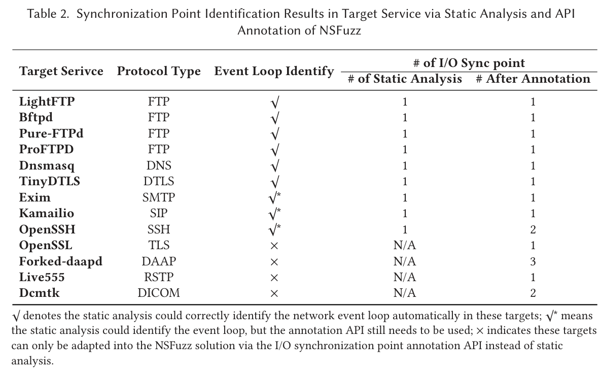

**Original caption:** Synchronization-point identification

**中文表注:** 同步点识别结果

#### Table 004. 状态变量提取结果

**Placed near:** p.10 S013  
**Source:** p.17

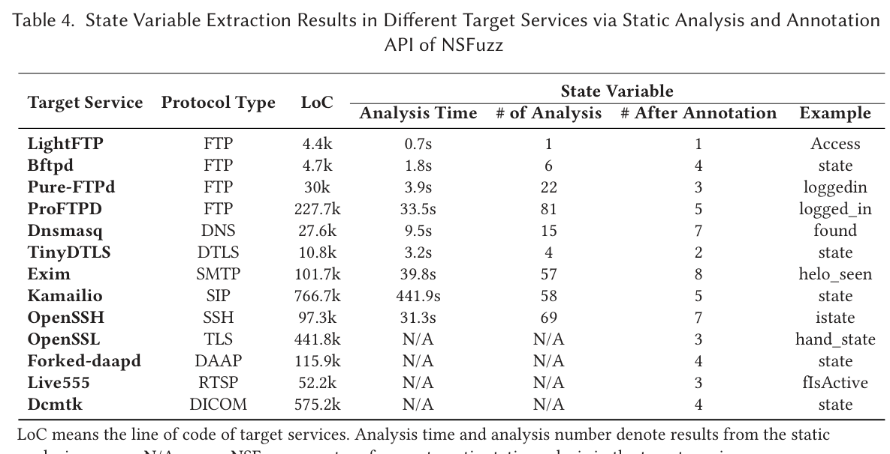

**Original caption:** State-variable extraction

**中文表注:** 状态变量提取结果

### 4.3.1 Synchronization Point Annotation

**Source:** p.11 S014

**Original:** _NSFUZZ_SYNC marks one or more locations so exactly one synchronization signal is emitted after each request is processed.

**中文:** _NSFUZZ_SYNC 标记一个或多个位置，使每条请求处理完后恰好产生一次同步信号。

### 4.3.2 State Variable Annotation

**Source:** p.11 S015

**Original:** _NSFUZZ_STATE can annotate global variables and structure-member variables selected to represent service state.

**中文:** _NSFUZZ_STATE 可标注被选作服务状态表示的全局变量和结构体成员变量。

### 4.4 Compile-Time Instrumentation

**Source:** p.12 S016

**Original:** shared_state[hash(var_id)] = cur_store_val

**中文:** 每次状态变量写入时，以变量唯一 ID 的哈希为索引，把当前写入值更新到 shared_state。

#### Fig. 003. shared_state 更新

**Placed near:** p.12 S016  
**Source:** p.13

**Original caption:** shared_state update process

**中文图注:** shared_state 更新

**Reading note:** Each selected variable occupies an indexed slot; the whole buffer is hashed into a state identifier.

### 4.5.1 Fast I/O Synchronization

**Source:** p.12 S017

**Original:** Instrumentation inserts raise(SIGSTOP) at synchronization points; NET_FORKSERVER uses waitpid to distinguish a synchronization stop from a crash and reports status through a pipe.

**中文:** 插桩在同步点插入 raise(SIGSTOP)；NET_FORKSERVER 通过 waitpid 区分同步停止与崩溃，并经管道向 fuzzer 报告状态。

### 4.5.2 Service State Tracing

**Source:** p.13 S018

**Original:** The hash of the complete shared_state buffer is used as the current service-state identifier, and successive identifiers form a state-transition sequence.

**中文:** 完整 shared_state 缓冲区的哈希被用作当前服务状态标识，连续的状态标识构成状态转移序列。

### 4.5.3 State-Aware Fuzzing

**Source:** p.14 S019

**Original:** NSFuzz updates the state-transition model and performs state-guided seed selection and message mutation similarly to AFLnet.

**中文:** NSFuzz 更新状态转移模型，并以与 AFLnet 类似的方式执行状态引导的种子选择和消息变异。

### 5 Evaluation

**Source:** p.14 S020

**Original:** The evaluation asks five questions about throughput, state-model accuracy, overall effectiveness, state-space coverage, and real-world bug finding.

**中文:** 实验围绕吞吐量、状态模型准确性、总体有效性、状态空间覆盖和真实漏洞发现五个问题展开。

### 5.1 Experiment Setup

**Source:** p.15 S021

**Original:** All 13 ProFuzzBench services were tested in separate Docker containers for 24 hours per run, four runs per configuration, totaling 6,240 CPU-hours.

**中文:** 实验覆盖 ProFuzzBench 的全部 13 个服务；每个配置在独立 Docker 容器中运行 24 小时并重复 4 次，总计 6,240 CPU 小时。

#### Table 001. 实验目标

**Placed near:** p.15 S021  
**Source:** p.15

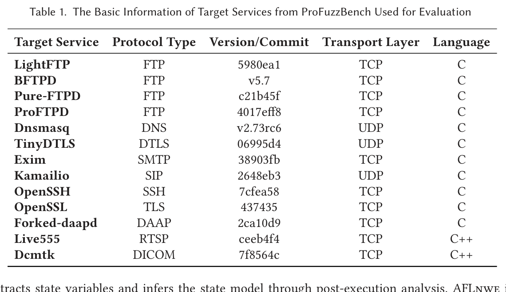

**Original caption:** Evaluation targets

**中文表注:** 实验目标

### 5.2.1 Static Analysis and Annotation

**Source:** p.15 S022

**Original:** The event loop was identified by the analyzer in 9 of 13 services; manual synchronization-point adaptation took several minutes to at most two hours for unfamiliar users.

**中文:** 分析器在 13 个服务中的 9 个识别出事件循环；对不熟悉目标的使用者，人工同步点适配耗时从数分钟到最多两小时。

### 5.2.2 Fuzzing Throughput

**Source:** p.17 S023

**Original:** Relative to AFLnet, NSFuzz reports throughput improvements from about 1.8 times to more than 200 times, with a reported average improvement of about 24 times.

**中文:** 相对 AFLnet，NSFuzz 报告的吞吐提升从约 1.8 倍到超过 200 倍，平均约 24 倍。

#### Table 003. 模糊测试吞吐量

**Placed near:** p.17 S023  
**Source:** p.16

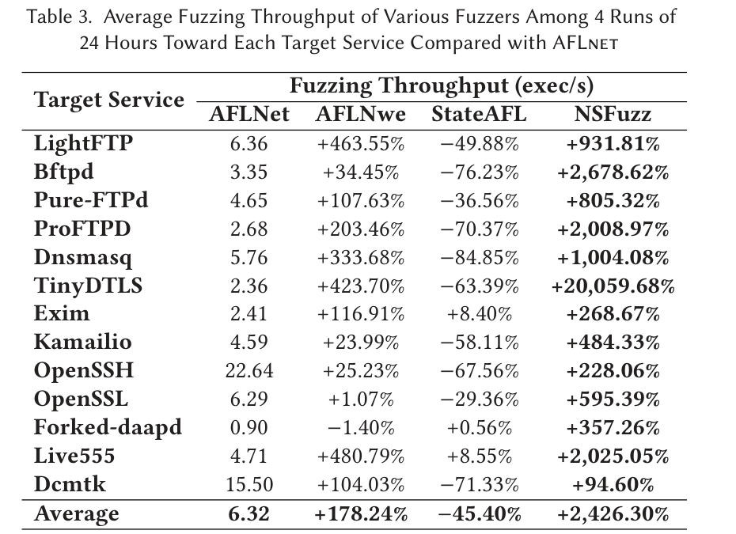

**Original caption:** Fuzzing throughput

**中文表注:** 模糊测试吞吐量

### 5.3.1 Static Analysis and Annotation

**Source:** p.17 S024

**Original:** State variables were automatically extracted for 9 services; annotation was used to remove configuration flags and message-type false positives or to handle unsupported services.

**中文:** 9 个服务可自动提取状态变量；人工标注用于去除配置标志、消息类型等误报，或处理静态分析不支持的服务。

### 5.3.2 Inferred State Model

**Source:** p.18 S025

**Original:** For LightFTP, all four runs produced the same five-vertex, eleven-edge model: four Access values plus one initial dummy state.

**中文:** 对 LightFTP，四次运行均得到同一个 5 顶点、11 边模型：Access 的四个取值加一个初始虚拟状态。

#### Fig. 004. LightFTP 状态模型

**Placed near:** p.18 S025  
**Source:** p.19

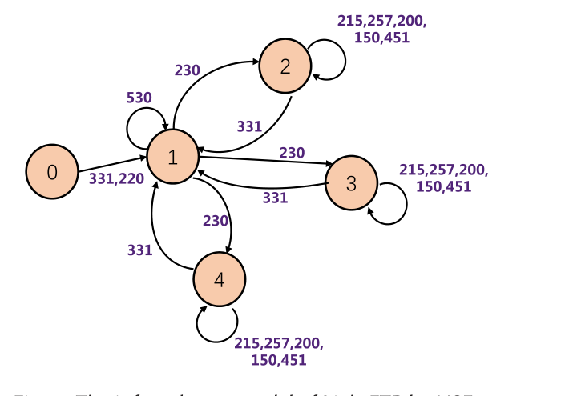

**Original caption:** LightFTP state model inferred by NSFuzz

**中文图注:** LightFTP 状态模型

**Reading note:** This is the paper's only detailed semantic ground-truth case study.

#### Table 005. 推断状态模型规模

**Placed near:** p.18 S025  
**Source:** p.18

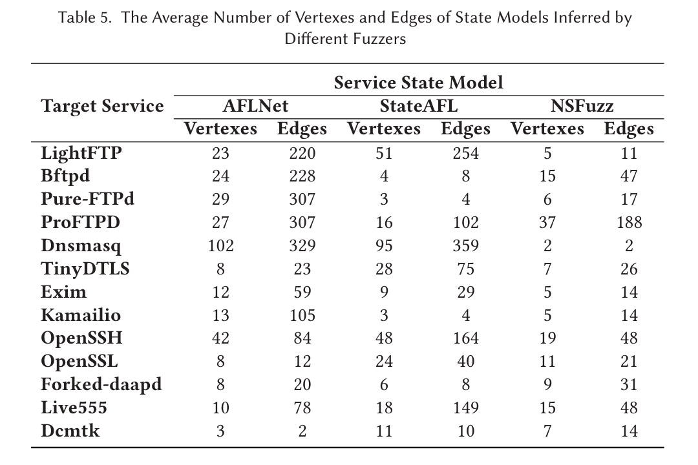

**Original caption:** Inferred state-model sizes

**中文表注:** 推断状态模型规模

**Source:** p.19 S026

**Original:** The paper's direct semantic accuracy argument is a manual LightFTP case study; the other targets are mainly compared by graph size.

**中文:** 论文对语义准确性的直接证据主要来自 LightFTP 的人工案例分析；其他目标主要比较模型图规模。

### 5.4.1 Code Coverage

**Source:** p.20 S027

**Original:** NSFuzz improved final branch coverage over AFLnet on all 13 targets, averaging 7.23% and reaching 25.82% on TinyDTLS; NSFuzz-V averaged 2.11%.

**中文:** NSFuzz 在 13 个目标上的最终分支覆盖均高于 AFLnet，平均提升 7.23%，TinyDTLS 上最高 25.82%；NSFuzz-V 平均提升 2.11%。

#### Fig. 005. 分支覆盖增长

**Placed near:** p.20 S027  
**Source:** p.21

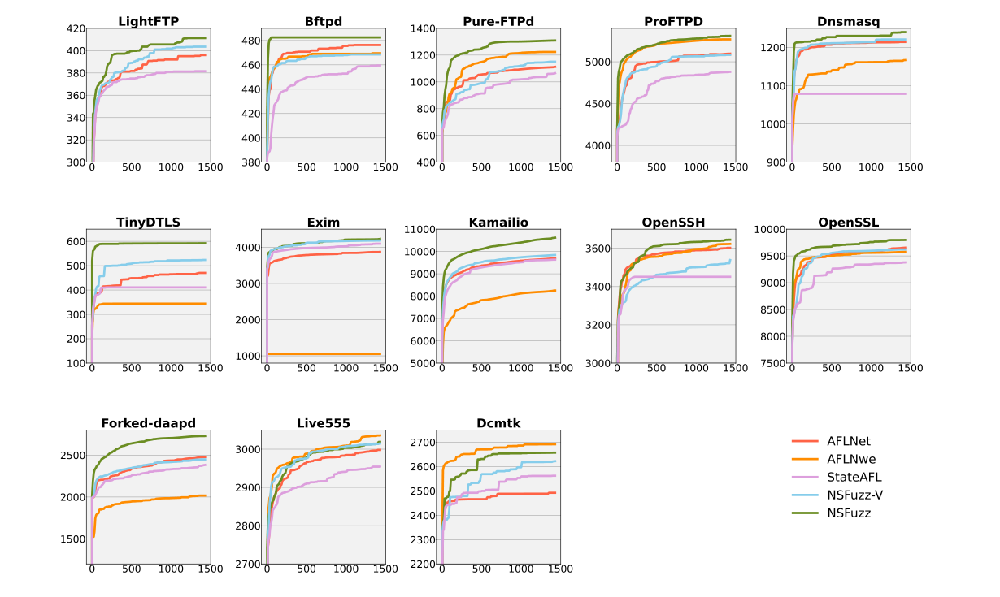

**Original caption:** Branch coverage growth

**中文图注:** 分支覆盖增长

**Reading note:** NSFuzz is generally highest, while Dcmtk and Live555 illustrate boundary cases.

#### Table 006. 最终分支覆盖

**Placed near:** p.20 S027  
**Source:** p.20

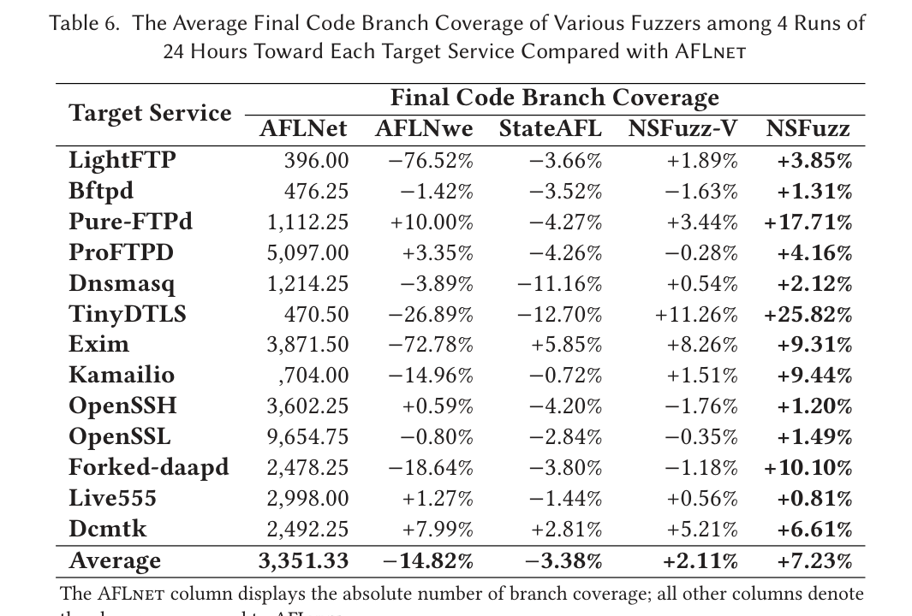

**Original caption:** Final branch coverage

**中文表注:** 最终分支覆盖

### 5.4.2 Crash Trigger

**Source:** p.21 S028

**Original:** Across the benchmark runs, NSFuzz triggered 19 crash clusters corresponding to 11 manually analyzed vulnerabilities, compared with 14/9 for AFLnet.

**中文:** 在基准实验中，NSFuzz 触发 19 个崩溃簇，经人工分析对应 11 个漏洞；AFLnet 为 14 个崩溃簇、9 个漏洞。

#### Table 007. 崩溃与漏洞

**Placed near:** p.21 S028  
**Source:** p.21

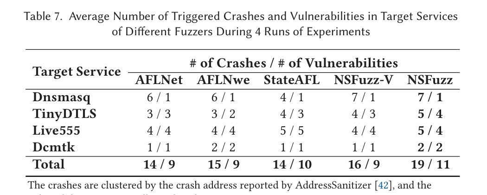

**Original caption:** Crashes and vulnerabilities

**中文表注:** 崩溃与漏洞

**Source:** p.22 S029

**Original:** NSFuzz reached the first crash faster on Dnsmasq, TinyDTLS, and Live555, but not Dcmtk; on Dcmtk it nevertheless triggered a crash in all four runs.

**中文:** NSFuzz 在 Dnsmasq、TinyDTLS 和 Live555 上更快触发首个崩溃，但在 Dcmtk 上并非如此；不过它在 Dcmtk 的四次运行中都能触发崩溃。

#### Table 008. 首次崩溃时间

**Placed near:** p.22 S029  
**Source:** p.22

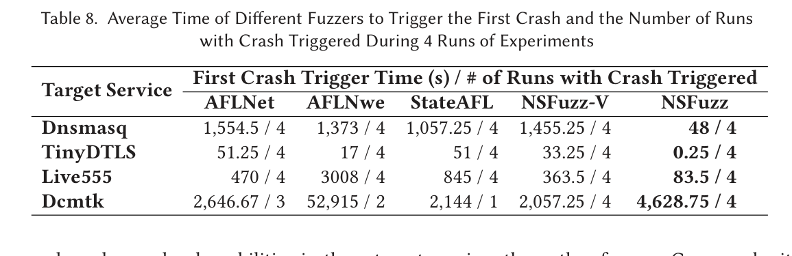

**Original caption:** Time to first crash

**中文表注:** 首次崩溃时间

### 5.5 State Space Coverage Evaluation

**Source:** p.22 S030

**Original:** The denominator for state-space coverage is the union of state-variable values reached by all fuzzers in all runs, not an independently known complete state space.

**中文:** 状态空间覆盖率的分母是所有 fuzzer 在全部运行中触发过的状态变量取值并集，而不是独立已知的完整状态空间。

#### Fig. 006. 状态空间覆盖率

**Placed near:** p.22 S030  
**Source:** p.23

**Original caption:** State-space coverage

**中文图注:** 状态空间覆盖率

**Reading note:** The percentages use a campaign-dependent union of observed values as the denominator.

**Source:** p.23 S031

**Original:** Average state-space coverage was 91.12% for AFLnet, 73.13% for AFLnwe, 92.17% for StateAFL, 96.21% for NSFuzz-V, and 98.50% for NSFuzz.

**中文:** 平均状态空间覆盖率分别为 AFLnet 91.12%、AFLnwe 73.13%、StateAFL 92.17%、NSFuzz-V 96.21%、NSFuzz 98.50%。

### 5.6 Real-World Bugs Finding Evaluation

**Source:** p.23 S032

**Original:** A two-week campaign reported eight zero-day vulnerabilities: five in TinyDTLS and three in Dcmtk; at submission two were fixed, one more was confirmed, and five were only reported.

**中文:** 两周长期实验报告了 8 个零日漏洞：TinyDTLS 5 个、Dcmtk 3 个；投稿时其中 2 个已修复、另 1 个已确认，其余 5 个仅处于已报告状态。

#### Table 009. 报告的零日漏洞

**Placed near:** p.23 S032  
**Source:** p.23

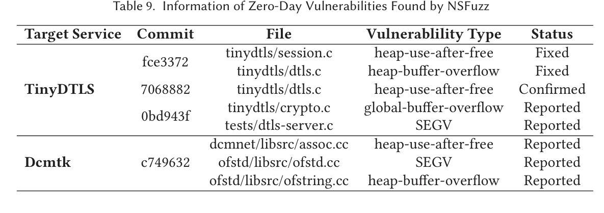

**Original caption:** Reported zero-day vulnerabilities

**中文表注:** 报告的零日漏洞

### 6.1 State Space Exploration

**Source:** p.24 S033

**Original:** The authors acknowledge that NSFuzz still uses AFLnet's seed-selection and mutation procedure and lacks a stronger mechanism for exploiting state feedback.

**中文:** 作者承认 NSFuzz 仍采用 AFLnet 的种子选择和变异流程，尚缺少更强的状态反馈利用机制。

### 6.2 SnapFuzz

**Source:** p.24 S034

**Original:** SnapFuzz pursues the same waiting-time reduction goal through binary rewriting and a custom protocol, but it was discussed rather than experimentally compared.

**中文:** SnapFuzz 也以消除等待开销为目标，但采用二进制重写和自定义交互协议；论文只讨论了它，没有进行实验对比。

### 6.3 Future Work

**Source:** p.24 S035

**Original:** Future work is to improve state-space-guided seed selection and add format-aware message mutation.

**中文:** 未来工作是改进状态空间引导的种子选择，并加入格式感知的消息变异。

## Remaining experiment tables

## Critical reading note

The paper's main novelty is not a new mutation algorithm. It replaces ambiguous or expensive state feedback with selected program variables, and replaces timer-based interaction with event-loop synchronization. The actual state-guided seed selection and message mutation remain inherited from AFLnet (p.14 S019; p.24 S033).

The strongest experimental evidence supports throughput and practical effectiveness. The broad claim of state-model accuracy is less completely validated because semantic ground truth is demonstrated in detail only for LightFTP (p.18-19 S025-S026).
