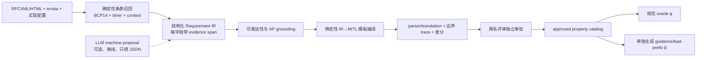

# 定时自动机运行时验证、MITL 性质提取与 TAFuzz 应用定位综述

生成日期：2026-07-13  
检索窗口：2019-01-01 至 2026-07-12；经典工作仅用于语义和方法背景  
代码审计基线：TAFuzz 公开提交 [`22ecff40d8c397cf658b1b6fe7fe32cc05458d23`](https://github.com/PearBabe/TAFuzz/tree/22ecff40d8c397cf658b1b6fe7fe32cc05458d23) <!--ref:tafuzz_sha--><!--anchor:section:repository-root-->  
配套数据：[研究矩阵](data/ta_mitl_rv_study_matrix.csv)、[领域评分](data/ta_mitl_domain_scores.csv)、[性质提取方法](data/mitl_property_extraction_methods.csv)、[RFC→MITL 初始目录](data/protocol_requirement_to_mitl_catalog.csv)

> “面向 CCF-A”在本文中表示按高水平系统/软件工程论文的语义、统计和 artifact 标准设计，不构成任何 venue 录用保证；尚未实现或实测的内容均标为候选设计。

## Material Passport

```yaml
claim_intent_manifest:
  manifest_version: "1.0"
  created_at: "2026-07-13T00:00:00+08:00"
  intended_claims:
    - claim_id: C1
      claim: "近年来可核验的严格 MITL/MTL 应用样本很小，不能据此宣称某领域占绝对主流。"
      evidence: "ta_mitl_rv_study_matrix.csv"
      scope: "2019-01-01..2026-07-12；按本报告纳排标准"
    - claim_id: C2
      claim: "点语义上的 verdict 对给定 timed word 是确定的；它能否代表底层连续系统则依赖采样和 AP 观测合同。"
      evidence: "形式语义、采样反例、公开 TraceParser 审计"
      scope: "Boolean timed-word 与连续信号的比较"
    - claim_id: C3
      claim: "公开提交不存在通用 RFC/自然语言需求到 MITL 的自动提取器。"
      evidence: "candidate_mitl、catalog builder、空映射库的提交级审计"
      scope: "仅 SHA 22ecff40；排除本地未提交代码"
    - claim_id: C4
      claim: "在 CPU-only、公开规范和新 fuzzing 算法为主贡献的约束下，状态型实时协议是当前最佳主背景。"
      evidence: "八维评分、敏感性分析、RFC 与基线生态"
      scope: "项目适合度，不等同于文献使用频率"
  must_not_claim:
    - "不能把同一批 trace 的 verdict 一致写成 XML 与 MITL 语言等价。"
    - "不能把 LLM 输出、默认 timer 数值或未复核公式直接当作可信 oracle。"
    - "不能把本地未提交的 prefix-cost 能力或性能归入公开基线。"
    - "不能把 SHOULD 违反称为 RFC conformance bug。"
```

## 摘要

本综述得到四个核心结论。

第一，2019–2026 年可核验的广义 timed-logic/TA 运行时验证文献并没有形成“MITL 主要用于自动驾驶/机器人”这样的可靠统计结论。广义应用样本只有 8 篇：汽车 3/8、医疗 2/8，机器人、跨链协议、实时 OS 各 1/8；而严格 MITL/MTL 且带应用实验的只有 3 篇，分别是网格机器人、跨链协议和 gearbox，严格集合中达到真实软件/系统 E3 证据的为 0。样本太小，应用频率只能描述，不能外推为领域主流。

第二，MITL 的 pointwise timed-word 语义与通常被简称为“连续信号”的 dense-time signal 语义不是同一件事。事件位置可以是离散的，而时间戳仍可取实数；定时自动机的时钟可以在事件之间连续流逝，但输入仍是事件序列。对一个已经给定的 timed word，公式 verdict 不依赖采样器；然而“这个 timed word 是否忠实代表底层 dense-time 执行”高度依赖周期、阈值交叉、插值、迟滞、漏采和 timestamp jitter。TAFuzz 公开提交接收的是无符号整数点/闭区间时间戳和完整 Boolean valuation，不是 dense-time real-valued STL signal。

第三，公开仓库当前不是通用性质提取器。`candidate_mitl()` 是基于 XML 文件名、模板名和少量 label/guard 的硬编码候选推荐；gearbox 的 AP 和 150/200/300/500 等界限直接写在 Python 字典中。结果汇总、差分 trace 和 review queue 有审计价值，但不能证明自然语言或 XML 已被自动、正确地翻译为 MITL。

第四，在“公开规范、CPU 纯软件、fuzzing 算法为主要贡献”的限制下，推荐主背景为 CoAP/DTLS/SIP 状态型实时协议，gearbox/CAN 作为控制案例。协议的 RFC 条款、timer、事务标识、公开实现和 stateful-fuzzing 基线共同降低了性质来源、插桩和复现成本。推荐新建 TAFuzz-Req：规范检索与结构化 IR 可以半自动化，最终 MITL 由确定性模板生成并经双人复核；LLM 只允许离线填充带证据的 IR，不作为 oracle。

## 1. 研究问题、纳入标准和证据等级

### 1.1 研究问题

- RQ1：近年来 timed logic/TA 运行时验证真正分析了哪些系统？
- RQ2：各论文使用点语义、连续信号、离散时间还是稠密时间？
- RQ3：公式在时间点求值时，系统层面的正确性是否依赖事件采样设计？
- RQ4：MITL 性质能否从 RFC、自然语言需求、模型或 trace 自动提取？
- RQ5：TAFuzz 当前能力适合什么应用背景，怎样设计成 CCF-A 级 fuzzing 工作？

### 1.2 纳入与排除

“近年来”统计窗口固定为 2019-01-01 至 2026-07-12。广义 monitoring 谱系纳入“提出、分析或实现”在线/流式 monitoring semantics/algorithm、runtime enforcement 或 predictive RV，并满足至少一项：以 timed automaton 为性质/monitor；以 MITL/MTL 等 metric-time logic 为运行时性质；或将该逻辑编译为自动机。纯理论 monitorability/complexity 因研究对象就是 monitoring 而留在广义分母，但证据为 E0；显式检查 runtime-generated trace 的事后 RV 单独标出。只有具有命名对象且证据至少 E2 的论文才进入应用统计。只做规划、离线模型检查、untimed LTL fuzzing、STL robustness 邻接路线、没有运行时 monitor 的 MightyPPL 工具评估均单列。

研究矩阵保留 22 条唯一记录，其中 17 条核心候选、5 条邻接/工具/未决记录；Mu 2023、Cho 2025 和 AIAA 2021 因完整实验或语义证据不足标为 `U`，不进入计数。[完整纳排、主来源和原文位置可由 CSV 复算](data/ta_mitl_rv_study_matrix.csv) <!--ref:study_matrix--><!--anchor:section:rows-1-22-->。

### 1.3 证据等级

CSV 使用 A/B/C/D/U，与计划中的 E3/E2/E1/E0/未决一一对应：

| CSV | 本文 | 判定 |
|---|---|---|
| A | E3 | 真实软件、真实系统或物理系统实验 |
| B | E2 | 命名模拟器、工业模型或端到端原型 |
| C | E1 | 合成 trace、toy model，或只编码领域性质 |
| D | E0 | 纯理论、算法或仅在引言中声称可应用 |
| U | 未决 | 一手全文或实验细节不足，禁止猜测 |

每篇论文只分配一个 primary domain 计算比例；secondary tags 不重复计数。统计结果与“TAFuzz 项目适合度”完全分开。

### 1.4 三个分母

1. **广义 recent timed-logic/TA monitoring 谱系：14 篇。** 从 17 条核心候选中排除 2 条 `U` 和 1 条“MITL→TA 只用于规划、运行时实际为 hybrid+LTL3”的语义错配。这个方法谱系分母包含 4 篇 E0 理论论文，也包含 1 篇对 runtime-generated trace 做事后检查的 Architectural RV；它不是“实际部署篇数”。实际应用采用后文的 8 篇扩展/7 篇在线敏感性分母。
2. **严格 MITL/MTL 运行时监测：4/14。** Lin & Baras 2020、Ganguly et al. 2022、Cimatti et al. 2024、Fränzle et al. 2024。
3. **严格集合中的 E3：0/4。** 三篇应用论文均为 E2；Cimatti et al. 为 E1。因此目前不能用严格集合证明 MITL monitor 已在真实部署中形成成熟经验。

广义 14 篇的成员是：Architectural Runtime Verification；Lin & Baras 2020；The Monitoring Problem for Timed Automata；Monitoring Timed Properties (Revisited)；Ganguly et al. 2022；Parametric Timed Pattern Matching；SlackCheck；VSMoN；pacemaker case；Cimatti et al.；Fränzle et al.；Distributed Monitoring of Timed Properties；Time for Timed Monitorability；Online Monitoring of MTL Using Sequential Networks。严格 4 篇就是上一项列出的四篇；E3 分子为空。这样可以从题名直接审计三个分母，而不把 adjacent STL/LHA/LTL 或 unresolved 论文混入。

## 2. 2019–2026 文献综述和应用统计

### 2.1 广义应用集合：8 篇

| Primary domain | 分子/分母 | 入选论文和实际对象 | 证据 |
|---|---:|---|---|
| 汽车/传动 | 3/8 = 37.5% | AUTOSAR 转向灯的 VEOS 仿真；Simulink 自动变速箱；Mecel gearbox trace | 均 E2 |
| 医疗 | 2/8 = 25.0% | Java 远程生命体征原型的伪随机传感数据；心脏模型中的 pacemaker enforcement | 均 E2，不是真实患者/植入器械 |
| 机器人 | 1/8 = 12.5% | 20×20 网格机器人强化学习与自纠正 | E2 |
| 跨链协议 | 1/8 = 12.5% | Ganache 上的 swap/auction mocked blockchains | E2 |
| 实时 OS | 1/8 = 12.5% | Linux scheduler tracepoint 上的 SlackCheck 内核模块 | E3 |

Architectural RV 使用 Timed-LTL 和数据库查询，不是 TA monitor；Parametric Timed Pattern Matching 以 PTA 为 pattern，不是 MITL；SlackCheck 则直接把调度性质实现成 TA。[SlackCheck](https://doi.org/10.4230/LIPIcs.ECRTS.2024.2) <!--ref:slackcheck--><!--anchor:section:implementation-and-evaluation--> 是本集合中最强的 live-software 证据，但不能用它证明“MITL→TA monitor 已在真实系统部署”。

这 8 篇只是“有命名应用且证据至少 E2”的扩展描述性集合，其中 Architectural RV 是 simulation trace 的事后检查。若按在线/流式/enforcement 严格排除它，则为 7 篇：汽车 2/7、医疗 2/7，机器人、跨链协议和实时 OS 各 1/7。无论使用哪个口径，样本都太小；37.5% 不意味着汽车占绝对主流，更不意味着汽车最适合 TAFuzz。

### 2.2 严格 MITL/MTL 应用集合：3 篇

- Lin & Baras 2020 在 20×20 网格环境中使用受限 MITL 和带时钟的 LTL3 monitor 做 RL 自纠正；时间是整数 action step，构造不支持任意嵌套 MITL。[ACC 论文](https://doi.org/10.23919/ACC45564.2020.9147506) <!--ref:lin_barras_2020--><!--anchor:section:monitor-construction-and-simulation-->
- Ganguly et al. 2022 对跨链协议使用整数物理/全局时间的 pointwise MTL，并以 formula progression+SMT 处理时钟偏差；它不是 timed-automaton monitor。[ICDCS 论文](https://doi.org/10.1109/ICDCS54860.2022.00012) <!--ref:ganguly_2022--><!--anchor:section:II-B-and-VI-->
- Fränzle et al. 2024 把 MITL 编译为 TBA，在 MoniTAal 中对 Mecel gearbox 做 parametric-delay monitoring/testing；性质包括 `G(ReqNewGear -> F_[150,1205] NewGear)`，并注入延迟、jitter、early/late fault。[IFM 论文](https://doi.org/10.1007/978-3-031-76554-4_11) <!--ref:fraenzle_2024--><!--anchor:section:gearbox-evaluation-->

三篇各占 1/3，分母太小，不能得出“MITL 一般用于机器人/协议/汽车中的哪一个”的强结论。更准确的表述是：**在非 punctual、无任意数据量化/对象相等且 AP 可观测的可表达片段内，MITL 适合可抽象为度量时间事件/状态序列的对象；实际研究对象还由可观测性、性质来源和实验基础设施决定。**

### 2.3 其他值得区分的路线

- Grosen et al. 2022 给出实数时间戳 pointwise timed word、MITL→TBA、zone-based 三值监测，但当时没有实现/系统实验。[FORMATS 论文](https://doi.org/10.1007/978-3-031-15839-1_3) <!--ref:grosen_2022--><!--anchor:section:formal-semantics-and-conclusion-->
- Cimatti et al. 2024/2025 同样采用实数时间戳的 pointwise MITL，以 assumption TBA 缩小部分可观测下的状态；实验是任务序列和 conveyor proof-of-concept，不能把引言中的自动驾驶、医疗等动机算成实验领域。[SEFM 论文](https://doi.org/10.1007/978-3-031-77382-2_5) <!--ref:cimatti_2024--><!--anchor:section:experiments-and-conclusion-->
- Waga et al. 2023 的 PTA timed pattern matching 在 Simulink 自动变速箱上有完整 artifact，说明“真实时间戳事件 trace + 自动机 pattern”适合汽车控制模型，但它挖掘的是匹配区间/参数，不是规范 MITL oracle。[TOSEM 论文](https://doi.org/10.1145/3517194) <!--ref:waga_2023--><!--anchor:section:experimental-evaluation-->
- VSMoN 把医疗 policy DSL 编译为 deterministic TA，但传感数据是伪随机生成；pacemaker 工作是 discrete TA runtime enforcement 与心脏模型闭环。[VSMoN](https://www.jot.fm/issues/issue_2024_02/article4.pdf) <!--ref:vsmon_2024--><!--anchor:page:data-generation-and-performance-->、[pacemaker case](https://doi.org/10.1007/978-3-031-74234-7_1) <!--ref:pacemaker_2024--><!--anchor:section:case-study-->
- RTAMT 面向 sampled real-valued signals 和 STL robustness，案例包含机器人、ROS/Gazebo 与航空控制；Model-Bounded Monitoring 用线性混合自动机界定样本间未观察行为。这两条路线最能说明：连续物理变量通常不能未经采样合同就当作 Boolean timed word。[RTAMT](https://arxiv.org/abs/2005.11827) <!--ref:rtamt--><!--anchor:section:case-studies-->、[Model-Bounded Monitoring](https://arxiv.org/abs/2102.07401) <!--ref:model_bounded--><!--anchor:section:semantics-and-automotive-cases-->

## 3. 数学语义：点、离散、稠密和 dense-time 信号

### 3.1 Pointwise timed-word 语义

令 `AP` 为原子命题集合。有限或无限 timed word 写作

\[
\rho=(\sigma_0,t_0)(\sigma_1,t_1)\ldots,
\qquad \sigma_i\subseteq AP,
\qquad t_i\le t_{i+1}.
\]

`i` 是第几个事件的**离散位置**；`t_i` 是它的时间戳，可以属于 `N`，也可以属于 `Q` 或 `R_{≥0}`。原子命题只在位置上求值：

\[
(\rho,i)\models p \iff p\in\sigma_i.
\]

以 metric until 为例：

\[
(\rho,i)\models \varphi\,U_I\,\psi
\]

当且仅当存在 `j≥i`，使 `t_j-t_i∈I`、`(ρ,j)⊨ψ`，并且所有 `i≤k<j` 都满足 `φ`。因此，区间约束比较的是**事件时间戳差**，量化对象仍是事件位置。past `S_I/O_I/H_I` 同理向过去位置量化。Grosen、Cimatti、Fränzle 和 MightyPPL 这条技术线都属于 pointwise metric-time 语义；MightyPPL 的贡献是把 past 和 Pnueli 模态纳入自动机构造，而不是把输入变成连续信号。[MightyPPL](https://arxiv.org/abs/2510.01490) <!--ref:mightyppl--><!--anchor:section:logic-and-construction-->

对无限 timed word，还必须在语义合同中声明 time divergence/non-Zeno 条件（通常要求时间戳无界），否则 bounded event accumulation 会影响 liveness；若允许相同时间戳，事件先后仍由位置索引 `i` 保留，不能把同时间戳事件自动当成无序集合。

### 3.2 Dense-time Boolean/实值信号语义

所谓“连续信号语义”更准确地是**稠密时间域信号语义**。Boolean signal 是

\[
s:\mathbb{R}_{\ge0}\rightarrow 2^{AP},
\]

公式原则上可在每个实数时刻 `t` 求值，通常另假设 finitely variable、分段常值或 càdlàg；从 `R` 到离散值域的函数并不因定义域稠密而在拓扑意义上连续。实值 signal 是

\[
x:\mathbb{R}_{\ge0}\rightarrow D\subseteq\mathbb{R}^n,
\]

是否 continuous、piecewise-continuous 或仅 measurable 是额外假设。原子谓词来自 `μ(x(t))≥0`，STL 还常计算 quantitative robustness。dense-time signal 语义中的 `U_I` 会量化区间内所有实数时刻，而不只是已有事件位置。若 `p` 在两个样本之间短暂变假，pointwise trace 可能完全看不见；dense-time Boolean signal 会把它判为违反。

### 3.3 四个容易混淆的维度

| 维度 | 问题 | 例子 |
|---|---|---|
| 事件位置 | 是否只有 `i=0,1,2,...` 这些观测位置？ | timed word 始终是离散位置序列 |
| 时间域 | `t_i` 是整数还是实数？ | Lin 2020 为 action-step integer；Grosen/Cimatti 为 real timestamp |
| 自动机时钟 | 两事件间时钟是否连续增长？ | 标准 TA clock 在稠密时间中流逝，即使输入只在事件处到达 |
| 被观测对象 | 是 Boolean event/state，还是连续物理量？ | `received_ack` 对比 `speed(t)`/`TTC(t)` |

逐篇语义归类如下；每行的详细 carrier、time domain 和 adapter 证据在研究矩阵中：

| 论文/路线 | 求值位置与时间 | 语义判定 |
|---|---|---|
| Lin & Baras 2020 | action-step 位置，整数时间 | 受限 pointwise MITL |
| Ganguly et al. 2022 | 分布式 log 事件，整数全局/物理时间与 clock skew | pointwise MTL；SMT 而非 TA |
| Grosen 2022、Cimatti 2024、Fränzle 2024 | 非降实数时间戳的事件位置 | pointwise MITL→TBA/zone |
| Grez 2020、Henry 2024、Grosen 2025 | dense timed words | TA/monitorability 理论，不是连续实值 signal |
| Waga 2023 | 实数时间戳 timed words | PTA pattern matching |
| Architectural RV 2019 | 仿真 trace 的 timestamped events | Timed-LTL 事后检查，无 TA |
| SlackCheck 2024 | scheduler tracepoint 事件之间使用 wall-clock timer | 直接 TA monitor |
| VSMoN、pacemaker 2024 | finite metric event trace / discrete time | DSL→DTA；discrete TA enforcement |
| Ulus 2026 | 同时讨论 discrete Boolean sequences 与 dense Boolean interval signals | MTL sequential network，非 TA |
| RTAMT、Model-Bounded Monitoring | sampled real-valued observations，底层连续/混合系统 | STL robustness 或 LHA 包络，属于邻接连续信号路线 |
| MightyPPL 2025 | pointwise metric-time trace | MITPPL→自动机工具；不是 RV 应用案例 |

所以：

- “只在事件点求值”不等于“离散时间”；
- “时间戳为实数”不等于“有连续信号”；
- “TA 时钟连续流逝”不等于“monitor 已看到事件之间的物理状态”；
- “把 10 Hz 速度样本加上实数时间戳”仍只是 sampled trace，除非显式给出插值或混合系统包络。

### 3.4 TAFuzz 公开提交到底采用什么语义

公开 `TraceParser` 用 `std::stoul` 读取非负整数时间原子，并允许 `[low,high]` 形式的闭区间时间戳；它把 formula 中未列出的 AP 位补成 `0`，因此每个输入位置最终是完整 bit valuation。[TraceParser.cpp L46–145](https://github.com/PearBabe/TAFuzz/blob/22ecff40d8c397cf658b1b6fe7fe32cc05458d23/src/TAMonitor/TraceParser.cpp#L46-L145) <!--ref:trace_parser--><!--anchor:section:L46-L145-->

因此公开 TAFuzz 的当前输入对象是：

\[
([l_i,u_i],\sigma_i),\quad l_i,u_i\in\mathbb{N},\quad \sigma_i\in 2^{AP},
\]

点时间是 `[t_i,t_i]` 的特例。它支持 finite/infinite word 和三值 monitor，但没有连续实值 signal、插值、阈值 crossing detector 或 STL robustness。**这正适合 packet、timer、transaction-state、request/response 等离散事件；不应直接声称监测连续速度、距离或 TTC。**

报告中的 `G*` 沿用当前 MightyPPL/TAFuzz 测试片段：仓库候选代码用它显式覆盖第一个已观察位置上的 trigger；它不是本文新定义的标准 MITL 记号。正式 property catalog 必须把 `G`/`G*`、current-event 和 finite-word 端点语义写进版本化合同，不能只凭视觉相似替换。

## 4. “公式按时间点求值”是否依赖事件采样设计？

最准确的答案是分两层：

1. **逻辑层：不依赖。** 给定同一个 timed word `ρ` 和同一套端点/有限词语义，`ρ⊨φ` 是确定的。
2. **系统层：依赖。** 从真实执行 `x` 经过 sampler/observer 得到 `ρ=S(x)`。要声称 `ρ⊨φ` 能推出真实系统满足某个连续或实现级需求，必须证明或约定 `S` 保留了相关事件、状态和时间误差。否则 monitor 可能“正确地判断了错误/不完整的抽象”。

若 `Φ` 是物理/实现级需求、`φ` 是观测级 MITL，至少要说明想保证哪一个方向：无虚假安全感要求 `S(x)⊨φ ⇒ x⊨Φ`；不漏报违反要求 `x⊭Φ ⇒ S(x)⊭φ`；完整等价要求两者都成立。任意有限采样通常不能自动满足这些关系，必须依赖事件完备性、最小 dwell/变化率、保守不确定性或显式重构模型。

### 4.1 四种观测方式

Kane 2015 给出了一个很清楚的离散采样实例：formal carrier 是带 `T=N` 时间戳的有限、完整 Boolean state sequence；monitor 以固定周期 snapshot 当前 live state，因此两个 snapshot 之间的多次更新可能被合并，瞬态和先后顺序会丢失。论文要求采样足够快且 temporal bounds 是 monitor period 的整数倍；后文的 interval reading 是 sample-and-hold，而不是对未知物理信号的所有实数时刻量化。[Kane dissertation，printed pp. 54–55、73–76、156–157](https://users.ece.cmu.edu/~koopman/thesis/kane.pdf) <!--ref:kane_2015--><!--anchor:page:54-55,73-76,156-157-->。这说明“公式在 sample point 上算得完全正确”与“采样没有漏掉真实系统事件”是两项独立责任。

| 方式 | 形成的语义 | 主要风险 | 必须写入合同的内容 |
|---|---|---|---|
| 周期采样 | 每 `h` 产生一个状态位置 | 短于 `h` 的脉冲、先后顺序、同周期多次变化被折叠 | 周期、最小 dwell、时间戳来源、overrun/漏样策略 |
| 事件触发 | 状态变化、packet、hook 时产生位置 | hook 不全、队列丢失、并发重排 | 事件源、因果/事务 key、去重、buffer 顺序 |
| 零阶保持 | 假定样本值保持到下一样本 | 把未知区间错误填成已知；不适合快速变化信号 | hold 规则、有效期、unknown 状态 |
| 阈值交叉 | 把 `x(t)` 转为 Boolean AP | 噪声抖动、迟滞、crossing 时间误差 | 阈值、迟滞带、滤波延迟、最大 timestamp error |

不存在脱离信号假设的“万能采样率”。若要从周期样本推断连续区间内始终满足 `p`，至少需要最小驻留时间、变化率/混合模型包络或足够的 robustness margin。对事件型协议，packet arrival/send 和 timer fire 本身就是自然事件，抽象负担明显更低。

### 4.2 完整 valuation 与 change-only event

pointwise timed word 的 `σ_i` 通常表示该位置上所有 AP 的真假。真实日志常只报告“发生了 `ack`”，这有两种合法建模方式：

- **瞬时事件 AP：** `ack` 只在该事件位置为真，下一位置自动为假；
- **持久状态 AP：** `waiting`、`connected` 等从上次更新 carry-forward，直到对应离开事件。

两者不能混用。若把 change-only 日志直接当完整 valuation，未报告的 `waiting` 会被误判为假；若把瞬时 `ack` 错误 carry-forward，又会制造不存在的持续 ACK。TAFuzz-Req 的每个 AP 必须声明 `event/state` 类型和 carry-forward 规则。

### 4.3 Timestamp jitter 和区间不确定性

若观测时间 `\hat t` 的误差为 `ε`，真实事件时刻只能断言在 `[max(0,\hat t-ε),\hat t+ε]`。在 deadline `u` 附近，单点化会把同一物理执行因调度 jitter 随机判成满足或违反。TAFuzz 已能读取整数区间时间戳，这可以作为不确定性的输入载体，但仍需保证区间来源可信，并用三值结果保留不确定性，而不是总选最有利或最不利端点。

边界测试必须覆盖 `l-ε,l,l+ε,u-ε,u,u+ε`；整数时间以一个最小时间单位替代 `ε`。开闭端点是规范含义，不是 parser 细节。

### 4.4 连续速度、距离和 TTC 怎样才能进入 MITL

例如需求“若 `TTC<2s`，则 500ms 内制动”。概念模板可写成：

```text
G*(ttc_low -> F_[0,500ms] brake_started)
```

这里的下划线和 `500ms` 是带单位伪代码，不是当前 parser 可直接接受的 formula；编译器必须先选定 campaign tick、换算为整数界限并记录舍入/误差政策。

但这只在以下合同成立后才可信：TTC 的计算定义固定；阈值 crossing 不漏报；采样/滤波延迟和 timestamp jitter 有界；迟滞避免抖动；`brake_started` 的 hook 时刻明确；两个 AP 属于同一车辆/场景实例。缺少这些条件时，真正研究对象应是 STL robustness 或 hybrid/model-bounded monitoring，而不是直接把稀疏数值样本改名成 MITL event。

## 5. 当前仓库的 MITL 性质提取审计

### 5.1 结论

公开 SHA 中不存在可泛化的“RFC/自然语言需求→MITL”提取模块。现有能力应准确命名为：**固定 MoniTAal benchmark 的候选公式推荐、trace 差分与人工审计流水线。**

### 5.2 代码证据

[`candidate_mitl()` L3997–4062](https://github.com/PearBabe/TAFuzz/blob/22ecff40d8c397cf658b1b6fe7fe32cc05458d23/test/TARV/scripts/run_paper_experiments.py#L3997-L4062) <!--ref:candidate_mitl--><!--anchor:section:L3997-L4062--> 的行为是：

- 根据 `xml_file`、`template`、少量 `labels`/`guards` 进入 `if` 分支；
- 直接返回手写公式、`high/medium/low` 标签和说明；
- gearbox 的 `CloseClutch/OpenClutch/ReqSet/ReqNeu/SpeedSet`、request/response AP 和 150/200/300/500 界限写在 Python 字典里；
- 对不能保守判断的 `never_b`、`time-must-pass` 等明确返回空候选，这一保守行为是正确的，但不是自动抽取。

AP 映射只对已有 label 做轻量字符串规范化；它没有从业务语义、packet field 或 source hook 推导可执行 observer。`high/medium/low` 也没有训练集、校准曲线或概率含义。

[`build_mitl_formula_catalog.py` L42–168](https://github.com/PearBabe/TAFuzz/blob/22ecff40d8c397cf658b1b6fe7fe32cc05458d23/test/TARV/scripts/build_mitl_formula_catalog.py#L42-L168) <!--ref:catalog_builder--><!--anchor:section:L42-L168--> 只是读取已有 semantic/candidate/result CSV 并汇总；它不生成新的语义映射。正式映射库明确写着“只能加入人工复核或证明的 mapping”，而 `mappings` 当前为空。[xml-mitl-mapping.v1.json](https://github.com/PearBabe/TAFuzz/blob/22ecff40d8c397cf658b1b6fe7fe32cc05458d23/test/TARV/baselines/xml-mitl-mapping.v1.json) <!--ref:empty_mapping--><!--anchor:section:mappings-->。

### 5.3 已经做到什么、没有证明什么

公开结果包报告：23 个 XML manifest 条目、19 个非空候选、17 个唯一候选公式；63/63 个**选定、映射后的 candidate traces** 与 MoniTAal baseline final verdict 一致，其中包含生成 trace；15 条被标为 strong trace-level candidate，4 条为 approximate，4 条不声明公式。结果包本身也明确说 `REVIEW_REQUIRED` 仍需人工数学审查。[FINAL_RESULTS_README](https://github.com/PearBabe/TAFuzz/blob/22ecff40d8c397cf658b1b6fe7fe32cc05458d23/test/TARV/results/FINAL_RESULTS_README.md) <!--ref:final_results--><!--anchor:section:Latest-Verified-Counts-->。

这些结果能支持：parser/translator 在测试片段上可运行；候选与 XML baseline 在**选定 trace** 上没有观测到 verdict 差异；trace、edge/guard ledger 和 signoff queue 可作为未来验证框架。

它们不能支持：XML 与 MITL 的全语言等价；任意 XML 自动翻译；任意 RFC 需求自动抽取；AP 与真实程序变量已正确绑定；小公式离线时间等于 fuzzing 吞吐量。

## 6. MITL 性质究竟如何提取

### 6.1 方法证据比较

完整的 11 类证据矩阵见 [mitl_property_extraction_methods.csv](data/mitl_property_extraction_methods.csv) <!--ref:extraction_matrix--><!--anchor:section:rows-1-11-->。关键结论如下。

| 路线 | 能可靠做什么 | 不能可靠做什么 | 在 TAFuzz 中的角色 |
|---|---|---|---|
| 人工 PSP/real-time patterns | 选择 scope、response、absence、duration 等模板后确定性实例化 | 自动理解自由文本、自动 grounding AP | 金标和确定性编译器核心 |
| FRET/FRETish | 结构化 scope/condition/timing/response，并生成 future/past MTL；模板有验证/证明 | 自由文本全自动提取；直接兼容 TAFuzz event-point 语义 | 借鉴 IR、解释和边界测试 |
| 规则/依存 NLP | 召回 actor、event、timer、数字和依赖关系 | 保证完整语义或上下文指代 | 高召回候选生成 |
| NL→TL/LLM | 交互式提出公式/子句候选 | 无人复核地充当可信 oracle | 只填带 evidence span 的 IR |
| RFC→FSM | 建 state/event/timer 词典和部分协议状态机 | 证明抽到的是完整规范性质 | AP/状态词典辅助 |
| trace mining | 发现实现常见模式、候选参数 | 从“经常如此”推出“规范必须如此” | 候选与校准，不是规范真值 |

Dwyer PSP 收集并组织常见性质模式；real-time extension 把 duration、periodicity、real-time order 映射到 MTL/TCTL/RTGIL。[PSP](https://doi.org/10.1145/302405.302672) <!--ref:dwyer_psp--><!--anchor:section:pattern-system-->、[Real-time Specification Patterns](https://doi.org/10.1145/1062455.1062526) <!--ref:rt_patterns--><!--anchor:section:real-time-patterns-->。FRET 把受控 FRETish 编译成 future/past metric LTL，并有后续 PVS 证明；但其逐步、自然数索引的 state sequence 与 TAFuzz 的事件点 timed word 不同，不能未经 semantic adapter 直接复用公式。[FRET](https://doi.org/10.1016/j.infsof.2021.106590) <!--ref:fret--><!--anchor:section:language-and-semantics-->、[FRET correctness](https://doi.org/10.1145/3497775.3503685) <!--ref:fret_proof--><!--anchor:section:proof-->。

ARSENAL 的 held-out NLP F-measure 约 0.63，说明规则管线适合候选召回但远未达到 oracle 要求。[ARSENAL](https://arxiv.org/abs/1403.3142) <!--ref:arsenal--><!--anchor:section:evaluation-->。nl2spec 通过交互式 subtranslation 改正 LTL 候选，适合人机审阅界面而非全自动 MITL。[nl2spec](https://doi.org/10.1007/978-3-031-37703-7_18) <!--ref:nl2spec--><!--anchor:section:evaluation-->。2025 年文档→形式规约研究在 37 个真实文档、603 条规约上发现端到端方法仍会简化或虚构，两阶段 annotation→conversion 明显更好；它支持“分阶段和 sentence–spec 证据配对”，但其 conversion 仍由 LLM 完成，不能证明确定性 IR→MITL 编译正确。确定性模板编译是本项目额外提出、仍需证明的风险控制。[实证研究](https://arxiv.org/abs/2504.01294) <!--ref:llm_formalization_2025--><!--anchor:section:dataset-and-results-->。

ProtocolGuard 2026 先用 RFC 规范词和协议词召回，再让模型填结构化 JSON 并面向协议实现做检测/定向 fuzzing；这证明混合 RFC 管线有工程价值，但它没有给出 RFC→MITL 的语义正确性证明。[ProtocolGuard](https://doi.org/10.14722/ndss.2026.240521) <!--ref:protocolguard--><!--anchor:section:specification-extraction-and-evaluation-->。RFCNLP 可辅助抽 FSM，但其安全性质仍需人工确认。[RFCNLP](https://doi.org/10.1109/SP46214.2022.9833673) <!--ref:rfcnlp--><!--anchor:section:state-machine-extraction-->。

### 6.2 推荐模块：TAFuzz-Req



#### 输入与召回

第一版用 Python `lxml` 解析 RFCXML，HTML 仅作回退；以 [RFC 7252/CoAP](https://www.rfc-editor.org/rfc/rfc7252.html) <!--ref:rfc7252--><!--anchor:section:4.2-4.8-->、[RFC 9147/DTLS 1.3](https://www.rfc-editor.org/rfc/rfc9147.html) <!--ref:rfc9147--><!--anchor:section:5.8-and-7-->、[RFC 3261/SIP](https://www.rfc-editor.org/rfc/rfc3261.html) <!--ref:rfc3261--><!--anchor:section:17-and-table-4--> 为主源，保留 section、paragraph/table、原句、上下文、cross-reference 和 errata。RFCXML `<bcp14>` 优先；旧 RFC 只有在该文档明确包含 RFC 2119/BCP14 boilerplate 时，才对相应大写关键词做回退识别，不能把任意大写词自动赋予规范强度。[RFC 8174](https://www.rfc-editor.org/rfc/rfc8174.html) <!--ref:rfc8174--><!--anchor:section:2-->。Wireshark dissector/field registry 和目标实现文档只用于 AP/字段 grounding，不得改写 RFC modal。

确定性召回包括：`MUST/MUST NOT/SHALL/REQUIRED`；单独分级的 `SHOULD`；`within/before/after/until/no later than/at least/at most/timeout/retransmit`；timer/counter/message/state；数字单位；表格和跨段引用。`MAY` 默认不产生 bug oracle。

#### Requirement IR

```text
source_ref
evidence_spans
normative_level
actor
scope_or_state
trigger
precondition
obligation_kind
required_or_forbidden_event
lower_bound
upper_bound
endpoint_kind
unit
repeat_count
stop_or_cancel_event
exception
parameter_origin
ap_bindings
observation_contract
expressibility_status
review_state
```

状态只允许：`candidate`、`needs_context`、`needs_parameter`、`needs_ap_binding`、`unsupported`、`approved`。逐字段证据不能只放在一个自由文本单元格；实现应另建 `property_id,field_name,source_quote,section,paragraph_id,source_hash,errata_id,extractor` evidence table。LLM 若启用，只能产生 `machine_proposal` JSON 和逐字段原文证据；不得写 review/modal/endpoint verdict，也不得直接提交 `.mitl`。

一个可批准 `property_id` 只对应一个原子义务、一个 modal 和一个公式；复合段落先拆成带父子关系的子条款。每个子条款的 interval 使用 `lower_value,lower_closed,upper_value,upper_closed,endpoint_source,source_unit,campaign_tick,rounding_policy,timestamp_uncertainty`，不能用一个自由文本 `endpoint_kind` 同时描述多个区间。原单位、换算值和舍入政策都保留，避免把 SIP 的 32 s 当成 32 ms。

未来模块的最小文件/API 合同建议固定为：

```text
tafuzz-req extract  RFC.xml + errata -> requirements.candidate.jsonl
tafuzz-req compile  requirements.reviewed.jsonl -> formula_templates.json + properties/*.mitl + compile_report.json
tafuzz-req ground   requirements.reviewed.jsonl + target.yaml -> ap_bindings.json
tafuzz-req validate properties + bindings -> boundary_traces/ + differential_results.csv
tafuzz-req signoff  two review files -> approved_catalog.jsonl
```

每个阶段只消费上一阶段的版本化 artifact，并保留 source hash、IR hash、formula hash、schema/tool version 和 reviewer identity。`formula_template` 是带类型占位符的内部 AST/伪代码；只有单位归一化、参数实例化后产生的 `instantiated_mightyppl_formula` 才交给当前 parser。`approved_catalog.jsonl` 才能被 campaign loader 读取；`candidate`/template 默认不可执行。这一接口让提取器与 fuzzer 解耦，也便于复现 retrieval F1、semantic accuracy 和人工时间。

#### 确定性模板

第一版只编译经过单元/边界验证的片段。下面是 `tafuzz_req_template_v1` 的概念伪代码，不是当前 MightyPPL 输入；真正输出必须使用统一整数 time unit、`&&/||`、`infty` 和 grammar 允许的区间记法，并通过目标 commit 的 parser gate。[MightyPPL Mitl.g4](https://github.com/PearBabe/TAFuzz/blob/22ecff40d8c397cf658b1b6fe7fe32cc05458d23/tool/MightyPPL/Mitl.g4#L24-L103) <!--ref:mitl_grammar--><!--anchor:section:L24-L103-->

```text
bounded_response: G*(trigger -> F_I response)
bounded_absence:  G*(trigger -> G_I !bad)
initial_deadline: F_I event
minimum_gap:      G*(event -> G_(0,l) !event)
past_cause:       G*(response -> O_I trigger)
cancel:           G*(ack_or_rst -> G_(0,infty) !retransmit_same_object)
```

Pnueli 的次数/有序重传只有在“同一对象实例、事件去重、窗口和端点语义”证明完成后启用。以下情况必须拒绝或保留为 `unsupported`：未知界限/单位/端点；概率分布本身；未实例化的动态 backoff；payload/token 相等和任意对象量化；连续 robustness；不可观测概念；当前 MightyPPL 不支持的 punctual/其他片段。

#### 参数和 AP grounding

RFC 默认、target 编译配置和运行时配置是三种来源，不能互相替代。campaign manifest 必须记录真正实例化的值。例如 CoAP 的 `ACK_TIMEOUT=2s` 是可配置默认值，不是每个实现都必须使用的固定 oracle；RFC 7252 明确允许环境配置。[RFC 7252 §4.8](https://www.rfc-editor.org/rfc/rfc7252.html#section-4.8) <!--ref:rfc7252_params--><!--anchor:section:4.8-->。

每个 AP 绑定 packet direction、message type/code、field predicate、connection/token/MID/transaction key、timer fire/cancel、source hook 和 carry-forward。普通 AP 不带对象参数，因此默认每个 CoAP exchange、SIP transaction、DTLS connection/flight 建独立 monitor instance，避免把 A 的 request 与 B 的 ACK 配对。

#### 审批和语义验证

两名评审应先盲标、再查看任何 LLM proposal，角色至少覆盖一名协议/RFC 专家和一名逻辑/工具专家。clause inclusion、modal、expressibility、template class 等分类字段计算 Cohen's `κ`；数值、单位和端点报告 exact agreement；公式语义通过两人独立 verdict、反例 trace 和仲裁，而不是对自由文本公式硬算 `κ`。两人批准的是同一组 `source_hash+IR_hash+formula_hash`，任一内容变化自动撤销 approval。若用 LLM，还要保存 model/version、prompt hash、temperature、source version 和原始输出；模型、prompt 或模板升级不得继承旧 approval。之后执行：MightyPPL parse/type/translation；satisfiability/non-vacuity；正常、漏响应、重复 trigger、overlap、cancel 前后、并发对象 trace；六点边界；与独立解释器或 MoniTAal 支持片段差分；finite-word termination 和 AP 可观测性审查。

规范公式 `φ` 与 fuzzing guidance/bad-prefix 目标 `β` 分开 artifact、分开审批。β 记录至少包含 `phi_hash,beta_hash,proof_direction,trigger_anchor,finite_prefix_semantics,differential_oracle,beta_review_state`；不能把满足见证或 `F !q` 之类普通伪代码当成坏前缀。三值 monitor 在“若当前有限词就此结束则违反”时给出的 negative，并不自动意味着这个 prefix 对任何未来扩展都不可修复；只有对所有扩展都违反的 sound bad prefix 才能作为不可逆 fuzzing 目标。

### 6.3 本轮 RFC 目录的状态

[protocol_requirement_to_mitl_catalog.csv](data/protocol_requirement_to_mitl_catalog.csv) <!--ref:protocol_catalog--><!--anchor:section:rows-1-20--> 收录 20 个用于设计和评审的 seed：CoAP 6、DTLS 6、SIP 8；包含需拆分的 mixed-modal clause、需参数/AP、punctual/动态 backoff 和 hard negative。审计后目录明确分开 `formula_template`、`instantiated_mightyppl_formula`、`parser_status`、`semantic_relation`、`normative_phi`、observer/horizon 和 `beta_review_state`：当前仅 7 条非空伪代码 template，**0 条实例化 MightyPPL 公式、0 条 parser run、0 条 β proposal**。

优先进入双人复核、而非预批准实现的两个 seed 是：实例化参数后的 CoAP MAX_TRANSMIT_SPAN observable envelope；DTLS complete/implicit ACK 后同一 flight 不再重传。SIP §17.2.1 的 200 ms disjunction 已降为 `needs_context`：它只是必要的可观测条件，不能表达 RFC 原文“事务知道 TU 将在 200 ms 内响应”的知识前提，端点开闭也未解决。

这 20 条**不是穷尽三个 RFC 的正式金标**。两名评审列全部为 `PENDING`，没有任何 `approved` 公式；clause-level evidence 已保留，但逐字段 evidence table/source hash 仍为 `PENDING`。这符合本轮“不实现提取器、不伪造人工审批”的范围。

### 6.4 性质提取评估设计

正式实现时，应对三个 RFC 的所有时间相关候选建立三类金标：当前 MITL/Pnueli 可直接表达；需抽象/参数；包含数字/timer 但不是时序性质的 hard negative。比较：关键词召回、RFCXML+上下文规则、人工 PSP/FRETish 模板、IR+确定性编译+双人复核；LLM-assisted IR 只做离线附加实验。这是独立的 artifact validity study：主 fuzzing 论文只需报告 provenance 完整率、人工批准率和 onboarding 时间；完整关键词/LLM 方法竞赛不作为主论文核心假设。

指标包括 clause precision/recall/F1、IR 字段 F1、可表达性 macro-F1、trigger/response/modal/bound/unit/cancel/count 准确率、语法有效率、boundary semantic accuracy、AP grounding 正确率、人工接受率、修改轮数/分钟数和 100% provenance completeness。消融：去上下文、去协议词典、跳过 IR、去边界测试、去双人确认。

## 7. 公开分支能力、性能和缺口

### 7.1 已有能力

- MightyPPL MITL/MITPPL parser 和 MITL→正/负 timed automata/network 构造；
- MoniTAal 风格三值在线监测，finite/infinite word、point/interval integer timestamp；
- TAMonitor 在 flatten runtime 下支持 BDD-label valuation expansion/projection、formula/trace CLI 和结果导出；BDD-native runtime 与 compflatten/network 在线执行不属于公开提交能力；
- finite-word 下的 offline backward-priced DBM 和 mixed reachability 分析；
- 固定 benchmark 的 semantic regression、trace differential、edge/guard ledger 和人工 signoff scaffold。

### 7.2 缺失能力

公开 SHA 中没有通用 property extractor、fuzzer loop、target runner、coverage feedback、持久 campaign/session、协议 adapter、AP→输入逆映射或在线 prefix→priced-distance 接口。目录中存在 `PTAAnalysis` 和离线实验脚本，不等于已有完整 fuzzing guidance hot path。

### 7.3 三层性能结论

| 层次 | 可以说什么 | 不能说什么 |
|---|---|---|
| 公开分支已测 | 87 个 semantic case、70 个 runtime-verified；63/63 选定、映射后的 candidate traces 与 baseline final verdict 一致；CLI/离线 PTA 测试可运行 | trace-level differential 不证明 XML–MITL 语言等价、性质提取正确率、exec/s 或 time-to-bug |
| 文献已测 | Fränzle gearbox 在至多 10,000 events 的表中报告 classic/delayed/testing 响应时间低于 300 μs；SlackCheck 报告 O(1)/decision | 不能把别人的环境或小公式时延直接当 TAFuzz 协议性能 |
| 实现后才能测 | target exec/s、monitor update p50/p95/p99、zone/BDD growth、distance update、virtual-time overhead、coverage 和 time-to-bug | 现在不能给出这些数字 |

主要工程风险是 TA/zone state explosion、Boolean AP 数量导致 valuation growth、动态多事务 monitor 实例数量，以及 source coverage 与 timed-distance 两套反馈的同步开销。对于协议，真正瓶颈也可能是 process reset、socket I/O 或真实等待，而不是 monitor。

## 8. 应用背景评分与选择

### 8.1 评分方法

权重为：语义/代码契合 20%；公开性质与可提取性 15%；CPU-only 15%；fuzzing 吞吐 10%；插桩 10%；真实 bug 10%；基线生态 10%；CCF-A 新颖性 10%。每项 1–5 分。分值是有证据约束的专家判断，不是实测性能；`engineering_ease`、`publication_impact` 和 `confidence` 是解释性辅助字段，不进入加权总分。正式投稿前仍应给每个指标补齐单独 rubric 和 target-specific 证据。

| 排名 | 背景 | 加权分 | 关键判断 | 敏感性排名范围 |
|---:|---|---:|---|---|
| 1 | 状态型实时协议 | 4.45 | RFC、离散事件、CPU target 和 baseline 最完整；已批准性质/历史 timing bug pair 尚待锁定 | leave-one-out 1–1；单权重 ±50% 1–1 |
| 2 | gearbox/CAN | 3.90 | 语义高度匹配、易搭建；公开规范和真实 bug 较弱 | 2–4；2–3 |
| 3 | ROS2/DDS | 3.80 | 公开接口和 deadline；分布式时钟、启动和连续机器人属性增成本 | 2–4；2–4 |
| 4 | 工业控制 | 3.75 | 事件型规则和软件 PLC 可行；vendor provenance 不均 | 3–4；3–4 |
| 5 | 分布式系统 | 3.35 | bug 强、规范公开；数据参数和部分序使单时钟 MITL 不自然 | 5–6；5–5 |
| 6 | 医疗/TA 模型 | 3.15 | 模型便宜；临床规范、设备和真实 bug 复现受限 | 5–8；6–7 |
| 7 | 机器人/UAV 仿真 | 2.95 | 影响力高；连续信号、闭环启动和低吞吐不利 | 6–7；6–7 |
| 8 | CARLA/自动驾驶 | 2.70 | 连续空间性质和重型仿真与当前语义差距最大 | 7–8；8–8 |

详细原始分值、显式权重、证据 URL 和扰动结果见 [ta_mitl_domain_scores.csv](data/ta_mitl_domain_scores.csv) <!--ref:domain_scores--><!--anchor:section:rows-1-8-->。考虑到当前没有双人批准公式和已锁定的 historical timing-bug SHA pair，协议的可提取性保守取 4、真实 bug ground truth 取 3，总分为 4.45；它在每次删除一个指标以及逐个权重乘 0.5/1.5 的全部情形中仍保持第一。

### 8.2 为什么主背景选 CoAP/DTLS/SIP

1. **语义匹配。** request、response、ACK/RST、retransmit、timer fire/cancel、transaction state 都是 Boolean timed events，无需先解决连续信号 robustness。
2. **性质可追溯。** RFC 给出 section、BCP14 强度、timer equation、例外和参数来源；每条性质可形成原文→IR→公式→AP→hook 的链。
3. **CPU-only 和吞吐。** libcoap、TinyDTLS、Kamailio/PJSIP 等可在用户态运行，不需要 CARLA/Gazebo/硬件在环。[libcoap](https://github.com/obgm/libcoap) <!--ref:libcoap--><!--anchor:section:repository-->、[TinyDTLS](https://github.com/eclipse-tinydtls/tinydtls) <!--ref:tinydtls--><!--anchor:section:repository-->、[Kamailio](https://github.com/kamailio/kamailio) <!--ref:kamailio--><!--anchor:section:repository-->
4. **基线和 bug 生态。** AFLNet、StateAFL、ProFuzzBench 为 stateful network fuzzing 提供可比入口。[AFLNet](https://github.com/aflnet/aflnet) <!--ref:aflnet--><!--anchor:section:repository-->、[StateAFL](https://github.com/stateafl/stateafl) <!--ref:stateafl--><!--anchor:section:repository-->、[ProFuzzBench](https://github.com/profuzzbench/profuzzbench) <!--ref:profuzzbench--><!--anchor:section:repository-->
5. **新颖性边界清楚。** 不能只声称“从 RFC 提性质并定向 fuzzing”，因为 RFCNLP 和 ProtocolGuard 已覆盖相邻空间；贡献必须是 sound timed-logic guidance、时间变异和 priced TA distance。

推荐顺序：CoAP 做首个完整纵向系统；DTLS 增加 flight/ACK/backoff；SIP 增加多 timer 和 transaction 状态。gearbox 保留为与 Fränzle/Mecel 文献可对照的控制案例。

### 8.3 真实等待会不会让 fuzzing 太慢

会。CoAP 默认 MAX_TRANSMIT_WAIT 可到 93 s，SIP 有 `64*T1`，若每个 test case 真睡眠，吞吐无法接受。推荐两阶段时间执行：

- campaign 使用可审计的 virtual monotonic clock/time shim，使输入成为 `packet sequence + nonnegative delta_ms`；所有 timer hook 和 manifest 记录虚拟时间；
- 发现后在未指导配置、真实 wall clock 和原始 timer 设置下独立 replay；只有可重复结果进入 bug 统计。

不能简单把所有 RFC timer 除以常数并称为同一 bug。若使用可配置 timer，必须记录 target 的配置来源；若用虚拟时间，必须验证 SUT 所有相关 clock API 都被接管，并用真实时间 replay 排除 shim artifact。

## 9. 面向 CCF-A 审稿标准的 fuzzing 实验蓝图

### 9.1 算法对象

测试输入：

```text
[(delta_ms_0, packet_0), (delta_ms_1, packet_1), ...]
```

变异包括字段、顺序、插入/删除/重复、重传、连接/事务交错、delay 和 interval endpoint 周边的 boundary mutation。候选多目标反馈是：

\[
F = \langle
\text{SUT coverage},
\text{monitor edge/zone novelty},
\text{sound bad-prefix priced distance},
\text{time-boundary novelty}
\rangle.
\]

代码 coverage 保证探索实现；monitor novelty 保证探索性质状态；boundary novelty 针对 `l±ε,u±ε`。但公开 solver 的 finite-word negative accepting Goal 只表示“若有限词此刻结束则为负”，**不等于** `BadPref(φ)`，因此当前不能直接把它叫作 sound fuzzing distance。

第一版只支持具有有限坏前缀的 bounded-safety/bounded-response 片段；对每个批准性质单独构造带 timeout/tick/terminal 语义的 guidance automaton `β`，并证明在既定 AP 观测合同下 `L(β)=BadPref(φ)`，再用独立解释器和 boundary traces 做差分。在这个证明和增量接口完成前，priced distance 只是 candidate contribution，不进入已有能力或实验结果。

### 9.2 基线与消融

六个配置固定为：一个在 pilot 前锁定的 coverage-only network baseline（例如 AFL++-net）、AFLNet、StateAFL、TAFuzz-oracle-only、TAFuzz-unpriced、TAFuzz-full。若同时保留两个 coverage-only baseline，配置数必须改为 7 并重算预算。LTL-Fuzzer 只能用于去掉 metric timing 的公平子集，不能直接与完整 MITL 任务等价比较；ProtocolGuard 若 artifact 可运行，应加入最近邻的方法/artifact 比较，否则明确报告不可执行原因，而不是从 related work 中消失。

消融：关闭 delay mutation；关闭 MITL guidance；unweighted TA；关闭 witness；point vs interval timestamp；只 coverage；只 oracle detection。性质提取模块另做离线评估，不让在线 LLM 混入 fuzzer 性能。

### 9.3 Ground truth

每个 bug 分三层：

- `reached`：执行到相关代码/状态；
- `triggered`：真实缺陷条件发生；
- `detected`：monitor 或 sanitizer 报告。

ground truth 使用 buggy/fixed commit pair、独立 canary、source-level assertion 和无 guidance replay。pilot 前至少锁定两个精确条目：实现/版本、vulnerable SHA、fixed SHA、issue/CVE、对应 RFC 条款、触发输入和独立 canary；当前报告尚未提供这些条目。若找不到足够的 historical timing/conformance pair，变异注入缺陷必须单列为 synthetic mutants，不能与真实历史 bug 合并。只有 RFC `MUST/MUST NOT` 且 AP/参数已批准的违反称 conformance bug；`SHOULD/SHOULD NOT` 只称 anomaly。这是 TAFuzz 为避免过度声称而采用的保守实验标签政策，不是对 BCP14 完整语义的重新定义。crash、hang、memory safety 和逻辑 conformance 分开报告。

### 9.4 规模与统计

- 一个 task 固定定义为 `(implementation, approved property)`；首轮 `2 implementations × 4 properties = 8 tasks`。至少两个 task 绑定各自的 historical buggy/fixed pair，bug pair 不是额外的笛卡尔积维度。
- Pilot：8 tasks × 6 configs × 5 runs × 1 h = **240 core-hours**。
- 主实验的初始名义预算：8 × 6 × 30 × 12 h = **17,280 core-hours**。
- 在 32 个独占物理核持续满载且无重启/争用开销时，17,280/32/24 = **22.5 天是理想墙钟下界，不是上界**；实际周期还要包含构建、target reset、失败重跑和资源争用。若保留 7 个配置，则预算为 20,160 core-hours，理想下界 26.25 天。
- 发现后提前停止只用于预注册的 time-to-first endpoint，并按 censored survival data 处理；比较最终 coverage/unique bugs 的 campaign 必须保持固定预算或另行运行，不能把提前停止的短跑与完整 12 小时结果混算。

30 次独立运行是初始上限，不是未经验证的充分样本量。pilot 后针对预注册的主要 time-to-trigger contrast 做 survival/power simulation，锁定最终运行数和最小可检测效应。统计单位是独立 campaign；结果先按 target–property 分层报告，再做分层汇总，不能把不同任务直接视为同分布样本。相同初始 corpus/seed schedule 使用 blocked 或 paired 设计。Time-to-first 使用 Kaplan–Meier 和 log-rank；报告 hazard ratio 前检查 proportional-hazards 假设，不成立时报告 restricted mean survival time difference。固定预算指标使用 Mann–Whitney U 或配对检验、Vargha–Delaney `A12`、bootstrap 95% CI，并预先定义 Holm–Bonferroni 的 comparison family。报告随机种子、CPU pinning、超时、失败运行和全部 null result。

### 9.5 论文 RQ 与最小可发表闭环

- RQ1：TA-aware timed guidance 是否比 stateful coverage baseline 更快触发已知和新 timing bug？
- RQ2：delay mutation、zone novelty、priced distance 各自贡献多少？
- RQ3：monitor/solver 开销怎样随 AP、clock、zone、事务实例数增长？
- RQ4：virtual-time 与 AP observation contract 能否在独立 wall-clock replay 中保持触发条件和 verdict 一致？

最小闭环应先完成 2 个 CoAP 实现 × 4 个批准性质 = 8 个 tasks，其中至少两个 task 具有各自的 historical buggy/fixed pair；跑 pilot 确认吞吐、oracle 和 baseline 公平后再扩 DTLS/SIP。若首个系统尚未证明 `φ/β/AP/time shim` soundness，不应过早扩展全部任务。

### 9.6 新颖性和主要威胁

MITL/MITPPL→TA 是 MightyPPL 提供、本文复用的形式基础，不是 TAFuzz 的新颖性。待验证的 candidate algorithmic contribution 应收敛为：针对明确定义的 bounded metric-time 片段构造 sound bad-prefix automaton；增量维护 priced-zone prefix distance；将它与 packet+virtual-time mutation、SUT coverage 和 monitor-zone novelty联合用于 stateful protocol fuzzing。正式 novelty claim 必须逐项区别于 LTL-Fuzzer 的逻辑引导、Fränzle 的 timing perturbation/active testing、ProtocolGuard 的规范抽取与协议验证，以及 AFLNet/StateAFL 的状态反馈；实现和实验证据完成前不使用“首次”。性质提取只作为可审计支撑。

主要威胁：RFC 模态/例外误读；AP 错配；virtual-time 漏 hook；finite-word verdict 被误作坏前缀；benchmark 对算法泄漏；同一 bug 多次计数；配置 timer 与 RFC 默认混淆；网络/OS nondeterminism；只在 seeded bug 上成功。对应缓解是双人 review、边界 trace、fixed-commit replay、独立 canary、真实时间复现、bug dedup 和 holdout properties/targets。

## 10. 实施顺序、成本和停止条件

以下是工程估计，不是公开分支实测：

1. **语义锁定（1–2 人周）：** 明确 event/state AP、finite-word、interval timestamp 和 `φ/β` 合同；优先让 CoAP MAX_TRANSMIT_SPAN envelope 与 DTLS complete-ACK absence 等 seed 进入双人复核，再逐步批准 4–6 条原子性质。
2. **TAFuzz-Req MVP（2–4 人周）：** RFCXML/context recall、IR、确定性 5–7 个模板、provenance、review UI/CSV；暂不接 LLM。
3. **协议 runner（3–5 人周）：** packet grammar、transaction monitor instance、coverage、virtual clock、crash/hang capture、replay。
4. **TA guidance loop（3–5 人周）：** edge/zone novelty、sound β、priced distance、缓存与增量性能。
5. **Pilot 与修正（2–3 人周 + 240 core-hours）：** 先证明公平、稳定和可复现。
6. **主实验：** 只有 pilot 达到预注册的吞吐、oracle 和 baseline 完整性门槛后，才按 power/survival simulation 锁定运行数；17,280 core-hours 只是 30-run 初始名义预算。

停止/降级条件：若四条首批性质无法形成完整 RFC→IR→AP→trace 证据链，则先做 property engineering，不跑主实验；若 virtual-time replay 与 wall-clock replay 不一致，则 timing bug 不入统计；若 online priced update 成为主要瓶颈，则保留 oracle/zone novelty，先以 unpriced 或批量 distance 作为工程降级，而不篡改结果。

## 11. 局限、可复现性与披露

### 11.1 局限

- 检索不是数据库注册的系统综述；agent-reach CLI 在当前环境不可用，检索使用可访问的一手论文、DOI/RFC 和公开代码，并将无法核验者标 `U`。
- 2026-07-12 是人为截点，之后工作不在统计内。
- 应用统计只有 8 篇，严格应用只有 3 篇；任何“主流领域”结论都不稳健。
- 领域评分依赖项目约束和专家判断；敏感性只覆盖 leave-one-out 与单权重 ±50%，不是所有可能偏好。
- RFC 目录是 20 条 seed，不是穷尽性 gold set；双人评审尚未发生，所有 reviewer 字段为 `PENDING`，实例化/parser-valid 公式和 β 均为 0。
- 没有运行新的 fuzzer、SUT 或性能实验；性能数字只在明确标注的文献/公开结果范围内使用。

### 11.2 可复算数据

- [ta_mitl_rv_study_matrix.csv](data/ta_mitl_rv_study_matrix.csv)：22 篇、22 列，含语义、应用、证据和原文位置。
- [ta_mitl_domain_scores.csv](data/ta_mitl_domain_scores.csv)：8 个领域、原始分、权重计算结果和敏感性排名。
- [mitl_property_extraction_methods.csv](data/mitl_property_extraction_methods.csv)：11 类方法、语义保证、实验和 TAFuzz 角色。
- [protocol_requirement_to_mitl_catalog.csv](data/protocol_requirement_to_mitl_catalog.csv)：20 条 RFC seed、IR、伪代码 template、semantic relation、AP/观测合同和复核状态；当前无实例化公式或 β。

### 11.3 AI 与负责使用披露

本报告由 AI 辅助检索、代码审计、结构化综合和 CSV 生成；关键计数由脚本从 CSV 复算。AI 没有代替两名人类评审，也没有把候选公式标为 approved。使用者应在投稿前人工复核每个 DOI、RFC evidence span、公式端点和代码 SHA。

协议 fuzzing 具有双重用途。建议只对自有、开源或明确授权的 target 执行；默认隔离网络、限制资源、保留可复现日志，并按项目/供应商披露政策处理新漏洞。本报告不授权对第三方生产服务进行测试。

### 11.4 用户材料与 Zotero 范围

本轮没有修改用户提供的 [deep-research-report.md](/mnt/c/Users/PC-123/Downloads/deep-research-report.md) <!--ref:user_deep_report--><!--anchor:section:whole-document-->。其中 LTL-Fuzzer 的 program-location/AP/CFG 三层插桩用于本文的最近邻与 baseline 思考；PGFuzz 和 LawBreaker 属于机器人策略/连续轨迹 fuzzing 邻接路线，支持本文对仿真成本、采样和领域选择的讨论，但不满足本报告 strict MITL/TA monitoring 计数条件。该旧报告含临时引用且 PGFuzz 多处依赖二手证据，因此本报告没有直接继承其未经一手复核的数字或结论。

此前对 Zotero“运行时验证”集合及子目录做过只读全量筛查，但本轮 `ta_mitl_rv_study_matrix.csv` 是按 2019–2026 和 timed-logic/TA 问题策展的 22 条研究矩阵，不是 Zotero 全库逐篇清单。因此本文不声称“22 条覆盖 Zotero 全部论文”；若要交付全库系统综述，还需单独导出 collection inventory、逐条 exclusion reason 和 screening log。当前范围以本报告第 1.2 节和用户本轮锁定计划为准。

## 12. 最终定位

TAFuzz 当前最合理的论文叙事不是“自动从任何需求提取 MITL，也不是把 MITL 用于所有 CPS”，而是：

> 目标是面向具有公开定时规范的状态型协议，构建语义可审计的 MITL/TA oracle；在 `L(β)=BadPref(φ)` 得到证明后，再以 packet+time 联合变异、monitor zone novelty 与 priced distance 提升 timing/conformance bug 的发现效率；以 gearbox 作为控制案例，严格区分 observed timed word 与底层 dense-time 系统。

这一路线最有希望同时满足 CPU-only、公开复现、性质可追溯、stateful fuzzing baseline 可比较和算法贡献集中五个条件，但当前仍是项目决策而非实证结论。最先进入复核的 seed 是实例化后的 CoAP MAX_TRANSMIT_SPAN envelope 与 DTLS ACK-cancel observable effect；SIP 200 ms 知识前提、动态 backoff、Pnueli 次数和车辆 dense-time 信号放到后续阶段。

## 参考文献说明

完整题名、年份、venue、DOI/URL、artifact、evidence locator 与纳排状态均已放入 [研究矩阵](data/ta_mitl_rv_study_matrix.csv)。本报告正文使用稳定 DOI、RFC section、公开仓库 commit URL；未使用临时检索引用。经典性质提取工作和 2025–2026 相邻工作见 [方法矩阵](data/mitl_property_extraction_methods.csv)。
