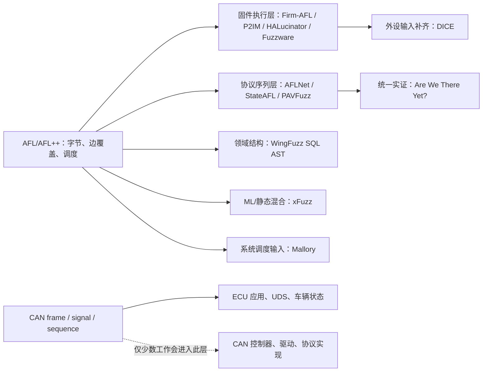

# Zotero「固件 fuzz 综述」与「总线 fuzz」文献分析

调研日期：2026-07-16  
范围：Zotero `模糊测试/固件 fuzz 综述`（34 个顶层条目）和
`模糊测试/总线 fuzz`（22 个顶层条目），以及解释这些论文方法与实验所必需的
关键相关工作。

## 1. 需求整理与判定规则

本报告回答以下问题：

1. 每篇文献是综述、直接 fuzz 方法、fuzz 使能方法，还是仅与 fuzz 相邻？
2. 真正的 PUT/SUT 是什么，输入从哪里进入？
3. 是主机原生执行、全系统/用户态仿真、MCU 重宿主、硬件在环、设备台架、
   整车，还是纯软件仿真？
4. 输入生成、变异、种子调度、状态探索和反馈算法是什么？
5. 属于黑盒、灰盒还是白盒；若是混合方法，静态分析和动态反馈分别用在哪里？
6. benchmark、baseline、运行时间、硬件/软件环境、重复次数和指标是什么？
7. bug oracle 是崩溃、信号/日志、liveness、差分结果、不变量、状态偏差，还是
   人工确认？
8. 论文实际得到什么结果，哪些结果来自论文自己的实验，哪些只是综述转述？
9. CAN 是被测协议/实现，还是仅仅承载发往 ECU 或其他对象的测试输入？

纳入原则不是“只分析固件”，而是“分析两个目录中的所有 fuzz 文章”。因此，
分布式系统、DBMS、智能合约、通用 fuzz、协议/状态机 fuzz 和机器学习辅助 fuzz
都进入主体。纯 IDS、异常检测、物理指纹、一般运行时验证及仅讨论固件分析而不以
fuzz 为核心的论文，不进入逐篇方法矩阵；它们在剔除清单中保留理由。重复 Zotero
记录合并为一篇。

## 2. 先给结论

### 2.1 “固件 fuzz 是否必须上真机”没有单一答案

- Linux 路由器/摄像头 Web 服务可以在 QEMU 全系统仿真中 fuzz。FirmFuzz 就是
  这种模式：主机运行 fuzzer，QEMU 内运行完整固件，HTTP 是输入通道，固件日志和
  内核异常是 oracle。
- 也可以直接 fuzz 物理设备。UCRF 在主机静态分析固件二进制以生成 HTTP 种子，
  然后把测试请求直接发送给真实路由器；其运行反馈只能依赖网络存活性和代理回连，
  不能像仿真器一样直接看到段错误。
- 裸机/RTOS MCU 通常不能直接在主机上执行。P2IM、DICE、HALucinator、Fuzzware、
  µEmu 等工作的核心是补齐外设语义，让 AFL 一类主机 fuzzer 能驱动重宿主后的固件。
- 真机仍然常用于最终确认。DICE 的 fuzz campaign 在 P2IM 仿真环境中运行，但五个
  bug 又用同一 fuzzer 输入在真实设备上复现；这应称为“仿真发现、真机验证”，不能
  简写成纯仿真或纯真机。
- 硬件在环是中间形态：CPU/部分代码在仿真器中执行，外设访问转发给开发板或真实
  设备。它提高外设真实性，但吞吐、并行性和一台仿真器绑定一块板的扩展性较差。

### 2.2 固件 fuzz 最大实验变量常常不是变异算法，而是“能否正确执行”

普通程序 fuzz 通常默认 PUT 可以反复启动、崩溃可见、覆盖可插桩。固件不具备这些
前提：它依赖架构、内核、NVRAM、MMIO、DMA、中断和具体外设。因此不少论文（DICE、
P2IM、HALucinator、FirmAE、Fuzzware）真正改进的是执行环境或输入通路。评价它们时，
除覆盖率和 bug 数外，还必须看：成功启动率、外设模型准确率、误识别率、重宿主开销、
可达路径和是否经过真机复现。

### 2.3 CAN 文献中，“向 CAN 发帧”通常不等于“fuzz CAN 协议”

当前集合中绝大多数直接 CAN fuzz 工作以 CAN 为输入通道，真正 PUT 是 ECU 应用逻辑、
车辆功能、诊断服务或多 ECU 状态机。测试用例虽然是 CAN 帧/帧序列，但 oracle 常是
仪表/执行器状态变化、ECU 响应、超时、重启或车辆功能偏差。只有当被测对象是 CAN
控制器、驱动、协议栈、帧解析/错误处理、仲裁或一致性实现时，才应称为“fuzz CAN
协议/实现本身”。PAVFuzz 甚至完全不是 CAN fuzzer：它测试 FastRTPS、vsomeip 和
libzmq 的主机协议实现，只是被存放在“总线 fuzz”目录中。

### 2.4 oracle 是跨领域可比性最弱、也最容易被报告模糊的部分

- 主机程序：崩溃信号、ASAN、超时较直接。
- MCU：内存破坏未必立即崩溃，简单地址区权限和 red-zone 只能发现部分越界；
  “没有 crash”不等于没有 bug。
- 物理 IoT/路由器：多用 heartbeat、响应差异、重启、代理回连和人工复现，定位能力弱。
- 分布式系统：oracle 通常是 Jepsen checker、线性一致性/可用性条件或系统不变量，
  输入是故障调度而非字节串。
- DBMS：崩溃之外大量依赖差分/蜕变结果、错误码、日志和去噪确认。
- 智能合约：依赖特定缺陷模式的运行时检查器、交易回滚/异常、状态或资产流不变量。
- CAN/ECU：常用 ECU 响应缺失、重启、DTC、功能状态偏差或人工观察；论文之间很少有
  统一 oracle，因此“发现异常数”通常不能直接横向比较。

## 3. 分类框架

### 3.1 按论文贡献分类

| 类别 | 判断标准 | 代表工作 |
|---|---|---|
| 直接 fuzzer | 提出并实际执行新的输入/状态/调度搜索方法 | FirmFuzz、UCRF、StateAFL、Mallory、WingFuzz、xFuzz、多数 CAN/ECU fuzz |
| fuzz 使能 | 解决执行、外设、种子或状态准备瓶颈，本身不一定改动核心 mutator | DICE、P2IM/HALucinator 类工作、2026 AI-CAN 状态提取 |
| fuzzer 基础设施 | 组合通用 fuzz 机制供其他工作复用 | AFL++ |
| 综述/系统综述 | 分类、比较已有方法；通常没有原创 fuzz campaign | 固件/嵌入式、协议、通用、ML、IoT、分布式动态测试综述 |
| fuzz 相邻但非 fuzz | 目标或方法不是 fuzz | 纯 IDS、异常检测、物理指纹、一般运行时验证 |

### 3.2 按执行载体分类

| 执行载体 | PUT 在哪里执行 | 可获得反馈 | 主要优点 | 主要实验风险 |
|---|---|---|---|---|
| 主机原生/容器/VM | 主机进程或集群节点 | 覆盖、日志、异常、sanitizer、系统不变量 | 吞吐和可观测性高 | 与嵌入式真实环境无关或环境简化 |
| 全系统仿真 | QEMU 中的内核+用户态+文件系统 | 客体内核日志、进程状态、网络、覆盖 | 接近完整固件环境，可快照恢复 | 外设/NVRAM/网络配置不完整导致启动失败 |
| 用户态/增强进程仿真 | QEMU user mode，必要系统调用转回全系统 | 边/路径覆盖、崩溃 | 比全系统快 | 系统调用和进程间依赖可能失真 |
| MCU 全仿真/重宿主 | 仿真 CPU+自动/手工外设模型 | 基本块/路径、地址异常 | 可并行、无需每实例真机 | 外设模型和中断/DMA误差；崩溃可见性不足 |
| 硬件在环 | CPU/代码在仿真器，I/O 转发到板卡/设备 | 仿真反馈+真实外设行为 | 外设更真实 | 转发慢、布线/设备绑定、规模受限 |
| 物理设备/ECU 台架 | 真机运行，主机发输入并监控 | 响应、heartbeat、DTC、日志、功能状态 | 真实度最高 | 吞吐低、恢复慢、覆盖/崩溃定位弱 |
| 整车/封闭车辆试验 | 实车 ECU 网络和执行器 | CAN trace、仪表/功能/诊断状态 | 系统级行为真实 | 可重复性、成本、oracle 和实验控制较差 |

## 4. 固件与嵌入式 fuzz：逐篇实验分析

### 4.1 FirmFuzz：Linux 固件 Web 应用的仿真内灰盒生成式 fuzz

**PUT 与输入。** PUT 不是 CAN 或内核本身，而是 Linux 固件中厂商编写的 Web/CGI
应用及其辅助进程。FirmFuzz 用无头浏览器遍历 DOM、触发 JavaScript、填写合法字段，
经 mitmproxy 捕获真实 HTTP 请求作为种子，再按目标 bug 类别替换参数 payload。

**框架与算法。** 固件先解包并在定制内核的 QEMU 全系统环境中启动；不支持的外设
根据 panic 日志迭代映射到返回真的假驱动；helper/poison binary 注入客体。fuzzer 是
context-driven、generation/substitution-based 的有限 payload 搜索，不是 AFL 式随机
覆盖引导。固件进入不一致状态时使用 QEMU snapshot 回滚。

**黑灰白盒。** 输入接口一侧近似黑盒 Web 交互，但它读取固件静态/运行时上下文，
修改客体文件系统和内核并监控内部日志，因此整体应判为灰盒，而非纯黑盒。

**实验环境。** Intel i7、16 GB RAM、Ubuntu 16.04、QEMU 2.5.0、Selenium WebDriver
3.4.0、mitmproxy 0.18.2。数据源为三个厂商网站抓取的 6,427 个镜像：1,013 个能找到
Linux 文件系统，203 个成功推断网络配置，最终只有 32 个镜像（27 个独立设备、六种
Web UI）具有可访问 Web 入口并实际 fuzz。

**benchmark 与 baseline。** benchmark 是上述真实厂商镜像，而非标准公开漏洞套件。
baseline 为 Firmadyne 自动检测、ZAP Active Scan 和 w3af；比较指标是能否检出同一组
问题。ZAP/w3af 获得了额外的认证配置，因此比较对它们并非完全无辅助。

**oracle。** 命令执行通过监控 `execve` 是否执行 poison binary；缓冲区溢出和空指针
解引用通过内核未映射内存访问日志；XSS 通过主机侧检测注入 JavaScript 是否执行。
每个触发输入与 URL 被保存为可复现 PoC。

**结果。** 报告七类/个独立未披露问题，分布于六台设备（两款摄像头、四款路由器），
当时四个获得 CVE。FirmFuzz 检出全部七个；ZAP 只检出反射型 XSS，Firmadyne 和 w3af
在该集合上均未检出。平均 fuzz 阶段耗时 16 分 42 秒。最重要的限制不是吞吐，而是
6,427 个镜像最终仅 32 个进入 fuzz，说明仿真成功率和 Web 入口可达性主导总体规模。

### 4.2 UCRF：主机静态分析生成种子，直接 fuzz 物理路由器

**PUT 与输入。** PUT 是真实 SOHO 路由器的后端 Web 服务。UCRF 解包固件并静态分析
后端 border binary，识别 action handle、参数关键字及三类约束，然后构造 JSON/SOAP
等键值型 HTTP 请求。请求绕过前端，直接发送到路由器后端。

**算法。** 先用 SaTc 等预处理定位边界二进制；从网络数据读取点进行 VEX IR 级轻量
数据流分析，提取 strcmp-like 固定值、number-like 数值范围和 network-like 地址约束；
再生成“格式合法但只保留后端真正需要的约束”的 under-constrained seeds，避免前端
检查使种子过约束。变异只在有意义字段空间中进行。

**黑灰白盒。** 测试执行在物理设备上且没有内部覆盖反馈，但种子来自固件二进制
白/灰盒静态分析；整体是静态分析辅助的灰盒/混合式物理设备 fuzz，不宜标作纯黑盒。

**实验环境与 benchmark。** 十台真实路由器、四个厂商；论文将其中作者实际持有的
五台设备用于与 SRFuzzer 的对比。它不依赖固件仿真，测试中需要人工给出 URL 前缀并
完成一次登录，以便自动取得会话凭据。

**baseline 与 oracle。** 主要 baseline 是 SRFuzzer。内存类异常的 oracle 是设备无
响应或响应行为变化；命令执行通过本地代理收到路由器发出的特制请求判断。设备无
响应后由系统物理重启并恢复 fuzz。由于是真机，无法直接读取 segmentation fault，
因此该 oracle 是启发式且定位能力弱于仿真内监控。

**结果。** 报告 41 个 0-day，其中 20 个只有满足提取约束后才能触发；38 个获得 CVE、
两个获得 CNVD、一个获得 PSV 标识。后端接口识别准确率 96.3%，平均为 36.4% 的参数
关键字找到约束。对持有的五台路由器，UCRF 报告的内存和命令执行问题显著多于
SRFuzzer。论文未建立可复用标准 benchmark，因此数字不能直接与仿真型固件 fuzzer
横向比较。

### 4.3 DICE：为 MCU fuzz 自动补齐 DMA 输入通道

**定位。** DICE 不是一个新的通用变异器；它是 drop-in DMA 输入通道仿真层，使现有
动态分析器和 AFL 能到达原本因 DMA 不可见而完全不可达的代码。

**对象与算法。** PUT 是 ARM Cortex-M/MIPS MCU 固件。DICE 观察固件对 MMIO 的 DMA
配置写入，把相邻 RAM 指针识别为传输描述符，区分输入/输出通道；当固件读取 DMA
目标缓冲区时，通过 RAM hook 注入 fuzzer 数据，并用保守的相邻访问扩展启发式推断
缓冲区大小。方法不需要固件源码、真实外设或针对具体 DMA 控制器的手写模型。

**执行环境。** 主实验把 DICE 集成到 P2IM，并使用未修改 AFL；另集成 MIPS PIC32
仿真器、Avatar2 和 Symbion 说明可移植性。fuzz campaign 在主机上的 MCU 仿真环境中
运行，不是直接在板上高速 fuzz；发现的问题再用真机复现。

**benchmark。** 单元/准确性评估使用 83 个 sample firmware，覆盖两种架构、11 种
MCU、五个厂商、九种 DMA 控制器和多种 RTOS/SDK。fuzz 评估使用七个真实开源固件：
Modbus、Guitar Pedal、Soldering Station、Stepper Motor、GPS Receiver、MIDI
Synthesizer 和 Oscilloscope，覆盖 FreeRTOS、Mbed OS、Arduino 和 bare metal。

**baseline、预算与 oracle。** baseline 是相同输入下的原始 P2IM。每个固件用随机
初始种子运行 48 小时。oracle 包括 P2IM 的地址区域权限检查，以及编译期在缓冲区前后
插入 red-zone 的细粒度越界检测；red-zone 用于实验增强可见性，但启动 fuzz 并不要求
重编译。最后用同一输入在真实设备上复现，作为真实性 oracle。

**结果。** 52 个 DMA 配置中识别 45 个，TPR 约 89%，35 个非 DMA 的类指针 MMIO
写入上零误报；样本执行平均增加 3.4% 开销。七个真实固件中，DICE 在五个上提高覆盖，
基本块覆盖最高提高 30.4%，新执行模式路径数最高提高 79 倍，最大深度最高提高 500%。
发现五个 P2IM 单独无法触发的问题（三个 Modbus 越界读写、两个 MIDI 非堆内存释放），
全部用生成输入在真实设备上复现。最差吞吐下降为 18%。

**解释限制。** DICE 会把控制流影响很弱的连续 ADC/DSP 输入也当作 fuzz-worthy DMA
通道，浪费预算；AFL 偏好短输入，而某些固件一次消耗多个 4 KB DMA 缓冲区；简单内存
oracle 仍会漏掉同一地址区内部的破坏。因此“覆盖增加但未发现 bug”的固件不能据此
判断不存在缺陷。

### 4.4 《基于深度学习的固件模糊测试技术设计与实现》：方法可辨，实验数字证据不足

该学位论文是 fuzz 核心工作，不应因为全文索引不完整而剔除。可核实的方法链是：先按
局部熵值把固件/协议输入分为文本区和高熵二进制区；文本区由 LLM 做保留语法与语义的
精细化变异，并用 fuzz 反馈调整提示，再用 RAG 从目标资料构造领域词典；二进制区用
策略梯度结合覆盖反馈学习变异选择；最后集成为固件 fuzz 平台。它属于“输入结构识别
+ LLM/RAG 文本变异 + 强化学习二进制变异”的混合灰盒方案，不是单纯让 LLM 从零生成
测试用例。

但 Zotero 当前可访问快照虽然列出了完整章节结构，实验章正文、硬件、PUT 清单、
baseline、运行预算和统计结果没有形成足够可靠的连续证据。因此本报告不补写这些数字，
也不把平台实现等同于已公开源码。该条目的结论置信度低于 FirmFuzz、DICE、UCRF；若要
做定量引用，应以学校论文库中的完整 PDF 重新核对第六章。

### 4.5 综述论文中的统一对比实验必须单独标注

《Fuzzing of Embedded Systems: A Survey》除综述外还由作者补做了一组跨工具实验：
八个网络相关 IoT 设备，每个运行 24 小时；Intel i5、32 GB RAM、Ubuntu 16.04 LTS、
QEMU 2.1.0、AFL 2.52b。结果如下：

| 工具 | 24 h crashes | 论文报告的 0-day 数 | 24 h 平均路径数 | 关键差异 |
|---|---:|---:|---:|---|
| Firm-AFL | 52 | 2 | 492 | 增强进程仿真，必要系统调用回到全系统 |
| Firm-AFLFast | 133 | N/A | 1118 | 用 AFLFast power schedule 替换 AFL |
| FIRMCORN | 105 | 2 | 870 | 优化虚拟执行+启发式算法 |
| FIRM-COV | 335 | 2 | 2321 | 固件预分析+优化进程仿真 |

同一综述还转录 SNIPUZZ 论文中的网络设备比较：NEMESYS、BooFuzz、Doona 在其 24 小时
设置中均为零 crash；IoTFuzzer 为 2 crash/2 vulnerability；SNIPUZZ 为 13 crash/
5 vulnerability。该表的“coverage”是平均响应类别数，不是代码边/路径覆盖，因此不能
和上表路径数放在同一纵轴比较。

### 4.6 固件主线相关工作矩阵

这些工作主要由本地综述引用，未必都是 Zotero 中的独立顶层条目，但它们决定了
FirmFuzz/DICE/UCRF 应如何定位。

| 工作 | 方法定位 | 执行载体与对象 | benchmark / baseline | oracle / 主要结果 |
|---|---|---|---|---|
| [P2IM](https://www.usenix.org/conference/usenixsecurity20/presentation/feng) | 动态 MMIO register 分类与 processor-peripheral interface 模型；AFL 输入经 data register 注入 | QEMU 纯软件 Cortex-M，fuzz 不需真机 | 66 个有效 peripheral/OS 测试组合（论文原写 70，仓库后勘误）；10 个真实固件；baseline 为无 P2IM | 地址区权限；真机重放；约 79% 示例无需人工持续执行，覆盖提高约 7–30 倍，报告 7 个新 bug |
| [FIRM-AFL](https://www.usenix.org/conference/usenixsecurity19/presentation/zheng) | augmented process emulation：full-system 启动、user-mode 加速、困难 syscall 回退 | Linux 固件单个网络服务进程 | 7 个服务，另 120 镜像透明性评估；TriforceAFL full-system/快照 baseline | AFL signal/crash；相对最佳 full-system 平均约 8.2× 吞吐，报告 2 个新缓冲区问题 |
| [FirmAE](https://www.acsac.org/2020/program/final/s313.html) | 修复 boot/NVRAM/filesystem/network 不兼容的重宿主平台，本身不是 fuzzer | QEMU 全系统 Linux 固件 | 1,124 个路由器/摄像头镜像；Firmadyne baseline | 外接 scanner/PoC；成功运行 183→892（16.28%→79.36%），验证 320 个已知问题 |
| [HALucinator](https://www.usenix.org/conference/usenixsecurity20/presentation/clements) | LibMatch 识别 HAL/library，host handler 替换底层外设；AFL-Unicorn | 纯软件 Cortex-M，上层协议/应用 | 三家厂商 16 个应用；QEMU、Avatar2 | Unicorn signal、handler precondition、heap checker；16 个应用保持黑盒行为并找到多类内存问题 |
| [Fuzzware](https://www.usenix.org/conference/usenixsecurity22/presentation/scharnowski) | 对唯一 `(PC, MMIO)` 访问做局部符号分析，合成 bit-precise MMIO 模型 | Unicorn Cortex-M，AFL/AFL++ + angr | 77 个固件/19 平台；P2IM、µEmu | 非法访问/crash/timeout+人工；输入空间最高减少约 95.5%，覆盖最高约 3.25×，报告 15 个新问题/12 CVE |
| [Jetset](https://www.usenix.org/conference/usenixsecurity21/presentation/johnson) | 指定目标的符号执行，求硬件交互序列并合成 QEMU peripheral model；之后才接 fuzz | 多架构固件纯软件模型 | 13 个固件、3 架构、5 OS；人工/官方 QEMU model、真实 Raspberry Pi | 模型一致性+后续 AFL crash；CMU 案例约 200 h 得 2,963 crash paths，模型约 97.3% 一致 |
| [BaseSAFE](https://wisec2020.ins.jku.at/proceedings/wisec20-134.pdf) | 从基带 dump 提取消息 parser，在 Unicorn 中构造函数上下文并 AFL fuzz | 主机函数级 sandbox；MediaTek/Nucleus 基带 | 单一基带家族和若干 LTE/RRC parser；无统一 baseline | Unicorn/assert/custom heap sanitizer；高吞吐，但 harness/状态/上下文需人工，真机验证需手机+SDR/基站 |
| [Avatar2](https://www.eurecom.fr/en/publication/5437) | 多目标编排、状态迁移和 record/replay，本身不是 fuzzer | QEMU/PANDA/angr + 真实板卡外设转发 | 框架型，无统一 fuzzer benchmark | oracle 由接入工具提供；外设真实但转发慢、设备一对一、难扩展 |

源码当前可访问：[FirmFuzz](https://github.com/HexHive/FirmFuzz)、
[DICE](https://github.com/RiS3-Lab/DICE-DMA-Emulation)、
[P2IM](https://github.com/RiS3-Lab/p2im)、
[FIRM-AFL](https://github.com/zyw-200/FirmAFL)、
[FirmAE](https://github.com/pr0v3rbs/FirmAE)、
[HALucinator](https://github.com/halucinator/halucinator)、
[Fuzzware](https://github.com/fuzzware-fuzzer/fuzzware)、
[Jetset](https://github.com/aerosec/jetset_engine)、
[BaseSAFE](https://github.com/fgsect/BaseSAFE) 和
[Avatar2](https://github.com/avatartwo/avatar2)。FirmFuzz 仓库已归档为只读；UCRF
未找到作者公开实现。

### 4.7 如何选择实验形态

| 研究问题 | 最合适的起点 | 是否需要真机 |
|---|---|---|
| Linux 固件 Web/daemon 输入处理 | FirmAE/Firmadyne 全系统启动，再接 FirmFuzz、FIRM-AFL 类 driver | campaign 可不需要；建议抽样真机回放 |
| 裸机/RTOS MCU MMIO 输入 | P2IM/Fuzzware/µEmu 类纯软件重宿主 | campaign 不需要；真实板卡验证模型和 bug |
| DMA 驱动的串口/ADC/协议代码 | DICE 集成到 P2IM/其他 analyzer | campaign 不需要；真机重放很重要 |
| 有稳定 HAL、关注上层协议/应用 | HALucinator | 不需要；被替换的 driver 不在测试范围 |
| 外设不可建模且行为必须真实 | Avatar2/HIL | 需要板卡或设备 |
| 只有少量关键 parser、追求吞吐 | BaseSAFE 式函数 sandbox | campaign 不需要；harness 正确性和真机复现是关键 |
| 只有物理路由器运行环境可信 | UCRF/IoTFuzzer/SNIPUZZ 类直接网络 fuzz | 必须有设备；覆盖和精确 crash 定位受限 |

固件实验不能只报告“跑了 AFL”。至少应同时报告启动/重宿主成功率、路径或覆盖定义、
外设模型误报/漏报、oracle 可见范围、重置方式和真机复现比例。

## 5. CAN/嵌入式总线 fuzz

### 5.1 强制分类字段

每篇总线文献按以下字段判定：

| 字段 | 需要回答的问题 |
|---|---|
| 真正 PUT/SUT | CAN 控制器/协议栈，还是 ECU 应用、UDS、车辆功能、仿真程序？ |
| CAN 的角色 | 被测对象、输入投递通道、观测通道，还是仅数据集来源？ |
| 输入粒度 | bit/frame/signal/message sequence/诊断服务/车辆场景 |
| 状态处理 | 无状态随机、结构感知、状态感知、模型/序列引导 |
| 执行载体 | 软件仿真、虚拟 ECU、HIL、ECU 台架、停放真车、封闭道路/整车 |
| oracle | CAN 响应、超时/重启、DTC、功能状态、仪表/执行器、人工判定 |

### 5.2 集合内论文总表

| 论文 | 真正 PUT/SUT | CAN 的角色 | 输入/反馈类型 | 执行环境 | baseline | oracle 与主要结果 |
|---|---|---|---|---|---|---|
| Fowler et al. 2018 | ECU/车辆功能 | 投递+观测 | 随机 ID/DLC/data/rate；黑盒 | Vector 仿真、ECU 台架、Arduino 台架、停放真车 | 无竞争 baseline | 仪表/灯/显示/CAN 确认；发现功能异常但未确认软件 bug |
| Fowler et al. 2017 | 概念中的 ECU 应用 | 投递 | DBC 辅助边界变异 | 只提出 SIL/HIL/仿真设想 | 无 | 无实验、benchmark 或结果 |
| Fowler et al. 2019 | 显示 ECU 应用 | 投递 | 随机帧→回放→二分→逐 bit/DLC 最小化 | 真实 ECU 台架+实验车 | 无 | 屏幕/蜂鸣/回放；多个 ID/bit 触发 68/78 类提示，长度处理仅为外部推断 |
| CAN-FT 2021 | 车辆 ECU/功能状态 | 投递+观测 | BFR、WGAN-GP 生成，AdaBoost 异常反馈；黑盒 | 停放真车 | Random | 异常分类+肉眼功能+回放；统计是异常消息/功能，不等于 confirmed bug |
| Structure-Aware 2022 | ECU/车辆功能 | 投递+观测 | BFR+OBD 相关性+DNN checksum，结构感知变异 | 2014 Kia Soul、2018 Genesis EQ900 | 理论 64-bit 穷举 | 新 ID/DLC/字段/相关性、IMU、肉眼；触发 RPM、转向、制动等功能，无 crash 证据 |
| Dynamic Sequence 2024 | 闭源 IoV 仿真程序 | 投递接口 | grammar/model+消息序列/间隔变异；黑盒 | 主机仿真平台+USB-CAN | Boofuzz、Peach、WNT | crash/exit、heartbeat、challenge-response；24 h 找到一个需≥50帧的可复现序列故障 |
| De Rosa thesis 2024 | Fiat 500 BEV 台架 ECU、白盒虚拟 ECU | 投递+观测 | Random/Sequential/BitFlip/BLFReplay | SocketCAN、CANalyzer、真实多 ECU 台架、虚拟 ECU | 策略间比较 | 车辆功能+虚拟 ECU ERROR；真实台架无 confirmed bug，虚拟 ECU 显示 CRC 对有效率的影响 |
| CAN embedded platform 2022 | 闭环嵌入式控制节点 | 投递 | 抓包、去重、随机替换/组合、同频回放 | 物理闭环、CAN-Scope、USBCAN、ZCANPRO | 无 | 执行器/蜂鸣/响应/状态消息/错误码；仅定性结果，证据不足 |
| ARE-GF 2024 | 声称为 ECU/车辆响应 | 投递+观测 | 从值变化推断 bit-field 后 guided fuzz | 未披露 | 不可比系统列表 | 车型、台架、oracle、时长和 bug 均未披露；“94% pass rate”未定义 |
| PAVFuzz 2021 | FastRTPS、vsomeip、libzmq | **不是 CAN** | 协议状态模型+跨状态字段关系+分支覆盖 | 主机进程、Peach、LLVM/ASan | AFL、Peach | ASan/OOM/coverage；24 h×5，覆盖优于 AFL/Peach，报告 12 个 bug |
| AI-CAN state extraction 2026 | 没有执行 fuzz；分析 TPM ECU 的 CAN trace | 数据/状态来源 | LLM 解析 DBC/ASC，提取状态、停留时间、迁移 | HIL/合成 trace+量产车日志 | 确定性脚本/人工分析 | 状态集合和数值一致性；不是 bug oracle，也没有 fuzz campaign |

`Novel CAN Bus Fuzzing Framework` 的两个 Zotero 条目是同一 DOI，合并一次分析。

### 5.3 代表性实验的细节

#### 5.3.1 Fowler 2018：四级环境的早期随机实验

方法用 C# 在 Visual Studio 中随机生成 11-bit CAN ID（0–2047）、DLC（0–8）、
payload byte（0–255）和发送频率，没有代码覆盖和结构学习。实验从 Vector 车辆仿真器，
扩展到 Windows+PEAK PCAN-USB+仪表 ECU，再通过 OBD 接入真车两条 CAN，另用三个
Arduino 模拟 ECU 网络做可重复的“解锁确认”试验。oracle 是仿真信号、MIL/仪表/显示、
CAN 回复和 Arduino 确认消息。加入 DLC 检查后，模拟解锁平均触发时间从约 431 秒增到
1959 秒，说明简单有效性检查能显著缩小随机命中空间。论文没有确认固件 crash/缺陷；
仪表出现的英文单词 `crash` 只是显示文本，不能作为程序崩溃证据。

#### 5.3.2 Fowler 2019：真实显示 ECU 上的“发现—回放—最小化”

台架为 Windows PC、PEAK USB-CAN、购买的显示 ECU、12.4 V 电源、500 kbps 总线和
自制终端线束；第二个接口发 ACK，避免 ECU 唤醒后 bus-off。随机阶段以 1 ms/帧发送
ID 0–2047、DLC 8、随机 payload；观察屏幕变化后回放日志、二分缩小到单帧，再扫描
64 个 payload bit 并逐步降低 DLC。ID 793 的 22 个 bit 触发 20 类提示，ID 752 的
55 个 bit 至少触发 44 类，ID 753 再增加 4 类；同样帧在实验车上触发提示和蜂鸣。
零值短 DLC 仍能触发功能，作者推测内部总读取 8 byte，但没有固件内存证据，故只能
标为疑似长度处理问题。它的强项是可回放/最小化，弱项是完全人工 oracle 和无 baseline。

#### 5.3.3 CAN-FT：生成模型有趣，但 oracle 存在循环性

CAN-FT 先把 payload 字段分为 constant、multi-value、counter、checksum、signal；
WGAN-GP 学习约十万条正常消息分布，再以 BFR 或生成模型产生输入；AdaBoost 用正常
消息和生成异常训练后作为响应分类器。停放真车上每种方法发送 5,000 条 fuzz 消息，
再采集 30,000 条响应。论文表中 WGAN/BFR/Random 分别报告 4,734/7,852/10,683 条
异常响应，其中“fuzz 消息”和“被诱导其他异常消息”的口径解释不足。Random 触发的
可见行为反而更多；论文关于规避 IDS 的主张没有在安装 IDS 的车辆上验证。由于异常
分类器本身由生成异常训练，它更适合做状态偏差 oracle，不应把分类数量当作 bug 数。

#### 5.3.4 Structure-Aware：两辆真车，但 PUT 仍是车辆功能

实验对象为 2014 Kia Soul 和 2018 Genesis EQ900；硬件包括 RAD GALAXY、Raspberry
Pi 3、MPU-6050 IMU 和 OBD PID 查询。第一阶段用 BFR 识别 unused/constant/
multi-value/sensor/counter/checksum，用 Pearson ±0.7 阈值匹配 OBD PID，用 DNN
预测 checksum（数据 70/20/10 切分）。第二阶段对不同字段注入 (2^k)、越界传感器
值和跨字节重复模式。第三阶段检查新 ID、DLC/BFR 变化、字段越界、相关性和 IMU。
38 个 PID 中识别 37 个；Kia/Genesis 分别生成约 140/226 个测试。CAN trace 本身没有
显著异常，但 IMU/人工观察到 Kia RPM、两车转向以及 Genesis 制动动作。论文验证了
结构恢复能到达车辆功能，并没有给出程序崩溃或定位后的固件 bug。

#### 5.3.5 Dynamic Message Sequence：唯一明确的序列 crash

框架用 message tree template 描述 interval、ID、DLC、Data，用 protocol process
template 的链表表示序列；mutator 做 bit/byte/random、单帧、顺序和间隔变异。PUT 是
未公开的闭源 IoV 仿真平台，主机经 USB-CAN 投递输入。与 Boofuzz、Peach、WNT 在
同平台各运行 24 小时，只有该方法找到一个可复现程序 crash：至少连续 50 条 ID
`0x10`、data `00 28 00 00 00 00 00 00`、间隔不超过 20 ms。这个结果说明状态/时序
序列比单帧更重要，但只有一个闭源 PUT、一个故障且无重复统计，外部有效性有限。

#### 5.3.6 De Rosa：四级工程验证，而非真实 bug 发现

实现基于 Python 3.11、python-can、python-ics、PySide6，支持 Random、Sequential、
BitFlip、BLFReplay 和人工二分反向定位。主机为 Dell Latitude E6540、i5-4200M、
8 GB、Arch Linux 6.7.4；接口为 ValueCAN 4-2、Vector VN1630 和 CANalyzer。实验依次
使用 `vcan`、CANalyzer 吞吐测试、Fiat 500 BEV 的仪表/BCM/ICM/ACM 台架和具有明确
OK/ERROR oracle 的虚拟 ECU。Fiat 台架可触发转速表、倒车摄像头和提示状态，回放并
最小化到含 CRC-8 的四字节帧，但未确认固件 bug。虚拟 ECU 显示：未知 CRC 时随机命中
率很低；已知 CRC 字段后约 8,448 条消息即可遍历 bitflip/brute-force 组合。它适合说明
实验台阶和 checksum 障碍，而不是作为真实缺陷数量证据。

#### 5.3.7 PAVFuzz：为何保留、为何不能叫 CAN fuzz

PAVFuzz 要求用户为每个协议状态提供 packet data model，维护相邻状态字段关系表；
新分支出现后通过回放和逐步删除变异元素定位贡献字段，再把当前字段与以前能提升下一
状态覆盖的字段组合，并更新 relation weight。PUT 是 FastRTPS、GENIVI vsomeip、
libzmq；Peach Community 3.0.202 负责变异，Clang/LLVM 收集分支，ASan/OOM 为 oracle。
每个实验 24 小时、重复五次；对三 PUT 的分支覆盖分别达到 23,784、138,548、16,114，
报告相对 AFL 平均高 369.19%、相对 Peach 高 22.51%，并报告 12 个 bug（AFL 1、
Peach 6）。它对车载状态协议 fuzz 有算法参考价值，但不能作为 CAN 实验。

### 5.4 强相关但不在 Zotero 总线目录中的工作

| 工作 | 为什么重要 | 环境/PUT | baseline/oracle/结果 |
|---|---|---|---|
| [EffCAN 2020](https://doi.org/10.1145/3385958.3430480) | 从 ECU 固件 CFG 静态构造 8-byte CAN 输入，是真正“固件语义引导+真 ECU” | PCAN-USB+12 V 台架；VW IPC、Ford BCM/ECM | 周期消息/UDS Tester Present/新 ID/仪表；三 ECU 中两个出现通信停止，但部分不能稳定回放，baseline 弱 |
| [oCANada 2025](https://doi.org/10.1109/VNC64509.2025.11054197) | DBC 或逆向字段生成 binary template，再用 FormatFuzzer 生成 | Raspberry Pi+PiCAN、CANoe、真实 Gateway ECU、修改 ICSim | CaringCaribou、AFL+FF；消息超时、UDS、输出流量和仿真内存错误；主要定量结果来自仿真 |
| [EcuFuzz 2025](https://doi.org/10.1145/3728914) | 真实 AUTOSAR ECU、CAN+SPI 多输入、自动诊断 oracle，并[公开源码](https://github.com/ECUFuzz/ECUFuzz) | STM32H755 双核外设仿真器；三家 Tier-1 的十个 ECU | SecFuzz、AutoFuzz、EffCAN；UDS/DTC/内部错误变量；三类 ECU 各 24 h，报告九个此前未知故障 |
| Lee et al. 2015 | 早期真车 CAN 帧随机/逐字节注入 | 真车 | 仪表/灯光等功能行为，缺少软件级 oracle |
| Oka et al. 2016 | HIL 自动物理量 oracle 的代表 | dSPACE SCALEXIO+Defensics，发动机/Gateway ECU | 模拟/数字系统信号用于自动判定 |
| Patki et al. 2018 | 说明 UDS 是 CAN 上层服务 PUT，不是 CAN 协议 | UDS 服务 | DLC、subfunction、`00`/`FF` 边界变异 |

其中 EcuFuzz 的实验设计最完整：它要求 ELF/符号表和 DBC，用逻辑分析仪记录初始化
SPI 序列，STM32H755 实时模拟外设，同时变异 CAN 与 SPI，并用 UDS 读取内部错误变量、
DTC 和异常上下文。它清楚展示了“真 ECU fuzz 不等于随机发 CAN 帧”，关键还包括启动
序列、板载外设和可自动化内部 oracle。

## 6. 其他 fuzz 论文：分布式、DBMS、智能合约、协议与通用框架

### 6.1 原创方法与原创统一实验总表

| 工作 | PUT 与输入 | 类型/算法 | 环境与预算 | benchmark / baseline | oracle | 论文自己的主要结果 |
|---|---|---|---|---|---|---|
| Mallory / Greybox Fuzzing of Distributed Systems | Braft、Dqlite、MongoDB、Redis、ScyllaDB、TiKV 多节点部署；输入是 12 步故障/环境调度序列，不是文件字节 | 灰盒；LLVM 覆盖+网络事件截获，Lamport timeline/happens-before 摘要，MinHash 状态签名，Q-learning 在线选择分区、暂停、崩溃、成员变化等动作 | AWS m6a.4xlarge，Ubuntu 20.04，16 vCPU/64 GB；通常 5 节点、MongoDB 9 节点；24 h×10 | 六个真实系统；Jepsen 随机/人工故障调度 | ASan、fatal/error/bug 日志、Elle 一致性 checker | 平均多探索 54.27% 状态；同状态覆盖快 2.24×；已知问题 14/16 对 9/16；22 个新问题，18 个获确认 |
| WingFuzz | PostgreSQL、MySQL、MariaDB、PolarDB，工业部署扩展到 12 个 DBMS；输入为 SQL/SQL 序列 | 源码/语法辅助灰盒；从 Bison/Flex/文档构造 AST mutator，维护 schema 元数据依赖；持续 corpus 与 commit-directed corpus；ptrace 去噪 | Ubuntu 20.04，AMD EPYC 7742 128 核、504 GiB；Docker，每实例 5 核/32 GiB；24 h | SQLancer、SQLsmith、SQUIRREL | `SIGSEGV/ILL/BUS/ABRT/FPE`、libunwind 调用栈、覆盖去重、人工确认 | 四库总分支 459,181，对照 247,561/262,122/326,784；独立问题 27，对照 2/3/6；12 DBMS 报告 236 个，232 个确认 |
| xFuzz | Solidity 多合约集合和本地私有 EVM；输入是跨合约调用路径、交易序列、构造器/函数参数 | 静态分析+ML 调度+动态灰盒；AST/CFG/call graph；20 维 Word2Vec bytecode 特征+7 个结构特征分类；按可疑函数、调用方数、参数复杂度和分支距离排序 | Ubuntu 18.04，Xeon E5-2620 v4、32 GB、2 TB HDD；每个可疑合约 180 s；部分实验 20 次、效率实验 5 次 | 18 个带标签跨合约样例和 7,391 个 Etherscan 合约；ContractFuzzer、sFuzz、Clairvoyance | 执行 trace 上三类规则，再由专家代码审查 | 跨合约结果 18 个，其中 15 个此前未暴露；报告 precision 100%；非跨合约 209 个；总耗时约 4,338 min，对 sFuzz 约 21,984 min |
| StateAFL | 13 个 C/C++ 有状态网络服务器、10 种 TCP/UDP 协议；输入为应用层消息序列 | 灰盒；插桩分配/释放、网络 I/O 和代码边；在请求边界快照长寿命内存，用 TLSH/MVP-tree 聚类状态；AFL 字节变异+消息插入/替换/重复 | Google Cloud E2 high-memory，4 vCPU；13×3×4=156 个 24 h 实验，每个重复独占 vCPU | ProFuzzBench；AFLNWE、AFLNet | 目标进程 crash；调用栈分组和人工根因去重 | 6/13 覆盖接近、7/13 状态反馈占优；覆盖 baseline 能触发的四个 crash 目标，并独有 ProFTPD heap over-read；状态分析常约 1.5× 开销 |
| AFL++ | 21 个 FuzzBench 原生程序/库 target；输入为字节串/文件 corpus | 通用灰盒基础设施；AFL edge/hit-count，集成 MOpt、RedQueen/CmpLog、N-gram、Rare、AFLFast、custom mutator，并支持 QEMU/Unicorn 等 binary-only 模式 | 每配置约 20 次、23/24 h；FuzzBench 托管硬件在论文中未明确 | AFL++ Default、MOpt、Ngram4、RedQueen、Rare 及其组合；FuzzBench 其他 fuzzer | 该实验主要是 median edge coverage，不是 bug oracle | 各技术高度 target-specific；手工 Optimal 配置在 13/21 target 上提高 normalized score，总体约 7% |
| Stateful Protocol Implementations: Are We There Yet? | 与 ProFuzzBench 相同的 13 个服务器；消息序列 | **原创统一实证研究，不是纯综述**；统一比较代码覆盖、协议状态转移、吞吐和问题 | Ubuntu 20.04，Xeon Gold 6242R、128 GB；10 次×24 h | AFLNet、AFLNetLegion、StateAFL、SnapFuzz、Nyx-Net、AFLNWE | ASan+GDB backtrace，人工根因去重 | 平均分支覆盖 Nyx-Net 22.18%、AFLNet 20.23%、AFLNetLegion 19.95%、SnapFuzz 19.64%、StateAFL 18.57%、AFLNWE 14.54%；状态深度不必然转化为最高代码覆盖 |
| 《分布式系统动态测试技术研究综述》的原创对比/MultiGen | HDFS 3.0.0、ZooKeeper 3.5.6、IPFS 1.0.7；配置、workload、消息和故障输入 | 综述之外补做统一实验；MultiGen 组合 ECFuzz、DUPTester、Tyr、Chronos，多维输入并行生成 | Ubuntu 20.04，EPYC 7742 128 核/512 GiB；每 SUT Docker 6 核/16 GiB/480 GB SSD；20 节点 10 Gbps；24 h，未报重复 | 单工具 CTests/ECFuzz、DUPTester/Mocket、LOKI/Tyr、CrashFuzz/Chronos；组合 MultiGen | 各工具逻辑 checker+统一 crash，栈去重和人工跨工具合并 | 单工具 line coverage 均低于 30%；MultiGen 为 HDFS 31.48%、ZooKeeper 21.93%、IPFS 20.47%，覆盖原 21 个问题并额外得到 8 个 |

### 6.2 Mallory：fuzz 的是故障调度和分布式状态空间

Mallory 最能说明“fuzz 不等于变异文件”。执行器持续向真实集群施加 client workload，
fuzzer 选择网络分区、进程暂停/崩溃、重启和成员变化。节点间事件通过 Netfilter 等机制
被观察，组合成 Lamport 时间线；happens-before 对的 MinHash 摘要作为灰盒状态反馈。
Q-learning 的动作奖励由新状态决定，因而优化目标是到达新的分布式交互，而不是单节点
边覆盖。bug oracle 也必须是系统语义：Elle/Jepsen 一致性检查、日志和 sanitizer 共同
使用。它在普通主机云 VM 上运行真实多进程/多节点部署，不需要仿真器或真机硬件。

### 6.3 WingFuzz：DBMS 的难点是“有效 SQL、持续版本变化和噪声”

WingFuzz 从 DBMS 语法和元数据自动建立 lexer/parser/AST mutator，使表、列、类型等引用
尽量有效；同时用历史 corpus 保持长期覆盖，用提交触达 bitmap 只保留能到达改动函数的
输入。每个 test case 前清理数据库，并用 `ptrace` 同时冻结/检查多线程子进程，再按
调用栈与覆盖去重。PUT 是主机/容器中的数据库服务，不涉及设备仿真。其 236/232 是长期
工业部署累计，不应与 24 小时四库对照中的 27 个独立问题混为同一实验。

### 6.4 xFuzz：智能合约的“输入”是跨合约调用序列

xFuzz 先用机器学习过滤大量预测为正常的合约，把 fuzz 预算集中到可疑合约和可疑调用
路径；随后在本地 EVM 中执行交易序列，用条件距离继续驱动参数变异。它不是纯黑盒：
合约源码、AST、CFG、call graph 和 bytecode 特征都被使用；同时也不是纯静态检测，最终
判定依赖动态执行 trace 和人工复核。它的 oracle 是三类论文定义的问题规则，不能与
普通 native crash 数直接比较。

### 6.5 StateAFL 与六工具实证研究：状态反馈不是自动胜出

StateAFL 的关键是把请求/响应边界的长寿命内存近似为协议状态，从而不必为每个协议手写
响应码 parser。代价是内存快照和模糊聚类开销，以及“内存距离是否真的等于协议状态”
这一近似。后续六工具统一实验进一步表明：状态反馈通常能进入更深协议状态，但最高状态
深度、最高吞吐、最高代码覆盖和最多独立问题并非同一个目标；SnapFuzz/Nyx-Net 还存在
部分 benchmark 无法运行。论文间比较必须同时报告可运行目标数、吞吐、代码覆盖和统一
状态覆盖，不能只挑一个最佳数字。

### 6.6 AFL++：是实验基础设施，不是领域对象

AFL++ 将多项研究机制工程化到一个框架中，既能在主机源码插桩模式 fuzz，也能通过
QEMU/Unicorn 等 fuzz 二进制或被重宿主固件。其原论文实验对象仍是 FuzzBench 主机
target；使用 AFL++ 去 fuzz 固件、CAN gateway 或 DBMS，并不会自动让 AFL++ 论文成为
相应领域实验。论文最重要的实证结论是配置依赖 target，不能默认把所有高级策略全部
打开就一定更好。

## 7. 综述论文的价值与局限

综述表中的 benchmark、bug 数和工具排名大多是**二手转录**；除 4.5 和 6.1 明确标出的
作者补做实验外，不能写成“综述作者在该环境跑出了这些结果”。

| Zotero 条目/论文 | 覆盖范围与最有用的分类 | 是否有作者原创 fuzz 实验/源码 | 本报告定位 |
|---|---|---|---|
| `KKITREBF`《嵌入式软件模糊测试研究综述》 | 嵌入式输入生成、执行环境、反馈和异常监控 | 无统一原创 campaign；无综述代码 | 固件/嵌入式主综述 |
| `PV9UJ8U3` Embedded/firmware fuzzing review | 按真实硬件、仿真、抽象/重宿主比较约 42 项工作 | 主要为二手汇总 | 固件执行形态主线 |
| `S2BB35DY` Firmware Fuzzing: State of the Art | 真实设备与 simulation-based 固件 fuzz | 纯综述 | 早期固件版图 |
| `93F6SRH2` Fuzzing of Embedded Systems: A Survey | direct、emulation、firmware-analysis 三类，覆盖全流程 | **有作者补做八设备/四工具 24 h 实验**，见 4.5；综述本身无工具源码 | 唯一带跨工具固件实验的综述 |
| `NUHDR2L7` IoT Fuzzing review | IoT 网络接口、固件和设备端 fuzz 的可用性/限制 | 无统一原创实验 | IoT fuzz 补充 |
| `PMF83B3Q` IoT fuzz systematic review | 以系统检索方式整理 IoT fuzz 对象、技术和评估 | 无统一实验 | IoT 系统综述 |
| `P38J8L3P` A Survey of Protocol Fuzzing, CSUR 2025 | 2013-01 至 2024-06 检索，544→87，snowball 后 93 篇，并含 22 项工业资料；generator/executor/bug collector、语法/状态/reset/oracle | 无原创 PUT/硬件/campaign；无伴随代码 | 当前最完整协议 fuzz 综述 |
| `WWX57TQW` Network Protocol Fuzzing Techniques, 2023 | 按 generation/mutation、黑白灰盒和状态建模梳理约 50 项 | 无原创实验；数据仅称可申请 | 协议 fuzz 发展线 |
| `YSYRFWBX` Systematic Review of Network Protocol Fuzzing, 2021 | 协议 fuzz 基础流程、架构和 ML 应用 | 当前只有元数据/摘要可核实，不能补纳入篇数或实验细节 | 低证据等级协议综述 |
| `LERTF2BR`《网络协议软件漏洞挖掘技术综述》 | 协议描述、对象适配、fuzz、程序分析四部分 | fuzz 只是其中一种方法；无统一实验 | 保留为相关背景，不计 fuzz-only 综述 |
| `G5FFFL3G` Are We There Yet? | 六个 stateful protocol fuzzer 的统一实证比较 | **不是纯综述**；10×24 h 原创实验，见 6.1 | 实证研究 |
| `Z9KE8VD6`《分布式系统动态测试技术研究综述》 | 配置、workload、消息/调度、环境故障四维输入；状态感知与 oracle | 综述外含统一实验和 MultiGen，见 6.1；未给 MultiGen 仓库 | 混合“综述+原创实验” |
| `KASTL2Y5`《模糊测试技术研究综述》2016 | 目标选择、预期输入、生成、执行、异常监视、确认 | 纯综述 | 历史基线，较旧 |
| `XTZVRTCD` A Systematic Review of Fuzzing Techniques, 2018 | 符号执行、coverage、grammar、调度、taint、static analysis、ML | 无原创统一 benchmark | 通用系统综述 |
| `MURH655H` Fuzzing: A Survey for Roadmap, 2022 | 以输入空间、缺陷空间和自动执行 gap 组织 fuzz 生命周期 | 无原创 campaign | 研究问题地图 |
| `T25TK89J` Demystify the Fuzzing Methods, 2024 | binary-only、静态/符号辅助、接口/环境、插桩误差；汇总近年 fuzzer 开源性 | 表中结果来自原论文，无作者统一执行 | 机制与实现边界综述 |
| `5KRS4KNW` ML-based Fuzzing systematic review, 2024 | TML/DL/RL/DRL 在 seed、grammar、调度、fitness、预测中的作用 | 截止 2023-10 的系统综述，无统一 SUT/硬件 | ML fuzz 分类 |
| `IT9WDAFI` Fuzzy/Fuzz Testing for Information Systems, 2021 | 标题和会议元数据可确认是信息系统 fuzz 综述 | 本地无正文/摘要，方法与实验字段不可核实 | 元数据级保留，不作定量结论 |

这些综述共同支持三条判断：第一，benchmark 必须匹配对象，Linux daemon、MCU、协议
server、DBMS、合约和分布式集群不能共用一套目标；第二，coverage 定义可能是边、路径、
协议状态、消息响应类别或物理功能状态，名称相同并不代表可比较；第三，源码可得性应在
原创工具层面核验，综述 PDF 可访问不等于被综述工具可复现。

## 8. Benchmark、baseline 与 oracle 的跨领域比较

| 领域 | 合理 benchmark 单位 | 合理 baseline | 最关键 oracle | 最常见误读 |
|---|---|---|---|---|
| Linux 固件 Web/daemon | 可启动镜像、服务和设备型号；同时报告抓取→解包→启动→可 fuzz 漏斗 | 相同重宿主环境下的 Firmadyne/FirmAE/FIRM-AFL、Web fuzzer | guest crash/kernel log、回连、响应+liveness、真机回放 | 只报告最终 32 个镜像而隐藏最初 6,427 个导致高估可扩展性 |
| 裸机/RTOS MCU | 固件×MCU×外设组合；启动率、路径、外设模型准确率 | 相同 CPU 仿真器和 mutator，仅替换 P2IM/DICE/Fuzzware 等模型层 | 地址异常、red-zone/assert、timeout，最好真机重放 | 把“执行继续”当作外设模型正确；把 coverage 增长当作 bug 数 |
| CAN/ECU | 车型、ECU、DBC/UDS 服务、初始状态和总线拓扑 | 相同 ECU/状态/发送速率下 Random、BFR、结构/序列方法 | ECU 响应、DTC、重启/通信停止、功能/物理状态和可回放最小序列 | 把 IDS anomaly 或仪表变化直接叫 vulnerability/bug；把经 CAN 测 ECU 叫 fuzz CAN 协议 |
| 有状态网络协议 | 可构建服务器×协议，明确各工具成功启动的目标数 | AFLNWE、AFLNet、StateAFL、SnapFuzz、Nyx-Net 等同预算 | ASan/crash+backtrace 去重；状态转移和代码覆盖是反馈/指标，不天然是 bug | 只比较覆盖而忽略吞吐、状态深度、reset 正确性和不可运行目标 |
| 分布式系统 | 真实多节点系统、固定 workload、节点数和 12/更多步故障计划 | Jepsen/random/manual fault scheduler | 线性一致性/事务/可用性 checker、日志、crash | 把单节点 crash 当作全部问题；忽略 schedule/state coverage |
| DBMS | DBMS 版本/commit、schema、SQL corpus 和可重置数据库 | SQLancer、SQLsmith、SQUIRREL 或同类 grammar/AST fuzzer | crash signal+stack；逻辑问题还需差分/蜕变/语义 checker | 把长期工业累计 232 个与 24 h 单次结果直接比较 |
| 智能合约 | 合约源码/字节码、链状态、部署关系、交易序列 | ContractFuzzer、sFuzz、Echidna/同类，前提是 oracle 要求一致 | trace 规则、状态/资产不变量、回滚和专家确认 | 把静态分类精度、动态触发数和可确认问题混为一个指标 |
| 通用 native fuzz | 标准 target+版本+seed corpus；多次同预算 | AFL/AFL++ 配置、libFuzzer、FuzzBench 同配置 | sanitizer/crash+栈/根因去重 | 只报单次最大覆盖；把 edge coverage 当作发现问题数 |

### 8.1 建议的最小实验记录模板

后续若复现其中任一工作，至少固定并公开：PUT 版本/哈希；种子和输入 grammar；fuzzer
版本/配置；主机、仿真器或真机拓扑；每轮时间和重复次数；重置策略；coverage 的确切
定义；oracle；crash/异常去重规则；最小化输入；真机/第二环境复现情况。对 CAN 再增加
总线速率、接口、ACK/终端、初始 ECU 状态、周期背景流量、发送频率和安全可重复的恢复
流程；对分布式系统增加节点数、workload、故障动作集合与 checker。

## 9. 相关工作谱系与源码/复现状态

### 9.1 主要原创工具

| 工作 | 公开状态 | 可复现性判断 |
|---|---|---|
| FirmFuzz | [HexHive/FirmFuzz](https://github.com/HexHive/FirmFuzz)，2025-03-04 后归档只读 | 有源码，但老旧 QEMU/Ubuntu、固件下载和设备依赖使整套复现成本高 |
| DICE | [RiS3-Lab/DICE-DMA-Emulation](https://github.com/RiS3-Lab/DICE-DMA-Emulation) | 有源码和 P2IM 依赖；benchmark/板卡回放仍需具体环境 |
| UCRF | 未找到作者公开实现 | 论文方法可分析，难做等价复现 |
| Mallory | [dsfuzz/mallory](https://github.com/dsfuzz/mallory) | 有源码；需搭建多节点 PUT 和系统专用 checker |
| StateAFL | [stateafl/stateafl](https://github.com/stateafl/stateafl)，benchmark 为 [ProFuzzBench](https://github.com/profuzzbench/profuzzbench) | 两者均公开，是本集合中较容易统一复现实验的一组 |
| AFL++ | [AFLplusplus/AFLplusplus](https://github.com/AFLplusplus/AFLplusplus) | 框架活跃；论文旧配置必须用提交/版本锁定，不能直接用最新版声称复现 2020 结果 |
| xFuzz | [ToolmanInside/xfuzz_tool](https://github.com/ToolmanInside/xfuzz_tool)，MIT | 当前存在公开代码、模型、定制 Slither/EVM 和 Docker 说明；论文原匿名链接失效，现仓库与论文版本仍应逐项核对 |
| WingFuzz | 核心系统未公开；[wingfuzz-for-clickhouse](https://github.com/wingfuzz/wingfuzz-for-clickhouse) 主要是集成脚本、seeds 和需 `WFUZZ_LICENSE` 的预编译包 | 不能把外围集成仓库写成完整开源实现 |
| PAVFuzz | 论文以 Peach/LLVM/ASan 实现，未核实到完整公开系统仓库 | 数据模型需人工配置，复现还依赖 Peach 版本 |
| EcuFuzz | [ECUFuzz/ECUFuzz](https://github.com/ECUFuzz/ECUFuzz) | 相关工作中源码最完整的真 ECU 多输入方案，但需 ECU、DBC/ELF、STM32H755 与逻辑分析环境 |
| Stateful protocol 六工具实证 | [评估数据页面](https://sites.google.com/view/stateprotocolfuzzevaluation)；不是一个新 fuzzer | 可复现重点是版本、补丁和统一状态变量，而非寻找“新工具源码” |
| MultiGen | 论文未给组合框架仓库 | 组成工具有源码不等于 MultiGen 开源 |

### 9.2 方法谱系

谱系图的重点是：执行/状态/输入模型可以复用，但 PUT 和 oracle 不能随目录名称迁移。
例如 AFL++ 可以作为 EcuFuzz 或固件重宿主的底层引擎，却不提供 ECU 的启动序列、CAN/SPI
状态或 DTC oracle；CAN trace 状态提取可以给 fuzzer 种子和状态模型，却不等于已经执行
过 fuzz。

## 10. 剔除、降级与去重清单

### 10.1 “固件 fuzz 综述”34 个条目的处置

| 处置 | Zotero key | 论文/原因 |
|---|---|---|
| 原创 fuzz/原创实验，主体分析 | `TVYQTQPP`、`GNUCP68Y`、`9YJ24CQJ`、`IU5YV864`、`BY5TCLAB`、`GYPKBQAQ`、`VAQ7RX8U`、`KU5535CN`、`AJHNXRCW`、`G5FFFL3G`、`Z9KE8VD6` | 深度学习固件论文、Mallory、FirmFuzz、StateAFL、DICE、AFL++、WingFuzz、xFuzz、UCRF、有状态协议统一实验、分布式综述中的原创实验 |
| fuzz 核心综述，纳入第 7 节 | `KKITREBF`、`KASTL2Y5`、`P38J8L3P`、`PV9UJ8U3`、`S2BB35DY`、`MURH655H`、`PMF83B3Q`、`IT9WDAFI`、`T25TK89J`、`NUHDR2L7`、`XTZVRTCD`、`5KRS4KNW`、`93F6SRH2`、`YSYRFWBX`、`WWX57TQW` | 嵌入式、通用、协议、IoT、ML fuzz 综述；不把转录结果当原创实验 |
| 相关背景，降级 | `LERTF2BR` | 网络协议软件问题挖掘综述，fuzz 只是协议描述/对象适配/fuzz/程序分析四部分之一 |
| 非 fuzz，剔除 | `SEY7PJ37`、`W5YJY5EB`、`3MQP4AV2`、`ERCWB6UH`、`YJW66TNT` | 泛嵌入式/IoT 固件分析、分类或安全综述，不以 fuzz 方法或 fuzz 实证为主 |
| 非 fuzz，剔除 | `QGXIAFZG` | 多机器人运行时验证论文，输入/目标不是 fuzz |
| 非 fuzz，剔除 | `77TJEKSF` | 用 LLM 识别嵌入式网络代码弱点，不执行 fuzz campaign |

### 10.2 “总线 fuzz”22 个条目的处置

| 处置 | Zotero key | 说明 |
|---|---|---|
| 直接 fuzz，主体分析 | `5Q55ML6B`、`M4JYBJ4A`、`7GUJSLB9`、`VM3UL6XE`、`83EC2I99`、`XME4NN92`、`YNQLDQ9A`、`E98TVWXJ`、`XWQHPGI2`、`FAKZZWR2` | 前九个记录覆盖随机/结构/反馈/序列 CAN/ECU 测试；PAVFuzz 是总线/状态协议 fuzz，但不是 CAN。`7GU...` 与 `VM3...` 为同 DOI 重复记录 |
| fuzz 使能/相关，单独保留 | `9BAXAZAP` | AI 从 DBC/ASC/CAN trace 提取 ECU 状态，可给状态感知 fuzz 提供模型，但论文没有运行 fuzzer |
| 背景，降级 | `GFJCYFXE` | CAN bus 综合分析学位论文；可提供测试环境背景，不是原创 fuzz 主方法 |
| 非 fuzz，剔除 | `2867SAVW`、`N8A3K6AU`、`8DGQQS5S`、`ER69K2WT`、`I9DQDKJU`、`BLYYHJYV`、`4Y6LVHPQ`、`CAVJQZ9V` | IDS、异常检测或 IDS benchmark，输入 CAN trace 但没有 fuzz PUT/反馈循环 |
| 非 fuzz并去重 | `M53XEXM3`、`9LKLEXKW` | 同一 CAN 物理指纹综述的重复记录；指纹/识别不是 fuzz |

### 10.3 CAN 名称的最终判定

在本目录的直接 CAN 论文中，主流对象是“通过 CAN fuzz ECU/车辆功能”：Fowler 系列、
CAN-FT、Structure-Aware、ARE-GF、嵌入式测试平台、De Rosa 台架以及序列工作都在正常
CAN 接口上生成 frame/signal/sequence，并观察 ECU/车辆或仿真应用。它们没有系统地
变异 bit stuffing、CRC 生成/校验、仲裁、ACK/error frame、控制器寄存器、驱动 API
或总线错误恢复，所以不能据此声称覆盖了 CAN 协议实现本身。

更严格的标签应写成：

- **CAN-input ECU/application fuzz**：Fowler、CAN-FT、Structure-Aware、EffCAN、
  EcuFuzz 等；
- **UDS-over-CAN service fuzz**：诊断 service/subfunction/data identifier 是 PUT；
- **CAN-controller/stack fuzz**：只有 PUT 明确为控制器、驱动或协议栈并变异错误语义时
  才使用，本 Zotero 集合尚无实验充分的代表论文；
- **CAN-trace analytics**：IDS、指纹和 AI 状态提取，不是 fuzz；
- **non-CAN bus/protocol fuzz**：PAVFuzz。

## 11. 证据边界

- 数字优先来自 Zotero 本地论文全文；网页只用于补足本地缺失全文、官方代码仓库和
  论文页面。
- “论文报告发现”不等于本次重新复现实验。本报告没有运行这些 fuzz campaign。
- 某些物理设备、车辆和商业 DBMS benchmark 无法公开重现；报告会明确区分“真实对象”
  与“公开 benchmark”。
- Zotero 中《基于深度学习的固件模糊测试技术设计与实现》的快照只完整索引了目录和
  少量页面。在拿不到可信实验章全文时，只根据可核实内容描述方法，不补写硬件、
  baseline 或结果数字。
