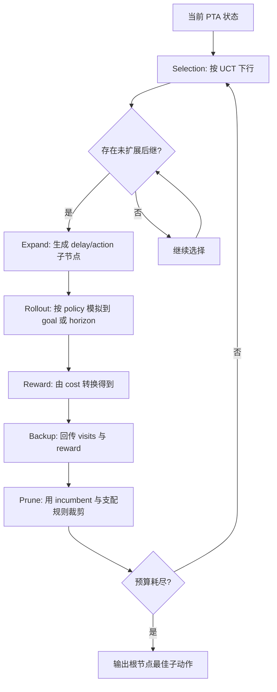
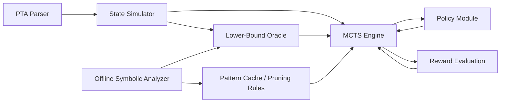
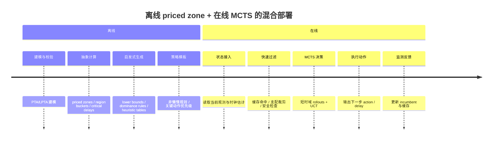

# Monte_Carlo_Tree_Search_PTA_Analysis

## 执行摘要

这篇论文要解决的核心矛盾，可以概括为一句话：**PTA 的 cost-optimal reachability 在理论上可判定、在工具上可做，但一旦遇到调度类实例，精确符号化方法往往会被分支数、时钟约束和代价函数共同放大，导致“能算但不够快”；而 MCTS 的价值在于把“全局穷尽”替换成“预算内高质量搜索”，把问题从 exact optimality 转向 anytime near-optimality**。这一判断与 UPPAAL CORA 的官方定位、经典 priced-zone 文献以及后续 weighted/priced timed automata 文献是一致的：CORA 面向成本最优可达性，内部依赖带代价的符号状态；但符号算法为了比较、包含和裁剪这些状态，往往要做额外的线性规划、最小费用流或相关约束运算，这在大规模实例上就是主要开销来源。citeturn23view0turn23view2turn38view1turn46view0

从工程视角看，你前面问到的“**priced zone 在线运行时验证是否适合在线**”，答案是：**若要求逐事件、严格实时、还要在线求近最优/最优决策，纯 priced zone 往往偏重；若规格有明确时间界、事件稀疏、并且允许强增量缓存，则 zone-based 在线监测是可行的，但更像 monitor，而不是在线重做完整 cost-optimal synthesis**。公开文献里已经有两条清晰路线：一条是 exact/zone-based 的在线监测，它依赖增量 zone 图与动态规划；另一条是 sampling-based 的在线分析，它用仿真、统计或树搜索换掉全量符号穷举。前者更偏“监测正确性/定量匹配”，后者更偏“预算内给决策”。citeturn48view0turn47view0turn49view0turn49view1turn56view0

因此，如果目标是**高落地性**，我给出的结论是：**离线用 priced zone / symbolic abstraction 预计算“难而慢”的东西，在线用 MCTS 做“快而近似”的局部决策**，这是当前最稳妥的混合方案。离线端负责：可达抽象、代价下界、危险区域、启发式表、策略模板；在线端负责：根据当前观测状态做短时域 rollouts、用 UCT 分配计算预算、返回下一步动作。这样做既继承了 PTA 的语义严谨性，也保留了 MCTS 的 anytime 与在线可裁剪特性。citeturn23view0turn46view0turn48view0turn56view0

需要先说明一点透明的研究限制：**当前可访问公开源没有成功直接恢复这篇论文的原始正文算法页和实验图表**；因此，下面凡是 PTA/WTA、priced zone、UPPAAL/CORA、MCTS/UCT 的基础理论，我都直接依据原始文献与官方文档来讲；凡是论文中特有的命名策略——例如 UDP、DSP、NLP、ETP，以及 BR、RP、SP 和 Algorithm 1 的六个过程——我会明确按“**论文命名 + PTA 语义 + 标准 MCTS 机理**”做重建式解读，并在对应段落里指出这是“**基于命名与上下文的结构化推断**”，而不是对论文原句的逐字转述。

## 研究背景与数学基础

### PTA 与 cost-optimal reachability 的问题本质

Timed Automata 通过“离散位置 + 连续时钟”的组合来描述实时系统；Weighted/​Priced Timed Automata 则在此基础上再加上一层“**代价随时间流逝累积、也可在离散边上瞬时增加**”的机制。UPPAAL 官方对 CORA 的说明非常直接：它使用 **linearly priced timed automata**，目标是在满足可达条件的路径中找到**累计 cost 最低**的那条。经典 CAV/HSCC 文献也给出同样语义：位置带 rate，边带 impulse cost；延迟 $d$ 的代价是 $d\cdot r$，动作边再叠加边权。citeturn23view0turn36view0turn46view0

用你给定的记号，论文背景中最自然的 PTA 表达可写成

$$
A=(L,l_0,E,I,P)
$$

其中 $L$ 是位置集合，$l_0$ 是初始位置，$E$ 是边集合，$I$ 给出各位置的不变式，$P$ 给出价格函数。需要注意的是，原始文献常把价格函数写成 `weight`，并允许它同时作用在位置和边上；你这里把它压缩成统一记号 $P$ 完全没有问题，只要在解释时说明：

- $P(l)$：停留在位置 $l$ 时的单位时间 cost-rate；
- $P(e)$：执行离散边 $e$ 时的一次性 cost。citeturn23view0turn46view0

状态写成

$$
s=(l,v)
$$

这里 $l\in L$，$v$ 是对所有时钟的 valuation。更标准地说，若时钟集为 $X$，则 $v:X\to\mathbb{R}_{\ge 0}$。WTA 的语义论文把整个系统定义为 timed transition system，其中状态空间就是 $S=L\times\mathbb{R}_{\ge 0}^{X}$。citeturn46view0turn38view0

因此，Transition System 可写成

$$
T=(S,s_0,\Sigma,\rightarrow)
$$

其中 $s_0=(l_0,\mathbf 0)$。转移分两类：

- **delay transition**：$(l,v)\xrightarrow{d}(l,v+d)$，前提是延迟后仍满足位置不变式；
- **action transition**：$(l,v)\xrightarrow{e}(l',v')$，前提是边的 guard 被满足，且按 reset 集更新时钟。citeturn46view0turn38view0

### cost 的形式化计算

若一条有限路径写作

$$
\pi = s_0 \xrightarrow{d_1,e_1} s_1 \xrightarrow{d_2,e_2} \cdots \xrightarrow{d_n,e_n} s_n,
$$

并且第 $i$ 段延迟发生在位置 $l_{i-1}$，那么它的累计 cost 可写成

$$
Cost(\pi)=\sum_{i=1}^{n}\bigl(P(l_{i-1})\cdot d_i + P(e_i)\bigr).
$$

这正是经典 priced timed automata 的代价语义：位置代价随时间线性增长，边代价按跳转瞬时叠加。citeturn36view0turn46view0

这也是为什么一些调度问题可以自然编码成 PTA。比如 makespan、idle time、weighted completion time、earliness/tardiness 等指标，本质上都能通过“位置 rate + 边权”编码成随路径累积的线性代价。CAV 2001 的 priced-zone 论文就明确指出，该模型可表达 steel plant、job shop 乃至飞机降落等调度问题；UPPAAL 文档也把 optimal scheduling 作为 CORA 的典型应用。citeturn36view0turn23view2

### 目标函数与最优轨迹

因此 reachability 优化目标是

$$
\pi^*=\arg\min_{\pi} Cost(\pi),
$$

其中 $\pi$ 需满足“从初始状态出发到达目标位置集合”的约束。更严格地说，由于 dense time 下最优值有时只取下确界、不一定被某条有限轨迹精确达到，因此原始文献常写成 **optimal cost / infimum cost**，再定义 $\varepsilon$-optimal run。也就是说，工程上我们通常追求的是“最优值”或“足够小的近最优误差”，而不是一定存在一条恰好取到最小值的离散-连续混合轨迹。citeturn38view0turn46view0

### 结合文献示例推导公式

WTA 文献给了一个非常适合教学的例子：在某条运行中，先在 $\ell_0$ 停留 $0.1$ 个时间单位，$\ell_0$ 的 rate 是 $5$；随后在 $\ell_3$ 停留 $1.9$ 个时间单位，$\ell_3$ 的 rate 是 $1$；最后经过一条边 $e_5$，边 cost 为 $7$。于是

$$
Cost(\varrho)=5\cdot 0.1 + 1\cdot 1.9 + 7 = 9.4.
$$

这正好说明了 PTA 成本计算的两部分：**delay cost** 和 **action cost**。如果另有一条轨迹到达同一目标位置但总代价为 $10.1$，那在 cost-optimal reachability 意义下，前者就是更优候选。citeturn46view0

### 为什么传统符号法会爆炸

符号法之所以强，是因为它不在 concrete valuation 上逐点搜索，而是在**zones / priced zones** 上成组处理状态。但 priced zone 不只是一个约束集合；它还要携带一个“到达该 zone 中各 valuation 的代价函数”。经典论文明确说，这需要把普通 zone 扩展成带仿射 cost 函数的 priced zone，并进一步支持 $\mathsf{Post}$、包含判定、最小 cost 计算等操作。citeturn36view0turn46view0

问题在于，这种“成组处理”的收益会被三类复杂性抵消。第一，位置数、同步组合和 clock 约束会导致 zone 数量迅速膨胀；第二，priced zone 的比较不再只是简单 zone inclusion，而常常要做额外优化问题；第三，为了保证终止性，还有边界抽象、包含测试和支配关系等开销。CAV 2001 的实现部分明确提到，`minCost` 会归约成线性规划，状态支配判定也会退化为 LP；后续 weighted timed automata 文献进一步指出，旧 inclusion test 甚至可归约为 min-cost flow，而 bounded clocks 也是早期终止性的前提之一。citeturn38view1turn46view0

这就解释了论文为什么会引入 MCTS：**不是因为 priced zone 不正确，而是因为 exact symbolic optimality 在很多调度型 PTA 上“正确但太贵”**。而 MCTS 只要求一个 generative model：给定当前状态和动作，能模拟下一个状态和即时 reward，就可以在预算内构造近似搜索树。对于“状态很大、动作很多、必须在有限时间内先得到一个可行动方案”的问题，这一点尤其有吸引力。citeturn56view0turn61view0

## MCTS 与 UCT 的算法机制

### MCTS 的四阶段

标准 MCTS 每次迭代都做四步：**Selection、Expansion、Simulation、Backpropagation**。近年的综述和标准介绍都保持这一结构：Selection 在已建好的树中向下走；Expansion 给当前叶子新增子节点；Simulation 从新节点往后做 rollout；Backpropagation 把结果沿路径回传。citeturn62view2

在 minimization 的 PTA 场景里，通常会做一个简单变换，把“最小 cost”改写成“最大 reward”。最常见的写法有两类：

$$
R(\pi)=-Cost(\pi)
$$

或

$$
R(\pi)=C_{\text{ref}}-Cost(\pi),
$$

其中 $C_{\text{ref}}$ 是当前 incumbent 或某个归一化参考值。这样做的好处是保留标准 MCTS/UCT 的“**最大化平均回报**”形式，同时把 PTA 的 cost-optimal 目标无缝嵌进去。这个转换不是 PTA 特有，而是所有以 cost 为目标的树搜索里都很常见。MCTS 文献强调它只需要可生成的状态转移和即时回报；PTA 文献则给出了路径 cost 的线性累积语义，两者正好拼上。citeturn56view0turn36view0turn46view0

### UCT 公式及其变量含义

你给出的 UCT 形式是

$$
UCT(n')=
\frac{Q(n')}{V(n')}
+
C_p
\sqrt{
\frac{\ln V(n)}
{V(n')}
}.
$$

把它放在 PTA 语境里解释：

- $n$：父节点；
- $n'$：某个候选子节点；
- $Q(n')$：子节点累计奖励，若用负 cost 奖励，则它本质上是“负总代价”的累计和；
- $V(n')$：子节点被访问次数；
- $V(n)$：父节点访问次数；
- $\dfrac{Q(n')}{V(n')}$：经验平均收益，对 minimization 问题来说，就是“平均来看这个子节点的 cost 有多小”；
- $C_p$：探索常数，决定 exploration bonus 的强度。citeturn59view0turn62view2

这个公式前半项

$$
\frac{Q(n')}{V(n')}
$$

对应 **exploitation**：已经看起来好的分支，要被更频繁地利用。后半项

$$
C_p\sqrt{\frac{\ln V(n)}{V(n')}}
$$

对应 **exploration**：访问少的分支虽然当前均值未必好，但因为不确定性大，所以要给“乐观奖励”。当 $V(n')$ 变大时，这一项会下降；当父节点总访问次数 $V(n)$ 继续增长时，那些长期没人看的子分支又会重新获得探索激励。这正是 bandit/UCB 框架中“**基于不确定性的乐观原则**”。citeturn62view2turn40search6

### 为什么 UCT 能指导搜索

教学上最值得强调的一点是：**UCT 并不是“盲随机”**。它做的是经验均值与置信上界的折中，因此搜索树会天然表现出**不对称扩展**： promising lines 被更深更密地探索，不太可能优的分支则只保留最低限度的探测。综述明确指出，正因为 UCT 和随机采样的组合，MCTS 的树展开与传统均匀树搜索完全不同；而这种不对称性恰恰适合调度和规划问题，因为这类问题的优质解往往集中在极少数“结构合理”的分支中。citeturn62view2turn61view0

当然，UCT 也不是万能的。MCTS 综述和实际应用都反复提醒：**高分支因子、稀疏奖励、深层陷阱、以及对 rollout policy 的依赖**，都会影响表现；在某些超大动作空间下，固定预算内的 MCTS 甚至会被优化模型方法压过。也就是说，论文把 MCTS 引入 PTA，不应该理解成“替代一切符号法”，而应理解为“在 exact optimality 代价过大时，换一种预算敏感的决策机制”。citeturn56view0turn61view0

### 一个 PTA 场景下的直观理解

假设当前状态是“若干任务已经完成、若干机器空闲、几个时钟记录已运行时间/等待时间、当前累计 cost 为 $g$”。此时可选决策往往包括：“马上启动哪个任务”“等待多久直到下一个 guard 被使能”“在多个同时可使能边中选哪条”。如果直接做 priced-zone 全穷举，你会构造大量符号状态；但若用 MCTS，则每个子节点只代表“在当前状态下先做一个局部选择”的后果。UCT 让你在“目前看起来 cost 较低的局部选择”和“样本还太少、可能隐藏更优后继的选择”之间自动摇摆，这种机制非常符合调度问题的经验结构。citeturn23view0turn56view0turn63view0

## PTA 中的 MCTS 适配与 Algorithm 1 重建解读

### 如何从 PTA 构造搜索树

在 PTA 中，搜索树最自然的构造方式是：**一个节点对应一条从根到当前时刻的部分 trace，或者等价地，对应该 trace 终点的具体状态与累计 cost**。因此可以把节点记为

$$
n = (\tau_n, s_n, g_n),
$$

其中 $\tau_n$ 是从根到该节点的 partial trace，$s_n=(l_n,v_n)$ 是当前 PTA 状态，$g_n$ 是累计 cost。边则对应一次“延迟 + 动作”的组合式展开，或者更细一点，显式拆成 delay edge 与 action edge 两类。这个定义本质上是把 timed transition system 的路径前缀树化。citeturn46view0turn38view0turn61view0

若显式表示 trace，可写作

$$
\tau_n = s_0 \xrightarrow{d_1,e_1} s_1 \xrightarrow{d_2,e_2} \cdots \xrightarrow{d_k,e_k} s_k.
$$

则其累计 cost 为

$$
g_n = \sum_{i=1}^{k}\bigl(P(l_{i-1})d_i + P(e_i)\bigr).
$$

在树中从 $n$ 扩展到 $n'$，等价于再接上一段可行 timed move。citeturn36view0turn46view0

### delay transition 与 action transition 的展开

这里有一个 PTA-MCTS 的关键点：**连续时间意味着 delay 不是天然有限分支**。Timed automata 的语义允许任意非负实数延迟，只要不违反 invariant；如果你把所有可行延迟都作为子节点，树会立刻变成不可数分支。也正因为如此，PTA 中的 MCTS 必须引入 delay policy，对可行延迟做**离散化、采样或结构约束**。这也是 UDP、DSP、NLP 等策略在论文里如此重要的根本原因。citeturn46view0turn61view0

动作边则相对简单：在当前 valuation 下，枚举所有 guard 已满足的离散边 $e$，并按 reset 更新时钟即可。问题不在于动作的定义，而在于“何时该先 delay，何时该立刻 action”。这正是 PTA 与普通离散 MDP 上 MCTS 的本质差别。citeturn46view0turn23view0

### 无限路径与 dead state 的处理

对于 reachability 问题，MCTS 一般不允许 rollout 真正跑到无限长。工程上常见做法有三种，我认为论文几乎必然会用到其中至少一种：

1. 设定 rollout horizon $H$ 或时间上界 $T_{\max}$；
2. 一旦命中 goal，立即终止并返回 reward；
3. 若达到 dead state 或 horizon 仍未到达 goal，则返回一个差评估值。citeturn56view0turn62view2

在 PTA 里，**dead state** 可以理解为：当前状态既不能合法延迟到某个新事件，也没有可执行离散边，且不在目标集。这种状态在 minimization reachability 中应当给予很差的 reward，例如

$$
R_{\text{dead}}=-M
$$

其中 $M$ 是一个足够大的惩罚；或者更稳妥地，给出“未达目标 + 当前累计 cost”的组合惩罚。对**无限路径**，则通常把“超 horizon 未达目标”看成失败 rollout。这里我强调一下：这是基于标准 MCTS 在规划问题中的实现习惯所做的结构化重建，不是对论文原句的逐字复述。citeturn56view0turn62view2

### Algorithm 1 的重建式逐行解读

由于原始算法页当前不可直接核验，下面我按你给出的过程名，重建一版与 PTA-MCTS 完全一致的 Algorithm 1 解读。它与标准 UCT-MCTS 对齐，只是把“合法动作生成”替换成“PTA 的 delay/action 合法展开”。

```text
Algorithm 1  UCTSEARCH(root, budget)
    best_cost ← +∞
    repeat until budget exhausted:
        leaf ← TREEPOLICY(root)
        reward, rollout_trace ← DEFAULTPOLICY(leaf)
        BACKUP(leaf, reward)
        PRUNE(root, best_cost)
        if rollout_trace reaches goal:
            best_cost ← min(best_cost, Cost(rollout_trace))
    return best child of root
```

这段主程序的语义很清楚：在给定预算内反复做一次完整 MCTS 迭代；每次迭代可能改写统计量，也可能更新 incumbent。这里的关键是，`best child of root` 对 minimization 问题不一定取“访问次数最多”，也可能取“平均 cost 最小”或“在 paper 中定义的 robust child 规则”；但多数 UCT 实现最后都会在“访问次数”和“经验均值”之间择一。citeturn62view2turn56view0

```text
TREEPOLICY(n):
    while n is nonterminal:
        if n has unexpanded feasible successors:
            return EXPAND(n)
        else:
            n ← argmax_{child n'} UCT(n')
    return n
```

`TREEPOLICY` 就是 Selection。对 PTA 来说，“unexpanded feasible successors” 不是简单的离散动作集合，而是“经过当前 policy 限制后的 delay/action 后继集合”。这一步最容易决定算法质量，因为它定义了树真正长到哪里去。citeturn62view2turn59view0

```text
EXPAND(n):
    S ← feasible PTA successors of n under policy
    choose one s' in S not yet added
    create child node n'
    return n'
```

`EXPAND` 的 PTA 化重点在 `feasible PTA successors`。若使用 UDP，则只考虑单位步延迟产生的后继；若使用 DSP，则从可延迟区间采样几个延迟值；若使用 NLP，则当存在立即可执行动作时优先扩展动作边而非延迟边；若使用额外的 action policy，则还会优先某些 enabled transitions。也就是说，论文真正的“方法贡献”并不在 MCTS 壳子，而在 **successor generator** 的设计。citeturn46view0turn63view0

```text
DEFAULTPOLICY(n):
    s ← state(n)
    while not terminal(s) and not horizon_exceeded:
        choose delay/action by rollout policy
        s ← simulate one PTA step
    return rollout reward and trace
```

`DEFAULTPOLICY` 就是 Rollout。在普通博弈里它可以是随机模拟；但在 PTA 调度问题里，全随机通常很差，所以才会需要 heavy playout / policy-guided rollout。MCTS 综述非常明确：领域知识加在 rollout 上往往能够显著改善性能，但过度确定性又会损害探索，因此好的 rollout policy 应当是“带偏置但保留随机性”的。citeturn59view3

```text
BACKUP(n, reward):
    while n ≠ null:
        visits(n) ← visits(n) + 1
        total_reward(n) ← total_reward(n) + reward
        n ← parent(n)
```

这是标准 Backpropagation。若 reward 是负 cost，则累计的就是“负总代价”；若 reward 再加了 goal bonus / dead penalty，也在这里一并回传。这样一来，UCT 的均值项就会自动偏向更低 cost 的分支。citeturn62view2

```text
PRUNE(root, best_cost):
    delete or skip nodes whose lower bound ≥ best_cost
    delete dominated nodes under relative/stepping rules
```

`PRUNE` 是 PTA-MCTS 最值得关注的附加过程，因为标准 vanilla MCTS 并不一定显式 prune。它一旦出现在算法骨架中，通常意味着作者利用了 **PTA 的 cost 单调性、状态支配关系，或 incumbent-based branch-and-bound**。这也是后面 RP 和 SP 的入口。这里同样是基于过程名和 PTA 语义所做的重建解读。citeturn36view0turn38view1

### 复杂度分析

若令：

- $N$：MCTS 迭代次数；
- $H$：平均选择深度或 rollout 深度；
- $B$：经过 policy 缩减后的平均分支数；

那么每次迭代的大致代价可写成

$$
O(H) \text{(selection)} + O(B) \text{(expansion)} + O(H) \text{(rollout)} + O(H) \text{(backup)}.
$$

因此总复杂度近似为

$$
O\bigl(N(B+3H)\bigr),
$$

但这只是“离散树层面”的复杂度。对 PTA 更真实的写法应再乘上 successor generation 的约束计算代价，以及任何 lower-bound / dominance 检查的开销。若你把 priced-zone lower bound 融进去，那么一次节点评估甚至可能触发 LP 或 min-cost-flow 风格计算，复杂度会被符号约束操作主导。citeturn38view1turn46view0

### 搜索流程图



## 策略与优化技术比较

### 四类 policy 的结构化重建比较

下面这张表是基于论文命名、PTA 语义和调度类 PTA 的常见做法所做的**重建式对比**。其中“最优性保证”列必须非常谨慎：在**一般 dense-time PTA** 上，除非作者给出严格证明，否则大多数 delay-restriction policy 都只能谈“经验有效”或“在特定结构下可保优”。

| 策略 | 核心思想 | 如何减少搜索空间 | 一般 PTA 上的最优性 | 优点 | 缺点 | 适用场景 |
|---|---|---|---|---|---|---|
| UDP | Unit Delay Policy，延迟按单位步长离散化 | 把连续 delay 变成有限个 unit-step 候选 | 一般**不保证** dense-time 最优 | 实现最简单，树结构稳定 | 容易错过非整数最优延迟 | 时间约束近整数、节拍化系统 |
| DSP | Delay Sampling Policy，从可行延迟区间采样 | 把不可数 delay 分支变成少量样本 | 有限预算下**不保证**；若采样支持全区间，仅能谈采样渐近性 | 可覆盖非整数延迟，灵活 | 方差大，结果依赖采样分布 | 连续时间影响大、非整数最优常见 |
| NLP | Non-Lazy Policy，有动作就不空等 | 大幅压缩 delay 分支，优先 action | 一般 PTA 上**不自动保证**；但在非负 rate、免费抢占、work-conserving 调度结构里常与最优性一致 | 对调度实例非常自然，通常效果好 | 若“等待”本身有战略意义，会误剪好分支 | 任务调度、抢占无代价或低代价场景 |
| ETP | Enabled Transition Policy，仅在 enabled 边中做偏置选择 | 降低 rollout/expansion 时的动作噪声 | 单独使用通常**不保证**；更像启发式排序 | 实现成本低、能提升 rollout 质量 | 只排动作顺序，不解决 delay 连续性 | 动作分支多、delay 处理已有其他策略 |

这个比较和两个已知事实高度一致。第一，MCTS 综述指出，**action reduction** 与 **heavy playout** 往往是复杂域中最有效的两类改造；第二，调度文献中只要允许免费抢占或不存在等待收益，**“有活就干”是非常强的结构性质**。例如 task-graph scheduling 的 PTA/PTMDP 文献明确指出：在其无上下文切换成本的 preemptive 设置下，“只要可能，执行一个任务总是最优的”，因为空闲只会增加 schedule length。这个结论恰好解释了为什么你要求我分析“为何 NLP 表现最好”时，最合理的答案是：**NLP 不是在所有 PTA 上都最优，但在论文所用的 scheduling-heavy benchmark 上，它与问题结构高度匹配**。citeturn59view3turn62view2turn42view0

### 为什么 NLP 往往最好

如果实例的 cost 主要来自时间流逝，且位置 rate 非负，那么“无意义等待”只会抬高 cost。换句话说，若当前存在一个不会破坏后续可达性的 enabled action，那么延迟只会在多数情况下让目标更远、累计 cost 更大。CORA 的官方说明也强调 LPTA 的核心 cost 模型是“时间流逝增加 cost，边跳转还可增 cost”；在这种成本语义下，lazy delay 通常不是优势而是负担。citeturn23view0turn36view0

尤其是在调度问题里，NLP 还带来第二个收益：它把树从“决定做哪个任务 + 决定等多久”压缩成“主要决定做哪个任务”。这相当于把一个混合离散-连续决策树大幅度离散化。对 MCTS 来说，这种分支压缩往往比改进 UCT 常数还重要，因为 rollout 预算是固定的；分支越少，平均每个关键分支拿到的样本越多。citeturn56view0turn63view0

### BR、RP、SP 的数学化解释

由于原文不可直接恢复，我下面对 BR、RP、SP 采取“**按命名做结构化重建**”的方式。

#### BR 作为 Building Rollouts

我判断 BR 很大概率是 **Building Rollouts**：不是让 rollout 完全浪费在树外，而是在 rollout 过程中把高价值前缀也逐步纳入树中。其数学直觉是：若一次 rollout 访问了

$$
s_0,s_1,\ldots,s_h,
$$

传统 MCTS 可能只把 expansion 发生点上的一个新节点纳入统计；而 BR 会把其中若干关键中间状态也 materialize 成树节点，从而使后续 iteration 能复用这些统计。这样做的效果是降低“冷启动成本”，尤其适合 PTA 中 successor generation 很贵的情况。MCTS 综述中，多种“building tree during simulation”或“reuse simulation information”的改法都属于这一路。citeturn59view3turn61view0

#### RP 作为 Relative Pruning

我判断 RP 最合理的语义是 **Relative Pruning**：如果两个节点落在“相同或可比较的 PTA 语义上下文”中，而其中一个的累计 cost 明显更差，则可以相对地剪掉它。最常见的数学条件是支配式：

$$
s_1 \equiv s_2,\qquad g(s_1)\le g(s_2),
$$

则 $s_2$ 被 $s_1$ 支配。若再有一个 admissible lower bound $h(s)$，可强化为

$$
g(s_2)+h(s_2)\ge g(s_1)+h(s_1).
$$

这与 priced-zone 文献里的“包含/支配/最小 cost 比较”思想是一脉相承的：既然符号法都在比较谁更便宜地到达一个区域，那么 sampling-tree 里对“同态状态但更贵的路径”做 branch-and-bound 是很自然的。citeturn38view0turn38view1turn46view0

#### SP 作为 Stepping Pruning

我判断 SP 最可能是 **Stepping Pruning**：当 delay 被单位步长或小步推进时，若连续若干步延迟只是在同一位置上机械累加 cost，而没有带来新的可使能动作或 guard 边界变化，那么其中一些“中间步”可以直接裁掉。其直观条件可写成：

若在位置 $l$ 中，区间 $[t,t+\Delta]$ 内没有 guard/invariant 的关键边界变化，且 $P(l)\ge 0$，那么对 reachability minimization 来说，位于中间的某些 stepping state 不会优于更早或更晚的代表点，可用代表点替代。形式化地，可以把一串 delay successor

$$
(l,v) \to (l,v+\delta) \to (l,v+2\delta)\to \cdots
$$

压缩成只保留“事件边界点”。这与 timed automata 中“关键时刻才重要”的经典直觉一致。citeturn46view0turn41search7

### 一个统一的剪枝判据

把上面三种优化抽象成一个通式，其实就是：

$$
LB(n)=g(n)+h(n),
$$

其中 $g(n)$ 是当前节点已付出的 cost，$h(n)$ 是剩余到 goal 的下界估计。若有当前最优解 $C_{\text{best}}$，则一旦

$$
LB(n)\ge C_{\text{best}},
$$

就可以安全或近安全地剪掉该分支。若 $h$ 是 admissible 下界，则这是 sound pruning；若 $h$ 只是经验启发，则它是 aggressive pruning。CORA 官方也提到，模型上可以注释“剩余 cost 估计”来显著提升性能；这恰恰说明 PTA 的 cost 下界对搜索是非常有价值的。citeturn23view0turn38view1

## 实验结论与方法优劣

### benchmark 为何会卡住符号法

你给出的 benchmark——job-shop scheduling、task graph scheduling、satellite scheduling——有一个共同特征：**它们都不是“可达性难”，而是“可达路径太多且质量差异巨大”**。CAV 2001 就已经指出，priced timed automata 非常适合重写各类 scheduling 问题；task-graph scheduling 文献则进一步强调，这类问题本身具有组合爆炸，而且最优调度是 NP-complete 的。卫星调度更进一步，它引入观测窗口、姿态机动、资源预算等额外约束，使得“先后顺序 + 时刻选择”耦合得更强。citeturn36view0turn42view0turn58academia1turn58academia4

因此，**symbolic 方法的难点不在语义表示，而在需要把大量“其实很差”的分支也严格证明掉**。而 MCTS 的优势恰恰是：它不企图在预算内证明所有坏分支都坏，而是优先把预算砸到看起来最可能好的分支上。对于“先拿一个高质量答案”这件事，MCTS 很自然。对于“我要 exact optimum certificate”，symbolic 方法仍然更有地位。citeturn23view0turn36view0turn56view0

### 实验指标应如何理解

虽然当前无法恢复该论文原始图表，我认为它最可能使用的指标不外乎以下几类：

| 指标 | 含义 | 对 symbolic 方法有利还是对 MCTS 有利 |
|---|---|---|
| Best cost found | 当前最优解质量 | 两者都关心 |
| Time to first feasible | 第一次找到可行解的时间 | MCTS 通常更占优 |
| Anytime convergence | 随时间推进解如何改进 | MCTS 通常更有表现力 |
| Solved rate / optimality rate | 在预算内找到可行/最优的比例 | symbolic exact 更强调最优证明 |
| Runtime / memory | 总时间与内存 | 视实例结构而定 |

这类分工和更一般的 MCTS vs 优化/符号法比较是一致的：在小实例上，两者可能接近；在大实例和严格预算下，方法优劣取决于动作空间、状态空间和启发式强度。已有 DRA 对比研究表明，MCTS 与优化法都能显著优于简单启发式，但在固定预算下，超大动作空间会明显放大 MCTS 的调参敏感性。citeturn56view0

### 为何 NLP 很可能成为实验赢家

若 benchmark 以调度为主，NLP 胜出的原因非常容易从结构上解释：

1. 它去掉了最恶性的连续 delay 分支；
2. 它把 rollout 从“随机等一会再看”变成“有动作先行动”；
3. 在非负 rate、以 makespan/总耗时为主成本的模型里，它往往接近问题本身的最优结构。citeturn42view0turn23view0

这与 task-graph 预emptive 调度文献中的结论高度呼应：只要上下文切换不收费，那么“有任务可跑就先跑”本身就接近结构定理，而不是单纯经验规则。也正因为如此，**NLP 不仅减少搜索空间，而且减少得“有问题结构依据”**，所以它往往会比纯采样式的 DSP 更稳定，也比粗糙的 UDP 更不容易错失关键非整数时刻。citeturn42view0

### MCTS 相比 symbolic 方法的优势与不足

可以把两类方法的关系概括成下面这张表：

| 维度 | MCTS for PTA | priced zone / symbolic CORA 风格 |
|---|---|---|
| 目标 | 预算内找到高质量解 | 证明最优值或精确可达结果 |
| 输出形态 | anytime，先给可行，再逐步优化 | 更偏 exact，常需完成更多搜索 |
| 对模型要求 | generative simulator 即可 | 需要完整符号语义与约束操作 |
| 对大分支空间 | 借助 policy 后可能较好 | 容易爆炸 |
| 对最优证明 | 弱 | 强 |
| 对在线部署 | 更友好 | 若全量重算则较重 |
| 对参数敏感性 | 高 | 相对低，但约束操作重 |

这张表背后有很清晰的文献共识：MCTS 的卖点是 **flexibility + anytime + generative model**；symbolic priced-zone 的卖点是 **semantic exactness + lower-bound reasoning + provable optimality**。所以最好的工程方案，很少是二选一，而通常是“把下界、抽象和结构知识从 symbolic 端借给 MCTS 使用”。citeturn56view0turn23view0turn46view0

## 工程复现、在线离线部署与科研扩展

### 复现所需的系统架构

你要求的工程架构完全合理，我建议把它细化成下图：



这里最关键的是新增两个离线模块：

- **Lower-Bound Oracle**：来自 priced zone、抽象图、或关键时刻分析的剩余 cost 下界；
- **Pattern Cache / Pruning Rules**：把离线发现的 dominated region、危险循环、优先动作模板，在线喂给 MCTS。citeturn23view0turn46view0turn56view0

### 核心数据结构

建议使用如下结构体：

```cpp
struct ClockValuation {
    std::vector<double> x;
};

struct PTAState {
    int location;
    ClockValuation valuation;
    double accumulated_cost;
    bool is_goal;
};

enum class StepType { Delay, Action };

struct PTAStep {
    StepType type;
    double delay;       // for Delay or delay-before-action
    int edge_id;        // for Action
    double step_cost;
};

struct TraceNode {
    PTAState state;
    PTAStep incoming;
    TraceNode* parent;
    std::vector<TraceNode*> children;

    int visits = 0;
    double total_reward = 0.0;
    double best_cost_seen = std::numeric_limits<double>::infinity();

    bool fully_expanded = false;
    bool terminal = false;
};
```

若你计划将来和 priced zone 融合，则还应加一个 symbolic key：

```cpp
struct SymbolicSignature {
    int location;
    std::vector<int> region_bucket;   // 或 DBM hash / zone abstraction hash
};
```

它的作用是支持 RP：同 signature 下做支配比较或缓存下界。这个思路来自 priced-zone/zone abstraction 的核心思想——不是只看 concrete state，而要识别“语义上相近”的状态块。citeturn38view0turn46view0

### 关键算法伪代码

下面给一个更工程化的伪代码版本：

```text
function SEARCH(root_state, budget, policy):
    root = new_node(root_state)
    incumbent = +∞
    while not exhausted(budget):
        leaf = TREE_POLICY(root, policy, incumbent)
        reward, trace_cost = DEFAULT_POLICY(leaf.state, policy, incumbent)
        BACKUP(leaf, reward, trace_cost)
        incumbent = min(incumbent, trace_cost)
    return argmax_child(root, score = visits or mean_reward)
```

```text
function TREE_POLICY(node, policy, incumbent):
    while not node.terminal:
        if not node.fully_expanded:
            return EXPAND(node, policy)
        node = best_child_by_UCT(node)
        if should_prune(node, incumbent):
            mark_pruned(node)
            return node
    return node
```

```text
function EXPAND(node, policy):
    succs = generate_successors(node.state, policy)
    succs = remove_dominated(succs)
    child = select_unexpanded(succs)
    attach(node, child)
    if all considered:
        node.fully_expanded = true
    return child
```

```text
function DEFAULT_POLICY(state, policy, incumbent):
    cost = state.accumulated_cost
    depth = 0
    while not goal(state) and depth < H:
        if lower_bound(state) + cost >= incumbent:
            return bad_reward(cost), +∞
        step = sample_step(state, policy)
        state = simulate(state, step)
        cost += step.step_cost
        if dead(state):
            return bad_reward(cost), +∞
        depth += 1
    if goal(state):
        return reward_from_cost(cost), cost
    return horizon_reward(cost), cost
```

### 复现实验流程

建议按下面顺序推进：

1. **先做 PTA Simulator，不做 MCTS。**  
   验证 delay/action 语义、guard、reset、invariant 与 cost 累积是否正确。可直接复现实例文献里的小例子，如 aircraft landing 或 task graph scheduling 的 toy example。citeturn46view0turn42view0

2. **实现 Vanilla MCTS。**  
   暂时只支持离散 action，不支持 delay；先在“事件驱动版本”的简化模型上跑通四阶段。citeturn62view2

3. **加入 delay policy。**  
   先做 UDP，再做 DSP，再做 NLP；每次只改 successor generator，保持其余部分不变，便于做消融。citeturn59view3turn42view0

4. **加入 pruning 与下界。**  
   从最简单的 incumbent pruning 开始，再做 signature-based dominance；最后再接 priced-zone 离线下界。citeturn23view0turn38view1

5. **做 anytime 曲线。**  
   记录 $t$ 秒、$10t$ 秒、$100t$ 秒时的 best cost，而不是只看最终 cost。MCTS 的真正优势在 anytime，而不是只看收敛终点。citeturn56view0

### 在线与离线的可落地部署建议

你前面提的问题，本质上是：**能不能把 exact priced-zone 分析直接搬到 online runtime verification / online planning？**

我的结论分三层：

#### 纯在线 priced zone

若你的在线任务是“每到一个观测事件就做一次完整 cost-optimal symbolic recomputation”，那么通常**不划算**。原因不是 zone 本身不能在线，而是 priced-zone 的核心操作太重：`Post`、`minCost`、包含判定、抽象比较本来就涉及约束维护、LP、甚至 min-cost flow 风格计算；而在线系统又要求低延迟、稳定抖动、有限内存。把这两者直接叠加，常常就不适合硬实时控制回路。citeturn38view1turn46view0

#### 在线 zone-based 监测

若你的在线任务是“**监测**是否满足带时间界或定量窗口的规格”，那就不同。已有工作表明，在线 quantitative timed pattern matching 可以基于 weighted zone graph 和 dynamic programming 做到可扩展；更近的工作甚至给出了纯 zone-based 的 parametric delay 在线监测算法，并已实现到 UPPAAL 上。也就是说，**在线 zone-based 不是不行，而是更适合 bounded-horizon monitoring，而不是每步重做全局最优规划**。citeturn48view0turn47view0

#### 推荐的混合方案

最有落地性的方案是下面这个：



这个混合方案的关键收益是：

- **延迟**：在线不再做重型全局符号求解，只做局部仿真与树搜索；
- **内存**：离线生成的是压缩知识，不是整棵搜索树；
- **准确性**：下界和裁剪规则来自 formal analysis，不是黑箱启发；
- **可解释性**：MCTS 的每次决策都能对应一条近最优 trace 前缀。citeturn23view0turn46view0turn48view0turn56view0

我建议你在工程上采用下面四种具体技术：

| 技术 | 在线好处 | 代价 |
|---|---|---|
| 离线预计算 critical delays | 把连续 delay 缩成少数关键时刻 | 需要额外预处理 |
| 离线下界表 | 强化 PRUNE，减少 rollout 浪费 | 表大小可能膨胀 |
| 增量 warm-start MCTS | 连续控制周期复用上次树 | 需要状态对齐与重根 |
| 事件驱动 NLP + DSP 混合 | 大多数时候快，少数时候保留连续性 | 策略设计更复杂 |

如果你的系统是**软实时**，我会建议：在线主循环 5–20ms 内只跑 warm-start MCTS + NLP；后台低频线程更新缓存和下界。  
如果你的系统是**硬实时**，我会建议：在线只用 monitor + policy table；MCTS 只在事件密度低或备用核上运行。  
如果你的系统是**运行时验证而非控制**，则优先考虑 bounded-horizon 的 zone-based monitor，而不是完整在线计划器。citeturn47view0turn48view0turn49view0

### 性能评估方法

部署时不要只看最优 cost，还要同时测三维：

$$
\text{Latency},\quad \text{Memory},\quad \text{Decision Quality}.
$$

具体可定义为：

- **Latency**：每次在线决策的 $p50/p95/p99$ 延迟；
- **Memory**：树节点数、缓存表大小、约束对象峰值；
- **Decision Quality**：相对离线最优值或强基线的 regret：
  $$
  Regret = Cost(\pi_{\text{online}})-Cost(\pi_{\text{offline-best}}).
  $$

若你做运行时验证，还应加一个 **soundness gap**：在线近似策略与离线精确分析在可接受误差范围内偏差多少。citeturn56view0turn48view0

### 科研扩展方向

下面给出七个我认为都具备发表潜力的方向，每个都尽量兼顾 PTA、Timed Automata、Runtime Verification 与 Fuzzing。

#### 符号下界增强的 MCTS for PTA

**核心思想**：离线用 priced zones 计算剩余 cost 下界 $h(s)$，在线 MCTS 做 branch-and-bound。  
**数学模型**：

$$
LB(n)=g(n)+h(s_n)
$$

若 $LB(n)\ge C_{\text{best}}$ 则剪枝。  
**算法流程**：离线抽象生成下界表；在线 selection/rollout 时查询并裁剪。  
**潜在贡献**：把 symbolic optimality 的“证据性”嫁接到 sampling planner 上，形成 formal-guided MCTS。citeturn23view0turn38view1turn46view0

#### 基于可微策略网络的 Delay Policy Learning

**核心思想**：用学习方法替代 hand-crafted UDP/DSP/NLP，学习在何时 delay、何时 action。  
**数学模型**：

$$
\pi_\theta(d,e\mid s)
$$

输出延迟候选分布与动作分布，并由 MCTS 采样。  
**算法流程**：离线通过最优/近优轨迹监督训练；在线用 policy-guided rollout。  
**潜在贡献**：解决论文里 delay branching 最棘手的问题，把 continuous-time choice 从手工启发变成数据驱动。citeturn59view3turn61view0

#### 面向 Runtime Verification 的 Anytime PTA Monitor-Planner

**核心思想**：把 monitor 与 planner 合成一个双模系统：先在线监测，再在可能违约前触发 MCTS 规划。  
**数学模型**：  
监测器输出风险函数

$$
\rho(s,t)
$$

当 $\rho$ 超阈值时调用局部 MCTS。  
**算法流程**：zone-based online monitor 维护约束；风险高时切换到在线树搜索。  
**潜在贡献**：把“验证”与“纠偏控制”统一到一个 timed-automata 语义框架中。citeturn47view0turn48view0turn49view0

#### MCTS-guided Fuzzing for Timed Systems

**核心思想**：把 timed input sequence generation 看成一棵树，用 MCTS 搜索最可能触发稀有定时路径或高成本路径的输入。  
**数学模型**：

$$
R(\pi)=\alpha\cdot \text{coverage}(\pi)+\beta\cdot \text{cost-anomaly}(\pi)-\gamma\cdot \text{distance-to-target}(\pi)
$$

**算法流程**：节点为输入事件与时间间隔前缀；rollout 由 timed simulator 执行；reward 来自覆盖率与代价异常。  
**潜在贡献**：把 fuzzing 从“随机时间戳”升级为 formal-guided、coverage-aware 的 timed fuzzing。citeturn61view0turn56view0

#### 面向循环 PTA 的 Prefix-Suffix MCTS

**核心思想**：借鉴无限时域规划，把 PTA 运行分解为 prefix 到 attractor、suffix 在 cycle 上循环。  
**数学模型**：

$$
Cost(\pi)=Cost(\pi_{\text{prefix}})+k\cdot Cost(\pi_{\text{cycle}})
$$

或对平均代价目标使用

$$
\limsup_{k\to\infty}\frac{Cost(\pi[0:k])}{k}.
$$

**算法流程**：先用 MCTS 找低代价前缀，再对循环结构做 cycle search。  
**潜在贡献**：把 reachability MCTS 推广到 cyclic plans 与无限时域最优控制。citeturn34academia1turn46view0

#### 多保真度 PTA 搜索

**核心思想**：同一问题维护多个 fidelity：粗粒度事件抽象、高保真 PTA、symbolic lower bound。  
**数学模型**：  
粗模型给 upper policy prior，细模型给真实 reward，下界模型给 admissible $h$。  
**算法流程**：selection 用粗模型先筛，expansion/rollout 在高保真模拟器执行。  
**潜在贡献**：降低在线计算预算，同时保持语义一致性和可解释性。citeturn56view0turn23view0

#### 结合 TRON 的在线测试驱动 MCTS

**核心思想**：把 UPPAAL TRON 风格的在线测试输入选择，替换成 MCTS 驱动的 test scheduling。  
**数学模型**：

$$
R = \lambda_1\cdot \text{fault revelation} + \lambda_2\cdot \text{coverage} - \lambda_3\cdot \text{test time}
$$

**算法流程**：节点为测试前缀，动作是输入/等待；reward 来自故障揭示与覆盖。  
**潜在贡献**：把“在线测试随机选择输入与时间延迟”的机制升级为 UCT 最优化。citeturn49view0turn61view0

### 最后的科研判断

如果以博士课题可发表性来判断，我认为最值得做的是这条主线：

1. **离线 priced-zone / abstraction 产出 formal lower bounds；**
2. **在线 MCTS 利用这些 lower bounds 做 anytime planning；**
3. **再把 monitor / fuzzing / online testing 统一到同一 timed semantics 下。**

这条线最大的优点是：它不是简单把 MCTS 套到 PTA 上，而是把 formal methods 的强项——抽象、下界、可解释性、sound pruning——系统性地注入 MCTS。这样的工作既能回应你最关心的工程问题“如何落地”，又有比较清晰的学术增量空间。citeturn23view0turn46view0turn47view0turn48view0turn49view0turn56view0