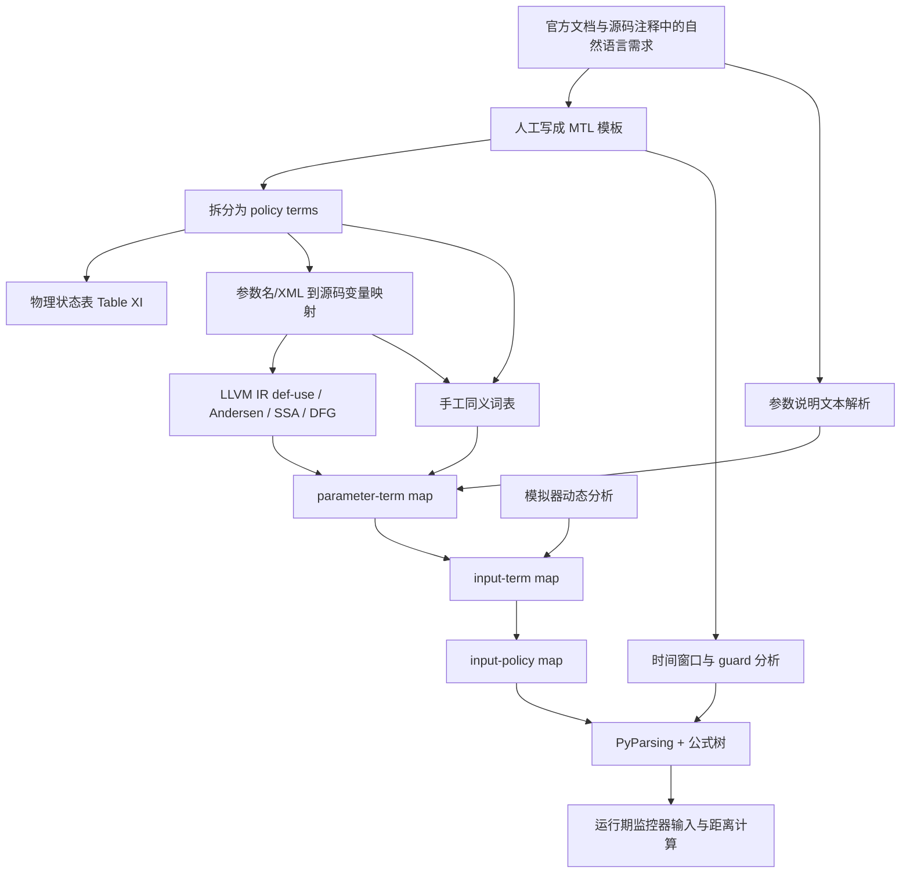

# PGFuzz 论文中 MTL 族公式的 AP 提取与源码绑定分析

## 执行摘要

本文基于 PGFuzz 论文《Policy-guided fuzzing for robotic vehicles》、作者公开仓库 `purseclab/PGFuzz`、ArduPilot 官方文档/源码与 PX4 官方文档/源码，对论文中全部 **ArduPilot 30 条**与 **PX4 21 条** MTL/MTL-like 公式做了“去严格时间度量”的 AP 绑定分析。核心结论是：**论文中的“性质”主要是人工从官方文档与源码注释中抽取，再手工拆成 terms/AP，作者随后用一套“文档映射 + LLVM 静态分析 + 同义词表 + 动态影响分析 + 运行期代理信号”的工作流，把这些 AP 连接到 MAVLink 可观测字段、参数和值域上**；但在公开仓库中，**并不是每一条公式都存在完整、显式、可复用的“AP→源码变量”实现**，很多绑定只体现在“策略目录里的输入集合”“单策略硬编码监控器”“STATUSTEXT 文本代理变量”里，而不是直接映射到 ArduPilot/PX4 内部状态位。citeturn24view0turn24view1turn25view0turn25view2turn18view0turn19view0turn30view0

对你最关心的“**这个性质文中是怎么提取的**”这一点，论文写得很明确：作者先**人工识别自然语言安全需求**并写成 MTL；然后手工建立物理状态表（Table XI），其中 **S1–S5 来自 MAVLink 遥测，S6 来自解析车辆 ACK/状态文本**；再把每个 policy 拆成 terms，利用 **参数 XML/手册到源码变量的映射、LLVM IR def-use 链、Andersen 指针分析、SSA/DFG、手工同义词表、以及基于仿真的动态影响分析**，最终得到“某个 policy 该变异哪些输入、监控哪些 AP”。因此，**AP 提取不是从公式自动“反向挖出”源码变量，而是“需求→terms→同义词/文档/源码/遥测代理”的半人工、半自动流程**。citeturn24view1turn25view0turn25view1turn25view2turn43view0

从仓库实现看，作者主分支并没有把 51 条 ArduPilot/PX4 公式全部生成成统一监控器；相反，仓库采用的是“**每次手动选一个 Current_policy**”的工作方式，README 还明确要求新增 policy 时手工修改 `fuzzing.py` 里的谓词与 `Current_policy`，这说明论文里关于“从公式到监控器代码片段”的自动生成能力，在公开仓库里只部分暴露，且主要以示例和单策略实现呈现。对复现实验而言，这意味着：**论文可解释，仓库可跑，但想得到每条公式的精确 AP 绑定，仍然需要二次溯源到 ArduPilot/PX4 官方实现。** citeturn18view0turn19view0turn15view0turn30view0

## 证据基础与分析方法

本报告使用的主证据链包括四类。第一类是论文正文与附录，特别是 **Section V-A“Pre-Processing”**、**Table XI 物理状态表**、**Figure 3/4/13** 与 **Table XII 全部 policy 公式**。第二类是作者仓库 `purseclab/PGFuzz` 中 ArduPilot/PX4 目录下的 `README.md`、`fuzzing.py`、`update_distance.py`、各 `policies/*` 目录内的 `cmds.txt` / `envs.txt` / `parameters.txt` / `preconditions.txt`。第三类是 ArduPilot 官方文档与官方源码。第四类是 PX4 官方文档、uORB 消息文档与官方源码/参数文档。citeturn24view0turn25view0turn43view0turn18view0turn15view0turn16view0turn17view0turn46search0turn46search1turn46search2turn46search3turn46search4turn42search0turn41search0turn41search2turn26search7turn27search0turn45search0

需要先说明两个版本层面的事实。其一，PGFuzz 的 ArduPilot README 明确建议测试一个历史提交 `ea559a56aa2ce9ede932e22e5ea28eb1df07781c`，这说明论文实验面向的是一个历史版本，而不是今天的 `master`/`main`。其二，论文附录中的 policy 与仓库目录命名并不总是一一同名，例如论文是 `A.CHUTE1`，仓库目录是 `A.CHUTE`；论文把 `A.CIRCLE4/5/6` 分开列，仓库把它们合并成 `A.CIRCLE4_6`；论文有 `A.FLIPGeneral`，仓库目录则呈现为 `A.FLIP4`。因此，下面表格里凡是出现“**目录名与论文名不一致**”的地方，我都显式标成“仓库重命名/合并”，并将其视为**作者实现层面的证据**，不是论文正文原名。citeturn18view0turn16view0turn17view0turn44view0

在形式化处理上，我遵循了你的设定：**暂不强制考虑明确时间度量**。因此，表格中我把所有公式都规范化成“**无区间骨架**”，例如把
\[
\mathbf{G}\bigl(A \rightarrow \mathbf{F}_{[0,k]} B\bigr)
\]
视为
\[
\mathbf{G}\bigl(A \rightarrow \mathbf{F} B\bigr)
\]
来分析 AP、阈值、守卫与取消条件；但我会把原论文中的 \(k\)、\(2.5\)、`COM_POS_FS_DELAY`、`RTL_LAND_DELAY` 等仍然作为**依赖参数**单独列出，因为它们确实是作者提取性质时的一部分。citeturn24view0turn24view1turn44view0

## 作者如何提取 AP 与参数

论文对 AP 提取流程的描述相当系统。作者的第一步不是读日志，而是**人工做 requirements engineering**：他们从 ArduPilot、PX4、Paparazzi 的官方文档和源码注释中，手工识别安全需求，并用模板写成 MTL。论文还报告了人工时间成本：两位作者一共花了约 7.5 小时识别 ArduPilot policy，3.5 小时识别 PX4 policy。换句话说，**“性质”本身首先是人工提取出来的，不是自动从代码挖出来的**。citeturn24view0

接下来，作者把每条 policy 拆成 terms，并维护一个物理状态表。Table XI 明确写到：**S1–S5 由 MAVLink 获得，S6 由解析车辆 ACK/状态消息得到**。Table XI 列出的状态类包括：位置（经纬高）、姿态（roll/pitch/yaw 及参考值）、运行状态（空速/地速/油门/爬升率/飞行模式/降落伞）、RC 输入（1–4 通道）、系统信息（时钟/飞行状态/任务/预解锁检查）和传感器状态（gyro/accel/mag/baro/GPS）。这与仓库中 `read_loop()` 对 `HEARTBEAT`、`VFR_HUD`、`ATTITUDE`、`GLOBAL_POSITION_INT`、`GPS_RAW_INT`、`MISSION_COUNT`、`PARAM_VALUE`、`STATUSTEXT` 等消息的订阅完全一致。citeturn43view0turn33view1turn33view5turn31view4

然后是论文最关键、也最容易被忽略的一步：**State/term 到 Proposition 的映射不是纯日志字段匹配，而是一条“文档—参数—源码变量—同义词—动态行为”的复合链路**。论文写道，他们先把参数名从手册/XML 映射到源码变量，再围绕这些变量建立 LLVM IR 层面的 def-use 链；对指针则做 Andersen points-to analysis，然后转 SSA、建 DFG、收集 def-use chain。仅靠静态代码还不够，所以他们还**手工构建同义词表**，把源码变量名与公式里的 terms 连接起来；最后再解析官方参数说明文档，把参数描述中的词匹配回同义词表。citeturn25view0turn25view1turn25view2

论文还加了两个运行期分析步骤。其一是**输入依赖分析**：如果某个输入本身“不起作用”，就随机选另一个输入去“使能”它，最多重试 10 次；论文用 `Parachute` 命令依赖 `CHUTE_ENABLED` 参数作为例子。其二是**输入—状态影响分析**：他们在模拟器里执行输入，记录一分钟状态，用标准差比较
\[
\left|SD\{State(i)\}-SD\{State(i,j)\}\right| > SD\{State(i)\}
\]
来判断输入是否影响某个状态。正因为这一步，PGFuzz 最终拿到的不是“全输入集”，而是某条 policy 的 **input-policy map**。citeturn24view2turn24view1turn25view1

最后，作者把验证过的 MTL 公式用 PyParsing 解析，并在运行期距离计算里把“always 形式”转成“not eventually 形式”，生成**二叉表达式树**，再自动生成计算 propositional distance 和 global distance 的代码片段。Figure 13 给出的 `A.CHUTE1` 就是这个过程的例子；仓库里的 `update_distance.py` 也确实对 `A.CHUTE` 手工写出了 `P1`–`P5` 和全局距离。值得注意的是：**论文说“自动生成代码片段”，而主仓库公开部分更像“部分自动 + 大量手工整理”的结果**。citeturn43view0turn15view0



### 通用 AP 绑定目录

下表先给出**所有公式反复复用的公共 AP/term 绑定**。后面的逐公式表直接引用这些绑定，避免在 51 条公式里重复抄写同一组消息字段。

| 绑定代号 | AP/term | 作者仓库中的提取方式 | ArduPilot / PX4 官方绑定 | 绑定状态 |
|---|---|---|---|---|
| B-Mode | `Mode_t` | PGFuzz 以 `HEARTBEAT` 调 `mavutil.mode_string_v10(msg)` 读当前飞行模式；论文把 flight mode 放在 Table XI 的 S3。 | ArduPilot 官方说明 current mode 由 `HEARTBEAT.custom_mode` 发送；PX4 当前活跃模式由 `VehicleStatus.nav_state` / `nav_state_display` 表征，MAVLink 侧也通过 `HEARTBEAT`/`CURRENT_MODE` 对外显示。([ArduPilot FlightMode 文档](https://ardupilot.org/dev/docs/mavlink-get-set-flightmode.html), [PX4 VehicleStatus](https://docs.px4.io/main/en/msg_docs/VehicleStatus)) citeturn43view0turn46search0turn45search0 | 作者明确绑定到遥测；官方内核变量可追到 |
| B-Armed | `Armed=true/Disarm=on` | PGFuzz 用 `HEARTBEAT.base_mode & MAV_MODE_FLAG_SAFETY_ARMED` 判断；`Disarm=on` 语义上取该位清零。 | MAVLink `HEARTBEAT.base_mode` 中包含 armed bit；ArduPilot/PX4 都通过该位对外公开 armed 状态。([MAVLink common](https://mavlink.io/en/messages/common.html)) citeturn12view1turn32search0 | 作者明确绑定到遥测 |
| B-Alt | `ALT_t` | ArduPilot/PX4 代码都订阅 `VFR_HUD.alt`；ArduPilot 还用 `GLOBAL_POSITION_INT.relative_alt` / `vz`；PX4 也用 `GLOBAL_POSITION_INT.relative_alt`、`vz` 参与高度/垂直速度估计。 | `VFR_HUD.alt` 与 `GLOBAL_POSITION_INT.relative_alt` 是标准 MAVLink 高度字段。([MAVLink common](https://mavlink.io/en/messages/common.html)) citeturn12view1turn33view5turn31view4turn32search0 | 作者明确绑定到遥测 |
| B-Pos | `Pos_t` | `GLOBAL_POSITION_INT.lat/lon` 累加为当前位置序列，并与 home 比较。 | 标准 MAVLink `GLOBAL_POSITION_INT.lat/lon/relative_alt`。([MAVLink common](https://mavlink.io/en/messages/common.html)) citeturn33view5turn31view4turn32search0 | 作者明确绑定到遥测 |
| B-Att | `Roll_t/Pitch_t/Yaw_t` | 由 `ATTITUDE.roll/pitch/yaw`；部分分支还用 `rollspeed/pitchspeed/yawspeed`。 | 标准 MAVLink `ATTITUDE`。([MAVLink common](https://mavlink.io/en/messages/common.html)) citeturn12view1turn31view4turn32search0 | 作者明确绑定到遥测 |
| B-RC | `RCroll/RCpitch/RCthrottle/RCyaw` | `RC_CHANNELS.chan1_raw..chan4_raw`。 | 标准 MAVLink `RC_CHANNELS`。([MAVLink common](https://mavlink.io/en/messages/common.html)) citeturn12view1turn31view4turn32search0 | 作者明确绑定到遥测 |
| B-GPSCount | `GPScount` | `GPS_RAW_INT.satellites_visible`。 | 标准 MAVLink `GPS_RAW_INT.satellites_visible`。([MAVLink common](https://mavlink.io/en/messages/common.html)) citeturn31view0turn33view4turn32search0 | 作者明确绑定到遥测 |
| B-Param | `CHUTE_ALT_MIN`、`RTL_ALT` 等参数项 | 运行期 `PARAM_REQUEST_READ` / `PARAM_VALUE.param_value` 读取。 | MAVLink 参数协议 `PARAM_REQUEST_READ`/`PARAM_VALUE`/`PARAM_SET`。([MAVLink common](https://mavlink.io/en/messages/common.html), [ArduPilot 参数获取文档](https://ardupilot.org/dev/docs/mavlink-get-set-params.html)) citeturn15view0turn31view4turn32search0turn46search9 | 作者明确绑定到遥测 |
| B-Mission | `Waypoint`、任务相关 | 作者仓库里只有 `MISSION_COUNT.count` 与 mission ACK 文本；**没有公开实现“当前 waypoint 是否为 0/空”的完整绑定**。 | 更合理的官方候选是 `MISSION_COUNT.count` + `MISSION_CURRENT.seq`；但作者仓库公开代码里未看到完整实现。citeturn33view4turn31view0 | **作者仓库未找到完整绑定；此处为推断** |
| P-Chute | `Parachute=on` | ArduPilot/PX4 都把它作为 `STATUSTEXT` 里 `"Parachute: Released"` 的文本代理。 | ArduPilot 官方降落伞文档描述了 release 条件与参数；PX4 侧只有 `COM_PARACHUTE` 等系统支持参数，公开仓库中未见更直接状态位。([ArduPilot Parachute 文档](https://ardupilot.org/copter/docs/common-parachute.html), [PX4 参数参考](https://docs.px4.io/v1.15/en/advanced_config/parameter_reference)) citeturn33view2turn31view0turn46search4turn42search1 | **代理变量** |
| P-GPSFail-A | `GPSfail=on` in ArduPilot | 作者仓库以 `STATUSTEXT` 中 `"EKF Failsafe"`、`"NavEKF ... lane switch"` 等文本代理 GPS/EKF fail-safe。 | 这能反映 failsafe 触发，但不是官方内部布尔位的直接导出。更合理的官方候选是 EKF / failsafe 状态位；公开仓库未给出。citeturn33view4turn33view2 | **代理变量** |
| P-GPSFail-PX | `GPSfail=on` in PX4 | 作者仓库以 `STATUSTEXT` 文本 `"Failsafe enabled: no global position"` 作为 `gps_failsafe_error=1`。 | PX4 官方文档将位置/GPS loss failsafe 解释为由 `COM_POS_FS_DELAY` 和 `COM_POSCTL_NAVL` 控制的位置质量失败反应。([PX4 Safety](https://docs.px4.io/v1.13/en/config/safety)) citeturn31view0turn42search0 | **代理变量** |
| P-RCFail | `RCfail=on` | ArduPilot 仓库以 `STATUSTEXT` 中 `"Radio Failsafe"` 代理。 | 官方文档把其配置参数落在 `FS_THR_VALUE` / RC failsafe 设置。([ArduPilot 参数与模式文档](https://ardupilot.org/copter/docs/parameters-Copter-stable-V4.6.1.html)) citeturn33view4turn46search3 | **代理变量** |
| C-CircleRadius-PX | `Circle_radius_t` / `Orbit radius` | PX4 仓库明确读取 `ORBIT_EXECUTION_STATUS.radius`。 | PX4 官方 `OrbitStatus` 文档说明 `radius` 正负号同时编码顺逆时针方向，并被 MAVLink 流到 `ORBIT_EXECUTION_STATUS`。([PX4 OrbitStatus](https://docs.px4.io/main/en/msg_docs/OrbitStatus)) citeturn31view1turn27search0 | 作者明确绑定到遥测 |
| C-CircleSpeed/Direction | `Circle_speed_t` / `Circle_direction_t` | ArduPilot 公开仓库未见显式字段；PX4 方向可以由 `radius` 正负号或 orbit 状态推出，但 speed 在公开仓库里也未见直接绑定。 | PX4 文档明确 orbit 半径/方向与加速度限制；ArduPilot 文档描述 Circle mode 行为，但公开仓库中没有统一的 speed/direction 字段绑定。([PX4 Orbit 文档](https://docs.px4.io/main/en/flight_modes_mc/orbit), [ArduPilot Flight Modes](https://ardupilot.org/copter/docs/flight-modes.html)) citeturn26search7turn46search5 | **作者仓库未找到完整绑定；候选绑定为推断** |
| C-ALTsrc/ALTBaro/ALTGPS | `ALTsrc=Baro`、`ALTBaro`、`ALTGPS` | 论文有该 term，但公开仓库未见明确实现。 | 最合理候选是 ArduPilot 的 `EK2_ALT_SOURCE`/`EK3_ALT_SOURCE` 参数与 barometer/GPS 高度来源；论文 Figure 4 也把参数—源码变量映射作为前提。([论文 Figure 4 与静态分析描述](https://beerkay.github.io/papers/Berkay2021PGFuzzNDSS.pdf), [ArduPilot 参数参考](https://ardupilot.org/copter/docs/parameters-Copter-stable-V4.6.1.html)) citeturn25view0turn25view2turn23view1turn46search3 | **作者仓库未找到绑定；候选绑定为推断** |
| C-TakeoffCmd | `Command_t=takeoff` | ArduPilot 用 `"Got COMMAND_ACK: NAV_TAKEOFF: ACCEPTED"` 文本；PX4 用 `STATUSTEXT` `"Takeoff to"` 文本。 | PX4 官方 takeoff 文档把 `MIS_TAKEOFF_ALT` / `MPC_TKO_SPEED` 作为 Takeoff mode 参数；ArduPilot 通过 MAVLink `NAV_TAKEOFF` 命令进入。([PX4 Takeoff](https://docs.px4.io/main/en/flight_modes_mc/takeoff), [ArduPilot MAVLink](https://ardupilot.org/dev/docs/mavlink-get-set-flightmode.html)) citeturn33view4turn31view0turn41search0turn46search0 | **代理变量** |

### 提取工作流在作者仓库中的落点

`PGFuzz/ArduPilot/README.md` 明确把工作流拆成：读取参数元数据、输入到状态/term 的映射、执行 PGFuzz、以及“新增 policy 时修改 `fuzzing.py` 的谓词与 `Current_policy`”四部分。ArduPilot 与 PX4 的 `fuzzing.py` 里都把 policy 做成 `Current_policy` + `Current_policy_P_length` 的手工选择项，这说明公开实现并不是“任意公式自动载入即监控”，而是“**每次针对一条 policy 的实验性执行**”。citeturn18view0turn19view0turn30view0

策略目录 `policies/*` 则承载了作者为每条性质整理出来的**依赖输入和初始化 guard**。以 `A.CHUTE` 为例，目录里有 `cmds.txt`、`envs.txt`、`parameters.txt` 与 `preconditions.txt`；其中 `preconditions.txt` 直接写了 `CHUTE_ENABLED 1`、`CHUTE_TYPE 10`、`SERVO9_FUNCTION 27`、`SIM_PARA_ENABLE 1`、`SIM_PARA_PIN 9`，而 `parameters.txt` 列出与本性质相关的参数集，包括 `RTL_ALT`、`FENCE_ALT_MAX`、`FS_THR_VALUE`、`CHUTE_ALT_MIN` 相关环境。也就是说，**作者对“性质所依赖的参数”并不是只写在论文里，而是落在每个 policy 目录中**。citeturn21view0turn22view0turn23view1turn23view2

## 逐公式详表

### ArduPilot 公式

下表按论文 Table XII 的原始 policy ID 顺序列出。考虑可读性，我把“源码绑定”写成“公共绑定代号 + 是否在作者仓库中显式出现 + 官方候选”。凡是标注“**未在作者仓库中找到绑定**”，都表示我在公开仓库里没有看到作者给出直接实现，这时我会给出**最合理的 ArduPilot 官方候选**，并明确说明这是**推断**而非作者声明。公式默认按“忽略严格时间区间”的骨架理解。citeturn44view0turn43view0

| 公式 | 无严格时间度量的骨架 | AP 与源码绑定 | 依赖参数、guard、取消条件 | 结论 |
|---|---|---|---|---|
| `A.RTL1` | \(\mathbf{G}((ALT<RTL\_ALT)\land Mode=RTL \rightarrow ALT' > ALT)\) | `Mode_t→B-Mode`，`ALT_t→B-Alt`，`RTL_ALT→B-Param`。home 无需参与。 | 关键参数 `RTL_ALT`；守卫为当前 mode 已经是 RTL。官方 mode/RTL 参数见 FlightMode 与参数文档。([ArduPilot FlightMode](https://ardupilot.org/dev/docs/mavlink-get-set-flightmode.html), [ArduPilot 参数文档](https://ardupilot.org/dev/docs/mavlink-get-set-params.html)) citeturn44view0turn46search0turn46search9 | 作者仓库未公开该条的独立监控代码，但绑定链明确 |
| `A.RTL2` | \(\mathbf{G}(Mode=RTL \land ALT\ge RTL\_ALT \land Pos\neq Home \rightarrow Pos'\neq Pos \land ALT'=ALT)\) | `Mode_t→B-Mode`，`ALT_t→B-Alt`，`Pos_t→B-Pos`，`home position→C-Home`，`RTL_ALT→B-Param`。 | 参数 `RTL_ALT`；home 位置需要 `home_lat/home_lon` 之类内部基准，公开仓库里未给出完整实现。citeturn44view0turn33view5 | **home 位置比较在作者仓库中未完整公开，属于合理推断** |
| `A.RTL3` | \(\mathbf{G}(Mode=RTL \land ALT\ge RTL\_ALT \land Pos=Home \rightarrow Mode=LAND)\) | `Mode_t→B-Mode`，`ALT_t→B-Alt`，`Pos_t→B-Pos`。 | 关键参数 `RTL_ALT`；取消条件是尚未到 home。citeturn44view0turn46search0 | 绑定明确，公开仓库未见专门分支 |
| `A.RTL4` | \(\mathbf{G}(Mode=LAND \land ALT=GroundALT \rightarrow Disarm=on)\) | `Mode_t→B-Mode`，`ALT_t→B-Alt`，`Disarm→B-Armed`；`GroundALT` 在仓库里通常落到 landing/hit-ground 文本代理。 | 取消条件：尚未触地。ArduPilot LAND 行为和落地自动停桨/解锁行为见官方文档。([Land Mode](https://ardupilot.org/copter/docs/land-mode.html)) citeturn44view0turn46search1turn33view4 | `GroundALT` 更接近代理变量而非单字段 |
| `A.FLIP1` | \(\mathbf{G}(Mode=FLIP \rightarrow PrevMode\in\{ACRO,ALT\_HOLD\}\land Roll\le45^\circ \land Throttle\ge1500 \land ALT\ge10)\) | `Mode_t→B-Mode`，`Roll_t→B-Att`，`Throttle_t→B-RC/B-Alt controller`。 | 守卫：前一模式必须为 `ACRO` 或 `ALT_HOLD`；阈值 `45°`、`1500`、`10m`。论文原公式排版有歧义，描述文字更可靠。citeturn44view0turn46search5 | **论文公式本身括号优先级不够清晰，建议按自然语言描述理解** |
| `A.FLIP2` | \(\mathbf{G}(Mode=FLIP \land -90\le Roll\le45 \rightarrow RollRate=400 \land RollDirection=right)\) | `Roll_t/rollspeed→B-Att`；`RollDirection=right` 最合理候选为 `rollspeed>0`。 | 阈值 `[-90,45]`、`400 deg/s`。citeturn44view0turn32search0 | **`RollDirection` 在作者仓库未见显式离散变量；为推断绑定** |
| `A.FLIP3` | \(\mathbf{G}(Mode=FLIP3 \rightarrow \mathbf{F}(Roll=RollOriginal \land Pitch=PitchOriginal \land Yaw=YawOriginal))\) | `Roll/Pitch/Yaw→B-Att`，原始姿态由 flip 进入前缓存；ArduPilot `fuzzing.py` 全局变量里确有 `roll_initial/pitch_initial/yaw_initial`。citeturn44view0turn33view5 | 时间参数 `K`；初始化 guard 是“进入 FLIP 前记录原始姿态”。 | 作者仓库存在“原始姿态缓存”的证据，但未公开完整 policy 分支 |
| `A.FLIPGeneral` | \(\mathbf{G}(Mode=FLIP1 \rightarrow \mathbf{F}(Mode=FLIP3 \land 返回原模式))\) | `Mode_t→B-Mode`；“原模式”由 `previous_flight_mode` 一类缓存完成。 | 时间参数固定为 `2.5s`。仓库目录中与其最接近的是 `A.FLIP4`，属于命名漂移。citeturn44view0turn16view0 | **仓库命名与论文不一致；推断 `A.FLIP4 ≈ A.FLIPGeneral`** |
| `A.ALT_HOLD1` | \(\mathbf{G}(ALTsrc=Baro \rightarrow ALT=ALTBaro \land ALT\neq ALTGPS)\) | `ALTsrc/ALTBaro/ALTGPS→C-ALTsrc`。 | 关键参数候选是 `EK2_ALT_SOURCE` / `EK3_ALT_SOURCE`；论文说这类映射先经参数—源码变量静态分析，再经同义词表落到 term。citeturn44view0turn25view0turn25view2turn23view1 | **未在作者仓库中找到直接绑定；官方候选存在但属于推断** |
| `A.ALT_HOLD2` | \(\mathbf{G}(Mode=ALT\_HOLD \land Throttle=1500 \rightarrow ALT'=ALT)\) | `Mode_t→B-Mode`，`Throttle→B-RC`，`ALT→B-Alt`。 | 阈值 `1500`；该性质是 Table XI / Figure 4 中用于举例的典型 policy。citeturn44view0turn25view1 | 绑定明确 |
| `A.CIRCLE1` | \(\mathbf{G}(Mode=CIRCLE \land RCpitch<1500 \land r>0 \rightarrow r'<r)\) | `Mode_t→B-Mode`，`RCpitch→B-RC`，`Circle_radius→C-CircleRadius`。 | 阈值 `1500`；ArduPilot 公开仓库未见 circle radius 直接遥测字段。citeturn44view0turn46search5 | **未在作者仓库中找到 ArduPilot 半径直接绑定；候选为根据位置轨迹推导** |
| `A.CIRCLE2` | \(\mathbf{G}(Mode=CIRCLE \land RCpitch>1500 \rightarrow r'>r)\) | 同 `A.CIRCLE1`。 | 仅阈值方向相反。citeturn44view0 | 同上 |
| `A.CIRCLE3` | \(\mathbf{G}(Mode=CIRCLE \land RCroll>1500 \land dir=clockwise \rightarrow speed'>speed)\) | `RCroll→B-RC`；`Circle_direction/speed→C-CircleSpeed/Direction`。 | 阈值 `1500`。citeturn44view0 | **speed/direction 在作者仓库未见显式实现** |
| `A.CIRCLE4` | \(\mathbf{G}(Mode=CIRCLE \land RCroll>1500 \land dir=counterclockwise \rightarrow speed'<speed)\) | 同 `A.CIRCLE3`。 | 同上。citeturn44view0 | 同上 |
| `A.CIRCLE5` | \(\mathbf{G}(Mode=CIRCLE \land RCroll<1500 \land dir=counterclockwise \rightarrow speed'>speed)\) | 同 `A.CIRCLE3`。 | 同上。citeturn44view0 | 同上；仓库目录合并为 `A.CIRCLE4_6` |
| `A.CIRCLE6` | \(\mathbf{G}(Mode=CIRCLE \land RCroll<1500 \land dir=clockwise \rightarrow speed'<speed)\) | 同 `A.CIRCLE3`。 | 同上。citeturn44view0turn16view0 | 同上 |
| `A.CIRCLE7` | \(\mathbf{G}(Mode=CIRCLE \rightarrow RC_{roll,pitch,yaw}\text{ 无效，仅 RCthrottle 可变})\) | `RC*→B-RC`。这里本质不是车辆状态，而是“控制输入是否被飞控接纳”的可观测代理。 | 无额外参数；取消条件是切出 Circle。citeturn44view0turn12view1 | 该条偏“输入语义”，不是传统物理状态 AP |
| `A.LAND1` | \(\mathbf{G}(Mode=LAND \land ALT\ge10 \rightarrow V_z = LAND\_SPEED\_HIGH)\) | `Mode_t→B-Mode`，`ALT→B-Alt`，`Speed_vertical→B-Alt/Pos`，参数 `LAND_SPEED_HIGH→B-Param`。 | 官方文档写明高于低空阈值时使用 `LAND_SPD_HIGH_MS`/`LAND_SPEED_HIGH`。([Land Mode](https://ardupilot.org/copter/docs/land-mode.html), [参数表](https://ardupilot.org/copter/docs/parameters-Copter-stable-V4.6.1.html)) citeturn44view0turn46search1turn46search3 | 绑定明确 |
| `A.LAND2` | \(\mathbf{G}(Mode=LAND \land ALT<10 \rightarrow V_z = LAND\_SPEED)\) | 同 `A.LAND1`，参数换成 `LAND_SPEED`。 | 切换高度默认 10m。citeturn44view0turn46search1turn46search3 | 绑定明确 |
| `A.AUTO1` | \(\mathbf{G}(Mode=AUTO \rightarrow RC_{roll,pitch,throttle}\text{ 无效，}RCyaw\text{ 可覆盖})\) | `Mode_t→B-Mode`，`RC*→B-RC`。 | 属于控制优先级语义。citeturn44view0turn12view1 | 绑定明确，但“忽略/可覆盖”需要由输入响应代理来观察 |
| `A.BRAKE1` | \(\mathbf{G}(Mode=BRAKE \rightarrow \mathbf{F}(Pos'=Pos))\) | `Mode_t→B-Mode`，`Pos_t→B-Pos`。 | 时间参数 `k`；论文专门拿它举例说明如何动态估计未知时间窗口。citeturn24view1turn24view2turn44view0 | 绑定明确，时间窗口靠动态分析求 |
| `A.DRIFT1` | \(\mathbf{G}(GPSfail=on \land Mode=DRIFT \rightarrow \mathbf{F}(Mode=FS\_EKF\_ACTION))\) | `GPSfail→P-GPSFail-A`，`Mode_t→B-Mode`，`FS_EKF_ACTION→B-Param`。 | 时间参数 `k`；行为由 `FS_EKF_ACTION` 决定。citeturn44view0turn33view2 | `GPSfail` 是文本代理变量 |
| `A.LOITER1` | \(\mathbf{G}(Mode=LOITER \rightarrow Pos'=Pos \land Yaw'=Yaw \land ALT'=ALT)\) | `Mode→B-Mode`，`Pos→B-Pos`，`Yaw→B-Att`，`ALT→B-Alt`。 | 无专用参数。citeturn44view0turn43view0 | 绑定明确 |
| `A.GUIDED1` | \(\mathbf{G}(Mode=GUIDED \land Waypoint=0 \rightarrow Pos'=Pos \land Yaw'=Yaw \land ALT'=ALT)\) | `Mode→B-Mode`，`Waypoint→B-Mission`，`Pos/Yaw/ALT` 同上。 | 取消条件：仍有 waypoint。作者仓库只保留了 `MISSION_COUNT.count`，未公开完整“已无 waypoint”判定链。citeturn44view0turn33view4 | **`Waypoint=0/空` 在作者仓库未找到完整绑定；候选为 `MISSION_COUNT` + `MISSION_CURRENT`** |
| `A.SPORT1` | \(\mathbf{G}(Mode=SPORT \rightarrow V_z = PILOT\_SPEED\_UP)\) | `Mode→B-Mode`，`Speed_vertical→B-Alt/Pos`，参数 `PILOT_SPEED_UP→B-Param`。 | 官方 SPORT 文档明确 climb/descent 上限由 `PILOT_SPD_UP` / `PILOT_SPD_DN` 调整。([Sport Mode](https://ardupilot.org/copter/docs/sport-mode.html), [参数表](https://ardupilot.org/copter/docs/parameters-Copter-stable-V4.6.1.html)) citeturn44view0turn46search2turn46search3 | 绑定明确 |
| `A.RC.FS1` | \(\mathbf{G}(Mode=ACRO \land Throttle<FS\_THR\_VALUE \rightarrow Disarm=on)\) | `Mode→B-Mode`，`Throttle→B-RC`，`FS_THR_VALUE→B-Param`，`Disarm→B-Armed`。 | 阈值由 `FS_THR_VALUE` 参数给出。`A.CHUTE/parameters.txt` 也把 `FS_THR_VALUE` 放入相关参数集。citeturn44view0turn23view1turn46search3 | 绑定明确 |
| `A.RC.FS2` | \(\mathbf{G}(Throttle<FS\_THR\_VALUE \rightarrow RCfail=on)\) | `Throttle→B-RC`，`RCfail→P-RCFail`。 | 关键参数 `FS_THR_VALUE`。citeturn44view0turn33view4turn46search3 | `RCfail` 是文本代理变量 |
| `A.CHUTE1` | \(\mathbf{G}(Parachute=on \rightarrow Armed \land Mode\notin\{FLIP,ACRO\}\land ALT\le ALT_{-1}\land ALT>CHUTE\_ALT\_MIN)\) | `Parachute→P-Chute`，`Armed→B-Armed`，`Mode→B-Mode`，`ALT→B-Alt`，`CHUTE_ALT_MIN→B-Param`。 | 初始化 guard 在 `A.CHUTE/preconditions.txt` 中写成 `CHUTE_ENABLED 1`、`CHUTE_TYPE 10`、`SERVO9_FUNCTION 27`、`SIM_PARA_ENABLE 1`、`SIM_PARA_PIN 9`；官方文档也给出了同一组 release 条件。([A.CHUTE 目录](https://github.com/purseclab/PGFuzz/tree/main/ArduPilot/policies/A.CHUTE), [Parachute 文档](https://ardupilot.org/copter/docs/common-parachute.html)) citeturn44view0turn23view2turn23view1turn33view2turn46search4turn15view0 | **这是作者仓库里绑定最完整的一条** |
| `A.GPS.FS1` | \(\mathbf{G}(GPSfail=on \rightarrow GPScount<4)\) | `GPSfail→P-GPSFail-A`，`GPScount→B-GPSCount`。 | 阈值常量 `4`。citeturn44view0turn33view2turn33view4 | `GPSfail` 为代理变量，`GPScount` 为遥测直读 |
| `A.GPS.FS2` | \(\mathbf{G}(GPSfail=on \land Baro=on \rightarrow ALTsrc=Baro)\) | `GPSfail→P-GPSFail-A`，`Baro=on` 从传感器/状态文本代理，`ALTsrc=Baro→C-ALTsrc`。 | 依赖 secondary altitude sensor / barometer availability。citeturn44view0turn33view2turn25view0 | **`ALTsrc=Baro` 在作者仓库未找到显式实现** |

### PX4 公式

PX4 公式中有 4 组是显式复用 ArduPilot 公式语义：`PX.RTL5 = A.RTL4`，`PX.ORBIT1-4 = A.CIRCLE1-4`，`PX.ALTITUDE1 = A.ALT_HOLD2`，`PX.HOLD1 = A.LOITER1`。因此，下表会把它们链接回前表，同时补充 PX4 专有的参数与消息来源。citeturn44view0

| 公式 | 无严格时间度量的骨架 | AP 与源码绑定 | 依赖参数、guard、取消条件 | 结论 |
|---|---|---|---|---|
| `PX.RTL1` | \(\mathbf{G}(ALT<RTL\_RETURN\_ALT \land Mode=RTL \rightarrow ALT'>ALT)\) | `Mode→B-Mode`，`ALT→B-Alt`，`RTL_RETURN_ALT→B-Param`。 | 关键参数 `RTL_RETURN_ALT`。citeturn44view0 | 绑定明确 |
| `PX.RTL2` | \(\mathbf{G}(Mode=RTL \land ALT\ge RTL\_RETURN\_ALT \land Pos\neq Home \rightarrow Pos'\neq Pos \land ALT'=ALT)\) | `Mode→B-Mode`，`ALT→B-Alt`，`Pos→B-Pos`，`home→C-Home`。 | 与 `A.RTL2` 同构。citeturn44view0 | home 比较仍属推断 |
| `PX.RTL3` | \(\mathbf{G}(Mode=RTL \land ALT\ge RTL\_RETURN\_ALT \land Pos=Home \rightarrow Mode=LAND)\) | 同 `PX.RTL2`。 | 同上。citeturn44view0 | 绑定明确 |
| `PX.RTL4` | \(\mathbf{G}(Mode=RTL \land RTL\_LAND\_DELAY=-1 \rightarrow Pos'=Pos \land ALT'=ALT)\) | `Mode→B-Mode`，`Pos→B-Pos`，`ALT→B-Alt`，`RTL_LAND_DELAY→B-Param`。 | 特殊参数 `RTL_LAND_DELAY=-1`。citeturn44view0 | 绑定明确 |
| `PX.RTL5` | 同 `A.RTL4` | 直接复用 `B-Mode`、`B-Alt`、`B-Armed`。 | 与触地解锁/停桨一致。citeturn44view0turn41search2 | 复用公式 |
| `PX.ORBIT1` | 同 `A.CIRCLE1` | PX4 至少公开了 `ORBIT_EXECUTION_STATUS.radius`，因此 `Circle_radius` 比 ArduPilot 更可观测。 | RC pitch 阈值 `1500`；半径来自 `OrbitStatus.radius`。([PX4 OrbitStatus](https://docs.px4.io/main/en/msg_docs/OrbitStatus)) citeturn44view0turn31view1turn27search0 | PX4 比 ArduPilot 好绑定 |
| `PX.ORBIT2` | 同 `A.CIRCLE2` | 同上。 | 同上。citeturn44view0turn31view1 | 同上 |
| `PX.ORBIT3` | 同 `A.CIRCLE3` | `RCroll→B-RC`；方向可由 `radius` 正负号推定；speed 仍缺显式 telemetry。 | Orbit 文档说明 radius 正负对应顺/逆时针。([PX4 OrbitStatus](https://docs.px4.io/main/en/msg_docs/OrbitStatus)) citeturn44view0turn27search0 | speed 仍是部分推断 |
| `PX.ORBIT4` | 同 `A.CIRCLE4` | 同 `PX.ORBIT3`。 | 同上。citeturn44view0turn27search0 | 同上 |
| `PX.ORBIT5` | \(\mathbf{G}(Mode=ORBIT \rightarrow Circle\_radius<100)\) | `Circle_radius→C-CircleRadius-PX`。 | 论文写死 100m；当前 PX4 主线已改成 `MC_ORBIT_RAD_MAX` 为可配置上限，历史版本文档曾给出 100m 硬编码上限，因此这里存在**版本漂移**。([PX4 Orbit v1.12](https://docs.px4.io/v1.12/en/flight_modes/orbit.html), [PX4 Orbit main](https://docs.px4.io/main/en/flight_modes_mc/orbit)) citeturn44view0turn26search0turn26search7 | **论文版本与当前主线存在参数化差异** |
| `PX.ORBIT6` | \(\mathbf{G}(Mode=ORBIT \rightarrow Circle\_accel<2m/s^2)\) | 作者仓库没有直接“轨道加速度”变量；最好由 orbit 控制器内部状态或速度变化率推导。 | PX4 文档明确最大向心加速度限制为 `2m/s^2`。([PX4 Orbit](https://docs.px4.io/main/en/flight_modes_mc/orbit)) citeturn44view0turn26search7 | **未在作者仓库中找到直接绑定；官方语义明确** |
| `PX.LAND1` | \(\mathbf{G}(Mode=LAND \rightarrow V_z=MPC\_LAND\_SPEED)\) | `Mode→B-Mode`，`Speed_vertical→B-Alt/Pos`，`MPC_LAND_SPEED→B-Param`。 | 官方 LAND 文档直接给出该参数。([PX4 Land](https://docs.px4.io/main/en/flight_modes_mc/land)) citeturn44view0turn41search2 | 绑定明确 |
| `PX.ALTITUDE1` | 同 `A.ALT_HOLD2` | `Mode=ALTITUDE` 由 PX4 `VehicleStatus.nav_state` / Heartbeat；`Throttle=1500` 由 RC 通道。 | 与 `A.ALT_HOLD2` 同构。citeturn44view0turn45search0 | 复用公式 |
| `PX.POSITION1` | \(\mathbf{G}(Mode=POSITION \rightarrow Pos'=Pos)\) | `Mode→B-Mode`，`Pos→B-Pos`。 | Position mode 保持位置。citeturn44view0turn45search0 | 绑定明确 |
| `PX.HOLD1` | 同 `A.LOITER1` | `Mode→B-Mode`，`Pos/Yaw/ALT` 同前。 | 与 hold/loiter 等效。citeturn44view0turn45search0 | 复用公式 |
| `PX.HOLD2` | \(\mathbf{G}(Mode=HOLD \land MIS\_LTRMIN\_ALT\neq -1 \rightarrow ALT'>ALT)\) | `Mode→B-Mode`，`ALT→B-Alt`，`MIS_LTRMIN_ALT→B-Param`。 | 参数 `MIS_LTRMIN_ALT`。citeturn44view0turn41search9 | 绑定明确 |
| `PX.TAKEOFF1` | \(\mathbf{G}(Command=takeoff \rightarrow ALT\le MIS\_TAKEOFF\_ALT)\) | `Command=takeoff→C-TakeoffCmd`，`ALT→B-Alt`，`MIS_TAKEOFF_ALT→B-Param`。 | 官方文档明确 Takeoff mode 目标高度由 `MIS_TAKEOFF_ALT` 给出。([PX4 Takeoff](https://docs.px4.io/main/en/flight_modes_mc/takeoff)) citeturn44view0turn41search0 | 命令检测使用文本代理 |
| `PX.TAKEOFF2` | \(\mathbf{G}(Command=takeoff \rightarrow V_z=MPC\_TKO\_SPEED)\) | `Command=takeoff→C-TakeoffCmd`，`Speed_vertical→B-Alt/Pos`，`MPC_TKO_SPEED→B-Param`。 | 官方文档明确 ascent speed 来自 `MPC_TKO_SPEED`。([PX4 Takeoff](https://docs.px4.io/main/en/flight_modes_mc/takeoff)) citeturn44view0turn41search0 | 绑定明确 |
| `PX.GPS.FS1` | \(\mathbf{G}(GPSloss=on \rightarrow \mathbf{F}(GPSfail=on))\) | `GPSloss` 与 `GPSfail` 在作者仓库都由状态文本代理；参数 `COM_POS_FS_DELAY` 取官方 failsafe delay。 | 官方 safety 文档明确该延迟由 `COM_POS_FS_DELAY` 控制。([PX4 Safety](https://docs.px4.io/v1.13/en/config/safety), [参数参考](https://docs.px4.io/v1.13/en/advanced_config/parameter_reference)) citeturn44view0turn42search0turn42search4turn31view0 | **这是典型“性质来自官方文档，运行期靠文本代理”的条目** |
| `PX.GPS.FS2` | \(\mathbf{G}(GPSfail=on \land RC=on \rightarrow Mode=ALTITUDE)\) | `GPSfail→P-GPSFail-PX`；`RC=on` 在作者仓库未见直接变量；`Mode→B-Mode`。 | 官方文档写明 `COM_POSCTL_NAVL=0` 时有遥控可用则切到 Altitude/Manual。([PX4 Safety](https://docs.px4.io/v1.13/en/config/safety), [参数参考](https://docs.px4.io/v1.12/en/advanced_config/parameter_reference)) citeturn44view0turn42search0turn42search3 | **`RC=on` 在作者仓库未找到直接绑定；更像配置假设项** |
| `PX.GPS.FS3` | \(\mathbf{G}(GPSfail=on \land RC=off \rightarrow Mode=LAND)\) | 同 `PX.GPS.FS2`，只是后件变为 `LAND`。 | 官方文档写明 `COM_POSCTL_NAVL=1` 时无 RC 则切到 Land/Terminate。([PX4 Safety](https://docs.px4.io/v1.13/en/config/safety), [参数参考](https://docs.px4.io/v1.14/en/advanced_config/parameter_reference)) citeturn44view0turn42search0turn42search6 | **`RC=off` 仍是缺失的直接观测项** |

## 完整链路示例

### 从 A.CHUTE1 到监控器输入

`A.CHUTE1` 是整篇论文里“性质提取—AP 映射—代码实现”最完整的一条。自然语言需求来自 ArduPilot 官方降落伞文档：**只有在电机已解锁、当前不在 FLIP/ACRO、气压计显示不在爬升、当前高度高于 `CHUTE_ALT_MIN` 时，自动抛伞才允许触发**。论文把它写成
\[
\mathbf{G}\bigl(Parachute=on \rightarrow Armed=true \land Mode\notin\{FLIP,ACRO\}\land ALT_t\le ALT_{t-1}\land ALT_t>CHUTE\_ALT\_MIN\bigr).
\]
这一步说明作者先人工把文档句子压缩成了 5 个 AP/term：`Parachute`、`Armed`、`Mode`、`ALT`、`CHUTE_ALT_MIN`。citeturn44view0turn46search4

在作者仓库里，这条性质对应 `ArduPilot/policies/A.CHUTE`。目录中的 `preconditions.txt` 要求先打开 `CHUTE_ENABLED`，设 `CHUTE_TYPE=10`，并配置对应 servo/sim 参数；这说明 `Parachute=on` 不是一个“随时可观察”事件，而是**必须先满足若干配置 guard 才可能发生**。同时 `parameters.txt` 把一组与该性质相关的输入参数列了出来，表明作者的 profiling engine 最终把这些参数视作“与该 policy 相关”的变异空间。([A.CHUTE 目录](https://github.com/purseclab/PGFuzz/tree/main/ArduPilot/policies/A.CHUTE)) citeturn21view0turn23view1turn23view2

在监控器代码层面，`update_distance.py` 展示了作者如何把这条公式编译成运行期距离。它先把 `Parachute_on`、`Armed`、`current_flight_mode` 和高度差转成 `P1`–`P4`，接着通过 `PARAM_REQUEST_READ` 读取 `CHUTE_ALT_MIN`，再计算 `P5=(CHUTE_ALT_MIN-current_altitude)/CHUTE_ALT_MIN`，最后以 `-min(P1,max(P2,P3,P4,P5))` 形成全局距离。这条链路非常关键，因为它直接回答了“性质中的 AP 是怎么提取出来”的问题：**先把文档条件拆成可观测命题，再把每个命题绑定到 MAVLink 字段或参数值，最后把布尔命题变成距离函数。** citeturn15view0turn43view0

可以把它整理成下面这条完整链：

```text
自然语言需求
→ “抛伞前必须 armed / 非 FLIP/ACRO / 不爬升 / 高于 CHUTE_ALT_MIN”
→ AP 定义
   Parachute=on, Armed=true, Mode∉{FLIP,ACRO}, ALTt≤ALTt−1, ALTt>CHUTE_ALT_MIN
→ 代码绑定
   Parachute_on ← STATUSTEXT("Parachute: Released")
   Armed ← HEARTBEAT.base_mode armed bit
   Mode ← HEARTBEAT.custom_mode
   ALT ← VFR_HUD.alt
   CHUTE_ALT_MIN ← PARAM_VALUE("CHUTE_ALT_MIN")
→ 监控器输入
   {STATUSTEXT, HEARTBEAT, VFR_HUD, PARAM_VALUE}
→ 距离计算
   P1..P5 + Global_distance
```

该链路中唯一明显的“代理”是 `Parachute=on`：作者不是直接读 ArduPilot 内部 parachute state bit，而是读 `STATUSTEXT("Parachute: Released")`。这会带来文本稳定性问题，但在公开仓库里这是作者明确采用的实现。citeturn33view2turn15view0turn46search4

### 从 PX.GPS.FS1 到监控器输入

`PX.GPS.FS1` 是另一条很能体现论文方法论的性质。它不是从源码里的一个 if 语句直接抽出，而是来自 PX4 官方安全文档：**GPS/position loss 被检测到后，如果超过 `COM_POS_FS_DELAY` 秒，必须触发 GPS fail-safe**。论文把这条自然语言要求写成
\[
\mathbf{G}\bigl(GPSloss=on \rightarrow \mathbf{F}_{[0,COM\_POS\_FS\_DELAY+k]} GPSfail=on\bigr).
\]
在你要求“不强制考虑严格时间”的前提下，它的骨架就是“**GPSloss 发生后最终要进入 GPSfail**”，而时间参数 `COM_POS_FS_DELAY+k` 被放到参数列表里处理。citeturn24view0turn44view0turn42search0turn42search4

这条性质的提取链比 `A.CHUTE1` 更偏“文档驱动”。论文明确用它作为模板示例；也就是说，作者先读 PX4 安全文档，再把 `GPSloss`、`GPSfail`、`COM_POS_FS_DELAY` 抽成 terms。公开仓库中，PX4 `fuzzing.py` 对 `gps_failsafe_error` 的实现是：当 `STATUSTEXT` 中出现 `"Failsafe enabled: no global position"` 时，把该变量设为 1。这里要注意：**这不是 PX4 内部 `vehicle_status` 或 estimator 状态位的直接绑定，而是一个文本代理**；因此 `GPSfail=on` 在作者实现里，实际上是 `STATUSTEXT` 的代理命题。citeturn31view0turn42search0

对应链路可以写成：

```text
自然语言需求
→ “位置/GPS 丢失超过 COM_POS_FS_DELAY 后必须触发 fail-safe”
→ AP 定义
   GPSloss=on, GPSfail=on, COM_POS_FS_DELAY
→ 代码绑定
   COM_POS_FS_DELAY ← PARAM_VALUE("COM_POS_FS_DELAY") / 官方参数文档
   GPSfail ← STATUSTEXT("Failsafe enabled: no global position")
   GPSloss ← 作者仓库未见更底层布尔位，最合理解释为“同一故障链的前置条件”
→ 监控器输入
   {STATUSTEXT, PARAM_VALUE, HEARTBEAT/Mode}
→ 最终性质
   G(GPSloss → F GPSfail)
```

这条例子揭示了 PGFuzz 方法的一处关键限制：**当官方系统没有把某个内部状态稳定地以独立遥测字段导出时，作者会退而求其次，用文本日志做代理变量。** 这让性质“可监控”，但也降低了可移植性与可重复性，因为日志文本会随版本变化。citeturn31view0turn42search0turn42search4

## 技术评估与建议

从优点看，PGFuzz 的真正贡献并不只是“用 MTL 验性质”，而是把**性质驱动的输入剖面化**做成了一条相对完整的 engineering pipeline：从文档抽 policy，到 terms，再到 parameter-term map、input-term map、input-policy map，最后再把 policy 变成距离函数去引导 fuzzing。对于 ArduPilot/PX4 这种强配置、强模式切换、强遥测接口的软件，这种方法比“盲目随机改参数”有效得多，因为它能把变异集中到真正影响某条性质的输入子集上。citeturn24view1turn25view1turn25view2turn25view3

但从你关心的“AP 是怎么提取的”角度看，它也有明显局限。第一，**可观测性依赖 MAVLink 与文本日志**。Table XI 已经把 S1–S5 限定为 MAVLink、S6 限定为 ACK/文本，因此凡是飞控内部存在、但既不走 MAVLink 字段也不走稳定日志文案的状态，都很难变成作者可直接监控的 AP。这正是为什么 `ALTsrc=Baro`、`Waypoint=0`、`Circle_speed`、`RC=on/off` 等项在公开仓库里都不够“硬”。citeturn43view0turn31view0turn33view4turn31view1

第二，**代理变量风险很高**。`Parachute=on`、`GPSfail=on`、`RCfail=on`、`Command=takeoff` 在公开仓库里大量由 `STATUSTEXT` 驱动。文本代理的好处是实现快、跨版本相对可跑；坏处是它把“控制软件内部语义”替换成了“日志文案是否出现”。这会带来三种误差：文案变化导致监控器失效、不同语言/构建配置影响文本匹配、以及同一文本可能对应多个内部状态。对科研复现而言，这是一种可接受的工程折中；但对严谨运行时验证而言，它弱于直接订阅内部 topic/状态位。citeturn33view2turn33view4turn31view0

第三，**参数不确定性与版本漂移不可忽略**。论文以文档为根源，而文档本身会随版本变化；公开 README 也明确建议 ArduPilot 使用固定历史 commit。PX4 的 `PX.ORBIT5` 是最典型例子：论文按 100m 上限写死，而当前主线 Orbit 文档已把 radius 上限参数化成 `MC_ORBIT_RAD_MAX`。这意味着如果今天直接用主线文档/源码去“精确复现”论文公式，某些阈值会发生偏移，你必须显式标出“论文版本语义”和“当前官方版本语义”的差异。citeturn18view0turn26search0turn26search7

第四，**公开仓库的自动化程度低于论文描述**。论文说可以经 PyParsing、公式树自动生成距离代码片段，但主仓库 README 明确要求用户自己新增 policy 谓词并改 `Current_policy`。这说明实际开源版本更像“研究原型 + 半手工脚手架”，而不是“完整的公式到监控器编译器”。对于你现在要做的精确源码绑定分析，这件事反而有一个正面效果：它让我们能较清楚地区分“作者明确公开实现了什么”和“论文理论上说能做到什么”。citeturn18view0turn19view0turn30view0turn43view0

在你已经选择“不严格考虑时间度量”的前提下，整体影响如下。好处是：可以把许多“窗口是否 1 秒还是 2.5 秒”的争议降到次要位置，先把命题语义、阈值、guard 和取消条件理清楚；这对于做 AP 绑定尤其有帮助。代价是：像 `A.BRAKE1`、`A.FLIP3`、`PX.GPS.FS1` 这种**本质上部分依赖时间界限**的性质，会从“deadline guarantee”退化成“eventuality guarantee”，于是误报/漏报边界会变宽。换言之，**去掉严格时间后，你得到的是更稳的命题绑定分析，但不是与论文实验完全等价的运行时验证语义。** citeturn24view2turn44view0

如果你的下一步是把这些公式真正落到监控器，我的技术建议是：对 ArduPilot 尽量保留 MAVLink 层，但把 `STATUSTEXT` 代理逐步换成 DataFlash 事件或更稳定的内部状态导出；对 PX4 则优先使用 `vehicle_status`、`orbit_status`、`vehicle_global_position`、`vehicle_attitude` 等 uORB topic，而不是只依赖 MAVLink 文本。这样才能把“论文中的 term”从“说明性代理”提升为“可重复、可版本化的正式观测变量”。这一点尤其适用于 `ALTsrc`、`GPSloss/GPSfail`、`RC availability`、`Circle_speed` 一类目前最脆弱的 AP。citeturn45search0turn27search0turn42search0

## 结论

把你的问题压缩成一句话来回答，就是：**文中的性质不是先有 MTL 再自动从源码里“提 AP”，而是作者先从文档/注释人工抽出安全需求，再把需求拆成 terms，再通过 Table XI 的状态表、参数到源码变量映射、LLVM def-use、同义词表、动态影响分析和 MAVLink/STATUSTEXT 代理，逐步把这些 terms 变成可监控的 AP。** 论文给出了完整方法论，仓库给出了部分落地实现，其中 `A.CHUTE1` 是最完整的样板。citeturn24view0turn24view1turn25view0turn25view1turn43view0turn15view0

就 ArduPilot/PX4 两个平台而言，**能稳定直绑的 AP** 主要是飞行模式、armed、高度、位置、姿态、RC 通道、GPS 星数、参数值；**需要代理或推断的 AP** 主要是 parachute release、GPS fail-safe、RC fail-safe、takeoff command、altitude source、circle speed/direction、home/waypoint 语义。你若后续要把这些公式移植到自己的监控器或 RV 日志分析管线，最值得优先补强的就是这几类代理变量。citeturn32search0turn46search0turn46search4turn42search0turn27search0turn45search0