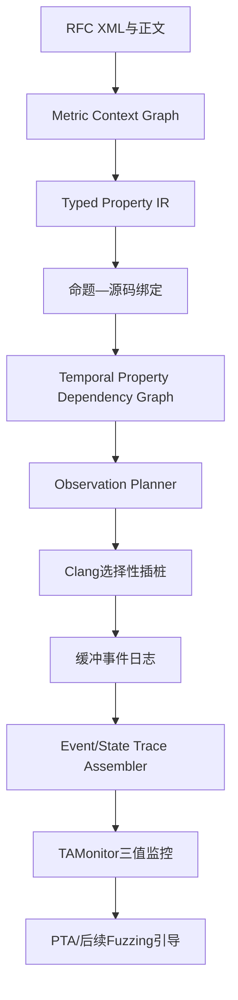

# TAFuzz-MITL：从 RFC 规范到可执行时序观测的论文级系统设计

## 0. 结论先行

推荐把当前工作的第一篇论文边界收敛为：

> **从 RFC 中提取可审计的 MITL 性质，将原子命题绑定到 C/C++ 协议实现中的输入、状态、计时器和事件依赖，并自动生成低开销且语义正确的选择性插桩，最终产生现有 TAMonitor 可直接消费的 timed word。**

现有 `TAMonitor/MightyPPL/MoniTAal` 和已经完成的 PTA 反向/混合 priced-zone 求解器应作为受保护的后端，不重新实现。时间感知 Fuzzing 调度作为第二阶段接入，不与前三个尚未落地的前端模块同时扩张。

这个边界具备 CCFA/ICSE/ASE 类论文所需的完整研究链条，但“达到 CCFA 程度”指研究问题、算法、实现和实验完整度，不代表投稿结果可以预先保证。

---

## 1. 已审阅材料与工程事实

### 1.1 输入材料

本设计综合了以下五个任务文件中的研究问题：

1. `01_MITL性质提取与ProtocolGuard结合研究提示词`；
2. `02_MITL命题与源码依赖分析提示词`；
3. `03_MITL轻量化插桩与运行时监控提示词`；
4. `04_时间自动机与Fuzzing搜索结合提示词`；
5. `05_完整CCFA论文方案设计提示词`。

同时核对了项目分支：

- 仓库：`PearBabe/TAFuzz`；
- 分支：`codex/tafuzz-20260712-004642`；
- 现有后端：`src/TAMonitor`、`src/TAMonitor/PTA`；
- 已有能力：MITL 解析、正负时间自动机构造、三值监控、exact backward PTA、exact mixed forward/backward PTA、稳定 JSON/JSONL 输出和完整测试基线。

### 1.2 必须保护的现有基线

- 未显式启用 PTA 时，原有监控行为和报告格式不能变化；
- `backward` 与 `mixed` PTA 路径保持独立、默认关闭；
- 新前端第一阶段只生成公式与 timed trace，不修改 PTA 求解器；
- 新增工具失败时不得把不完整结果伪装为已验证性质；
- 事件丢失、映射不确定或时间源异常时，结论必须降级为 `INCONCLUSIVE`。

### 1.3 RFC 核对暴露的关键问题

用于说明方法的句子“发送 CON 后 5 秒内必须收到 ACK”不是 RFC 7252 的原始规范。RFC 7252 实际规定：

- ACK/RST 必须通过 Message ID 和端点信息与原消息匹配；
- 发送端必须维护 timeout 和 retransmission counter；
- 重传之间存在最小间隔；
- 整个重传序列必须处于 `MAX_TRANSMIT_SPAN` 包络内；
- `MAX_TRANSMIT_SPAN`、`MAX_TRANSMIT_WAIT`、`EXCHANGE_LIFETIME` 等是参数表达式，而不是固定写死的常数。

因此，正式系统不能让 LLM 直接从一句话随意输出数字化 MITL。必须建模：

1. 符号时间表达式；
2. RFC 默认值与实现配置值；
3. 规范性义务、建议和环境假设的区别；
4. 跨段落定义与公式依赖；
5. 无法可靠转换时的主动拒绝。

RFC 7252 的可靠传输、参数定义和派生时间值可核对：[RFC 7252](https://www.rfc-editor.org/rfc/rfc7252.html)。

---

## 2. 研究主张与非主张

### 2.1 论文的三个主贡献

#### C1：Metric Requirement Context Graph 与可审计 Property IR

提出面向 MITL 的 RFC 上下文恢复方法。它不只取规范句前后固定窗口，而是构造包含定义、参数公式、例外、交叉引用和规范强度的上下文图，再生成带来源证据的类型化性质 IR。

#### C2：Temporal Property Dependency Graph（TPDG）

提出时序性质驱动的跨过程依赖图，将以下实体连接起来：

$$
\text{RFC Clause}
\rightarrow
\text{Atomic Proposition}
\rightarrow
\text{Code Predicate/Event}
\rightarrow
\text{State/Timer/Callback}
\rightarrow
\text{Protocol Field}
\rightarrow
\text{Input Bytes}
$$

与普通切片相比，TPDG 增加事件生命周期、时间源、定时器注册/回调、异步发生顺序和观测前后位置等边。

#### C3：生命周期正确的最小化插桩与事件—信号桥接

根据 TPDG 选择能够完整计算命题且代价较低的观测点。插桩计划显式规定在定义之前或之后采样，防止状态被清除或尚未更新。运行时采用缓冲记录，并将事件命题与持续状态命题转换为 TAMonitor 的完整 timed valuation。

### 2.2 第二阶段贡献，不放进第一版最小闭环

在上述前端稳定后，再把 TPDG 的输入影响关系和现有 PTA cost-to-go 连接到种子调度：

- 用 TPDG 选择影响目标命题的字节区域；
- 用 mixed PTA snapshot 查询剩余可达域与 cost-to-go；
- 用剩余时间松弛量调整队列优先级；
- 不在第一阶段重新实现 PTA 求解。

### 2.3 明确不主张

- 不声称把所有 RFC 句子都转换为 MITL；
- 不把 LLM 输出直接当作形式化真值；
- 不声称静态切片无误报或无漏报；
- 不把插桩后发现的所有异常都称为漏洞；
- 不把使用 RFC 假设推导出的性质称为 RFC 的直接 `MUST`；
- 不把小型 Python Demo 当作生产分析器。

---

## 3. 系统总体架构



### 3.1 离线阶段

1. 下载并解析 RFC XML/HTML；
2. 构造 Metric Requirement Context Graph；
3. 由 LLM 生成受约束的候选 Property IR；
4. 由确定性编译器生成 MITL；
5. 使用 MightyPPL/TAMonitor 做语法、类型、可满足性和正反例检查；
6. 对目标代码构造语义索引和 TPDG；
7. 生成、审核并固化 Observation Plan；
8. 使用 Clang LibTooling 重写独立的 instrumented build tree。

### 3.2 在线阶段

1. 目标程序执行一次测试；
2. 插桩调用只写入线程本地缓冲；
3. 测试结束后独立消费者收集记录；
4. Trace Assembler 恢复持续状态和瞬时事件；
5. 解析符号时间参数并量化时间单位；
6. 输出 TAMonitor 已支持的 `time,props` trace；
7. TAMonitor 输出 `POSITIVE/NEGATIVE/INCONCLUSIVE`；
8. 任何 drop、乱序未解决或映射不完整都会强制 `INCONCLUSIVE`。

---

## 4. 统一语义：这是整个方案能否成立的核心

### 4.1 三类原子命题

| 类型 | 例子 | 运行时含义 | 记录方式 |
| --- | --- | --- | --- |
| Event | `con_sent`、`ack_received` | 某一离散执行位置发生 | 每次发生记录一条 |
| State | `waiting_ack`、`counter_lt_max` | 一段时间内持续成立 | 仅在真值变化时记录 |
| Derived | `matching_ack`、`deadline_expired` | 由多字段或状态联合计算 | 在生命周期正确的位置计算布尔值 |

### 4.2 点语义与持续状态不能混用

现有 TAMonitor 消费 timed word。正式系统采用以下投影：

- Event proposition 只在对应记录位置为真；
- State proposition 在收到 `state_on/state_off` 后由 Assembler 持续维护；
- 每条输出记录都包含当前完整 state valuation；
- 对活跃时间约束在边界处注入 synthetic deadline tick，避免长时间无程序事件导致监控器无法推进；
- 同一时间戳的事件按全局 sequence number 保留微步顺序。

这比固定周期采样更适合协议实现：协议状态变化由解析、发送、接收、计时器和回调驱动；周期采样既可能漏掉短暂状态，也会增加严重开销。

### 4.3 相关性作用域

普通命题 MITL 不直接量化 Message ID、Token 和 endpoint。系统使用 scoped monitor instance：

$$
k = \langle endpoint, message\_id, token \rangle
$$

运行时先用 `scope_key` 将事件路由到对应实例，再把实例内部事件投影为布尔命题。若实验配置保证 `NSTART=1`，可选择单实例优化，但必须在元数据中记录这一假设。

### 4.4 三值结果

- `POSITIVE`：在声明的有限/无限词语义下性质已确定满足；
- `NEGATIVE`：存在可重放的性质违例轨迹；
- `INCONCLUSIVE`：前缀尚不足、事件丢失、时间顺序不可靠、绑定不完整或资源上限触发。

---

## 5. Property IR

### 5.1 核心结构

```json
{
  "schema_version": "tafuzz-property-ir/1.0",
  "property_id": "rfc7252.s4.2.retransmit_span",
  "normative_strength": "MUST",
  "derivation_kind": "direct_with_derived_bound",
  "scope_key": ["endpoint", "message_id"],
  "semantics": "event_clock",
  "pattern": "bounded_history",
  "formula_template": "G (retransmit -> O [0,MAX_TRANSMIT_SPAN] first_con_send)",
  "bound_symbols": {
    "MAX_TRANSMIT_SPAN": {
      "expression": "ACK_TIMEOUT * ((2 ** MAX_RETRANSMIT) - 1) * ACK_RANDOM_FACTOR",
      "unit": "second",
      "source": "RFC7252#4.8.2"
    }
  },
  "atomic_propositions": [],
  "exceptions": [],
  "assumptions": [],
  "provenance": []
}
```

### 5.2 时间界限不是单个整数

使用受限表达式 AST：

```text
BoundExpr := Constant
           | Symbol
           | Add(BoundExpr, BoundExpr)
           | Sub(BoundExpr, BoundExpr)
           | Mul(BoundExpr, BoundExpr)
           | Pow2(IntegerSymbol)
```

禁止 LLM 输出任意可执行代码。参数解析优先级：

1. 当前运行时配置快照；
2. 构建期宏/配置文件；
3. RFC 默认值；
4. 无法解析则保持 `UNBOUND`，不生成可执行监控任务。

配置本身的合法性单独形成性质，例如：

$$
ACK\_RANDOM\_FACTOR \ge 1
$$

### 5.3 候选状态机

```text
CANDIDATE
  -> SCHEMA_VALID
  -> CONTEXT_GROUNDED
  -> BOUNDS_RESOLVED
  -> FORMULA_VALID
  -> SOURCE_BOUND
  -> INSTRUMENTABLE
  -> APPROVED
```

任何阶段失败都保留错误原因和证据，不允许跳过状态。

---

## 6. RFC 性质提取算法

### 6.1 Metric Requirement Context Graph（MRCG）

节点：

- RFC section、paragraph、sentence；
- normative clause；
- term definition；
- protocol field/event/state；
- parameter symbol；
- parameter expression；
- exception/alternative；
- cross reference。

边：

- `defines`、`uses_symbol`、`cross_ref`、`exception_of`；
- `alternative_to`、`derives_bound`、`same_actor`；
- `precondition_of`、`scope_of`。

### 6.2 候选召回

候选评分不只看 `MUST/SHOULD`，还包括：

$$
S_{clause} =
w_n N + w_t T + w_s S + w_r R + w_p P
$$

其中：

- $N$：规范性关键词；
- $T$：时间表达或时间参数；
- $S$：状态变化词；
- $R$：响应/先后关系；
- $P$：协议实体密度。

高召回阶段允许误报，后续分类器将条款分为：

- direct metric temporal；
- derived metric temporal；
- qualitative temporal；
- non-temporal；
- ambiguous/unmonitorable。

### 6.3 LLM 的受限职责

LLM 只输出候选结构：actor、trigger、response、alternative、scope、bound symbol、exception 和证据句。LLM 不负责：

- 直接写最终 MITL 字符串；
- 猜测未出现的时间常数；
- 猜源码变量名；
- 决定插桩位置；
- 判定性质已经正确。

### 6.4 确定性模板编译

第一版支持六类模板：

1. bounded response；
2. bounded absence；
3. minimum separation；
4. bounded retention；
5. bounded history；
6. state transition with deadline。

例如重传包络：

$$
\varphi_{span} =
G\left(retransmit \rightarrow O_{[0,MTS]} first\_con\_send\right)
$$

这里 $MTS$ 在运行前解析为 `MAX_TRANSMIT_SPAN` 的实际值。

### 6.5 验证门

每个候选必须通过：

1. JSON Schema；
2. provenance span 精确回指；
3. 所有 symbol 可追踪到定义或配置；
4. 规范强度和例外一致；
5. MightyPPL 语法解析；
6. 正公式与否定公式可满足性检查；
7. 模板生成的最小正/负 timed trace 回归；
8. 低置信候选进入人工审核队列。

---

## 7. 原子命题到源码的多证据绑定

### 7.1 语义索引

Clang LibTooling 遍历真实编译数据库，记录：

- function、method、field、enum、macro、global、type；
- USR、qualified name、source range；
- CFG block、call site、constant comparison；
- 日志字符串和错误文本；
- timer API、callback registration 和网络 I/O API。

Clang 官方文档提供 LibTooling、FrontendAction、RecursiveASTVisitor 和 SourceManager 的稳定入口：[LibTooling](https://clang.llvm.org/docs/LibTooling.html)、[RecursiveASTVisitor](https://clang.llvm.org/docs/RAVFrontendAction.html)。

### 7.2 绑定评分

对 AP $a$ 和代码候选 $c$：

$$
Score(a,c)=
w_1S_{name}+w_2S_{type}+w_3S_{constant}+w_4S_{context}
+w_5S_{dataflow}+w_6S_{dynamic}
$$

必须满足至少一个结构证据：类型/常量/数据流/动态轨迹。单纯名称相似不能获得 `APPROVED`。

### 7.3 LLM 与静态分析分工

- LLM：提出可能 handler、字段同义词和框架 API；
- Clang/LLVM：验证符号存在、类型、调用和数据依赖；
- 动态 dry run：确认候选点是否在合法样例中发生；
- 人工审核：只处理低置信或多候选冲突。

---

## 8. Temporal Property Dependency Graph（TPDG）

### 8.1 节点类型

```text
RFC_CLAUSE, AP, PREDICATE, EVENT_SITE, FUNCTION, BASIC_BLOCK,
FIELD, VARIABLE, TIMER, CALLBACK, STATE_TRANSITION,
INPUT_REGION, CONSTANT, TIME_SOURCE, OBSERVATION_POINT
```

### 8.2 边类型

```text
DATA, CONTROL, CALL, RETURN, ALIAS, DECODE, STATE,
TIMER_START, TIMER_CANCEL, CALLBACK_REGISTER, CALLBACK_FIRE,
HAPPENS_BEFORE, CORRELATES, DEFINES, OBSERVES
```

### 8.3 构造流程

1. 从 AP predicate sink 开始后向切片；
2. 使用 LLVM def-use、MemorySSA、AA、Dominator/PostDominator 和调用图；
3. 遇到 parser field 后继续追踪到 ingress buffer 与 byte range；
4. 遇到 timer/callback 时应用框架摘要模型；
5. 对可能影响 AP 的状态写入做前向验证；
6. 仅保留位于入口到 AP sink 可行调用路径上的节点；
7. 输出每条边的分析证据与置信状态。

LLVM New Pass Manager 的插件入口可参考：[Writing an LLVM Pass](https://llvm.org/docs/WritingAnLLVMNewPMPass.html)。

### 8.4 异步依赖模型

第一版提供可声明模型：

```yaml
- api: coap_io_prepare_io
  kind: timer_schedule
  deadline_arg: 1
  callback_arg: 2
  context_arg: 3
- api: coap_cancel_session_messages
  kind: timer_cancel
  key_args: [0, 1]
```

未知框架 API 不猜测；标记 `MODEL_REQUIRED`。

### 8.5 输入指导产物

TPDG 同时导出：

- `input_regions`：字节偏移、bit mask、长度或 grammar field；
- `mutation_dependencies`：某输入区影响哪些 AP；
- `state_prerequisites`：触发 AP 前必须满足的内部状态；
- `timing_dependencies`：timeout、clock、callback 和调度点。

这些产物供第二阶段 Fuzzing 使用，但不影响第一阶段监控正确性。

---

## 9. Observation Contract 与选择性插桩

### 9.1 每个命题必须有 Observation Contract

```json
{
  "ap": "matching_ack_received",
  "site": "coap_handle_dgram:branch#17",
  "placement": "before_state_mutation",
  "read_set": ["packet.type", "packet.mid", "session.awaiting_mid"],
  "scope_key": ["session.remote", "packet.mid"],
  "truth_mode": "event_true",
  "timestamp_mode": "monotonic_raw_ns",
  "failure_policy": "inconclusive"
}
```

### 9.2 生命周期正确性

插桩点不是简单地选择“最近的语句”。例如：

- `con_sent` 若依赖 `awaiting_mid` 和 `deadline`，必须在这些状态更新之后记录；
- `matching_ack_received` 若随后清除 `awaiting_mid`，必须在清除之前记录；
- state proposition 应在每个可能改变其真值的 definition 后计算；
- timer event 应区分 schedule、fire、cancel 和 reschedule。

### 9.3 最小化目标

候选点集合为 $P$，需要观测的语义项为 $R$：

$$
\min_{x_p\in\{0,1\}}
\sum_{p\in P} cost(p)x_p
$$

约束：

$$
\forall r\in R:\quad
\sum_{p:r\in cover(p)}x_p \ge 1
$$

代价包含：

$$
cost(p)=
\alpha\cdot hotness(p)
+\beta\cdot payload\_bytes(p)
+\gamma\cdot atomic\_cost(p)
+\delta\cdot timing\_criticality(p)
$$

第一版使用确定性 greedy weighted set cover，并由生命周期约束验证器拒绝不合法计划；ILP 仅作为实验 oracle。

### 9.4 源码级与 IR 级插桩选择

推荐默认使用 Clang LibTooling Rewriter：

- 能识别 statement/branch/state update 的前后边界；
- 生成独立 instrumented tree，避免污染原始源码；
- 插入的运行时调用仍由编译器优化；
- 更容易保留源码可审计性。

宏展开、生成代码或无法稳定重写的位置才回退到 LLVM Pass；回退点必须记录 debug location 和 instruction fingerprint。

---

## 10. 轻量化事件通道

### 10.1 记录格式

```c
typedef struct {
    uint64_t timestamp_ns;
    uint64_t global_seq;
    uint32_t event_id;
    uint32_t scope_id;
    uint64_t value_mask;
} TafuzzEventRecord;
```

固定 32 字节，避免可变长分配。大字段只记录稳定哈希或索引，原始数据保留在独立 side table。

### 10.2 写入路径

- 每线程一个 SPSC ring；
- producer 只执行时间读取、sequence 分配和连续内存写；
- consumer 在独立线程或独立进程批量读取；
- 无同步磁盘 I/O；
- buffer 满时只增加 drop counter；
- drop counter 非零时本轮性质判定为 `INCONCLUSIVE`。

### 10.3 时间源

- 默认 Linux `CLOCK_MONOTONIC_RAW`；
- 时间单位在公式编译时统一缩放为整数 tick；
- 不默认使用 `RDTSC/RDTSCP`，除非完成跨核校准；
- 记录 runtime clock resolution 和转换误差；
- 插桩开销实验必须同时报告平均值、P95、P99 和 target throughput。

### 10.4 多线程排序

- 每条记录带 global relaxed sequence；
- 同线程保持 program order；
- collector 按 `(timestamp_ns, global_seq)` 排序；
- 若时间源回退或记录无法形成确定顺序，元数据标记 `ORDER_UNCERTAIN`。

---

## 11. Event/State Trace Assembler

Assembler 是现有 TAMonitor 前必须新增的独立工具，第一版不修改 TAMonitor。

输入：

- binary event log；
- `property_ir.json`；
- `observation_plan.json`；
- 运行时参数快照。

输出：

```text
time,props
0,first_con_send waiting_ack
2000,retransmit waiting_ack
45000,deadline_tick waiting_ack
```

处理规则：

1. event AP 只在当前微步置真；
2. state AP 根据 change event 持续维护；
3. scope instance 分开监控；
4. temporal boundary 产生 synthetic tick；
5. 所有输出时间非递减；
6. drop/未知 event/参数未解析产生 sidecar diagnostics；
7. 只有 `complete=true` 的 trace 才允许输出确定违例。

现有 TAMonitor 已支持 CSV timed word、等时间点和三值监控，所以该工具可作为无侵入桥接层。

---

## 12. 与现有 TAFuzz/PTA 的连接

### 12.1 第一阶段

```text
tafuzz-spec-mine
  -> property_ir.json + formula.mitl
tafuzz-bind / tafuzz-slice
  -> tpdg.json + observation_plan.json
tafuzz-instrument
  -> instrumented source tree
target execution
  -> events.bin
tafuzz-event-assemble
  -> trace.csv
TAMonitor
  -> POSITIVE / NEGATIVE / INCONCLUSIVE
```

### 12.2 第二阶段时间引导

现有 mixed PTA snapshot 已保存 reachable nodes/arcs、priced pieces、delay witness 和 cost-to-go。后续调度器只读这些产物：

$$
priority(seed)=
w_c\cdot coverage\_novelty
+w_s\cdot state\_novelty
+w_p\cdot proposition\_progress
-w_h\cdot \widehat{cost\_to\_goal}
+w_\sigma\cdot slack
$$

其中：

$$
slack = latest\_feasible\_time - now - \widehat{execution\_cost}
$$

若 `slack < 0`，当前执行不再继续昂贵求解，而是复用已有候选、快速重启或选择更短前缀。该阶段不能只使用单个 edge scalar；必须按当前 location 和 clock valuation 查询 priced piece。

---

## 13. 已完成的小型可行性原型

原型路径：`prototype/`。

已验证的最小闭环：

```text
合成 RFC 风格句子
  -> typed Property IR
  -> C AST 依赖图
  -> 两个选择性观测点
  -> 生命周期感知源码插桩
  -> Clang 18 -Wall -Wextra -Werror
  -> 内存缓冲事件
  -> TAMonitor 兼容 CSV
  -> 三值 bounded-response oracle
```

原型和正式实现都以 Clang/LLVM 为唯一受支持编译链：优先使用
`clang-18`/`clang++-18`，原型在仅有非版本化命令时可使用 `clang`；不得静默
回退到 GCC。正式实验必须在 manifest 中记录编译器绝对路径、完整版本、目标
三元组、编译参数和产物摘要，从而保证 AST、LLVM IR、插桩位置及实验结果来自
同一工具链。

实际产物：

- `property_ir.json`；
- `dependency_graph.json`；
- `instrumentation_plan.json`；
- `coap_instrumented.c`；
- `tafuzz_runtime.c`；
- `trace.csv`；
- `verdict.txt`。

原型审计中已经发现并修复：

1. 触发事件在状态更新前记录导致生命周期错误；
2. 同步 `printf` 不满足轻量化目标，改为内存缓冲后批量输出；
3. 对不支持的自然语言模板必须拒绝，而不是猜测公式。

原型的限制：

- `pycparser` 不能替代 Clang/C++ 生产分析；
- 当前示例句是接口验证用合成条款，不是 RFC 7252 的直接原文；
- 参考 monitor 只处理一个 bounded-response 模板；
- 生产监控仍使用 TAMonitor；
- 单进程固定缓冲必须替换为共享内存 per-thread ring。

---

## 14. 实验设计

### 14.1 研究问题

- **RQ1**：MRCG + typed IR 能否提高 MITL 条款提取和时间界限解析准确率？
- **RQ2**：TPDG 能否准确定位 AP、依赖变量、计时器、回调和输入区域？
- **RQ3**：生命周期感知的选择性插桩能否保持监控语义并降低开销？
- **RQ4**：完整前端是否比手工/全插桩/普通切片更快发现协议性质违例？
- **RQ5（第二阶段）**：加入 PTA cost-to-go 后，time-to-violation 是否进一步下降？

### 14.2 数据集

规范：

- RFC 7252（core CoAP）；
- RFC 7641（Observe）；
- RFC 7959（Block-wise）；
- 非时间规范句作为 negative corpus。

实现：

- `libcoap`：主要真实目标；
- RIOT `nanocoap`：嵌入式外部有效性；
- FreeCoAP 或一个较小 C CoAP 实现：规模敏感性；
- 小型人工模型：精确 dependency 和 instrumentation oracle。

### 14.3 Gold set

- 两名标注者独立标注 150 条候选规范；
- 标注是否 metric-temporal、规范强度、actor、trigger、response、bound、exception 和 scope；
- 对可执行性质标注 MITL 模板和 AP；
- 报告 Cohen's $\kappa$ 和分歧处理；
- 保留无法转换的条款，评估 abstention，而不是只评估成功样本。

### 14.4 指标

性质提取：

- candidate recall；
- accepted-property precision/recall/F1；
- bound expression exact match；
- provenance exact match；
- invalid candidate abstention accuracy。

依赖分析：

- AP binding Top-1/Top-3 accuracy；
- slice node/edge precision/recall；
- input-region accuracy；
- async dependency recall；
- slice reduction ratio。

插桩：

- observation point count；
- event loss；
- timestamp perturbation；
- throughput overhead；
- P95/P99 request latency；
- 与 full instrumentation 的 verdict equivalence。

效果：

- property transition coverage；
- time-to-first-violation；
- unique reproducible non-compliance bugs；
- confirmed/fixed bugs；
- 每小时有效测试数。

### 14.5 Baselines 和消融

Baseline：

- 固定窗口 RFC 检索 + LLM；
- 无类型 LLM 直接公式生成；
- 普通 backward slice；
- 全程序/全变量插桩；
- AFLNet/AFLGo/普通覆盖反馈；
- ProtocolGuard 思路的规则—源码切片基线；
- CoAP assertion testing 基线。

Ablation：

- 去掉 cross-reference context；
- 去掉 symbolic bound；
- 去掉多证据绑定；
- 去掉 async/timer edges；
- 去掉 lifecycle placement；
- 去掉 synthetic deadline ticks；
- 去掉 selective instrumentation；
- 第二阶段去掉 PTA cost-to-go。

---

## 15. 主要风险与退出条件

| 风险 | 失败表现 | 缓解 | Go/No-Go 条件 |
| --- | --- | --- | --- |
| 可提取 MITL 条款太少 | RFC corpus 只有少量时间性质 | 扩展 Observe/Block-wise；加入 derived temporal 但分开报告 | 少于 15 个可执行性质则缩小论文主张 |
| LLM 公式幻觉 | 时间常数或例外错误 | typed IR、模板编译、符号解析、abstention | 人工 gold 上 accepted precision 低于 85% 不进入自动化主张 |
| AP 绑定不稳定 | 不同实现无法定位 | 类型/常量/数据流/动态证据，人工低置信队列 | Top-3 低于 80% 时先限制单实现 |
| C/C++ alias 导致大切片 | 插桩点过多 | AA/MemorySSA、框架模型、动态 pruning | slice reduction 小于 50% 时重新设计摘要 |
| 插桩改变时间行为 | 假违例或吞吐下降 | ring buffer、批量消费、observer-effect calibration | P99 延迟增幅超过 10% 时不得称轻量化 |
| 事件丢失 | 错误确定 verdict | drop 强制 INCONCLUSIVE | 有 drop 的运行不得用于 bug claim |
| timed word 与 state signal 不一致 | 持续性质误判 | state-change capture + deadline tick + full valuation | 与 full oracle 不一致则限制为 event-only property |

---

## 16. 推荐里程碑

### M0：接口闭环（已完成原型）

合成条款、合成 C 程序、typed IR、dependency、插桩、trace 和 verdict 跑通。

### M1：真实 RFC + 单一真实实现

- RFC 7252 XML ingestion；
- 5 个经人工确认的真实性质；
- libcoap 单版本；
- Clang 语义索引；
- 事件型 AP；
- 端到端 TAMonitor。

### M2：时序依赖与轻量化

- LLVM 跨过程切片；
- timer/callback models；
- state proposition；
- per-thread ring；
- synthetic deadline tick；
- full-vs-selective verdict equivalence。

### M3：论文实验版

- 三个 RFC；
- 三个 C 实现；
- gold set；
- baselines/ablations；
- overhead、effectiveness、case studies；
- artifact automation。

### M4：PTA-guided Fuzzing

- TPDG mutation regions；
- runtime state-to-zone lookup；
- mixed PTA cost-to-go；
- slack-aware scheduler；
- 与 AFLNet/AFLGo/无 PTA 消融比较。

---

## 17. 最终判断

这个方向值得继续，但高质量论文的核心不是“LLM 从 RFC 生成 MITL”这一个点。真正可形成壁垒的是：

1. **符号时间与规范来源可审计**；
2. **命题到源码的时序/异步依赖图**；
3. **生命周期正确而非仅位置相近的选择性插桩**；
4. **事件与持续状态到现有 timed-word monitor 的语义桥接**。

只要 M1 和 M2 能在 libcoap 上稳定通过，并在 full instrumentation oracle 下保持 verdict equivalence，这个系统就具备继续扩展到论文实验的工程基础。反之，如果直接同时开发 RFC LLM、SVF、eBPF、PTA 调度和 AFLNet 修改，最可能得到的是五个无法严谨连接的原型。

---

## 参考入口

- [RFC 7252: The Constrained Application Protocol](https://www.rfc-editor.org/rfc/rfc7252.html)
- [Clang LibTooling](https://clang.llvm.org/docs/LibTooling.html)
- [Clang RecursiveASTVisitor FrontendAction](https://clang.llvm.org/docs/RAVFrontendAction.html)
- [LLVM New Pass Manager](https://llvm.org/docs/WritingAnLLVMNewPMPass.html)
- [SVF documentation](https://svf-tools.github.io/SVF-doxygen/html/)
- [CodeQL C/C++ library](https://codeql.github.com/docs/codeql-language-guides/codeql-library-for-cpp/)
- [TAFuzz repository](https://github.com/PearBabe/TAFuzz/tree/codex/tafuzz-20260712-004642)
