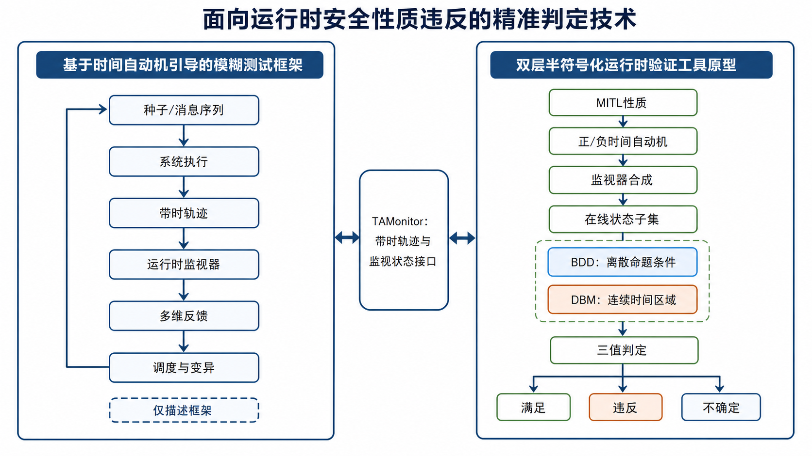
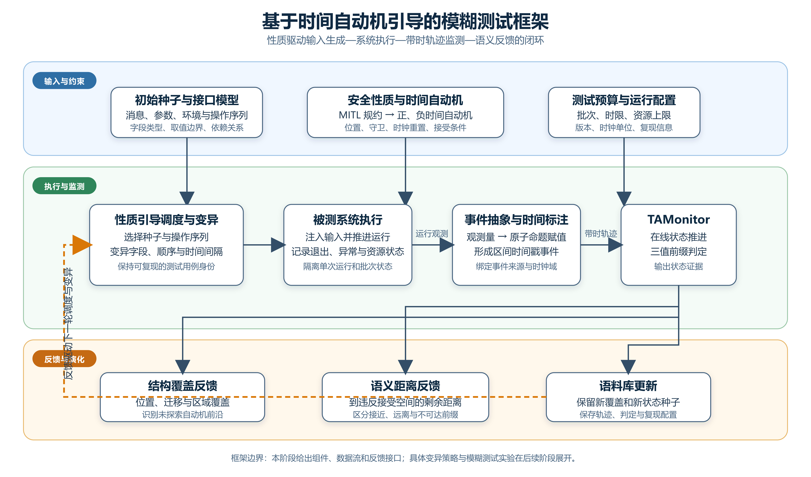
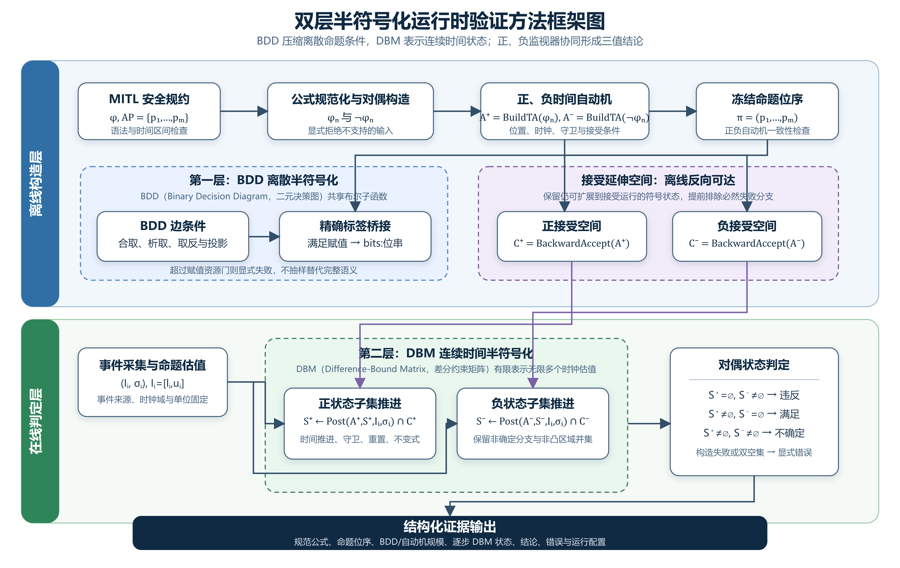
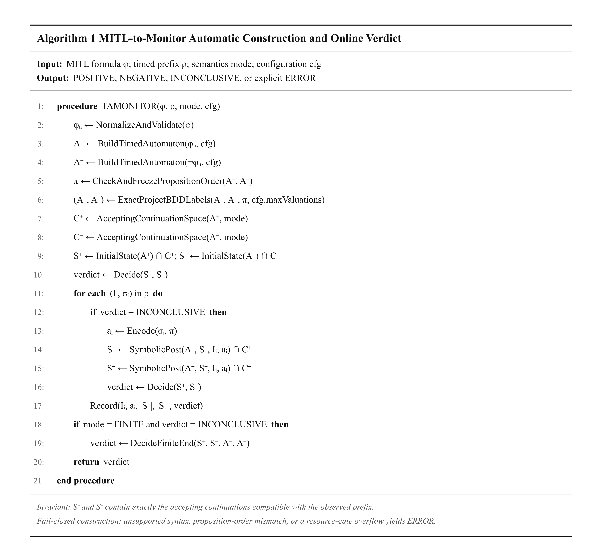

# 基于运行时验证的安全性质违反精确判定方法研究报告

**阶段版本：运行时验证部分**  
**研究对象：TAMonitor（安全性质违反精准判定工具的当前实现）**  
**编制日期：2026 年 7 月 28 日**

> 本报告按照参考文档的科技成果叙事顺序组织：首先说明形成了什么成果及其两个成果内容，再依次展开问题与挑战、国内外研究现状、方法整体框架、关键技术、算法和实验设计。模糊测试部分只给出框架，不展开具体变异算法；实验结果保留为待填写状态。

# 摘要

本成果面向复杂、非可信运行环境下嵌入式软件与固件的运行保障需求，聚焦违背时序约束、异常或非法操作、资源使用异常以及看门狗超时四类典型安全缺陷。针对环境交互具有动态性和非确定性、传统以崩溃为主要判据的测试难以识别非崩溃型性质违反等问题，本成果贯通可读的时间性质规约、时间自动机模型、在线事件轨迹与可审计判定证据，形成“MITL（Metric Interval Temporal Logic，度量区间时序逻辑）性质自动转换为时间自动机—时间自动机自动合成为正负监视器—运行事件在线分析并输出满足、违反或尚不能确定的三值结论”的全自动运行时验证方法框架和工具原型。该成果以性质驱动的监视器自动生成为核心，无需针对每条性质人工编写专用判定代码，面向上述四类缺陷组织检测能力，并以安全规约所描述性质的运行时检测准确率达到 90% 以上为第三方测评目标；监视过程中产生的自动机位置、时间区域、正负状态子集和三值结论等结构化结果，还可进一步作为模糊测试的反馈信号。

**关键词：** 运行时验证；度量区间时序逻辑；时间自动机；监视器自动合成；二元决策图；差分约束矩阵；三值判定

# 成果概述

本项目形成的主要成果为**面向运行时安全性质违反的精准判定技术**。该成果围绕性质规约自动转换、正负时间自动机监视器合成、在线三值判定和结构化证据输出形成完整方法与工具链，并将运行时监视结果进一步衔接到模糊测试反馈过程。

该成果由两个相互衔接、职责清晰的成果内容组成：一是**基于时间自动机引导的模糊测试框架**，利用时间自动机的位置、迁移、时间区域和违反前沿形成语义反馈，构成“输入生成—系统执行—轨迹监测—反馈调度”的闭环；二是**双层半符号化运行时验证工具原型**，自动把度量区间时序逻辑规约转换为正、负时间自动机，以二元决策图压缩离散命题条件，以差分约束矩阵表示连续时间状态，并依据正、负可接受延伸是否仍存在给出满足、违反或尚不能确定的三值结论。

两个成果内容通过 `TAMonitor` 接口连接。模糊测试框架向运行时验证工具提供带时事件轨迹，运行时验证工具返回自动机位置、时间区域、正负状态子集和判定结果；这些结构化信息可作为后续调度与时间变异的反馈。当前报告的研究重点是运行时验证方法和工具原型，模糊测试仅冻结总体框架、数据流和接口，具体种子调度、变异算子与测试实验将在后续阶段补充。

## 成果内容一：基于时间自动机引导的模糊测试框架

该框架在传统覆盖反馈之外加入时间自动机语义：安全性质被转换为正、负时间自动机，运行事件被抽象为带时轨迹，运行时监视器维护当前可达的位置与时间区域。框架据此提取位置覆盖、迁移覆盖、区域覆盖、未探索自动机前沿以及到违反接受空间的语义距离，并反馈给下一轮种子选择、操作序列调度和时间间隔变异。该成果内容当前形成的是总体框架，而不是已经冻结的具体模糊测试算法。

## 成果内容二：双层半符号化运行时验证工具原型

该工具原型形成从性质到判定的自动流程。离线阶段接收 MITL（Metric Interval Temporal Logic，度量区间时序逻辑）性质 $\varphi$，完成规范化与否定构造，自动生成 $A^{+}=BuildTA(\varphi)$ 和 $A^{-}=BuildTA(\neg\varphi)$，冻结正负自动机共同使用的原子命题位序。离散层采用 BDD（Binary Decision Diagram，二元决策图）共享布尔子函数，并通过精确标签投影连接运行时事件；连续时间层采用 DBM（Difference-Bound Matrix，差分约束矩阵）及其区域并集维护全部可行时钟估值。

在线阶段同时维护正、负监视器。若正监视器已经不存在接受延伸而负监视器仍可接受，则性质违反已经确定；若负监视器先为空，则性质满足已经确定；若两侧均保留可接受延伸，则输出尚不能确定。工具同时保存规范公式、命题位序、自动机和 BDD 规模、逐步 DBM 状态、结论及运行配置，形成可复核的证据链。当前版本不把尚未完成的性能实验或截图中的估算比例写成事实。

## 成果构成、作用关系与当前边界

| 成果内容 | 主要输入 | 核心处理 | 主要输出 | 本阶段边界 |
|---|---|---|---|---|
| 基于时间自动机引导的模糊测试框架 | 初始种子、系统接口、安全性质、测试预算 | 系统执行、事件抽象、运行时监测、多维语义反馈 | 新覆盖种子、带时轨迹、监测证据、反馈信号 | 只说明框架与接口，不展开具体变异算法和实验结果 |
| 双层半符号化运行时验证工具原型 | MITL 性质、原子命题绑定、带时事件轨迹 | 正负时间自动机构造、BDD 离散表示、DBM 时间区域可达、三值判定 | 满足、违反、不确定及结构化证据 | BDD 原生在线迁移尚未实现；实验结论待填写 |

其中，“双层半符号化”不是把全部状态编码为单一符号关系：第一层以 BDD 表示离散布尔条件，第二层以 DBM 表示连续时间约束，而自动机位置、正负监视器身份和运行证据仍显式保存。这样的设计既保留了可解释的控制结构，又避免对布尔赋值和实数时钟取值进行不必要的逐点枚举。

## 合同指标与验收关系

本报告同时对应“方法研究成果”和“工具成果”两个合同对象。二者使用同一技术框架，但验收指标、评价主体和证据形式不同，不能用一次内部测试替代专家评审或第三方测评。

合同中的“安全性质违反精准判定工具”是工具成果的正式名称，本报告标题中的“精确判定”是对方法语义的表述；为保持合同可追溯性，工具名称中的“精准”不作改写。合同所称“运行时监控器”与本文算法章节所称“运行时监视器”均对应 Runtime Monitor，即根据运行事件轨迹执行性质判定的程序组件。

| 合同对象 | 合同涵盖指标 | 指标解释与验证证据 | 评价方式 | 当前状态 |
|---|---|---|---|---|
| 基于运行时验证的安全性质违反精确判定方法研究 | 实验验证自动生成对违背时序约束的运行时监控器功能 | 输入 MITL 安全规约后，无需人工编写性质专用判断代码，自动形成正负时间自动机监视器，并在带时测试轨迹上输出违反判定；提交方法报告、框架说明、自动生成记录、代表性公式和运行结果 | 专家评审 | 待形成完整实验材料并送审 |
| 安全性质违反精准判定工具 | 支持 4 类典型安全缺陷检测 | 四类缺陷为“违背时序约束”“异常或非法操作”“资源使用异常”和“看门狗超时”；分别建立独立用例分区，并提供规约、轨迹、预期结论和工具输出 | 第三方测评 | 待测评 |
| 安全性质违反精准判定工具 | 安全规约所描述性质的运行时检测准确率达到 90% 以上 | 在预先冻结、具有独立真值标签的测评轨迹上计算正确结论数占全部有效测评轨迹数的比例；完成轨迹上的 `INCONCLUSIVE` 计为未正确检出，不从分母中删除 | 第三方测评 | 待测评，不预填达标结论 |

四类典型安全缺陷的测评口径固定如下：

1. **违背时序约束。** 使用 MITL 规约描述事件先后次序、持续时间、响应期限或允许时间窗口，并构造违反与不违反轨迹。纯看门狗刷新超时归入第四类，不在本类重复统计。
2. **异常或非法操作。** 监测规约明确禁止的事件、状态或操作序列，例如禁止模式下执行特定操作、互斥操作同时发生或未经前置授权事件即执行后续操作。此类以冻结的允许条件和禁止条件作为独立真值依据。
3. **资源使用异常。** 监测处理器、内存、栈、存储、通信缓冲区或其他受控资源的占用值、增长趋势及持续时间，判定超阈值、持续超限或未在规定时间内释放等性质违反。此类必须记录资源指标的采集来源、单位、阈值和采样规则。
4. **看门狗超时。** 监测启动、触发、心跳或刷新事件后，预期事件未在规定期限 `T` 内到达的行为。该类使用专门的超时规约和可靠的时钟推进事件，独立统计检出结果。

同一测试轨迹可能同时触发多个性质。第三方测评应在执行前冻结每条用例的主类别；跨类别复合用例可以另行报告，但不得在四类基本覆盖统计中重复计数。

合同准确率采用：

$$
Accuracy=\frac{N_{correct}}{N_{valid}}\times 100\%.
$$

其中，$N_{correct}$ 为工具最终结论与独立真值一致的有效轨迹数，$N_{valid}$ 为全部有效测评轨迹数。

“有效测评轨迹”是格式正确、事件与时间单位明确、能够由工具完整读取的冻结轨迹；因工具内部错误、构造失败或完成轨迹仍输出 `INCONCLUSIVE` 的用例均不得作为无效数据从分母中剔除，而应按未正确检测记录。轨迹文件损坏或不满足测评输入规范的情况应由第三方在测评前依据书面规则单独裁定。目标门槛为检测准确率不低于 90%，最终数值及是否达标以第三方测评报告为准。

# 1 基于时间自动机引导的模糊测试框架

## 1.1 问题与挑战

传统模糊测试通常依据代码覆盖、异常、退出状态或资源变化保留种子，但这些信号不能直接回答某次运行是否正在接近一个带有时限和事件次序的性质违反。对于“请求后必须在规定时间内响应”一类性质，两条轨迹可能经过相似的代码路径，却因事件顺序或时间间隔不同而具有完全不同的语义。框架需要在不把运行时监视器结论误当作测试生成算法的前提下，把性质自动机状态转换为可供调度器使用的稳定反馈。

主要挑战包括：如何将模糊测试产生的异构运行观测映射为统一原子命题；如何明确事件发生时间、采集时间及区间不确定性；如何在正负时间自动机和多个 DBM 区域之间定义可比较的语义进展；以及如何保持测试用例、轨迹、监测结果和反馈信号之间的一一对应，以支持复现与最小化。

## 1.2 国内外研究现状

已有研究表明，形式性质可以参与模糊测试反馈设计。Luo 等把运行时监测信息用于模糊测试框架[17]；Meng 等研究了线性时序逻辑引导的灰盒模糊测试[18]；PGFuzz 以性质指导控制系统测试[19]；CPFuzz 面向信息物理系统利用运行反馈探索性质违反[20]。这些工作说明，性质反馈能够补充传统结构覆盖，但其性质语言、时间语义和反馈粒度并不自动适配本项目的 MITL—时间自动机—DBM 运行链。

本成果不在本阶段复述或实现上述文献中的具体变异算法，而是提取与当前方法直接相关的共同结构：性质输入、系统执行、带时事件抽象、在线监视、语义反馈和新一轮调度。具体算法选择必须在后续实验中结合被测系统接口、状态可恢复性和测试预算确定。

## 1.3 方法整体框架

如图 2 所示，框架由输入与约束、执行与监测、反馈与演化三层组成。

1. **输入与约束。** 初始种子描述消息、参数、环境量和操作序列；接口模型冻结字段类型、取值边界和依赖关系；MITL 安全性质转换为正、负时间自动机；测试预算固定批次、时限、资源门、软件版本和时钟单位。
2. **执行与监测。** 调度器选择种子并变异字段、操作次序或时间间隔；被测系统在隔离运行中执行输入；插桩或外部采集模块将观测量转换为原子命题赋值，并生成时间点或闭区间标注；`TAMonitor` 接收带时轨迹并维护正、负监视状态。
3. **反馈与演化。** 结构反馈记录自动机位置、迁移和时间区域覆盖；语义距离描述当前前缀与违反接受空间之间的剩余可达关系；语料库保留带来新覆盖、新符号状态或新判定的种子，并将证据送回下一轮调度。

该闭环的关键接口是一个可审计运行记录：测试用例标识、输入序列、事件来源、时钟域、带时轨迹、监视器配置、逐步状态和最终结论必须共同保存。若事件缺失或不同运行复用状态，反馈本身就不再具有可比性。

## 1.4 与运行时验证工具的接口

模糊测试框架向运行时验证工具提交带时前缀 $\rho_n=(I_1,\sigma_1)\cdots(I_n,\sigma_n)$。其中，$I_i=[l_i,u_i]$ 是第 $i$ 个事件的时间区间，$\sigma_i\subseteq AP$ 是该位置为真的原子命题集合。工具返回正负状态子集 $S_i^{+}$、$S_i^{-}$、自动机位置、DBM 区域标识、逐前缀结论及错误分类。

框架可以从这些输出构造候选反馈，但必须保持两个边界。第一，位置覆盖或区域覆盖只能说明测试探索了新的监视状态，不能单独证明真实缺陷；第二，到违反空间的启发式距离只服务于后续测试排序，不能代替运行时验证算法给出的 `NEGATIVE` 结论。只有冻结公式、轨迹和监视配置后产生的判定，才属于本报告的性质违反证据。

## 1.5 本阶段形成的框架成果

本阶段已经明确框架的组件划分、端到端数据流、与 `TAMonitor` 的输入输出合同以及结构覆盖、区域覆盖、自动机前沿和语义距离四类反馈位置。尚未冻结具体种子评分函数、变异概率、能量分配或距离公式，也未填写模糊测试实验数据；这些内容不影响本阶段对运行时验证工具原型的详细论证。

# 2 双层半符号化运行时验证工具原型

## 2.1 问题与挑战

实时软件中的许多错误不表现为程序立即崩溃，而表现为事件出现得过早、过晚、持续时间不足或状态次序不符合要求。例如“每次请求都应在 5 个时间单位内得到确认”同时涉及请求事件、确认事件和响应期限，不能由某一时刻的单点断言完整判断。若为每条性质人工编写专用代码，不仅复用性差，而且容易在开闭区间、时间单位、事件缺失和有限前缀语义上产生不一致。

本研究需要解决的核心问题是：**如何把 MITL 性质自动转换为能够处理在线带时事件的正、负时间自动机监视器，并在离散命题组合和连续时间状态都可能快速增长的条件下，精确、高效地判断当前前缀是否已经确定满足或违反性质。** 围绕这一核心问题，主要存在以下挑战。

### 2.1.1 逻辑性质到可执行监视器的自动转换

MITL 公式需要经过语法检查、否定范式转换、子公式自动机构造、时间自动机组合和监视器初始化等环节。任一环节若改变时间区间的开闭边界、有限词或无限词语义，最终监视器即使能够运行，也不再回答原始性质。因此，“自动转换”不仅要求减少人工步骤，还要求保留公式、自动机语言和运行时事件之间的语义对应关系。

### 2.1.2 离散命题组合爆炸

若性质含有 $m$ 个原子命题，一个事件理论上存在 $2^m$ 种真假赋值。直接在自动机构造阶段为每个满足赋值生成独立边，会产生大量重复条件和显式边。需要一种能够共享相同布尔子函数的表示，同时还要保证符号条件转换为运行时标签时不丢失任何满足赋值。

### 2.1.3 连续时间可达状态难以枚举

时间自动机含有实值时钟。同一带时前缀可能对应多个自动机位置和无限多组时钟估值；非确定分支、不同重置方式和区间时间戳还会形成非凸集合。若只保存一个代表时钟值或任意选择一条运行路径，可能删除仍然能够接受的分支，从而过早判定满足或违反。

### 2.1.4 有限观测前缀不能简单二值化

在线监测得到的是不断增长的有限前缀，而许多性质定义在无限带时字上。在请求刚出现时，既不能断言“已满足”，也不能断言“已违反”；期限尚未越过时，暂时没有确认也不能直接判负。判定必须考察当前前缀是否仍存在满足性质的延伸和违反性质的延伸。

### 2.1.5 观测轨迹与真实执行之间存在边界

监视器只能判断实际收到的轨迹。事件漏采、时间戳属于不同的时钟域、原子命题计算错误或观测延迟未建模，都会破坏轨迹与真实执行之间的对应关系。因此，本成果的“精确”是相对于公式语义、命题绑定、带时轨迹和自动机构造合同的精确判定，不等同于在观测不完整时对物理系统真实行为作绝对判断。

### 2.1.6 研究目标

针对上述问题，本研究形成以下目标：

1. 建立从 MITL 公式到正、负时间自动机监视器的自动转换链，减少性质相关的人工监测代码。
2. 以 BDD 压缩构造阶段的离散布尔条件，并建立到运行时规范标签的无损桥接。
3. 以 DBM 区域及其并集表示在线连续时间状态，完整保留非确定分支和区间时间戳对应的可行运行。
4. 通过正负接受延伸状态给出满足、违反和尚不能确定的三值结论。
5. 记录公式、命题顺序、BDD 规模、标签投影规模、时间自动机规模、DBM 状态和逐步结论，为正确性与效率实验提供可重复证据。
6. 面向成果验收，分别形成方法成果的专家评审材料，以及覆盖违背时序约束、异常或非法操作、资源使用异常、看门狗超时和 90% 检测准确率门槛的第三方测评材料。

## 2.2 国内外研究现状

本报告对 Zotero 文献库中“运行时验证”及其子集合和“fuzz + rv”集合进行了只读筛查，共涉及 219 条集合归属，按条目键去重后为 207 篇文献，其中 186 篇具有已索引全文。新版正文不再展开与当前运行时验证成果无直接关系的模糊测试算法，而是集中选取能够支撑运行时验证语义、MITL、时间自动机转换、区域监测和 BDD 表示的文献。

### 2.2.1 运行时验证研究

运行时验证根据一次实际执行产生的事件轨迹检查形式性质，位于传统测试与穷尽式验证之间[4]。Leucker 和 Schallhart 强调其对象是具体执行而不是系统全部可能执行；Bartocci 等从性质描述、事件获取、监视器综合和部署方式总结了运行时验证流程[5]。Falcone 等进一步从输入语言、监测语义、部署方式和输出类型对运行时验证工具进行分类[10]。这些研究说明，自动监视器不仅要给出结论，还必须明确性质语义、事件来源和不确定结果的含义。

面向复杂实时系统，Sánchez 等总结了分布式、嵌入式和信息物理场景对时间、观测和资源的要求[13]。这些挑战与本成果直接相关：在线监视器必须处理持续到来的有限前缀，并把“尚未看到满足证据”与“已经证明违反”严格区分。

### 2.2.2 度量时间逻辑与时间自动机

Koymans 提出的度量时序逻辑在时序算子上加入时间区间，使请求—响应期限、持续时间和事件间隔能够写入形式性质[2]。MITL 通过排除点区间约束，在实时性质表达能力与可判定性之间取得平衡[3]。Alur 和 Dill 提出的时间自动机使用有限控制位置、实值时钟、守卫、重置和位置不变式描述实时行为[1]，为把逻辑性质转化为可执行状态迁移系统提供了基础模型。

### 2.2.3 MITL 到时间自动机的自动转换

Maler 等研究了从 MITL 到时间自动机的转换，为以自动机语言判断时间性质奠定了基础[6]。MightyL 采用组合方式构造未来 MITL 的时间自动机，并通过组件构造和组合减少一次性生成整体自动机的困难[7]。MightyPPL 进一步覆盖过去模态和 Pnueli 模态，在自动机构造过程中使用符号布尔边和可达性处理[11]。这些工作为本成果提供了公式前端和自动机构造基础，但从构造工具输出到在线监视器输入仍需要命题位序、标签语义和运行模式的一致连接。

### 2.2.4 基于时间区域的在线监测

Grosen 等提出以时间 Büchi 自动机监测带时性质：分别为性质和否定性质维护状态估计，以反向可达不动点计算仍有接受延伸的状态空间，再根据正负状态集合是否为空产生三值结论[8]。DBM 可以有限表示无限多个实值时钟估值，区域并集则保留非凸状态集合。Fränzle 等进一步研究了观测延迟和抖动条件下的实时系统监测，说明只有把时间不确定性显式纳入状态表示，才能在给定观测合同下保持可靠结论[9]。Cimatti 等研究了部分可观测条件下利用显式环境假设缩小可行延伸的方法[12]。Lima 等则关注度量时间逻辑在线监测结论的解释性[14]。

### 2.2.5 模型检验中的 BDD 方法

BDD 是一种以有向无环图表示布尔函数的数据结构。Bryant 给出的约简有序 BDD 及其布尔运算方法，使相同布尔子函数能够共享节点，并在固定变量顺序下获得规范表示[15]。Burch 等将 BDD 用于符号模型检验，以布尔函数集合表示大量状态和转移关系，减少显式枚举状态的需求[16]。

本成果只借鉴 BDD 对离散布尔条件的符号表示能力，并不把整个运行时验证过程改写为传统模型检验。当前 `TAMonitor` 在时间自动机构造阶段保留 BDD 边条件，随后为现有监测引擎无损投影出规范事件标签；在线连续时间状态仍由 DBM 区域维护。因此，BDD 在本文中是自动机构造与标签桥接的辅助表示，而不是已经实现的 BDD 原生在线监测器。

### 2.2.6 本研究定位

现有研究分别提供了运行时验证语义、MITL、时间自动机转换、区域监测和 BDD 表示。本成果的研究对象不是重新发明这些基础理论，而是形成一条当前仓库可执行的自动链：

- 自动解析并规范化 MITL 及当前前端支持的扩展公式；
- 自动生成性质及其否定性质的时间自动机；
- 统一正负自动机与运行轨迹的命题顺序；
- 连接 BDD 布尔边条件与运行时规范标签；
- 以 DBM 状态执行反向接受空间和前向在线可达计算；
- 形成逐前缀三值结论和结构化证据。

其研究价值在于消除“逻辑公式工具能够构造自动机”与“运行系统能够在线消费事件并精确判定”之间的工程和语义断层。

## 2.3 方法整体框架与关键技术

### 2.3.1 方法整体框架

图 3 将工具划分为离线构造层和在线判定层。离线构造层完成公式规范化、正负时间自动机生成、命题位序冻结、BDD 标签桥接以及正负接受延伸空间计算；在线判定层把事件采集得到的时间区间和命题估值送入 DBM 状态推进，并由对偶状态判空规则产生结论。第一层半符号化解决离散命题组合的共享表示问题，第二层半符号化解决连续时间状态不可逐点枚举的问题。

#### 2.3.1.1 输入与输出

令原子命题集合为 $AP=\{p_1,\ldots,p_m\}$，性质公式为 $\varphi$。运行轨迹前缀表示为：

$$
\rho_n=(I_1,\sigma_1)(I_2,\sigma_2)\cdots(I_n,\sigma_n).
$$

其中 $\sigma_i\subseteq AP$ 表示第 $i$ 个观测位置为真的原子命题集合，$I_i=[l_i,u_i]$ 表示该事件的时间戳区间，满足 $0\le l_i\le u_i$。点时间戳 $t_i$ 是 $[t_i,t_i]$ 的特例。时间单位由上游观测合同确定，监视器不自行把整数猜测为秒、毫秒或调度周期。

输出是逐前缀三值结论：

- `POSITIVE`：所有允许延伸都满足 $\varphi$，性质满足已经确定；
- `NEGATIVE`：所有允许延伸都违反 $\varphi$，性质违反已经确定；
- `INCONCLUSIVE`：仍同时存在满足 $\varphi$ 和违反 $\varphi$ 的允许延伸，当前证据不足以二值化。

有限词模式把输入结束解释为轨迹真实终止，并在末端检查接受位置；无限词模式把当前输入视为仍会延伸的前缀，并使用时间 Büchi 接受条件。两种语义不能混用。

#### 2.3.1.2 总体处理框架

| 阶段 | 输入 | 核心处理 | 输出或失败条件 |
|---|---|---|---|
| 1. 性质准备 | 原始 MITL 公式 | 语法检查、区间规范化、内部记号隔离 | 规范公式；非法输入显式失败 |
| 2. 自动转换 | $\varphi$ 与 $\neg\varphi$ | 自动构造正、负时间自动机，记录否定范式和构造统计 | $A^{+}$、$A^{-}$；构造失败则终止 |
| 3. 命题与标签桥接 | 两个自动机的 BDD 边条件 | 冻结命题位序，无损投影为 `bits:<valuation>` | 统一字母表；位序不一致或超过资源门则失败 |
| 4. 监视器合成 | 正、负时间自动机 | 分别计算接受延伸空间并初始化状态估计 | 正、负监视器状态 |
| 5. 在线状态更新 | 带时事件 | DBM 时间推进、守卫相交、重置、不变式和接受空间剪枝 | 正、负前向状态子集 |
| 6. 精确判定 | 两个状态子集 | 根据哪一侧已不存在接受延伸作三值判定 | 满足、违反或尚不能确定 |
| 7. 证据输出 | 构造和运行数据 | 输出逐步状态、结论、配置和统计 | CSV、JSON、XLSX 结果文件 |

#### 2.3.1.3 正负监视器协同

正自动机 $A^{+}$ 接受满足 $\varphi$ 的带时字，负自动机 $A^{-}$ 接受满足 $\neg\varphi$ 的带时字。系统不是在监测结束后再对一个布尔结果取反，而是从一开始就同步维护两类可行延伸。正监视器回答“当前前缀是否仍可能扩展为满足性质的运行”，负监视器回答“当前前缀是否仍可能扩展为违反性质的运行”。只有同时观察两侧状态是否为空，才能把有限前缀区分为已经满足、已经违反和尚不能确定。

#### 2.3.1.4 代表性执行过程

考虑性质“每次请求出现后，确认必须在 5 个时间单位内出现”：

$$
\varphi=\mathbf{G}\bigl(req\rightarrow\mathbf{F}_{[0,5]}ack\bigr).
$$

输入只包含公式和 `req`、`ack` 的带时观测，无需手写超时判断器。设命题顺序为 $\pi=(ack,req)$，则 $\{req\}$ 编码为 `bits:01`，$\{ack\}$ 编码为 `bits:10`，空集合编码为 `bits:00`。若轨迹依次为：

1. $t=0$，观察到 $\{req\}$；
2. $t=4$，尚未观察到 `ack`；
3. $t=6$，仍未观察到 `ack`。

第 1 步和第 2 步中，正自动机仍可能在期限内读取 `ack`，负自动机也仍可能沿超时延伸接受，因此结论为 `INCONCLUSIVE`。第 3 步中，所有正接受分支都已经越过 5 个时间单位的守卫上界，正状态集合为空；负状态集合仍非空，因此结论转为 `NEGATIVE`。若系统在请求后完全没有产生新事件，部署端还必须提供周期时钟事件、期限定时器事件或等价时间推进机制，不能因为事件流沉默就假设时间停止。

### 2.3.2 关键技术

#### 2.3.2.1 MITL 性质规范化与正负时间自动机自动构造

输入公式首先经过语法检查和规范化。当前运行路径会移除语义冗余的全域区间 `[0,infty)`，并拒绝 `CFn`、`COn`、`CGn`、`CHn` 等只供内部构造使用的记号，避免用户输入进入没有定义运行语义的路径。

系统随后自动执行：

$$
A^{+}=BuildTA(\varphi),\qquad A^{-}=BuildTA(\neg\varphi).
$$

每次构造记录规范公式、否定范式、命题编号、位置数、边数、时钟数和可满足性。正、负构造完成后，系统比较二者的命题位序；若位序不同，立即终止，而不是让相同位串在两个监视器中表示不同命题。该步骤形成了从一条 MITL 性质到一对监视器模型的自动转换核心。

#### 2.3.2.2 BDD 离散命题压缩与运行时标签桥接

自动机边标签通常是原子命题的布尔公式。若在构造开始时枚举全部真假组合，一个含 $m$ 个命题的条件最坏可能面对 $2^m$ 种赋值。方法在构造阶段使用约简有序 BDD 表示布尔条件，使相同子函数共享节点，并支持合取、析取、取反和投影等符号操作。

为连接当前运行时监测引擎，系统冻结命题顺序：

$$
\pi=(p_1,p_2,\ldots,p_m),
$$

并对赋值 $\sigma\subseteq AP$ 定义规范编码：

$$
\beta_{\pi}(\sigma)=\operatorname{bits}:b_1b_2\cdots b_m,
\qquad b_i=1\Longleftrightarrow p_i\in\sigma.
$$

对每条 BDD 标签边，当前实现会在监测开始前枚举使条件为真的赋值，为每个赋值生成规范标签边。这个投影是无损的：满足 BDD 条件的赋值全部保留，不满足的赋值不进入运行时字母表。单条边允许的赋值数设有上限；超过上限时构造失败，而不是抽样部分赋值后继续声称结论精确。

因此，BDD 的当前直接收益是减少自动机构造和中间表示中的布尔条件重复。端到端效率还取决于 BDD 节点压缩收益与运行前标签投影成本，必须通过实验分别测量。只有后续实现直接对 BDD 边求值的在线迁移后，才能进一步声称 BDD 降低了每事件标签匹配开销。

#### 2.3.2.3 接受延伸空间的反向计算

对任一时间自动机 $A$，令 $C(A)$ 表示从中仍存在接受后缀的状态空间。监测器只需保留与当前观测一致且属于 $C(A)$ 的状态。

无限词模式使用时间 Büchi 接受条件，从接受位置出发执行反向时间可达并迭代计算接受不动点。一个状态只有在能够到达接受位置并持续完成接受循环时才保留。有限词模式预计算能够反向到达接受位置的状态空间，并在轨迹真正结束时额外检查当前位置是否接受。每次在线更新后与 `C(A)` 相交，可以及时删除已经不可能产生接受延伸的运行分支。

#### 2.3.2.4 DBM 连续时间区域与前向状态子集

在线状态元素由自动机位置 $q$ 与时钟区域 $Z$ 组成。DBM 使用时钟差约束矩阵精确表示形如 $x-y\le c$ 的凸区域，支持时间前向闭包、守卫相交、空集检查、时钟重置和位置不变式限制。单个 DBM 表示凸区域；区域并集保存多个 DBM 的有限并，用于表达非凸状态集合。不同非确定运行分支还可以作为多个同位置符号状态共同保留。

接收事件 $(I_i,\sigma_i)$ 后，状态更新为：

$$
S_i=C(A)\cap Post_A\bigl(S_{i-1},I_i,\beta_{\pi}(\sigma_i)\bigr).
$$

$Post_A$ 依次执行：

1. 允许时钟向未来推进，并把全局事件时间限制在 $I_i$；
2. 与源位置不变式相交；
3. 选择与规范事件标签匹配的离散边；
4. 与边守卫相交并删除空区域；
5. 执行指定时钟重置；
6. 与目标位置不变式相交；
7. 与接受延伸空间 $C(A)$ 相交；
8. 保留所有存活分支及其区域并集。

该过程不把区间时间戳取中点，也不在每个位置只保留一个时钟向量。对于非单点时间区间，具体状态模式不能完整表达所有可能时间，当前实现会显式报错；需要精确区间监测时应使用符号状态模式。

#### 2.3.2.5 正负对偶状态与三值结论

令 $S_i^{+}$ 和 $S_i^{-}$ 分别表示读取前缀 $\rho_i$ 后，正、负自动机中仍能形成接受运行的状态集合。无限词逐前缀判定规则如下。

| 正负状态条件 | 输出结论 | 语义 |
|---|---|---|
| $S_i^{+}=\varnothing$ 且 $S_i^{-}\ne\varnothing$ | `NEGATIVE` | 满足性质的延伸全部被排除，违反已经确定 |
| $S_i^{-}=\varnothing$ 且 $S_i^{+}\ne\varnothing$ | `POSITIVE` | 违反性质的延伸全部被排除，满足已经确定 |
| 两者均非空 | `INCONCLUSIVE` | 满足与违反延伸都仍然存在 |
| 两者均为空 | 构造合同异常或保留不确定 | 正负自动机或标签映射可能不互补，不得强行二值化 |

一旦得到 `POSITIVE` 或 `NEGATIVE`，后续事件不再推进监视器，只在逐步记录中延续确定结论。该性质来自三值前缀语义中对所有后续延伸的量化，而不是工程上的提前停止启发式。

#### 2.3.2.6 核心算法

算法 1 采用论文常见的编号伪代码形式呈现。第 2—6 行完成公式规范化、正负自动机构造、命题位序冻结和 BDD 标签精确投影；第 7—10 行计算接受延伸空间并建立初始正负状态；第 11—17 行对每个带时事件同步执行两侧符号后继；第 18—19 行只在有限词真实结束时执行末端接受判定。任何不支持语法、命题位序不一致或资源门溢出都返回显式错误，不以部分自动机继续给出“精确”结论。

#### 2.3.2.7 正确性依据与精确性边界

方法正确性依赖以下前提：$A^{+}$ 与 $\varphi$ 等价，$A^{-}$ 与 $\neg\varphi$ 等价；两个自动机采用相同带时字语义和命题位序；规范编码在事件赋值与自动机标签间保持一一对应；DBM 状态更新保留所有且仅有与前缀一致的运行；接受延伸空间精确表示仍存在接受后缀的状态；输入轨迹忠实表达待判断的系统事实。

在这些前提下，可对前缀长度作归纳：初始状态与接受空间相交后，状态集合恰好表示既能读取当前前缀又仍有接受延伸的运行；每次时间推进、守卫、重置、不变式和接受空间相交保持该不变式。若 $S_i^{+}$ 为空，则不存在满足 $\varphi$ 的允许延伸；若同时 $S_i^{-}$ 非空，则所有允许延伸均违反 $\varphi$，因此 `NEGATIVE` 结论成立。正判定可以对称证明。

该结论是相对于观测抽象的精确性。如果真实系统在两个样本之间发生了未记录变化，或时间戳并非事件实际发生时间，监视器仍可能对输入轨迹作出语义正确、但不能代表连续物理执行的结论。此类问题必须通过插桩、统一时钟、区间时间戳或显式延迟模型解决，不能由监视器自行猜测。

#### 2.3.2.8 复杂度与资源保护

设正、负自动机边数为 $E^{+}$、$E^{-}$，每步符号状态数为 $K^{+}$、$K^{-}$，时钟数为 $c$，则每事件主要开销近似受下式控制：

$$
T_{event}=O\!\left(\left(K^{+}E^{+}+K^{-}E^{-}\right)\operatorname{poly}(c)\right).
$$

实际规模还受非确定分支和区域并集中的 DBM 数量影响。

离散层应同时记录原子命题数 $m$、BDD 节点数 $N_{BDD}$ 和投影产生的满足赋值数 $V$。$N_{BDD}$ 描述共享后的中间布尔表示规模，$V$ 决定当前运行时桥接产生的显式标签规模。BDD 在典型结构上可能获得压缩，但最坏情况仍可能随命题数指数增长。当前实现通过 BDD 节点、缓存和最大投影赋值数等资源门限制构造；资源门触发时报告失败，不把不完整自动机用于正式判定。

#### 2.3.2.9 当前实现映射与能力边界

| 方法环节 | 当前实现文件与职责 |
|---|---|
| 主流程与公共数据 | `src/TAMonitor/TAMonitorMain.cpp`、`TAMonitor.h`：构造、监测、配置和结果结构 |
| MITL 到正负自动机 | `src/TAMonitor/TAMonitorMightyAdapter.cpp`：公式检查、MightyPPL 调用、命题位序与构造统计 |
| 轨迹和规范标签 | `src/TAMonitor/TraceParser.cpp`：时间戳或闭区间、命题集合到 `bits:` 位串、未知命题拒绝 |
| 正负三值监测 | `src/TAMonitor/MonitorRunner.cpp`：有限词与无限词分流、逐步状态更新和末端判定 |
| 接受空间 | `tool/MoniTAal/src/monitaal/Fixpoint.cpp`：反向可达和 Büchi 接受不动点 |
| DBM 符号状态 | `tool/MoniTAal/src/monitaal/state.cpp`、`symbolic_state_base.cpp`：时间推进、相交、守卫、重置和区域并集 |
| 结果证据 | `src/TAMonitor/ReportWriter.cpp`：`steps.csv`、`summary.csv`、`metadata.json` 和 `results.xlsx` |

当前正式运行路径为 `flatten`。`compflatten` 只支持构造与统计，尚未接入运行时监测；BDD 原生运行时接口也是保留接口，实际监测前仍需执行规范标签投影。默认符号状态支持闭区间时间戳，具体状态只支持点时间戳。报告不把这些未实现能力写成已有成果。

## 2.4 实验设计与结果分析（待补充）

当前阶段只冻结实验问题、合同指标、数据和记录格式，不填写未经运行或未经评价主体确认的数字。方法成果由专家评审，工具的缺陷类型和准确率指标由第三方测评。

### 2.4.1 实验研究问题

- RQ1 自动转换完整性与语义一致性：对当前支持的 MITL 语法，系统能否无需人工编写监视器而完成正负时间自动机构造、命题位序对齐和运行初始化；生成自动机及逐前缀结论是否与独立语义预言一致？
- RQ2 BDD 离散表示效率：随着原子命题数、布尔公式结构和自动机组合规模增加，BDD 节点数相对显式满足赋值数获得何种压缩；构造收益能否抵消标签投影的时间和边数增长？
- RQ3 DBM 在线可达效率与精确性：随着时钟数、守卫数、非确定分支和时间戳区间宽度增加，反向接受空间和前向 DBM 子集如何影响初始化时间、事件响应时间、区域数和内存，并能否完整保留边界运行？
- RQ4 端到端判定与稳定性：对违背时序约束、异常或非法操作、资源使用异常和看门狗超时四类缺陷，以及过去与未来算子、有限词与无限词，系统能否稳定输出正确三值结论；重复运行、资源门和非法输入是否产生一致、可审计的结果？
- RQ5 成果指标满足情况：自动生成运行时监控器的功能证据是否足以支撑专家评审；工具是否分别覆盖四类典型安全缺陷，且第三方测得的总体检测准确率是否达到 90% 以上？

### 2.4.2 实验数据设计

实验数据分为六层：

1. 逻辑算子单元轨迹：为每种受支持算子准备正例、负例和开闭区间边界例；
2. 组合性质轨迹：覆盖嵌套公式、过去与未来混合以及多个重叠义务；
3. BDD 构造基准：控制原子命题数、布尔条件共享程度、区间数和 Pnueli 参数规模；
4. DBM 在线基准：控制时钟数、守卫密度、非确定分支、区域并集规模和时间戳区间宽度；
5. 成果验收轨迹：分为“违背时序约束”“异常或非法操作”“资源使用异常”和“看门狗超时”四个互不重复的基本用例分区，每条轨迹附带独立真值标签；
6. 应用轨迹：由真实或仿真系统采集，并记录每个原子命题的数据来源、事件来源、时钟域和采样规则。

所有轨迹必须标明有限词或无限词解释。独立语义预言不能由被测监视器反向生成；应用性质和原子命题绑定也不能根据监测结果倒推。

### 2.4.3 评价指标

自动化指标包括无人工干预构造成功率、正负命题位序一致率和端到端初始化时间。BDD 指标包括节点数、显式满足赋值数、投影后边数、构造时间、投影时间和峰值内存。DBM 指标包括接受空间计算时间、单事件响应时间分位数、峰值正负状态数、峰值区域数和内存。正确性指标包括逐前缀结论一致率、确定结论错误数、错误二值化次数和边界用例通过率。稳定性指标包括重复运行结果哈希一致性、输出结构完整率和失败分类一致率。

成果指标单独计算：一是是否形成“MITL 规约输入—时间自动机自动生成—监视器自动建立—带时轨迹判定”的完整功能证据链；二是四类缺陷是否分别至少有一组有效检出证据；三是按冻结公式计算的总体检测准确率是否不低于 90%。为避免类别不平衡掩盖问题，第三方报告还应分别给出四类缺陷的用例数、正确数和分类准确率，但总门槛仍按全部有效测评轨迹的总体准确率判断。

### 2.4.4 专家评审材料

“基于运行时验证的安全性质违反精确判定方法研究”应至少提交以下专家评审材料：

1. 本研究报告及方法总体框架；
2. MITL 性质自动转换为正、负时间自动机监视器的过程记录；
3. 至少一组违背时序约束的代表性公式、带时轨迹、独立预期结论和工具逐步输出；
4. 自动生成环节与当前源码位置的对应说明；
5. 方法正确性前提、能力边界和未完成实验清单。

专家评审关注的是“方法是否形成、框架是否完整、自动生成监控器功能是否得到实验验证”，不以内部自评文字代替专家意见。专家名单、评审时间、意见和结论均在实际评审后填写。

### 2.4.5 第三方测评方案

“安全性质违反精准判定工具”第三方测评应冻结工具版本、运行环境、测试规约、轨迹文件、独立真值和判定脚本。测评流程为：

1. 第三方分别准备或确认违背时序约束、异常或非法操作、资源使用异常和看门狗超时四类用例；
2. 每条用例在运行工具前冻结安全规约、事件轨迹和预期结论；
3. 使用同一工具版本批量生成监视器并执行运行时检测；
4. 保存自动机生成记录、逐步结论、最终结论、退出状态和失败原因；
5. 按冻结公式计算总体检测准确率，并分别报告四类用例的正确数和分类准确率；
6. 由第三方出具是否覆盖四类缺陷、总体准确率是否达到 90% 以上的正式结论。

### 2.4.6 待填写结果

| 合同对象 | 验收指标 | 要求 | 实际结果 | 评价主体 | 结论 |
|---|---|---|---|---|---|
| 方法研究 | 自动生成对违背时序约束的运行时监控器功能 | 完成功能实验并形成证据链 | 待实验 | 专家评审 | 待评审 |
| 精准判定工具 | 典型安全缺陷检测类型 | 违背时序约束、异常或非法操作、资源使用异常、看门狗超时，共 4 类 | 待测评 | 第三方 | 待测评 |
| 精准判定工具 | 运行时检测准确率 | $\ge 90\%$ | 待测评 | 第三方 | 待测评 |

| 评估类别 | 公式数 | 轨迹数 | 主要指标 | 当前结果 | 备注 |
|---|---:|---:|---|---|---|
| MITL 自动转换与语义一致性 | 待测 | 待测 | 构造成功率、结论一致率 | 待测 | 不填入推测数字 |
| 违背时序约束 | 待测 | 待测 | 正确数、错误数、完成轨迹不确定数 | 待测 | 与看门狗用例分区统计 |
| 异常或非法操作 | 待测 | 待测 | 正确数、错误数、完成轨迹不确定数 | 待测 | 冻结允许条件和禁止条件 |
| 资源使用异常 | 待测 | 待测 | 正确数、错误数、完成轨迹不确定数 | 待测 | 固定资源来源、单位、阈值和采样规则 |
| 看门狗超时 | 待测 | 待测 | 正确数、错误数、完成轨迹不确定数 | 待测 | 必须提供可靠时间推进事件 |
| BDD 构造与标签投影 | 待测 | 不适用 | 节点数、赋值数、时间、内存 | 待测 | 分开记录压缩收益和投影成本 |
| DBM 在线区域监测 | 待测 | 待测 | 区域数、事件延迟、内存 | 待测 | 覆盖开闭边界和区间时间戳 |
| 端到端稳定性 | 待测 | 待测 | 重复一致性、失败分类 | 待测 | 覆盖资源门和非法输入 |

| 原子命题数 | BDD 节点数 | 显式满足赋值数 | 投影后边数 | 构造时间 | 投影时间 | 峰值内存 |
|---:|---:|---:|---:|---:|---:|---:|
| 待测 | 待测 | 待测 | 待测 | 待测 | 待测 | 待测 |

| 时钟数 | 峰值 DBM 区域数 | 接受空间时间 | 单事件中位时间 | 单事件 95 分位时间 | 峰值正/负状态 | 峰值内存 |
|---:|---:|---:|---:|---:|---:|---:|
| 待测 | 待测 | 待测 | 待测 | 待测 | 待测 | 待测 |

### 2.4.7 有效性威胁

内部有效性主要受自动机构造正确性、预言独立性和计时噪声影响；外部有效性受应用轨迹规模、采样方式和性质代表性影响；构念有效性受“安全性质违反”与原子命题定义是否一致影响。后续实验必须区分“监视器对输入轨迹判定正确”与“输入轨迹充分代表真实系统”两类结论。

## 2.5 取得的研究成果

当前阶段已经形成以下方法与框架成果。

| 成果类别 | 已形成内容 | 可审计载体 | 当前边界 |
|---|---|---|---|
| 方法成果 | MITL 性质自动生成正负时间自动机并执行三值运行时验证的方法 | 本报告第 2.3 节及算法 1 | 正确性依赖自动机构造、命题映射和观测合同 |
| 框架成果 | BDD 离散命题表示、规范标签桥接和 DBM 连续时间区域执行组成的分层框架 | `TAMonitor`、MightyPPL 与 MoniTAal 集成路径 | BDD 原生在线迁移尚未实现 |
| 判定成果 | 基于正负接受延伸状态集合的满足、违反和尚不能确定判定 | `MonitorRunner.cpp` 和逐步输出 | 不能把不确定强制改写为二值结论 |
| 工程成果 | 公式、轨迹、构造、监测和证据输出的端到端工具流程 | CSV、JSON、XLSX 结果及元数据 | 当前实验结果尚未系统填充 |
| 研究设计成果 | 面向自动转换、BDD、DBM 和端到端稳定性的实验框架 | 第 2.4 节空表与指标 | 尚未形成可报告的性能数字 |
| 成果验收设计 | 方法专家评审证据链，以及四类缺陷和 90% 准确率第三方测评方案 | 指标映射表、第 2.4.4 至 2.4.6 节 | 实际专家意见和第三方结果均待完成 |

本阶段成果的核心是方法研究和总体框架，而不是未经测评的单一性能数字。报告已经明确了方法输入、自动转换过程、状态表示、判定语义、实现位置、正确性前提、成果指标和待实验问题。后续工作首先应补齐自动生成监控器的专家评审证据，再以冻结版本完成违背时序约束、异常或非法操作、资源使用异常、看门狗超时四类缺陷及 90% 准确率指标的第三方测评；BDD 和 DBM 性能数据作为解释工具效率的补充实验单独报告。

# 参考文献

[1] ALUR R, DILL D L. A theory of timed automata[J]. Theoretical Computer Science, 1994, 126(2): 183-235. DOI: 10.1016/0304-3975(94)90010-8.

[2] KOYMANS R. Specifying real-time properties with metric temporal logic[J]. Real-Time Systems, 1990, 2(4): 255-299. DOI: 10.1007/BF01995674.

[3] ALUR R, FEDER T, HENZINGER T A. The benefits of relaxing punctuality[J]. Journal of the ACM, 1996, 43(1): 116-146.

[4] LEUCKER M, SCHALLHART C. A brief account of runtime verification[J]. The Journal of Logic and Algebraic Programming, 2009, 78(5): 293-303. DOI: 10.1016/j.jlap.2008.08.004.

[5] BARTOCCI E, FALCONE Y, FRANCALANZA A, et al. Introduction to runtime verification[M]//Lectures on Runtime Verification. Cham: Springer, 2018. DOI: 10.1007/978-3-319-75632-5_1.

[6] MALER O, NICKOVIC D, PNUELI A. From MITL to timed automata[C]//Formal Modeling and Analysis of Timed Systems. Berlin: Springer, 2006. DOI: 10.1007/11867340_20.

[7] BRIHAYE T, GEERAERTS G, HO H M, et al. MightyL: A compositional translation from MITL to timed automata[C]//Computer Aided Verification. Cham: Springer, 2017: 421-440. DOI: 10.1007/978-3-319-63387-9_21.

[8] GROSEN T M, KAUFFMAN S, LARSEN K G, et al. Monitoring timed properties (revisited)[C]//Formal Modeling and Analysis of Timed Systems. Cham: Springer, 2022: 43-62. DOI: 10.1007/978-3-031-15839-1_3.

[9] FRÄNZLE M, GROSEN T M, LARSEN K G, et al. Monitoring real-time systems under parametric delay[C]//Integrated Formal Methods. Cham: Springer, 2025: 194-213. DOI: 10.1007/978-3-031-76554-4_11.

[10] FALCONE Y, KRSTIĆ S, REGER G, et al. A taxonomy for classifying runtime verification tools[J]. International Journal on Software Tools and Technology Transfer, 2021, 23: 255-284. DOI: 10.1007/s10009-021-00609-z.

[11] HO H M, KRISHNA S N, MADNANI K, et al. MightyPPL: Verification of MITL with past and Pnueli modalities[EB/OL]. arXiv:2510.01490, 2025. DOI: 10.48550/arXiv.2510.01490.

[12] CIMATTI A, GROSEN T M, LARSEN K G, et al. Exploiting assumptions for effective monitoring of real-time properties under partial observability[C]//Software Engineering and Formal Methods. Cham: Springer, 2025. DOI: 10.1007/978-3-031-77382-2_5.

[13] SÁNCHEZ C, SCHNEIDER G, AHRENDT W, et al. A survey of challenges for runtime verification from advanced application domains (beyond software)[J]. Formal Methods in System Design, 2019, 54: 279-335. DOI: 10.1007/s10703-019-00337-w.

[14] LIMA L, HERASIMAU A, RASZYK M, et al. Explainable online monitoring of metric temporal logic[C]//Tools and Algorithms for the Construction and Analysis of Systems. Cham: Springer, 2023. DOI: 10.1007/978-3-031-30820-8_28.

[15] BRYANT R E. Graph-based algorithms for Boolean function manipulation[J]. IEEE Transactions on Computers, 1986, C-35(8): 677-691. DOI: 10.1109/TC.1986.1676819.

[16] BURCH J R, CLARKE E M, MCMILLAN K L, et al. Symbolic model checking: 10^20 states and beyond[J]. Information and Computation, 1992, 98(2): 142-170. DOI: 10.1016/0890-5401(92)90017-A.

[17] LUO J J, LIU M X, LUO Y L, et al. A runtime monitoring based fuzzing framework for temporal properties[C]//2021 IEEE International Symposium on Software Reliability Engineering Workshops. Piscataway: IEEE, 2021: 300-301. DOI: 10.1109/ISSREW53611.2021.00089.

[18] MENG R J, DONG Z, LI J L, et al. Linear-time temporal logic guided greybox fuzzing[C]//Proceedings of the 44th International Conference on Software Engineering. New York: ACM, 2022: 1343-1355. DOI: 10.1145/3510003.3510082.

[19] KIM H, OZMEN M O, BIANCHI A, et al. PGFUZZ: Policy-guided fuzzing for robotic vehicles[C]//Network and Distributed System Security Symposium. Reston: Internet Society, 2021. DOI: 10.14722/ndss.2021.24096.

[20] SHANG F, WANG B H, LI T Y, et al. CPFuzz: Combining fuzzing and falsification of cyber-physical systems[J]. IEEE Access, 2020, 8: 166951-166962. DOI: 10.1109/ACCESS.2020.3023250.

# 附录 A 术语与机器可读状态

| 术语或标识符 | 完整含义与本报告中的作用 |
|---|---|
| RV | Runtime Verification，运行时验证；根据一次实际执行轨迹判断形式性质。 |
| MTL | Metric Temporal Logic，度量时序逻辑；在时序算子上加入时间区间。 |
| MITL | Metric Interval Temporal Logic，度量区间时序逻辑；排除点区间约束的度量时序逻辑片段，是本方法的主要性质输入语言。 |
| MITPPL | MITL with Past and Pnueli modalities，带过去时态和 Pnueli 模态的 MITL 扩展；对应当前公式前端能够表达的扩展语法。 |
| AP | Atomic Proposition，原子命题；由运行数据计算得到的布尔事实。 |
| TA | Timed Automaton，时间自动机；包含位置、实值时钟、守卫、重置和不变式的自动机。 |
| TBA | Timed Büchi Automaton，时间 Büchi 自动机；以无限运行反复访问接受位置作为接受条件。 |
| NNF | Negation Normal Form，否定范式；否定只作用于原子命题的规范形式。 |
| BDD | Binary Decision Diagram，二元决策图；以共享图结构表示布尔函数，本成果用于自动机边条件。 |
| DBM | Difference-Bound Matrix，差分约束矩阵；精确表示时钟差约束区域。 |
| Federation | 区域并集；多个 DBM 区域的有限并，用于表示非凸时钟状态集合。 |
| Model Checking | 模型检验；通过状态空间搜索判断模型是否满足性质。本成果只借鉴其 BDD 符号表示思想。 |
| timed word | 带时字；由时间戳或时间区间与原子命题赋值构成的有序事件序列。 |
| Runtime Monitor | 运行时监控器或运行时监视器；合同使用“监控器”，算法正文使用“监视器”，二者指同一类根据带时轨迹执行性质判定的程序组件。 |
| `POSITIVE` | 正判定；当前前缀已保证性质满足，或有限词结束时只有正自动机接受。 |
| `NEGATIVE` | 负判定；当前前缀已保证性质违反，或有限词结束时只有负自动机接受。 |
| `INCONCLUSIVE` | 尚不能确定；满足与违反延伸均仍存在，或末端状态不足以唯一判定。 |
| RQ | Research Question，实验研究问题；第 2.4 节用它标识待实验回答的问题。 |
| CSV | Comma-Separated Values，逗号分隔值文件；保存逐步结果和汇总指标。 |
| JSON | JavaScript Object Notation，JavaScript 对象表示法；保存公式、配置和结构化元数据。 |
| XLSX | Office Open XML Workbook，Office 开放 XML 工作簿；用于人工复核结果。 |
| `flatten` | 扁平构造模式；当前已经接入运行时监测的时间自动机构造路径。 |
| `compflatten` | 组合扁平构造模式；当前只支持构造与统计，尚未接入运行时监测。 |

# 附录 B 选用文献与成果环节的对应关系

| 文献 | 采用的相关部分 | 对应成果环节 |
|---|---|---|
| Leucker 2009；Bartocci 2018；Falcone 2021 | 运行时验证任务边界、监视器综合与工具分类 | 成果定义、输入输出和证据机制 |
| Koymans 1990；Alur 与 Dill 1994；Alur 等 1996 | 度量时间性质、时间自动机与 MITL 基础 | 性质语言和自动机语义 |
| Maler 2006；MightyL 2017；MightyPPL 2025 | MITL 到时间自动机的自动构造 | 正负时间自动机生成 |
| Grosen 2022 | 正负监视器、接受空间和区域三值监测 | 反向接受空间与三值判定 |
| Fränzle 2025；Cimatti 2025；Lima 2023 | 时间不确定性、部分可观测性和解释性 | 观测合同与精确性边界 |
| Bryant 1986；Burch 等 1992 | BDD 布尔函数表示与符号模型检验 | 离散命题条件压缩和方法来源 |
| Luo 等 2021；Meng 等 2022；PGFuzz 2021；CPFuzz 2020 | 运行时监测、时序性质和性质距离参与模糊测试反馈的框架经验 | 成果内容一的组件划分、闭环数据流与反馈接口 |

# 附录 C 当前不作出的结论

1. 不宣称所有真实系统事件均被当前轨迹完整观测。
2. 不宣称 `compflatten` 或 BDD 原生运行时迁移已经实现。
3. 不把 BDD 节点减少直接等同于端到端运行时间缩短。
4. 不把示意框架中的预期性能比例写成已经完成的实验结果。
5. 不把可满足性检查、自动测试通过或结果文件生成等同于真实系统满足性质。
6. 不把后续模糊测试使用的启发式代价等同于运行时验证的三值结论。
