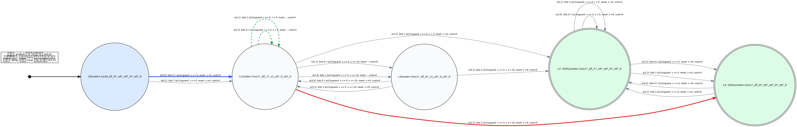

# Prefix cost-to-go 真实运行解释

- Formula: `!(F [5,10] p1)`
- Target: negative TA
- Cost model: every location `rate=1`, every edge `cost=0`
- Analysis status: `complete`, exact=`true`
- Goals: `[2, 4]`

| Prefix | Time | Live location | Remaining cost | Optimal delay | Next edge | Next arc | Core query us |
|---:|---:|---|---:|---:|---|---:|---:|
| 0 | 0 | L0 | 5 | 0 | e(0,0) | 0 | 19 |
| 1 | 0 | L1 | 5 | 5 | e(1,5) | 6 | 7 |
| 2 | 1 | L1 | 4 | 4 | e(1,5) | 6 | 7 |
| 3 | 3 | L1 | 2 | 2 | e(1,5) | 6 | 6 |
| 4 | 5 | L3, L4 | 0 | 0 | — | — | 9 |

## 关键 priced pieces

- Node N0/L0 piece 6: `V=5`, next arc 0 / edge e(0,0), delay 0.
- Node N1/L1 piece 4: `V(x)=5-x` on `0<=x<=5`, next arc 6 / edge e(1,5), delay `5-x`.
- Node N3/L4 piece 1: Goal seed, `V=0`.

因此完整最优 suffix 是 `N0 --arc0/e(0,0)--> N1 --delay until x=5--> N3/L4 Goal`。所有边 cost=0 且 rate=1，所以剩余代价恰好等于剩余 delay。
