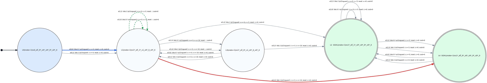
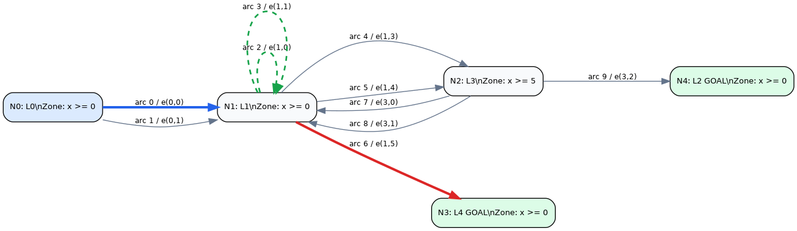
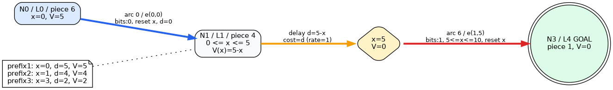

# Verified prefix cost-to-go run

- Formula: `!(F [5,10] p1)`
- Target: generated negative TA
- Cost model: location rate=1, edge cost=0
- Solver: status=complete, snapshot_exact=true
- Geometric oracle: checked=true, equal=true
- Observer oracle: `Goal ∧ T<5` unreachable; `Goal ∧ T<=5` reachable

| Prefix | Time | Live locations | Remaining cost | Delay | Next edge | Next arc | Core us | Serialization us |
|---:|---:|---|---:|---:|---|---:|---:|---:|
| 0 | 0 | L0 | 5 | 0 | e(0,0) | 0 | 18 | 18 |
| 1 | 0 | L1 | 5 | 5 | e(1,5) | 6 | 7 | 6 |
| 2 | 1 | L1 | 4 | 4 | e(1,5) | 6 | 7 | 6 |
| 3 | 3 | L1 | 2 | 2 | e(1,5) | 6 | 6 | 6 |
| 4 | 5 | L3, L4 | 0 | 0 | — | — | 9 | 9 |

The finite priced pieces are: `V(L0,x)=5`, `V(L1,x)=5-x` for `0<=x<=5`, and `V(L4,x)=0`.
