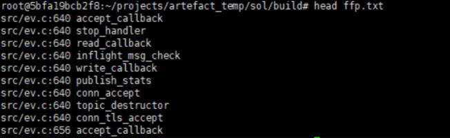
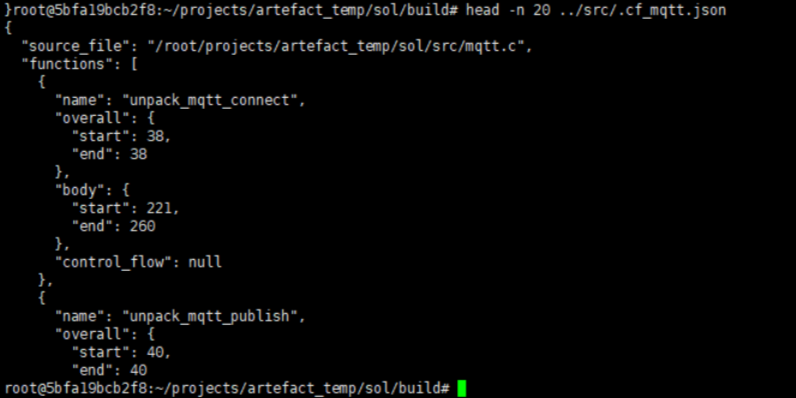
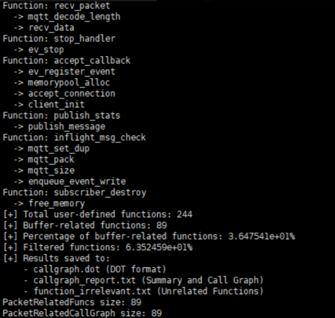
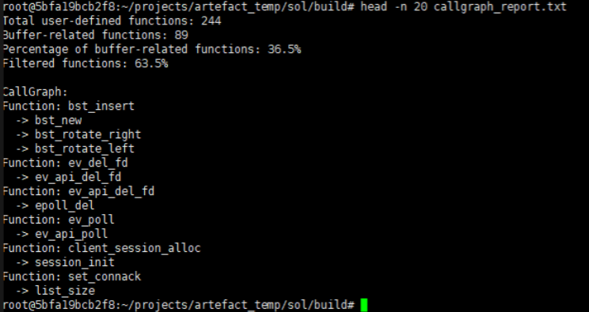

# Example

We provide a detailed step-by-step guide, including screenshots of each stage, to help users understand the usage and output of every step.

As an illustration, we use the Case Study 2 from the paper. The results generated by each module are all included in the sol.tar.gz archive.


## Key Directory

```
/path/sol/build/
├── cursorkleosr/                         # AI assistant workspace
│   ├── workflow_state.md                 # Workflow state file
│   ├── project_config.md                 # Project configuration
│   ├── Instructions.md                   # Instructions documentation
│   └── task/                             # Task directory
│       └── rule1.txt                     # MQTT ClientId rule analysis task
├── sol                                   # MQTT server main program
├── sqlite_Sol.db                         # SQLite database
├── sol_ssa.ll                            # SSA form LLVM IR
├── config.toml                           # Main configuration file
├── rule_config.txt                       # Protocol rule
├── callgraph.dot                         # Call graph DOT format
├── callgraph_report.txt                  # Call graph analysis report
├── function_irrelevant.txt               # Irrelevant functions list
├── function_arg_summary.txt              # Function argument summary
├── extracted_commands.sh                 # AST: Extracted commands script
├── extracted_commands.txt                # AST: Extracted commands list
├── build_log.txt                         # Build log
├── sol_ssa.bc                            # SSA form bitcode
├── ffp.txt                               # SVF indriect call analysis results
├── fp.txt                                # SVF indriect call analysis results
├── sol.ll                                # LLVM assembly file
├── sol.bc                                # LLVM bitcode file
```

## Step-by-step Procedure

`rule_config.txt`:
```json
{
	"CONNECT": [
		{
		  "rule": "After a Network Connection is established by a Client to a Server, the first Packet sent from the Client to the Server MUST be a CONNECT Packet [MQTT-3.1.0-1].",
		  "req_type": "CONNECT",
		  "req_fields": [
			  "Protocol Name",
			  "Protocol Level",
			  "Connect Flags",
			  "Keep Alive",
			  "Client Identifier",
			  "Will Topic",
			  "Will Message",
			  "Username",
			  "Password"
		  ],
		  "res_type": "",
		  "res_fields": []
		}
	]
}
```

### Build and compile the program
```bash
git clone https://xxx/sol.git && cd sol
mkdir build && cd build
cmake -DCMAKE_C_COMPILER=gclang -DCMAKE_C_FLAGS="-g -Xclang -disable-O0-optnone -fno-discard-value-names" ..
make VERBOSE=1 > build_log.txt
llvm-dis sol.bc 
opt -load-pass-plugin /path/libAnalyzerPass.so --passes='mem2reg,loop-mssa(licm)' sol.bc -o sol_ssa.bc
```

### SVF Indirect Function Call Analysis
```bash
~/SVF-SVF-2.9/build/bin/wpa -print-fp -ander  sol.bc >fp.txt
python3 /path/indirect_callgraph.py ./fp.txt ./ffp.txt
```



### Obtain AST-related information

```bash
python3 /path/build_ast_command.py /path/sol/build/build_log.txt /path/sol/build/extracted_commands.txt sol /path/build/src/libASTPass.so 

/path/sol/build/extracted_commands.sh

python3 /path/check_ast_file.py /path/sol/
```



### Obtain a simplified call graph that only includes logic related to message processing.

```bash
export WPA_REPORT_FILE=/path/sol/build/ffp.txt 
opt -load-pass-plugin /path/libAnalyzerPass.so --passes="analyzer-pass" < ./sol_ssa.bc
```





### LLM-guided program slicing
```bash
export OPENAI_API_KEY=xxx
opt -load-pass-plugin /path/libMatchPass.so --passes="match-pass<config=/path/sol/build/config.toml>" < ./sol_ssa.bc
```
Once the process completes successfully, you can view the slicing results in the `rule_code_snippet` table of the `sqlite_Sol.db` database.

Example: Call graph corresponding to the code slice
```
unpack_mqtt_connect
+-- unpack_string16
    +-- unpack_integer
    |   +-- unpacku16
    +-- unpack_bytes

connect_handler
+-- set_connack
+-- try_strdup
+-- topic_store_put
+-- topic_store_get_or_put
    +-- try_strdup [ALREADY VISITED]
    +-- topic_store_put [ALREADY VISITED]
    +-- topic_store_get
```


### Perform LLM-based Inconsistency Detection Analysis
```bash
python3 /path/inconsistency_detection/violation_check.py
```

results:
```json
{"result": "violation found!", "reason": "The rule MQTT-3.1.0-1 mandates that the first packet after a connection must be a CONNECT packet. The code slice shows that 'process_message' function directly unpacks and processes any packet type (lines 869, 874) without verifying if it's the initial CONNECT packet after connection establishment. This allows non-CONNECT packets to be accepted as the first packet, violating the protocol requirement.", "violations": [{"function_name": "process_message", "filename": "/root/projects/artefact_temp/sol/src/server.c", "code_lines": [869, 874]}]}
```


### Perform Assert Generation
```bash
python3 gen_assert_prompt.py --db_path /path/sol/build/sqlite_Sol.db --output_dir /path/sol/build/ --compile_command "cd /path/sol/build/ && make"
```

You can obtain the prompt for the LLM Agent as follows
```
You are an autonomous AI developer using a two-file system. Your sole sources of truth are @project_config.md (LTM) and @workflow_state.md (STM/Rules/Log), which are located in `./cursorkleosr/`. Before every action, read `workflow_state.md`, consult `## Rules` based on `## State`, act via Cursor, then immediately update `workflow_state.md`.
MUST complete all the following tasks in `./cursorkleosr/task/` before ending the session:
  - task1.txt
Processing MUST be done one-by-one (no batch processing allowed, as it is unfeasible), fully automated, and require no manual confirmation.
```

The content of `task1.txt`:
```
# Task
Analyze the protocol rule logic in `#Rule` and combine it with the summary of missing function logic identified in `#PreviousResponse` for comprehensive evaluation. 
Generate a corresponding ASSERT statement for the missing logic in that function. Determine the optimal insertion position for this ASSERT statement in the `#Code` snippet.

# Task Steps
1. Parse the content described in `#Rule` to extract key conditions or constraints.
2. Analyze the execution logic of the function in `#Code` and identify the missing logic based on `#PreviousResponse`.
3. Generate a syntactically correct ASSERT statement for the missing logic:
    - Follow the descriptions in `## Key Constraints` and `## Critical Patterns & Conventions` in `cursorkleosr/project_config.md`.
    - The purpose of the ASSERT statement is to actively terminate program execution when the program is in a scenario that **should have been handled by the missing logic**, not to patch the missing logic.
    - If there are variables in the `Code` that can be tracked by the ASSERT statement, prioritize those closest to the original data packet rather than those that have been processed.
    - If the condition for judging "whether the program state is correct" (i.e., whether to trigger the missing logic scenario) is complex, please define a helper function (usually returning a boolean value) to encapsulate this judgment logic.
    - The ASSERT statement should be implemented in the following format and must contain the conditional compilation instruction and the error message: `#ifdef ASSERT_ENABLED\nassert(function(xxx) || !"rule desc");\n#endif`.
4. Determine the optimal insertion position for the ASSERT statement:
    - The ASSERT statement is designed to detect and block at the point where "an error is about to occur", allowing developers to collect the current input for subsequent reproduction.
    - if conditions permit, prioritize selecting lines close to the problematic code (e.g., function entry, before conditional judgment).
    - Check if the current file needs to include relevant standard header files (e.g., assert.h).
5. If a custom function is implemented, determine the insertion position for the function definition and declaration:
    - The function name must start with `assert_related_` to avoid naming conflicts.
    - The definition and declaration of the custom function must be wrapped in the conditional compilation block, i.e., `#ifdef ASSERT_ENABLED\nvoid assert_related_...\n#endif`.
6. After completing the task, call the command-line tool to verify the generated result.
    - Command reference: `cd /root/projects/artefact_temp/sol/build/ && make`.

# Rule: 
After a Network Connection is established by a Client to a Server, the first Packet sent from the Client to the Server MUST be a CONNECT Packet [MQTT-3.1.0-1].

# PreviousResponse:
{"result": "violation found!", "reason": "The rule MQTT-3.1.0-1 mandates that the first packet after a connection must be a CONNECT packet. The code slice shows that 'process_message' function directly unpacks and processes any packet type (lines 869, 874) without verifying if it's the initial CONNECT packet after connection establishment. This allows non-CONNECT packets to be accepted as the first packet, violating the protocol requirement.", "violations": [{"function_name": "process_message", "filename": "/root/projects/artefact_temp/sol/src/server.c", "code_lines": [869, 874]}]}

# Code:
  862: static void process_message(struct ev_ctx *ctx, struct client *c)
  863: {
  864:     struct io_event io = {.client = c};
  865:     /*
  866:      * Unpack received bytes into a mqtt_packet structure and execute the
  867:      * correct handler based on the type of the operation.
  868:      */
  869:     mqtt_unpack(c->rbuf + c->rpos, &io.data, *c->rbuf, c->read - c->rpos);
  870:     // c->toread = c->read = c->rpos = 0;
  871:     atomic_store(&c->rpos, 0);
  872:     atomic_store(&c->read, (size_t)0);
  873:     atomic_store(&c->toread, (size_t)0);
  874:     c->rc = handle_command(io.data.header.bits.type, &io);
  875:     switch (c->rc) {
  876:     case REPLY:
  877:     case MQTT_NOT_AUTHORIZED:
  878:     case MQTT_BAD_USERNAME_OR_PASSWORD:
  879:         /*
  880:          * Write out to client, after a request has been processed in
  881:          * worker thread routine. Just send out all bytes stored in the
  882:          * reply buffer to the reply file descriptor.
  883:          */
  884:         enqueue_event_write(c);
  885:         /* Free resource, ACKs will be free'd closing the server */
  886:         if (io.data.header.bits.type != PUBLISH)
  887:             mqtt_packet_destroy(&io.data);
  888:         break;
  889:     case -ERRCLIENTDC:
  890:         ev_del_fd(ctx, c->conn.fd);
  891:         client_deactivate(io.client);
  892:         // Update stats
  893:         info.active_connections--;
  894:         info.total_connections--;
  895:         break;
  896:     case -ERRNOMEM:
  897:         log_error(solerr(c->rc));
  898:         break;
  899:     default:
  900:         c->status = WAITING_HEADER;
  901:         if (io.data.header.bits.type != PUBLISH)
  902:             mqtt_packet_destroy(&io.data);
  903:         break;
  904:     }
  905: }
```

Generated assertion:
```c
#ifdef ASSERT_ENABLED
/*
 * Custom function to check if the first packet from client is a CONNECT packet
 * as required by MQTT-3.1.0-1 rule.
 * Returns 1 if no violation (client already connected or packet is CONNECT),
 * Returns 0 if violation detected (client not connected and packet is not CONNECT)
 */
static int assert_related_rule1_first_packet_is_connect(struct client *c, int packet_type)
{
    /* If client is already connected, no violation */
    if (c->connected) {
        return 1;
    }
    
    /* If client is not connected, first packet must be CONNECT */
    return (packet_type == CONNECT) ? 1 : 0;
}
#endif

static void process_message(struct ev_ctx *ctx, struct client *c)
{
    struct io_event io = {.client = c};
    /*
     * Unpack received bytes into a mqtt_packet structure and execute the
     * correct handler based on the type of the operation.
     */
    mqtt_unpack(c->rbuf + c->rpos, &io.data, *c->rbuf, c->read - c->rpos);
    // c->toread = c->read = c->rpos = 0;
    atomic_store(&c->rpos, 0);
    atomic_store(&c->read, (size_t)0);
    atomic_store(&c->toread, (size_t)0);
#ifdef ASSERT_ENABLED
    assert(assert_related_rule1_first_packet_is_connect(c, io.data.header.bits.type) || !"Rule violation: The first Packet sent from the Client to the Server MUST be a CONNECT Packet [MQTT-3.1.0-1]");
#endif
    c->rc = handle_command(io.data.header.bits.type, &io);

    // ...
}
```

### Perform Test Case Generation
```bash
# Generate counterexamples
python3 /path/dynamic_verification/packet_generate/gen_packet_tasks.py /path/scapy/sol/ /path/scapy/ /path/sol/build/sqlite_Sol.db

# Generate task files for LLM agent
python3 /path/dynamic_verification/packet_generate/gen_scapy_scripts.py /path/scapy/sol/ /path/scapy/
```

